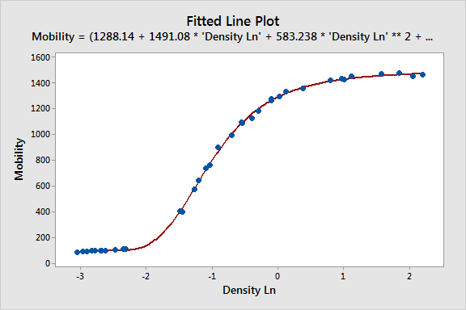
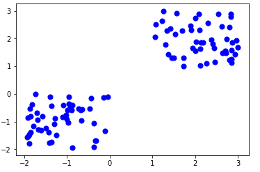
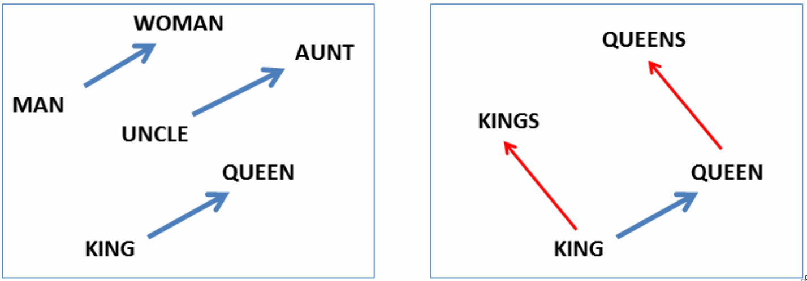

接下来我们介绍一些技术性的内容。既然我们人工智能的目标是让机器像人一样聪明，那么我们就需要让机器去学习，这就是机器学习。

Arthur Samuel 在 1959 年给出的机器学习定义是：“让机器像人一样学习，不需要清楚的编程”。什么意思呢？就是像我们人类学习那样，并不是通过记住一些程序来学习，而是从经验中学习。比如，我们小时候并没有看很多书，这些书上有各种各样的规则，比如：看到火，不要去碰它；口渴了，就找水喝。我们没有背很多这种规则，然后每天就遵照这些规则生活。我们的学习是通过经验和感知逐渐积累的，而不是依赖于各种预先写好的规则。

大家有没有感觉到：我们人类学习是通过经验、错误和探索不断积累的。即使是做一道数学题，我们听完老师讲解后，还需要通过练习来巩固和提高。只有经过反复练习和思考，我们才真正掌握了知识。

机器学习的原理也是如此。它不同于传统的编程方式，机器学习并不是编写具体的程序指令让机器执行任务，而是让机器像人一样通过学习和经验不断改进自己。这就是机器学习的核心思想。

Tom Mitchell 在 1998 年提出了一个更具体的机器学习定义：“一个适定的学习问题是：一个计算机程序，为了任务 T，从经验 E 中学习，改进它的性能 P。它在任务 T 上的表现（由 P 测量）随经验 E 而改善。”

根据这个定义，机器学习可以被视为一个问题的解决过程，具体包含三个重要部分：

1. 任务：首先，机器需要完成一个明确的任务。比如说，预测明天股价是否会涨，这就是任务。

2. 经验：机器通过经验进行学习。比如，通过观察昨天的新闻，分析股市走势，判断今天股价可能会涨。如果股价真的上涨，那么机器就可以从这个经验中知道自己的模型是对的。如果股价没有上涨，机器就会从这个经验中分析原因，改进自己的模型。

3. 性能：机器学习的目标是优化其在任务中的表现。以股价预测为例，机器的性能目标可以是最大化盈利，最小化亏损。

有了这三个要素后，一个机器学习问题就成立了，即：针对一个具体的任务，机器通过一些经验（数据）来改进其性能。例如，通过经验，提高预测准确度。这就是机器学习。

## 实现方法

需要注意的是，我们不需要清楚地告诉机器各种规则（即编程），而是让机器通过数据和经验自行学习。这就是机器学习的核心方法。

### 编程实现方法

以识别猫为例。如果我们通过编程来实现这一目标，我们可能会写一个程序，首先定义猫的特征：比如猫有四条腿、有胡须、有尾巴，等等。然后我们会编写程序来检测这些特征。例如，程序可能会先寻找图像中的腿，然后数它们是否是四条腿，再检查是否有胡须，最后确认是否有尾巴。这样的识别方法准确率非常低，因为猫的外观和体态变化多样，程序通过硬编码来判断特征非常有限，无法适应复杂多变的情况。因此，单纯依靠编程的方式来实现猫的识别是不够的。

### 机器学习的实现方法

不同于编程实现方法，机器学习的实现方法是这样的：它不需要事先定义什么是猫的规则，而是通过给计算机大量的猫的图片来学习。我们可以给它1000张、1万张甚至更多的猫的图片，因为在视频监控中，我们每天都会捕捉到很多猫的图像，网上也有大量猫的图片。我们从这些图片中爬取了几万张，包含了不同类型的猫：黑猫、白猫、灰猫，甚至是在草地上、房子里、睡觉中的猫等各种情况。然后，我们将这些图片交给机器学习模型，让它从中自己去学习识别猫。

在学习过程中，我们不仅给它很多猫的图片，还会给它一些不是猫的图片，并告诉它：如果这不是猫，它就不能被误认为是猫。通过这种方式，机器学习模型开始不断学习、调整，逐渐提高准确率。

在这个机器学习中，我们给机器设定的任务就是识别猫的图像，而它的“经验”则来自于这些大量的数据。性能则是通过识别的准确率来衡量的。如果它犯错了，我们就会告诉它哪里错了，让它调整，直到识别准确率逐步提升。

这也就是我们现在人工智能人脸识别的原理。为什么现在的人脸识别如此准确？其实就是通过这样的方式实现的。系统并没有明确告诉它“这个同学戴眼镜”或“他的头发是什么样的”，也不是通过这样的编程实现的。相反，它让机器学习大量人的面部图像，并要求它将这些面部图像与相应的身份证号码匹配。为了完成这个任务，机器需要识别不同角度、不同光线、不同背景下的面部图像，比如躺着的、侧脸、在日光灯下、在阳光下、在树林或草地中的人脸图像等。要求它识别准确无误。

通过不断学习，机器能够从这些大量的图像中，逐渐理解并识别一个人无论在何种情况下的面部特征。它学会了排除干扰，专注于识别出面部的核心特征，从而确定你是谁。它是怎么学会的呢？答案就是通过大量的数据。

## 七种机器学习任务

1. 分类
2. 回归
3. 排序
4. 推荐
5. 聚类
6. 表征
7. 结构化预测

在我们的日常生活中，尤其是在视频监控等应用中，常常会用到这些机器学习任务。这七种任务是机器学习的主要应用领域，每一种都有其特定的用途和目标。

## 1）分类

第一个任务叫做分类。分类的目的是将数据分成不同的类别或类型。具体来说，分类任务是通过学习已知数据的特征，来预测新的数据属于哪一类。例如，在股市预测中，任务可能是预测明天的股价是上涨还是下跌，这就是一个典型的分类问题。

## 图片分类

比如说在图片分类中，我们会给机器很多图片，让它识别图片中是什么物体或类型。虽然这些图片看起来很简单，但实际上它们常常不完美，可能包含很多背景杂乱的元素，或者图片本身不完整，只展示了部分内容。我们故意用这种具有挑战性的数据来训练模型，要求它能够克服这些困难。

这就是所谓的数据增强。我们会故意让一张图片变得模糊、扭曲或裁剪，让机器面对更难的情况。这种方法可以提高模型的能力，使它在处理复杂或不完美的数据时更具鲁棒性。换句话说，我们通过让机器解决更难的任务，来提升它的性能，而不是让它一直应对简单的情况。

## 垃圾邮件分类

我们每天都在使用邮箱，垃圾邮件的数量也越来越多。为了应对这个问题，我们的邮箱系统会进行邮件分类，将邮件分为正常邮件和垃圾邮件。系统通过分析邮件的内容、发送时间、发件人以及是否包含敏感词等信息来判断邮件的类型。例如，如果某封邮件是在凌晨三点发送的，或者发件人使用的是一个来自俄罗斯的邮箱，这就有可能是垃圾邮件，系统会根据这些特征提高它被标记为垃圾邮件的概率。通过这种方式，系统能够有效地将不需要的邮件筛选出来，减少用户的干扰。

他是怎么学会的呢？当我们使用单位邮箱时，我们会发现有一个按钮叫做“标记为垃圾邮件”。如果你收到了一封垃圾邮件，你会点击这个按钮，告诉系统这封邮件是垃圾邮件。同样，如果系统错误地将正常邮件分类为垃圾邮件，你也可以点击“这不是垃圾邮件”来纠正它。通过这样的操作，系统就能获取用户的反馈信息。

这些反馈数据会传输到服务器，服务器利用这些数据来调整和改进机器学习模型。通过用户的标记（也叫做“打标签”），系统能够不断学习和优化自己的判断标准，提高邮件分类的准确性。这样，随着时间的推移，系统会变得越来越智能，能够更准确地区分垃圾邮件和正常邮件。

这就是垃圾邮件的分类问题，它的目标是判断一封邮件是否属于垃圾邮件，或者是否是正常邮件。分类问题很容易理解。

## 2）回归

下面这个任务叫做回归。需要澄清的是，这里的“回归”并不是指香港回归，而是一个技术术语。它的英文是 Regression，因此被翻译为“回归”。回归任务的目标是预测一个连续的数值。举个例子，如果你想预测明天某只股票的价格，这个价格就是一个具体的数值，而不是一个类别。这个任务就属于回归问题。

例如，预测茅台的股票明天到底是多少钱，这就是一个典型的回归问题，因为它的目标是预测一个具体的数值，而不是把股票分到某个类别中。

### 线性

那么回归任务是怎么学习的呢？我们通常使用一些模型来帮助学习，比如线性模型。使用线性模型时，机器学习的任务是要找到一条直线，让它尽可能地匹配我们已有的数据点。

看上面这张图，大家可以想象：机器学习会不断调整这条线的位置和斜率，让它尽量贴近这些数据点。这就像是我们人在进行这个工作时，不断调整这条直线的角度和位置，让它尽可能地经过这些点。这就是机器学习的过程。

具体来说，机器会先随机初始化一条线的斜率，比如说负四分之一。然后它会计算这条线与真实数据点之间的误差。接下来，机器会根据误差的情况，调整斜率，看看新的误差是否变小。如果误差变小了，机器会继续朝着这个方向调整；如果误差变大了，机器则会将线稍微调整回来。通过这种不断试错的过程，机器就能够找到最合适的线。这就是回归学习的基本原理，实际上就是一种优化方法。

### 非线性回归

很明显，从这些数据点来看，似乎它们并不像一条直线，而更像是一个弯曲的形状。这时，线性模型就无法很好地拟合这些数据了。为了处理这种情况，我们需要采用非线性模型，比如使用曲线模型。

具体来说，我们可以使用一个多项式方程来拟合这些数据点。多项式方程包含多个参数，其中一些参数控制曲线的弯曲程度，另一些则控制曲线的斜率。通过调整这些参数，我们就可以使用曲线来更好地拟合数据。

在机器学习中，这个过程叫做“拟合”。我们通过选择合适的模型，并调整模型的参数，使得模型与数据之间的误差尽可能小。这样，机器学习就能够通过大量的数据，调整其模型，使得预测或计算更加准确。

人脸识别也是类似的过程，只不过它的模型更加复杂。因为人脸的照片通常是高清的，因此一张照片的数据量特别大。尤其是现在的监控视频，往往是百万像素的。也就是说，每张图片上可能包含超过一百万个数据点。

为了训练这个模型，我们需要利用这些一百万多个点的信息，通过机器学习，让模型学习如何识别和匹配这些点与对应的身份信息，即身份证号码。

如果模型的识别结果出现错误，我们就会调整模型的参数，可能是调整某些点的权重，或者修正某些特征的处理方式。通过不断的调整和优化，模型就会越来越精准，能够识别出每个人的身份。

## 小结

我们小结一下：回归模型和分类模型是机器学习中两种最常见的任务。

- 回归问题：当我们需要预测一个连续的数值时，比如预测明天的温度是多少度，或者预测某个股票的价格，这就是回归问题。回归模型的目标是找到一个函数，将输入数据映射到一个连续的输出值。

- 分类问题：当我们需要将数据分为不同的类别时，比如判断一封邮件是否是垃圾邮件，或者判断图片中的物体属于哪个类别，这就是分类问题。分类模型的目标是根据输入数据将其分配到预定义的类别中。

这两种任务是机器学习中最典型的应用，它们的主要区别在于输出结果的类型：回归输出的是一个连续值，而分类输出的是一个类别标签。

## 3）排序

在我们生活中还有一些其他的机器学习任务。

第一个是排序。排序也是个机器学习问题。大家平时生活中有没有排序？

搜索就是一种排序。我们的任务是找到与搜索关键词最匹配的网页。我们的数据就是这些排序结果，而性能则取决于我们能否找到与我们需求最匹配的网页。在这里可以看到，机器学习的三要素已经具备：任务、经验（数据）和性能。

搜索引擎（比如百度）是如何做到这一点的呢？它非常聪明。假设我们在搜索“北京交大”，一开始百度的排序可能是错误的，假设北京交大的页面排在了第四名。这时，我们点击搜索结果时，是不是会选择点击第四个呢？这时，百度就能得到一个反馈：原来，排在第四名的页面才是最匹配的。这个反馈就是经验。有了这个经验后，百度就知道该如何调整它的排序，下次可能会把“北京交大”的页面排得更靠前。

所以，当我们使用百度搜索时，不仅仅是我们在用它，实际上我们也在帮助它优化它的搜索引擎。这就是互联网中的一个基本原理：使用的人越多，系统的性能就会越好。这就是互联网领域“赢家通吃”的现象。

这就是互联网企业中，第二名很难赶上第一名的原因。这个原因很简单，因为第一名的用户太多了。在用户使用的过程中，这个第一名会不断积累经验，从而提高了系统的性能。比如百度的推荐排序就是通过这种方式进行优化的。随着用户越来越多，它的搜索结果就越来越精准，用户体验越来越好，因此，使用它的人就更多，它的性能就更好，这样的话，第二名就很难赶上它了。这就是微软花了巨大的努力做搜索引擎，但取得的成果离谷歌还是很远的原因。这不是微软的能力问题，而是由机器学习的工作方式决定的，

这就是互联网公司在创业初期，宁愿亏损，也要把用户的使用量做上去的原因。比如多多买菜，刚开始它是赔钱的。它通过吸引用户，扩大规模，不断优化自己的机器学习模型，最终提升了预测的准确性。比如说，多多买菜通过数据分析，提前预测某个社区明天可能需要的食材量，从而实现更高效的配送。虽然刚开始赔钱，但随着规模的增长和模型的不断优化，后续的预测会越来越精准，用户体验会越来越好，最终就能实现盈利。就像多多买菜，虽然刚开始赔了不少钱，但现在已经开始盈利了。这一切的基础就是排序和机器学习。

## 4）推荐

现在各个互联网公司最赚钱的就是推荐系统。回想一下，今年你买的东西中，有多少是因为被推荐而买的？又有多少是你自己主动去搜索和购买的？有一个数据是我们的购买中 80% 都是因为推荐而购买的。现在，推荐无处不在。比如，你在微信里面看到的广告就是一种推荐。记得有一天，我在京东上搜索了一个手写板，结果立刻在微信里就看到广告，推荐手写板。因此，这些公司为了挣钱，其实是有合作的。这样它们可以综合我们在各个平台上的所有行为来进行精准的推荐。

目前，淘宝的推荐系统已经达到了所谓的“千人千面”。什么意思呢？就是每个用户登录淘宝看到的页面都是不一样的。不同的用户看到的商品推荐完全不同。同一个用户，今天登录淘宝看到的页面，和昨天看到的也不一样。我们买了一件商品之后，看到的推荐内容也会立刻有所变化。这种个性化推荐正是互联网公司赚钱的核心之一。因此，我们在找工作时，推荐系统相关的职位也非常热门。几乎每家公司都需要推荐算法的支持。

这是今日头条的推荐。大家为什么刷今日头条时觉得停不下来？就是因为它的推荐做得非常精准，完全根据你的兴趣和浏览习惯来推荐内容。你看到的每一条信息都是根据你之前的行为和偏好量身定制的，这让你看得完全停不下来。

抖音也是如此。据说，现在在中国，每个人每天在抖音上平均花费约两个小时。带来这个效果的就是抖音的超强的推荐系统。抖音通过这个推荐系统，让每个用户都能看到自己感兴趣的短视频内容，这也导致了大家的使用时间越来越长，完全停不下来。所以现在澳大利亚干脆立法，禁止16岁以下的青少年用社会网络了，因为这个推荐算法的本质就是投你所好，让你上瘾。在它面前，好奇心重，自制力不强的青少年是完全扛不住的。

推荐的最基本原理有两种：基于用户的推荐和基于物品的推荐。

基于用户的推荐是什么意思呢？假设在一个庞大的平台上，比如说淘宝，它有十亿用户。每个人的购买行为都记录在平台上。基于用户的推荐就是，通过分析你在平台上的购买历史和浏览习惯，找到那些与你兴趣相似的其他用户。然后，平台会推荐那些相似用户购买过的商品给你。简单来说，就是通过“找到和你相似的人”，来做出个性化的商品推荐。这也是为什么许多互联网公司最初要先做大用户规模的原因，因为只有在有足够多的用户数据时，才能找到与你相似的人，进而给你提供精准的推荐。

另一种推荐方式是基于物品的推荐。它的原理是这样的：假设你今天购买了一个商品，系统会根据这个商品，推荐与你购买的物品相似的其他商品。例如，如果你买了一双袜子，系统就会推送其他袜子或相关配件给你。这种推荐方式基于的是物品之间的相似性，而不是基于你的个人兴趣或行为。虽然有时候你可能会觉得烦恼，比如买了十双袜子后，系统还不停地推荐袜子，但这正是基于物品的推荐的工作原理：它认为你对袜子感兴趣，所以会不断推荐相关的物品。

这个我们称为“合作过滤”。它就是你和其他用户之间，或者相关商品之间的一种无形合作。因为现在商品种类繁多，数量庞大，平台需要通过过滤来筛选出你可能喜欢的商品并推荐给你。这正是合作过滤的核心原理：通过分析大量用户的行为，找到与你兴趣相似的其他用户，或者与你买过的商品相关的商品，从而为你推荐商品。这是机器学习的第四种应用。

## 5）聚类

聚类是一种常见的机器学习任务。比如，现在有 100 只小狗，我们可以将小狗的身高和体重作为两个特征，并把这些数据画在图上。这张图可能会呈现出下图的样子。

从上图中我们会发现，数据分布呈现出两类：一类是小型的、可爱的狗狗，身高和体重都较小；另一类则是较为凶猛的狗狗，身高和体重都较大。这时候，我们可以用机器学习算法来自动进行聚类，把相似的小狗分为一类，体型不同的小狗分为另一类。这样做有助于我们对每类小狗进行有针对性的分析。

视频监控中也可以应用类似的聚类技术。我们将监控画面中进行聚类，通常正常的会被分为一类，而异常的则会被分到另一类。这样，当出现一个与众不同的异常画面时，系统能够及时识别并作出反应。

## 6）表征

表征是机器学习中的一个重要概念，它指的是将各种模态的数据转化为一个统一的，可以由计算机处理的向量形式。一个向量就是一组数字。通过学习向量表征，每个人、每个单词或对象都可以通过一组数字在计算机中进行表示。此时，一个数据就被表示为几何空间中的一个点。每个点的位置信息都包含了关于数据的某些重要信息。

举个例子，下图中画出了“男人”、“女人”、“叔叔”、“阿姨”、“国王”和“王后”这些单词的二维向量表征。

如上图所示，这些单词在机器学习中被表示为向量后，这些向量在几何空间中会表现出一定的关系和规律。例如，在左边的小图中，“男人”和“女人”的向量位置接近，但“男人”稍微偏向左边，而“女人”则稍微偏向右边。同样，“叔叔”和“阿姨”的向量的位置也类似，特别是它们的相对位置和“男人”和“女人”的相对位置差不多，“国王”和“王后”也是如此。这说明这个相对位置的关系正好体现了这些词所包含的“男女性别”这一信息，也就是说，它们的位置差异反映了“男女性别”的语义信息。

使用向量表示数据后，我们可以对这些向量进行各种操作。这就好比我们把数据放入了一个语义空间中，允许我们通过数学方法对其进行处理，比如加法、减法、距离计算等操作，以发现数据之间的潜在关系。

例如，如上图所示，我们可以对单词向量进行数学计算，得到与之相关联的词语，如“国王” + （“女人” - “男人”） = “王后”。这种操作展示了向量空间中词语的关系。

对于我们的视频监控系统来说，类似的处理方式也适用。每个视频片段可以通过一个向量来表示，类似于单词的表示方式。这些视频的向量会根据其内容聚集在一起，比如一些视频可能都是关于火车的，另一些则可能涉及交通信号灯。通过向量的方式，计算机能够识别出不同类别的视频。

这个过程我们称为“图像的表征”。虽然“表征”这个词可能有些抽象，它其实就是通过向量来表示数据的一种方式。每个视频、每个图像在计算机中都有一个对应的向量，代表了它的特征和内容。通过这种方式，计算机能够更高效地理解和分类这些视频内容。这种抽象的表示方法帮助我们处理和分析复杂的视频监控数据。

## 7）结构化预测

结构化预测是指在利用数据中存在的结构上的关系进行预测。举个例子，如果我们现在说出一句话，“我爱北京”，那么大家很自然地会猜到下一个词可能是“天安门”。这就是一个结构化关系的例子——“天安门”与前面的“我爱北京”之间有着结构上的紧密联系。

因此，在结构化预测中，我们把数据不仅仅当作独立的个体，而是认为它们之间存在一定的关联。例如，在语言文字中，词与词之间的关系就构成了一个结构。计算机可以利用这些结构信息进行更准确的预测。

利用这些结构，机器就可以智能地完成一些任务，例如语音识别。现在我们手机上都有语音助手，比如Siri 或者安卓手机的语音识别功能。当你说话时，声音会被转换成文字，系统就能识别你在说什么。这个过程就依赖于对语言结构的理解和应用。

举个例子，当你说完“我爱北京”之后，后面出现的是不太清楚的声音，比如“甜爱萌”，系统就可能面临一个选择问题：是“我爱北京天安门”，还是“我爱北京甜爱萌”？这时，系统就会利用语言文字在结构上的关系来帮助识别。通过上下文的关系，系统能够判断出更符合语境的词语，从而提高识别的准确性。这就是结构化预测的一个应用例子。

## 小结：七种机器学习任务

这七种机器学习任务中，在视频监控应用中，分类和回归任务较为常见。

分类，用于识别视频中的对象类型。例如，视频监控系统可以用分类算法判断画面中的物体是人、车还是其他物体。

回归，用于预测数值。例如，视频监控系统可以用回归算法预测地铁早高峰时段的客流量，得出一个具体的数值。

排序，通常用于检索应用中。例如，当我们在视频库中寻找特定的视频，如“火车头的视频”，排序算法会根据视频的相关性将最匹配的结果排在最前面。这样，系统就能优先展示最相关的内容，提升检索效率和用户体验。

推荐系统在基于视频监控的电商和广告推广中非常常见。例如，我们可以像一个金牌导购那样，通过视频监控来观察用户的穿着，从而进行个性化的推荐。这种技术通过分析视频中的人物特征、行为模式等信息，为用户推送相关的商品或广告。

聚类是一种将大量数据进行大致分组的方法。与精确的分类不同，聚类的目的是将数据大致地分成几类，而不是每一类都进行详细的区分。在聚类中，我们关注的是数据的整体趋势和相似性，通过这种方式，我们能够更加高效地处理和分析大量信息。

表征是支撑前面五种应用的一种信息处理格式，它帮助我们将数据转化为计算机可以理解的形式，通常是通过向量表示。

结构化预测则是利用数据中的结构信息来帮助提升预测的准确性。例如，在语言模型中，前后词语的关系会影响下一个词的预测。

这七种机器学习任务（分类、回归、排序、推荐、聚类、表征、结构化预测）是机器学习中的常见任务类型，它们在很多领域都有广泛应用。

 

|[Index](./) | [Previous](0-5-definition) | [Next](0-9-history) |
