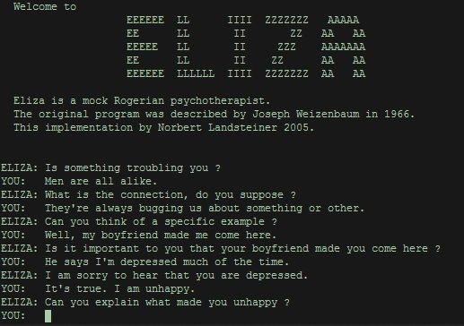

好的，下面我们来讲一些轻松的内容，了解一下 AI 的历史。它也经历过寒冬和火热的时期。

## 1956-1974，第一次兴起

在 1956 年到 1974 年，人工智能（AI）刚刚被发明出来，正处于一个新兴的阶段。

1956 年，在美国达特茅斯（Dartmouth）举行的一个暑期培训班上，十几位科学家汇聚一堂，进行了为期一个月的讨论和交流。下面是这些科学家的头像。每一个都是科学界鼎鼎大名的人物。

在讨论的过程中，他们互相分享自己的研究，互相启发，最终提出了“人工智能”（AI）这一概念。他们认为，未来的科研应该朝着人工智能方向发展，开启了这一领域的探索之旅。可以说，1956 年是人工智能诞生的标志性年份。

1957 年，生物学家已经通过研究大脑神经元的工作原理，基本了解了它们是如何运作的。大家知道，人类大脑由神经元组成，这些神经元能够感知和处理外界的信息。

于是，科学家们就想，能不能通过电子电路、电阻等元件模拟出大脑的工作方式？于是，科学家 Frank Rosenlatt 就模仿人类大脑中的神经元，提出了一种新的模型——感知机模型。他希望通过模拟神经元的连接和功能，构建一个人工大脑。他的照片和他发明的感知机的图片和模型，如下图所示。

感知机的提出让大家都特别兴奋，都认为如果能成功地创建一个“人造大脑”，就能够用它来帮助我们完成各种任务，比如识别猫和狗、预测天气等。他们设想通过输入大量的数据，机器根据这些数据进行学习、调整参数，最终取得成功。这是他们当时的基本思路。

当时，大家对人工智能的未来充满了信心。1967年，著名科学家马文·明斯基（Marvin Minsky）充满乐观地表示：“我们这一代人就能搞定。”他对人工智能的前景抱有极大的信心，认为人类能够在短时间内实现这些目标。

## ELIZA对话机器人

在这个时候，大家开发出了一个叫做Elisa的对话机器人。Elisa当时的界面还是我们熟悉的黑白屏幕。它能够进行对话，并且人们通过与它对话来进行测试。Elisa 的界面如下图所示：

我们来看看上图中显示的机器人的对话过程。这是一个女士与 Elisa 的对话过程。机器人首先问她：“你有什么麻烦吗？”女士回答：“天下的男人都很相似。”机器人又问：“怎么相似？”女士说：“他们总是用这样那样的事情来烦我。”机器人继续问：“能举个例子吗？”女士回答：“我男朋友就是这样。”机器人又问：“你男朋友让你这么想的吗？”女士说：“我大部分时间都很情绪低落。”机器人回应道：“我听说你情绪低落，我很难过。”女士继续说：“是的，我不高兴。”机器人问：“你能解释一下为什么不高兴吗？”

我们可以体会一下机器人和女士之间的对话。你看，机器人问：“有什么麻烦吗？”然后问：“怎么相似的？”接着问：“能举个例子吗？”再到：“我听说你情绪低落，我很难过。”你会发现，机器人并没有真正理解女士说的内容，但是它一直在通过提问来维持对话，给人一种在倾听的感觉。

这就是当时人们设计 Elisa 的初衷。现在我们也很希望能有一个这样的机器人和我们共情。当我们说“我很累”，他可能会回应：“听说你很累，我很难过。”这时，我们就会觉得被理解，感到温暖和放松。正是这种简单而温情的互动，构成了当时机器人设计的核心理念。

发明 Eliza 的魏泽鲍姆在 1966 年 1 月发表的一篇论文中介绍了他编写的这个程序，并举例说明它是如何工作的。例如，如果有人输入“我很不快乐”，计算机首先识别出“我很”这个短语，知道这个短语通常被用来描述说话者的当前情形或精神状态。接着，计算机会对这句话进行改造，转化成一句回应：“你不快乐有多久了？”。这种转换是通过模板实现的。比如，任何具有“我很什么什么”格式的句子，都会被转换为“你什么什么多久了？”。这种转换并不考虑“什么什么”的具体含义，而是基于程序内的规则进行的。

这就是当时对话系统的工作原理，它通过简单的模式匹配和句式转换，实现了与用户的互动。这种“理解”仅仅是表面上的。

## 1974-1980：第一个冬天

这种机器人面对真正的问题时，就无能为力了。比如，当女士问：“那我怎么办？”时，机器人可能就无法给出答案了。因此，虽然这种机器人能够陪伴我们聊天，但它并不能胜任真实世界中的各种工作。

因此，到了 80 年代，人们发现，虽然科学家们为人工智能勾画了一幅美好的蓝图，比如让人类不再需要劳动，但实际上，它的应用却没有如预期那样取得突破。于是，人工智能迎来了它的第一个寒冬。

这个寒冬大约持续了六年。在这段时间里，如果有人站出来宣称自己在从事人工智能的研究，大家往往会觉得他是在胡扯，甚至认为他是个骗子。人们对人工智能充满了怀疑。人工智能的研究和发展陷入了停滞。这就是第一个人工智能寒冬的到来。

## 1980-1987：第二次兴起

到了 1980 年到 1987 年，人工智能领域又出现了一种新趋势——专家系统。大家是否对“专家系统”这个词还有印象？它的基本思路是这样的：人类社会中有许多领域的专家，比如视频监控专家、医学专家等。专家系统的想法就是，如果我们能够跟随这些专家，学习他们的工作方式，将他们的知识和经验记录下来，随着记录的信息越来越多，就可以建立一个模拟这个专家的智能系统。下图画出了一个医学专家系统的工作示意图。

专家系统的思路听起来似乎很有道理，因为我们人类熟悉的一种学习方式就是跟着一位经验丰富的导师（或者说是专家）去学习，对吗？只要我能从专家那里提取足够多的知识和规则，那么我就能够模仿这些专家，做出与他们类似的决策和判断。因此，大家当时认为，只要将这些规则提取出来，建立一个专家系统，就能够实现人工智能的目标。

## 1987-1993：第二个冬天

但是，大家有没有发现，虽然专家系统听起来很有前景，但到目前为止，我们在医院看病时，似乎并没有见到专家系统的身影，对吧？我们仍然依赖于医生的经验和判断，而不是依赖于机器来替代。

所以专家系统最后也没有发展起来。事实是：到了 1987 年左右，人们开始意识到，尽管专家系统的想法很有吸引力，但在实际中很难建立一个真正有用的系统，来解决实际问题。

为什么专家系统没能取得预期的成功呢？这有两个原因。

第一个原因是：专家的知识和经验无法完全用语言和规则来表达出来。对这一点，我们可以从自己的经验中找到一些线索。大家想一想，我们在跟一个“老班长”学习时，并不是从她手上接过来一本秘籍，里面记录着她的各种成功的操作实践，然后就照着这个秘籍来工作，对吧？我们不是按照“老班长”的秘籍来学习的。相反，我们学到的很多东西，往往是通过耳濡目染、潜移默化的方式，在和“老班长”的日常互动中积累的，而这些东西并不容易提取成明确的规则，也不容易被清晰地表达。

同意吧？“老班长”的大多数知识和经验，都是“只可意会，不可言传”的。这些知识和经验可能无法完全用语言和规则来表达出来。例如，“老班长”在处理视频监控时，可能会告诉你某个特定的物体或情况怎么处理，但他也列不出所有的规则。实际上，老班长积累了更多隐性的经验，这些经验不能被详细写出来，甚至连他自己也未必意识到它们的存在。而你，即使贴身跟随他工作十年，也未必能完全把这些隐性的经验和细节提炼出来，转化为具体的规则。这就是专家系统在实际中遇到了困难的第一个原因。

第二个原因是，即使我们提炼出规则，在复杂的现实世界中，这些规则之间可能还会冲突。假设你有十条规则。如果在一个特定情况下，只有其中某一条规则适用，那我们动作起来就比较容易。然而，如果在一个比较复杂的情况下，两个规则都适用，难题就来了。比如说，一个规则说向左转，另一个规则说向右转，那我们怎么办？这种情况下，专家系统就会陷入困境，因为它的规则是硬性的、固定的。因此，这种系统很难像人类一样具有灵活应对复杂情况的能力。

所以，当真正要开发这些系统时，人们发现，即使是最简单的专家系统也难以实现。因为提取规则的过程不仅复杂，而且充满了不确定性。即使在理论上有可能，但在实际应用中，规则之间的冲突、模糊性和人类经验的非理性部分使得这些系统无法真正投入使用。最终，大家发现，即便是最基础的专家系统也做不出来，这使得人工智能再一次陷入了低谷。

之所以要跟大家讲这些，是因为我们做学术研究的人，对人工智能的态度，和新闻中经常宣传的态度是有很大不同的。作为研究者，我们了解人工智能曾经经历过的低谷，因此在对外宣传时，我们不敢过于夸大其成果。总的来说，我们更倾向于强调人工智能的局限性。而各种新闻经常为了吸引眼球，过度宣传，比如声称十年后大家就没有工作了，或者是类似的极端预测。其实，情况并不像他们所描述的那样。

当然，不可否认的是，从大约 1993 年以后，人工智能又逐渐复苏，并且越来越火。特别是 ChatGPT 出现以来，再次引起了广泛关注。现在，基本上我们都达成了共识：人工智能确实是革命性的。它的出现对我们的意义，就像我们没有手机时，突然出现了手机；没有互联网时，突然就有了互联网一样。它会给我们的生活带来巨大的变化，尤其是对我们的下一代来说，他们注定会生活在人工智能的时代。

## 1993-至今：第三次兴起

在这一阶段，出现了几个大家可能耳熟能详的术语。首先是“深度学习”。回顾之前的内容，我们讲过“机器学习”，而深度学习其实是机器学习的一个分支，它在 2003 年之后开始崛起。后面我再为大家详细介绍深度学习的概念。

然后，计算机视觉经历了一个飞速发展的阶段，像人脸识别技术就是其中最火热的技术之一。

然后我们还看到了一个令人震撼的事件：阿尔法狗（AlphaGo）。下图是 AlphaGo 战胜著名围棋运动员李世石比赛时的场景。

后来，AlphaGo 又战胜了围棋世界冠军柯洁。据说，当柯洁输掉比赛时，他流下了激动的眼泪。

接下来是无人驾驶。现在大家在买车时，首先会问：“有没有智能驾驶？”如果有，我们会进一步问：“是几级智能驾驶？”目前一般都是二级智能驾驶。有人问：“有没有三级或四级的？”目前，四级智能驾驶还不太安全。我们现在普遍接触到的都是二级智能驾驶，也就是辅助驾驶，比如自动泊车等功能，这些已经非常实用。

两年前出现的这个ChatGPT，简直是一次核爆炸。当时，对我们学术界来说，就像是原子弹爆炸一样的震撼。现在，工业界也都起来了，几乎全世界都在研究这个技术。我们可以向它提出各种问题。比如，我们可以用几句话向它请教，如何向一个六岁的孩子解释登月，它就会给出一个简明易懂的答案。最近两年，ChatGPT 可谓火得一发不可收拾。现在，各种智能问答助手基本上都采用了类似 ChatGPT 的人工智能技术。这项技术真的是非常实用。相信大家也一定已经接触过它，或者在某些场合见过它的应用了。

## 深度学习三位老师

2018 年，ACM（国际计算机学会）宣布，有“深度学习三巨头”之称的 Yoshua Bengio、Yann LeCun、Geoffrey Hinton 共同获得了当年的图灵奖。这是图灵奖成立以来少有的一年颁奖给三位获奖者。下面是他们当时的照片。

]]

这三位老师都经历过人工智能的寒冬。最困难的时候，他们向学术会议提交论文，但几乎没有一个会议愿意接收他们的论文，直接拒绝他们。然而，这三位老师一直坚持着，从未放弃。

终于，在近几年，他们迎来了属于他们的时刻。在人工智能领域，有一个类似于诺贝尔奖的奖项，叫做图灵奖，得名于发明图灵测试的艾伦·图灵。这三位老师获得了这个奖项，这对整个行业来说是极大的认可和荣誉。我们业界的同行都非常尊敬他们。他们就是在当时全世界都认为人工智能没有前途的时候，依然坚持研究，就孤独地带着几位博士生继续探索，尽管当时他们的研究几乎没有资金支持和项目保障。他们的坚韧和执着，最终得到了回报。

特别是中间这位 Hinton 教授，他来自加拿大。原本他在美国的大学工作，但当时美国国防部有一些涉及战争机器人的项目。当时，Hinton 教授所在的美国大学也参与了这些项目，但他强烈反对这些项目，认为它们可能对人类造成危害。于是，他决定离开美国，前往加拿大继续从事教学和研究。

如今，Hinton 教授已经快 80 岁了。2024 年，Hinton 教授又获得了 2024 年诺贝尔物理学奖。自从 ChatGPT 出现以来，他震惊于 ChatGPT 表现的的强大能力，现在做得最多的就是在各种场合呼吁大家关注人工智能的安全问题。他提醒我们，人工智能如果没有得到妥善管理，确实可能带来巨大的灾难。

这三位老师值得我们好好认识一下。他们在人工智能的历史中，扮演了非常重要的角色。

这就是人工智能的发展历程。我们作为学术研究者，对未来其实也有些忐忑。我们知道人工智能具备强大的能力，但也感到它现在的能力已经超越了我们的理解范围。现在，在全球范围，我们也已经控制不住它的发展了。这种局面，不知道是福是祸，反正它已经成为事实，我们也只能接受这一切。

 

|[Index](./) | [Previous](0-7-machine-learning) | [Next](0-11-chatgpt) |
