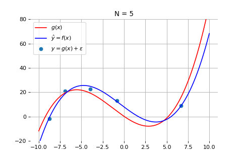
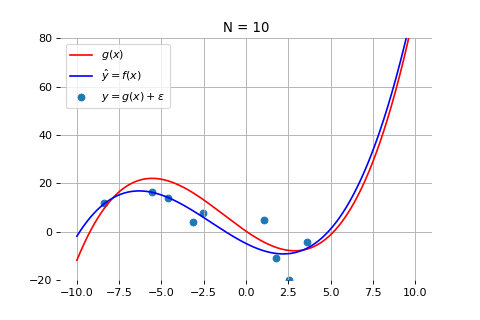
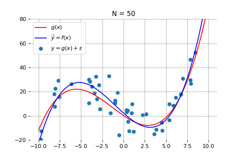
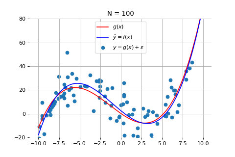
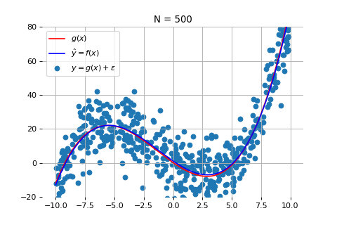
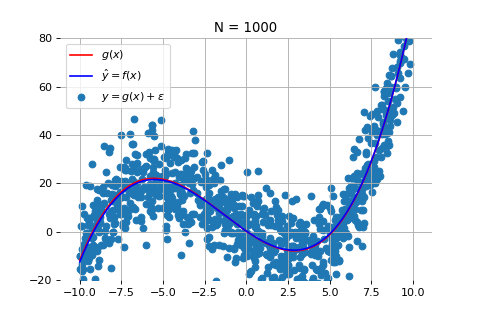

我们接下来讨论模型训练中数据的影响。在前面我们讲解了模型的相关内容，接下来将重点讲解数据的重要性。因为在机器学习和人工智能中，数据起着至关重要的作用。接下来，我们将详细探讨数据的影响。

好的数据是成功的关键。正如一句话所说：“巧妇难为无米之炊”，如果没有好的数据，哪怕是再强的机器学习模型也无法发挥作用。数据的数量和质量直接决定了模型的效果和准确性。

## 数据数量的影响

一般来说，数据量较少时，模型的误差会较大。我们来看一个例子。下图画出了我们通过 5 个数据点来拟合一个模型的结果。其中黑色的点是测量数据，红线代表产生数据的真实模型，而蓝线是通过数据拟合得到的模型。需要注意的是，由于数据在真实世界中总会受到各种干扰（例如测量误差），因此黑色的测量数据点并不完全落在红线上，而是围绕红线上下波动。

如上图所示，当数据点较少时，拟合出来的模型（蓝线）与真实模型之间的差距较大。

我们下面观察当数据量逐渐增长时，模型性能的变化。

当数据点为 10 个时：

当数据点为 50 个时：

当数据点为 100 个时：

当数据点为 500 个时：

当数据点为 1000 个时：

如上图所示，随着数据量的增加，尽管测量数据仍然在红线的上下震荡，但机器学习得到的模型（蓝线）和真实模型之间的误差会逐渐减小，蓝线和红线越来越接近。这意味着，模型的准确度也在不断提高。当数据量达到 1000 个时，拟合效果就非常好了。

这一例子说明，数据的数量对模型效果的影响非常大。在训练模型时，我们需要保证一定的数据量，才能获得更为准确和可靠的结果。

## 数据质量的影响

数据的质量对模型的学习也有着重要影响，因为机器学习模型是通过数据来进行学习的。举个例子，当我们使用某些智能助手时，可能会感觉到对话中存在中断或不连贯的情况，这实际上与这些智能助手的训练数据密切相关。

例如，一家以电商为主的公司，可能会用大量的电商客服数据来训练模型，而一家以媒体为主的公司，则可能使用大量的文章数据来训练其模型。因此，当我们使用不同公司的智能助手时，可能会感觉到某些助手的对话更流畅，而另外一些助手的领域知识更丰富，这就是因为它们的训练数据不同。

 

|[Index](./) | [Previous](1-9-svm) | [Next](1-13-overfit) |
