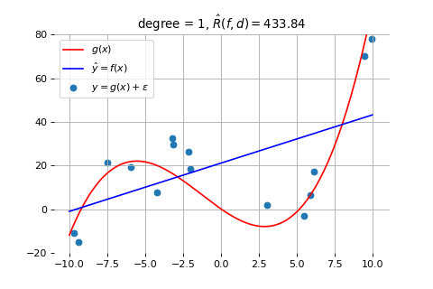
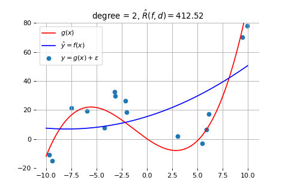
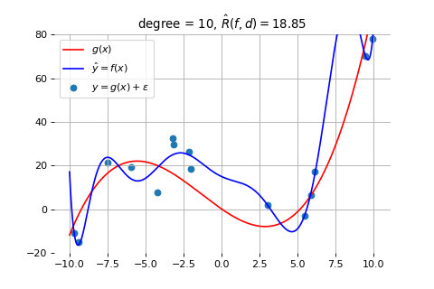
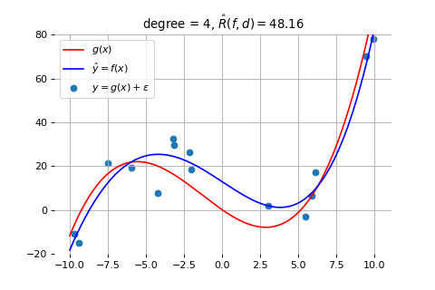
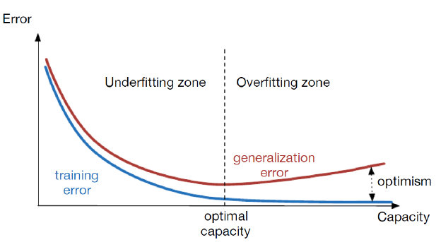
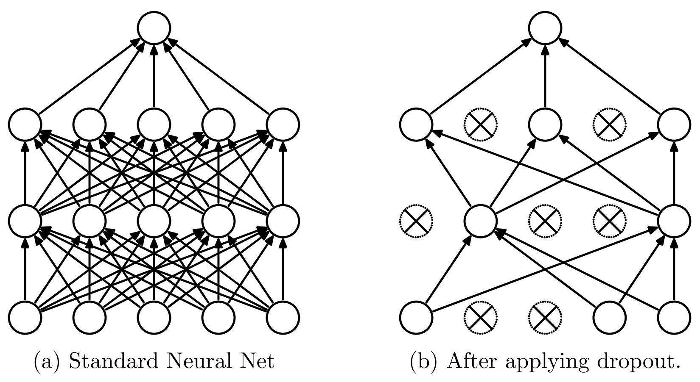

我们下面讨论模型选择的问题。在选择模型时，最重要的是选择一个能够与数据生成机制相匹配的模型。换句话说，模型的能力需要与产生数据的系统的底层工作机制相符合。

## 欠拟合

首先，当模型的能力不足以描述生成数据的模型时，模型的效果就会很差。下图画出了一个示例。其中，蓝色的数据点是由红色的曲线模型产生的，但我们却使用一个线性模型去拟合它（得到的蓝色直线）。

如上图所示，无论我们怎么调整蓝色直线的斜率和位置，都会有更大的误差。这就是所谓的欠拟合问题，指的是模型能力不足，无法捕捉到数据的复杂性。

类似的，当我们采用 2 次曲线来拟合它时，模型的能力依然不足。如下图所示：

## 过拟合

然而，模型的能力并不是越强越好。当模型的能力过于强大时，它可能会过度拟合训练数据中的偶然相关性或噪声。这样，虽然模型在训练数据集上的表现非常好，但它并没有捕捉到数据背后的系统工作基本规律，而是过于依赖这些随机出现的相关性和噪声。因此，当模型应用到测试数据集时，性能可能反而会下降，因为它所学到的规律并不具有普遍性，这就是所谓的过拟合问题。

为了理解这个问题，我们来看用 10 次曲线来拟合上面的例子时的结果，如下图所示。

如上图所示，因为数据本来是按照红线代表的规律生成的。但由于测量误差和噪声的存在，我们得到的数据点并不完全位于红线上，而是围绕红线上下波动。此时，因为 10 次曲线的能力过于强大，它就会尝试拟合这些误差和噪声，导致学到的蓝线变得非常复杂。但实际上，数据是根据红线产生的。所以，当我们用这个模型去试图理解按照红线产生的新数据时，就会发现不能解释，产生很大偏差。这就是模型能力过强所导致的过拟合现象。

## 奥卡姆剃刀准则

因此，选择合适的模型非常重要。在这方面，我们可以参考奥卡姆剃刀准则。该准则由14世纪的逻辑学家、圣方济各会修士威廉·奥卡姆（William of Occam，约1287年至1347年）提出。奥卡姆在《箴言书注》第二卷第十五题中写道：“若能用较少的资源就可以做得好，切勿浪费更多的资源去做。”奥卡姆剃刀的核心思想是：在解决问题时，不要使用不必要的复杂方法，应该选择最简单且有效的方案。

作为一个哲学原则，奥卡姆剃刀准则可以应用于许多方面，比如：

- 如果使用较少的资源就能完成一项任务，那么就不应浪费更多资源去做同样的事情。
- 如果面对同一个问题有多种理论，每种理论都能做出同样准确的预测，那么应当选择假设最少的理论。
- 在解释现象时，如果几种解释具有相同的解释能力，那么越简单的解释越好。
- 在预测能力大致相同的情况下，越简单的模型越好。

也有人将奥卡姆准则归结为四个字：简约至上。

按照奥卡姆剃刀准则，我们可以制定解决过拟合的模型策略。这就是说：我本来用一个简单一点的模型就能拟合出来的东西，你不要弄个特别复杂的模型去搞它。这时候大家在平时工作中。如果数据。大家先观察一下。如果这个数据它本身就比较有规律。咱们就用不着用这种特别复杂的什么 cnn transformer 去告诉他。你就用个简单的 SVM 就支持向量机或者现金回归，用这个模型去弄完就挺好的了。可以解释。就不需要就？就盯着最复杂的模型去告他，就这个意思。

按照奥卡姆剃刀准则，我们在选择机器学习模型时，如果一个简单的模型就能够拟合出数据的规律，就不要使用更复杂的模型。比如，如果支持向量机（SVM）或者线性回归就可以完成任务，那么就不要使用更复杂的模型，如卷积神经网络（CNN）或 Transformer。除了避免过拟合的风险，简单的模型还有计算量小，节省资源，容易解释等优点。因此，选择最合适的模型而非最复杂的模型是更为合理的做法。

因此，我们就来探索：为了拟合上面例子中的数据，我们需要采用几次的曲线。下面是分别用 3、4、5 次曲线拟合的结果

3 次曲线拟合的结果

4 次曲线拟合的结果

5 次曲线拟合的结果

如上图所示，当我们采用 3 次曲线时，拟合得就比较好了。采用更高次（比如 4、5 次）的曲线，也不能获得更好的效果。如前一节所述，此时的误差是因为数据量太少导致的，需要通过增加数据量来解决，而此时模型的复杂度已经是合适的了，符合奥卡姆剃刀准则。

## 欠拟合情况出现的判断和处理

由于深度模型具有很强的能力，它很容易出现过拟合。因此，在训练深度学习模型时，我们需要实时观察模型在测试集上的表现，以判断是否发生过拟合。如果在训练过程中，模型在训练集上的错误率持续下降，但在测试集上的错误率却开始上升，那么就可以判断模型发生了过拟合。这是因为模型在训练集上过度拟合了噪声和细节，导致它无法在未见过的数据上泛化，表现变差。下图画出了模型随着训练次数的增长，其误差的变化情况。

如上图所示，在模型训练的开始阶段，训练集和测试集上的误差都会逐渐减少，但是，当模型进入过拟合阶段时，训练集上的误差继续减小，但测试集上的误差就会逐渐增大了。

### Early Stopping

一旦我们发现出现上述情况，我们应该立刻停止模型的训练。这就是“提前停止”（Early Stopping）方法。Early Stopping 方法针对的是训练集 Loss 一直下降，而测试集 Loss 先下降后上升的现象。当我们观察到测试集 Loss 开始上升时，就说明模型已经过拟合，此时应该停止训练，并使用当前训练好的模型。通过这种方法，我们可以确保最终得到的模型性能不会因过度训练而下降，从而保持模型的泛化能力。

但此时，我们更需要反思的是：我们选用的模型是否过于强大，是否设计得过于复杂，是否过于灵活。确定了原因后，我们就可以有针对地进行改进，比如：选择一个更简单的模型；对现有模型进行简化；或者通过加入一些约束，如使用正则化方法（例如 L2 或 L1 正则化）来限制模型的复杂度。这些方法在实际工作中非常常见，可以帮助我们避免过拟合，提升模型的泛化能力。

### Dropout

在深度模型的训练中，也常用一种叫做 Dropout 的方法来防止模型过拟合。下图画出了该方法的工作原理。

如上图所示，Dropout 的基本思想是：在每一轮优化过程中，随机选择一部分神经元不参与计算，从而防止某些神经元过于突出，导致模型过拟合。具体来说，Dropout 会随机设置一些神经元的激活输出为 0，类似于关闭这些神经元。这迫使那些没有被关闭的神经元更加努力地进行训练，确保每个神经元都得到充分的训练。

Dropout 是一种启发式的方法，尽管它看起来简单，但它的效果却非常显著。最初，提出这个方法的论文被国际会议拒稿，原因是它太简单，缺乏所谓的“学术价值”。然而，这个方法的影响力巨大，几乎所有的深度学习模型在训练过程中都会采用这种方法。虽然该论文没有被正式出版，但它依然发表在 ArXiv 这一预印本平台上，并广泛应用于深度学习领域。

最终，当模型的能力与产生数据的系统底层工作机制相匹配时，模型的效果就会达到最佳。例如，在之前的例子中，当我们选择合适能力的模型时，模型的效果就会显著改善。这正是我们在选择模型时需要关注的关键问题——确保模型能够充分匹配数据的真实结构和规律。

 

|[Index](./) | [Previous](1-11-data) | [Next](1-15-opti) |
