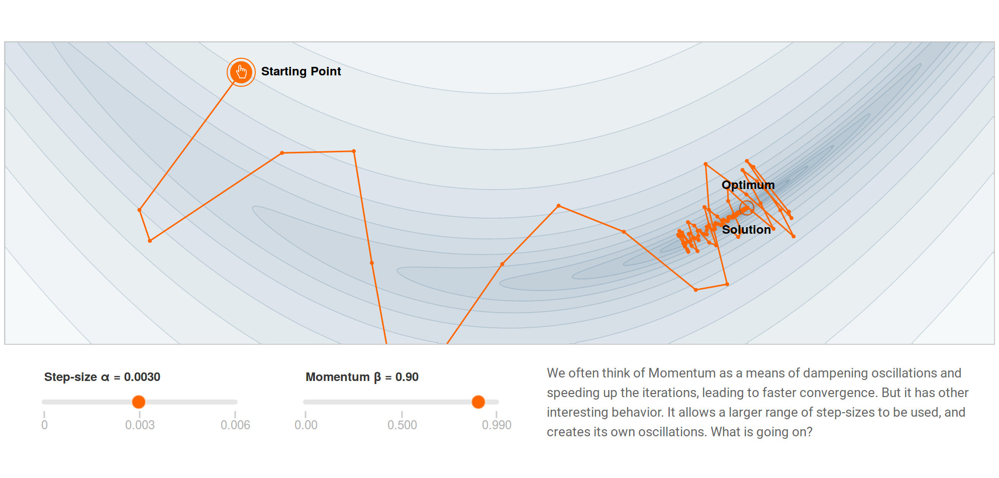

在训练深度学习模型时，我们的目标是让模型更准确地匹配实际数据。为此，需要调整模型的参数，使损失函数（Loss）达到最小值。这是深度学习中一个关键的优化过程。

在这部分内容中，我们将介绍深度学习模型的优化方法。首先，我们会讲解基础的梯度下降方法，然后逐步深入，讨论几种常见的自适应梯度下降方法。通过这些方法，模型可以更高效地学习和改进，从而提高性能。

## 梯度下降方法

在深度学习中，优化的核心方法是梯度下降。简单来说，深度学习的目标是找到一组最佳的模型参数 $$w$$，使得预测的误差最小化。这其实是一个经典的优化问题，而梯度下降法正是用来解决这一问题的有效工具。

下图画出了梯度下降优化方法的原理。其中红色的曲线是模型的损失函数随模型参数变化的关系曲线。横轴表示模型的参数，纵轴表示模型的损失。

如上图，当模型参数改变时，模型的性能（由损失函数表示）也会随之波动。我们的目标是找到使损失达到最低点的参数值——这对应于图中曲线的最低点，也就是最优参数的位置。在这个点上，模型的预测与实际数据之间的误差最小，意味着模型在此参数下表现最佳。

因此，我们的优化目的是：通过不断调整参数，使模型逐渐趋向损失函数的最低点，从而实现最优解。

在模型刚开始训练时，参数往往处于一个随机初始化的状态，通常并不是最优的。例如，参数可能位于损失曲线偏右侧的某个位置。这种情况下，损失值较大，模型的表现远未达到理想状态。

我们的优化操作是：从这个初始位置出发，调整参数，使损失逐渐减小。为此，我们需要一种策略来指导参数的更新方向和步伐。梯度下降法正是为了解决这个问题而设计的。

梯度下降法的核心思想可以简单地理解为：通过计算曲线在当前点的斜率（即梯度），调整模型参数的方向和幅度，以减小损失。

具体来说，我们通过计算损失函数关于参数的导数（即梯度），我们可以确定当前点的斜率。如果梯度为正，说明损失会随着参数的增加而升高，因此需要减小参数值；如果梯度为负，则表示损失会随着参数的减少而升高，因此需要增大参数值。这样一来，模型的参数会逐步向损失最小的位置靠近，最终达到优化目标。

如上图所示，当我们在黑色点处计算梯度时，如果发现曲线是朝右上方倾斜的，说明损失会随着参数的增加而变大。因此，为了让损失减小，我们需要沿着梯度的反方向调整参数——也就是向左移动一点点。

需要注意的是，在调整模型参数时，我们并不是一下子跳到损失曲线的最低点。这是因为我们并不知道目前离最优参数有多远。所以，每次调整模型参数时，我们只是沿着梯度的反方向挪动一点点。

挪动一点点之后，我们会重新计算当前点的梯度。如果梯度仍然表明曲线向右倾斜，那我们就继续向左移动，再挪一点点。

类似的，我们可以想象一下，如果我们初始的模型参数并不是位于曲线的右侧，而是在左侧，那么计算得到的梯度会显示曲线向左倾斜。这种情况下，我们会将参数向右挪一点点。

无论从哪一侧出发，通过这样不断重复计算梯度和调整参数的过程，经过几百次甚至几千次迭代，模型参数最终会逐渐逼近损失的最低点。

当模型参数到达最低点时，我们会发现曲线的斜率已经趋于平坦，不管往左还是往右移动，损失都不会再减少了。这时，模型的训练基本结束，因为我们已经找到了接近最优的参数值。

这种方法“小步慢跑”，逐步让模型的参数逼近最优值的方式，就是梯度下降优化方法的工作过程。

下面，我们通过一个动画来直观地看到梯度下降的过程。这个动画展示了一个二维图像，其中用等高线表示损失函数的变化。图像外围的区域损失较高，越接近中心的黑点，损失越低。黑点就是损失函数的最低点，也就是我们进行优化寻找的目标。

<video width="500" controls>
  <source src="fig/1-gd/2-opt-gd-easy-0.01.mp4" type="video/mp4">
</video>

如动画所示，在梯度下降的优化过程中，机器学习算法会从初始位置开始，不断调整模型参数，逐步向最低点靠近。动画中，路径显示了模型参数的移动轨迹，像是在一张地图上沿着山坡下行。随着一次次迭代，参数慢慢趋向最低点，模型的损失也随之减小。这一过程可能需要经历数百次、甚至数千次迭代，最终使得模型达到最优。

这个动态调整的过程，就是我们所说的梯度下降。它的核心思想是利用斜率（也就是梯度）来指导参数调整的方向和幅度，从而不断降低损失。

## 步长选择

在梯度下降的过程中，每次调整模型参数的距离被称为“步长”，可以类比为我们平时走路时每一步的长度。步长的选择对模型训练的效率和效果至关重要。

如果步长设得太小，就像走路时每次只挪动一点点，虽然方向是对的，但需要非常多的步数才能接近目标。这样一来，训练的时间会变得非常漫长，效率低下。

相反，如果步长设得太大，就可能出现问题。比如，从曲线的一侧一下子跳到另一侧，甚至越跳越远。这种情况下，模型可能在损失曲线上来回波动，总也找不到最低点的位置，训练过程会变得不稳定，甚至无法收敛到最优解。

因此，选择一个合适的步长非常重要。它需要足够小，保证调整的方向和幅度都不会偏离目标，同时也要足够大，以便在合理的时间内完成训练。这种平衡使得梯度下降法既能高效地进行优化，又能找到理想的解。

接下来我们来看一个步长过大导致震荡的演示。大家可以看到，模型参数的调整出现了明显的震荡。这就好比你站在一个碗的边上，因为每次跳跃的距离太大，所以每次你总从碗的这边跳到了碗的另一边，然后又再跳回来。这种震荡会导致训练过程不稳定，可能无法顺利收敛到最低点。因此，在选择步长时，我们需要保持适中的大小，既保证效率，又避免不必要的震荡。

<video width="500" controls>
  <source src="fig/1-gd/3-opt-gd-difficult-0.4.mp4" type="video/mp4">
</video>

# 高维下情况复杂

对复杂的深度学习模型来说，它的损失函数和参数的关系就特别复杂，不是像上图那样的特别简单的一个形状了。它的函数形状可能千奇百怪，有可能有各种凹凸不平的情况，如下图所示。

如上图所示，此时，在进行梯度下降优化时，就像咱们滑雪似的，就有可能稍微不注意，就溜到这边去了，又稍微不留意，留到那边去了，具有一定的随机性。所以有时候我们要进行各种尝试，才能最终来到一个比较低的损失函数值，训练出来一个好的模型。

在训练深度学习模型时，梯度下降法可能会遇到以下三种常见困境，它们在深度模型优化中的影响程度各不相同：

1. 局部最优：这个问题相对较轻。局部最优指的是模型参数可能会停留在某个比全局最优稍差的点上。虽然局部最优不是最佳解，但它通常比全局最优差距不大，因此影响不算严重。深度学习模型在面对局部最优时，往往能够通过进一步调整参数跳出局部最优，找到一个更好的解。

2. Plateau（高原）：在某些情况下，梯度下降法可能会遇到一个平坦的区域，即损失函数几乎没有变化的高原。此时，模型的梯度非常小，导致参数更新缓慢，训练进展停滞。

3. 鞍点：鞍点是梯度下降法中最常见且最严重的问题。在鞍点，损失函数的梯度在某些方向上接近零，而在其他方向上则变化较大，导致参数更新难以有效进行。深度学习模型往往会在这些鞍点附近停滞，难以继续优化。因此，鞍点问题是优化深度学习模型时需要特别注意的主要挑战之一。

这三种困境在模型训练过程中可能会影响优化效率和结果，因此解决这些问题是提升模型训练效果的关键。

为了解决上述问题，人们想出各种优化“步长”的控制方法。下面重点介绍两种方法。

# 一阶矩方法

该方法使用梯度的一阶矩（均值）的滑动平均来改善优化步长。Momentum（动量）方法是这样的一种方法。

动量方法通过引入历史梯度的加权平均来改进梯度的计算。其计算方式是：将当前的梯度与上一次的梯度加权平均后，作为新的梯度方向进行更新。一般来说，上一轮的梯度会乘以一个系数（如 0.99）。即以当前梯度 + 上一个方向的梯度 * 0.99，作为移动的方向。

Momentum（动量方法）是一种优化算法，旨在加速梯度下降法中的收敛过程，同时减少振荡。Momentum 的基本思想是通过引入一个动量项，让参数更新不仅仅依赖当前的梯度，还依赖于之前的梯度，从而形成一种“惯性”效应，加速沿着梯度下降的方向更新。

### Momentum 的控制公式

1. 计算梯度的滑动平均：
   $$v_t = \beta v_{t-1} + (1 - \beta) g_t$$
   其中：
   - $$v_t$$ 是当前时刻的动量（梯度的滑动平均）。
   - $$\beta$$ 是动量的衰减率（通常取值为 0.9）。
   - $$g_t$$ 是当前时刻的梯度。

2. 更新模型参数：
   $$\theta_{t+1} = \theta_t - \eta v_t$$
   其中：
   - $$\theta_t$$ 是当前时刻的模型参数。
   - $$\eta$$ 是学习率。
   - $$v_t$$ 是计算出的动量。

### 解释：
- $$v_t$$ 表示梯度的指数加权平均，它融合了当前梯度和之前梯度的影响，类似于惯性效果。如果连续多次的梯度方向相同，动量会累积，增加更新的步长；而如果梯度方向改变，动量会减小，避免过度震荡。
- $$\beta$$ 是动量的衰减因子，控制着过去梯度对当前更新的影响。较高的 $$\beta$$ 值使得动量在长时间内保持较大的影响力。
- 更新过程通过对动量进行累积，从而使得更新沿着正确的方向加速，特别是在平坦的区域内（如高原）可以避免过慢的收敛。

### Momentum 的优点：
- 加速收敛： 动量方法能够加速梯度下降，尤其是在梯度较小的方向上，避免了过慢的收敛。具体来说，通过引入历史梯度的加权平均，如果连续多次梯度都指向相似的方向，就迈更大步。这样就可以加速梯度下降，帮助模型克服平坦的高原区域，避免过慢的收敛。这个方法有点像滑雪的过程。如果你滑雪时一直朝一个方向滑行，动量方法会让你继续加速滑行，避免停滞不前。
- 减少震荡： 通过引入历史梯度的平均，Momentum 有助于减少梯度下降中可能出现的震荡现象，特别是在陡峭的方向。具体来说，通过计算历史梯度的加权平均，我们相当于对梯度做了滑动平均。，因此，如果连续多次梯度发生方向性的反转，移动的速度就会被降下来，这可以减少训练过程中的震荡。
- 稳定训练过程： 由于历史梯度的累积，Momentum 在训练过程中能够更稳定地收敛，避免了过早停滞。

我们下面来观察 Momentum（冲量）方法的效果。下面的图分别画出了在不同的 $$\beta$$ 下的方法表现。

我们首先观察，当不采用 Momentum 方法时，梯度下降方法的性能表现，如下图所示。

如上图所示，当不采用 Momentum 方法时，算法没有最终到达蓝色圆圈所示的最优处，而是停在了远离蓝色圆圈的红色圆圈处。优化性能不佳。

我们首先观察，当不采用 Momentum 方法时，梯度下降方法的性能表现，如下图所示。

如上图所示，当不采用 Momentum 方法时，算法没有最终到达蓝色圆圈所示的最优处，而是停在了远离蓝色圆圈的红色圆圈处。优化性能不佳。

我们然后观察，采用 Momentum 方法，$$\beta = 0.6$$ 时，梯度下降方法的性能表现，如下图所示。

如上图所示，此时，算法往前冲到了离蓝色圆圈最优处更近的地方，显示出 Momentum 加速的性能。当然，它还是没有到达最优点，而是停在了离红色圆圈不远的蓝色圆圈处，优化性能还是不佳。

于是，我们提高动量的衰减因子，令 $$\beta = 0.8$$，让原来的梯度能够更多地保留，获得的结果如下图所示。

如上图所示，此时，算法的震荡有所增加，但也往前冲得更远了，最终到达了蓝色圆圈所示的最优处。

然而，衰减因子不是越高越好的。比如，我们令 $$\beta = 0.9$$，获得的结果如下图所示。

如上图所示，此时，算法的震荡非常严重，虽然最终也还是到达了蓝色圆圈所示的最优处。

# 二阶矩方法

二阶矩方法的优化思路是：首先，在各个维度上，不再共享一个统一的步长，而是为每个维度单独调整步长，从而更灵活地控制训练过程中的梯度更新。然后，更重要的是，它使用梯度的二阶矩（即平方）来对梯度进行平滑处理，以减少震荡，并在保持正确方向的同时加速收敛。

在这种思路下，有两种常见的实现方法：RMSProp 和 AdaGrad。这两种算法都通过调整梯度的尺度，使得模型训练更加稳定，并能够在不同问题中更好地收敛。RMSProp 适合深度学习中的复杂问题，而 AdaGrad 更适用于简单的凸优化问题。

## RMSProp

我们首先看 RMSProp（Root Mean Square Propagation）。RMSProp 是一种适合深度学习的优化算法。它通过对梯度进行滑动平均，从而动态调整每个维度的学习率。具体来说，RMSProp 会计算每个参数梯度的平方的指数加权平均值，并根据这个平均值来调整学习率。通过这种方法，RMSProp 能够在训练过程中减少梯度的震荡，同时在需要时加速收敛，特别适合处理非凸问题，常用于深度神经网络的训练。

RMSProp 的控制公式通过对梯度的平方进行滑动平均来调整每个参数的学习率。具体的公式如下：

1. 计算梯度的平方的滑动平均：
   $$v_t = \beta v_{t-1} + (1 - \beta) g_t^2$$
   其中：
   - $$v_t$$ 是当前时刻的梯度平方的滑动平均。
   - $$\beta$$ 是一个衰减率（通常设为 0.9），用来控制历史梯度的影响。
   - $$g_t$$ 是当前时刻的梯度。

2. 更新模型参数：
   $$\theta_{t+1} = \theta_t - \frac{\eta}{\sqrt{v_t + \epsilon}} g_t$$
   其中：
   - $$\theta_t$$ 是当前时刻的模型参数。
   - $$\eta$$ 是学习率（通常设为 0.001 或其他值）。
   - $$v_t$$ 是梯度平方的滑动平均。
   - $$\epsilon$$ 是一个小常数（通常设为 \(10^{-8}\)），用于防止除以零的错误。

解释：
- 在 RMSProp 中，$$v_t$$ 保存了过去梯度平方的加权平均值。通过这样的方式，梯度的变化对参数更新的影响会逐步减少，尤其是当梯度变得较大时，步长会变小，减少震荡。
- 学习率 \(\eta\) 会根据 $$v_t$$ 动态调整，使得在梯度较大的方向上，更新的步长会减小，帮助避免在高梯度区域的过大波动，而在梯度较小的区域则保持较大的步长。

这种方法使得 RMSProp 在训练过程中更加稳定，并能够加速收敛，特别适用于深度学习模型的训练。

## AdaGrad

AdaGrad（Adaptive Gradient Algorithm）采用不同于 RMSProp 的方法，它通过对梯度的累积来动态调整学习率。在 AdaGrad 中，历史梯度的平方会累积起来，导致学习率随着时间的推移逐渐变小。这意味着模型在训练的早期阶段可以快速学习，但随着梯度的积累，学习率会变得越来越小，最终变得非常保守。AdaGrad 适合用于凸优化问题，尤其在训练时梯度变化较大的问题上效果更好。

AdaGrad 的控制公式通过对每个参数的梯度平方进行累积来动态调整学习率，使得在梯度较大的方向上更新步长较小，而在梯度较小的方向上更新步长较大。具体的公式如下：

1. 计算梯度的平方的累积：
   $$G_t = G_{t-1} + g_t^2$$
   其中：
   - $$G_t$$ 是在时刻 $$t$$ 时，所有梯度平方的累积和。
   - $$g_t$$ 是当前时刻的梯度。

2. 更新模型参数：
   $$\theta_{t+1} = \theta_t - \frac{\eta}{\sqrt{G_t + \epsilon}} g_t$$
   其中：
   - $$\theta_t$$ 是当前时刻的模型参数。
   - $$\eta$$ 是学习率（通常设为一个小常数，比如 0.01）。
   - $$G_t$$ 是从开始到当前时刻所有梯度平方的累积和。
   - $$\epsilon$$ 是一个小常数（通常设为 $$10^{-8}$$），用于防止除以零的错误。

解释：
- 在 AdaGrad 中，$$G_t$$ 累积了每个维度梯度的平方，因此，随着训练的进行，较大的梯度会导致该维度的步长变小，而较小的梯度会导致步长保持较大。这使得 AdaGrad 在训练过程中能够自适应地调整每个参数的更新步长。
- 初期，梯度较大时，学习率较高，步长较大，能够较快地收敛；但是随着训练的进行，累积的梯度平方值变大，学习率逐渐变小，步长变小，逐步收敛到最优解。

优点与缺点：
- 优点： AdaGrad 能够自适应调整每个参数的学习率，尤其适用于梯度变化较大的问题，能够有效避免梯度爆炸或梯度消失问题。
- 缺点： 由于 $$G_t$$ 的累积特性，AdaGrad 会导致学习率随着时间不断减小，可能会在训练后期过早地停止更新，导致模型无法充分训练。因此，AdaGrad 更适用于凸优化问题，对于非凸问题（如深度学习）可能表现不如其他优化算法。

# 综合方法

Adam（Adaptive Moment Estimation）是一种常用的优化算法，它综合了 Momentum（动量方法）和 RMSProp（根均方传播）两种优化思路，从而在梯度下降法中实现了自适应的步长调整。

Adam 方法的核心思想是：同时考虑梯度的 一阶矩（均值） 和 二阶矩（方差） 来动态调整每个参数的学习率。具体来说，Adam 结合了梯度的滑动平均（类似 Momentum）和梯度平方的滑动平均（类似 RMSProp），使得它在训练过程中既能够加速收敛，又能避免梯度震荡。

### Adam 的控制公式

1. 计算一阶矩（均值）的滑动平均：
   $$m_t = \beta_1 m_{t-1} + (1 - \beta_1) g_t$$
   其中：
   - $$m_t$$ 是当前时刻的梯度一阶矩（梯度的滑动平均）。
   - $$\beta_1$$ 是一阶矩的衰减率（通常设为 0.9）。
   - $$g_t$$ 是当前时刻的梯度。

2. 计算二阶矩（方差）的滑动平均：
   $$v_t = \beta_2 v_{t-1} + (1 - \beta_2) g_t^2$$
   其中：
   - $$v_t$$ 是当前时刻的梯度二阶矩（梯度平方的滑动平均）。
   - $$\beta_2$$ 是二阶矩的衰减率（通常设为 0.999）。

3. 计算偏差修正：
   由于一阶矩和二阶矩在初始时刻会偏向于零，因此需要对它们进行修正：
   $$\hat{m}_t = \frac{m_t}{1 - \beta_1^t}$$
   $$\hat{v}_t = \frac{v_t}{1 - \beta_2^t}$$
   其中，$$\hat{m}_t$$ 和 $$\hat{v}_t$$ 是经过偏差修正后的值。

4. 更新模型参数：
   $$\theta_{t+1} = \theta_t - \frac{\eta}{\sqrt{\hat{v}_t + \epsilon}} \hat{m}_t$$
   其中：
   - $$\theta_t$$ 是当前时刻的模型参数。
   - $$\eta$$ 是学习率（通常设为 0.001）。
   - $$\hat{m}_t$$ 和 $$\hat{v}_t$$ 分别是修正后的梯度一阶矩和二阶矩。
   - $$\epsilon$$ 是一个小常数（通常设为 $$10^{-8}$$），用于防止除以零的错误。

### Adam 的优点：
- 自适应调整学习率： Adam 在每个参数的方向上都自适应地调整学习率，使得在训练的过程中能够更有效地收敛，尤其是在处理稀疏梯度和非凸问题时效果更佳。
- 结合了 Momentum 和 RMSProp 的优点： 通过同时使用一阶矩和二阶矩，Adam 能够在维度较多的高维问题中表现出色，并且可以有效克服梯度消失或爆炸的问题。
- 训练稳定性： 由于 Adam 的梯度更新过程包含了动量和自适应的步长调整，训练过程通常更加稳定，能够加速模型的收敛。

总之，Adam 优化算法综合利用一阶矩（梯度的均值）和二阶矩（梯度的方差），进行梯度平滑，并自适应地调整学习率。具体来说，一阶矩用于表示梯度的方向，二阶矩则用来对梯度进行归一化，从而避免梯度过大或过小的问题。在训练的初期，Adam 采用较大的步长进行快速收敛，随着训练的进行，步长逐渐减小，以便更精细地调整模型参数。

由于这种自适应的步长调整和动量的引入，Adam 成为了一个非常强大的优化算法。它广泛应用于深度学习领域，尤其在处理大规模数据集和复杂模型时表现尤为出色。通过结合动量和自适应学习率调整，Adam 能够在大多数情况下实现快速且稳定的收敛，从而找到最优解。因此，Adam 是许多深度学习任务中的首选优化算法。

我们最后用一个动画来观察各种自适应步长选择算法的效果。下面的动画画出了 AdaGrad、RMSProp、Adam 算法的效果。

<video width="500" controls>
  <source src="./video/lec2/opt-adaptive.mp4" type="video/mp4">
</video>

如上面的动画所示，三种方法最后都能够到达最优点，但是：AdaGrad 的优化速度最慢；RMSProp 优化速度很快，但最后震荡比较大；而 Adam 的优化速度较快，而且能够比较稳定地到达最优点。

# 其它优化方法

在实际训练深度学习模型时，为了提高训练速度，常常使用 随机梯度下降（SGD） 和 Mini-batch 梯度下降 等方法，以增加模型参数的迭代次数，从而加速训练过程。

### 随机梯度下降（SGD）
随机梯度下降（Stochastic Gradient Descent, SGD） 是梯度下降的一种变种，它与传统的批量梯度下降的主要区别在于每次更新模型参数时，SGD 只使用一个样本的梯度来计算和更新参数，而不是使用整个数据集的平均梯度。这样做的好处是：
- 更快的更新： 每次迭代更新都只依赖于一个样本，而不是整个数据集，因此更新速度较快。
- 避免局部最优： 由于每次更新的方向都是基于一个单独样本的梯度，训练过程中会有一定的噪声，从而有助于跳出局部最优解，找到全局最优。

然而，SGD 也有缺点，由于每次迭代的梯度方向变化较大，训练过程可能不够稳定，并且可能导致较慢的收敛。

### Mini-batch 梯度下降
Mini-batch 梯度下降 是介于批量梯度下降和随机梯度下降之间的一种方法。在每次迭代中，它使用一个小批量的样本来计算梯度并更新模型参数。相比于 SGD 使用单个样本，Mini-batch 更加稳定，但比批量梯度下降的计算速度更快。

Mini-batch 的优点：
- 平衡计算速度与稳定性： 它在训练过程中提供了较为稳定的梯度估计，同时相较于批量梯度下降，计算效率更高。
- 硬件优化： Mini-batch 可以很好地适应现代硬件（如 GPU），通过并行计算加速梯度计算。
- 较好的收敛性： 由于每次更新基于多个样本，梯度计算更加平滑，能够较好地平衡速度和收敛性。

### 总结
- SGD 在每次迭代中计算一个样本的梯度，速度较快，但收敛不稳定，可能有较大的波动。
- Mini-batch 通过使用多个样本计算梯度，能够更好地平衡训练速度和收敛性，且适合在大规模数据集上使用。

因此，在实际训练中，Mini-batch 梯度下降通常被认为是一种非常有效的优化策略，能够在保证收敛的同时加快训练速度，特别是在使用深度神经网络时。

# 调参

调参（Hyperparameter Tuning） 是训练深度学习模型时非常关键的一个过程。调参的目的是找到一组最优的模型参数，从而提升模型的性能。调参的过程通常包括以下几个步骤：

### 1. 随机初始化模型
在开始训练之前，首先需要初始化模型参数。通常情况下，我们会采用一些随机初始化方法（如高斯分布、均匀分布等），确保模型的参数从一个合理的起点开始训练。良好的初始化有助于避免训练过程中陷入不良的局部最优解。

### 2. 使用模型进行预测
一旦模型初始化完毕，就可以通过训练数据来进行预测。这一阶段，我们并不期望模型能够马上预测准确，而是通过预测来评估模型在当前参数下的性能。

### 3. 将预测结果与真实结果比对
接下来，将模型的预测结果与真实结果进行比较，计算出误差或损失（如均方误差、交叉熵等）。如果模型的预测与真实结果相差较大，说明模型需要调整。

### 4. 调整模型参数
根据预测误差，我们会调整模型的参数。通常使用的调整方法是通过反向传播（backpropagation）算法来计算梯度，然后更新模型参数，减少损失函数值。这个过程会在每一次迭代中进行，直到模型的表现得到改善。

### 5. 重复步骤 2-4，直到性能无法提升
在训练过程中，我们会多次重复步骤 2-4，即不断地预测、计算误差、调整模型参数，并优化模型。每次迭代后，模型的性能应该逐渐提升。当模型的性能不再提升时，就可以停止训练。

### 6. 在验证集上验证，选择最好的模型参数
在整个训练过程中，我们需要时刻关注模型的性能。为了防止过拟合，通常会使用验证集来评估模型的性能。训练过程中，可以定期使用验证集对模型进行评估，并根据验证集的表现选择最好的模型参数。当训练完成后，最终的模型参数就是在验证集上表现最好的那一组。

### 总结
调参是一个反复试验和调整的过程。通常需要结合以下几个方面来进行：
- 学习率的选择： 太大可能导致不收敛，太小则训练过程过慢。
- 批量大小（Mini-batch size）： 影响训练速度和模型的稳定性。
- 优化算法： 比如 Adam、SGD 等，它们会影响模型的收敛速度和效果。
- 正则化方法： 防止模型过拟合，如 dropout、L2 正则化等。

通过反复优化这些参数，最终可以得到一个在验证集上表现最佳的模型。

## 课本

- Dive in Deep Learning
  - [5. Multilayer Perceptrons](https://d2l.ai/chapter_multilayer-perceptrons/index.html) 
  - [6. Builders’ Guide](https://d2l.ai/chapter_builders-guide/index.html)
  - [12. Optimization Algorithms](https://d2l.ai/chapter_optimization/index.html)
  - [13. Computational Performance](https://d2l.ai/chapter_computational-performance/index.html)

- Mining Massive Dataset，Ch.13, Neural Network and Deep Learning

## 课程材料

- 伯克利
  - 梯度下降 PPT，练习（带答案），用 ax2 + by2 的例子，很好地解释了各种梯度下降方法的原理
  - Batch Normalization PPT

## 复习题

- 画出 ReLU 激活函数的形状，给出其数学公式
- 给出 Softmax 的数学表达式
- 画图说明 NN 计算时的 Forward Pass 和 Backward Differentiation 的基本原理

## 练习

我们下面练习深度学习模型的构建和训练过程。

### 梯度下降优化编程练习

我们下面动手实现一个梯度下降算法，感受梯度下降的优化过程。我们用线性回归模型来练手。下面是材料：

- 布朗大学，线性回归，梯度下降 实验，代码：[ipynb](http://yishuai.github.io/bigalgo/hw/soln_gd.ipynb)

- 往届同学，Lisben ML 夏令营 Python和梯度下降入门实验报告：[腾讯文档](https://docs.qq.com/doc/DT01ZaXpsck5IblJp)

- Dive in Deep Learning，[3.4. Linear Regression Implementation from Scratch](https://d2l.ai/chapter_linear-regression/linear-regression-scratch.html)

### 神经元网络编程练习

多伦多大学 Pascal Poupart 老师 AI 课程的 [练习](https://cs.uwaterloo.ca/~ppoupart/teaching/cs486-spring23/assignments.html) 3 中的 Neural Network 部分练习。练习内容为：根据房子的属性，分类其售价是高还是低。需要编码的内容包括：层数优化、激活函数、Dropout

Numpy MLP 模型实现和图片分类，[Github](https://github.com/josephdviviano/intro-dl)

 

|[Index](./) | [Previous](1-13-overfit) | [Next](3-0-intro) |
