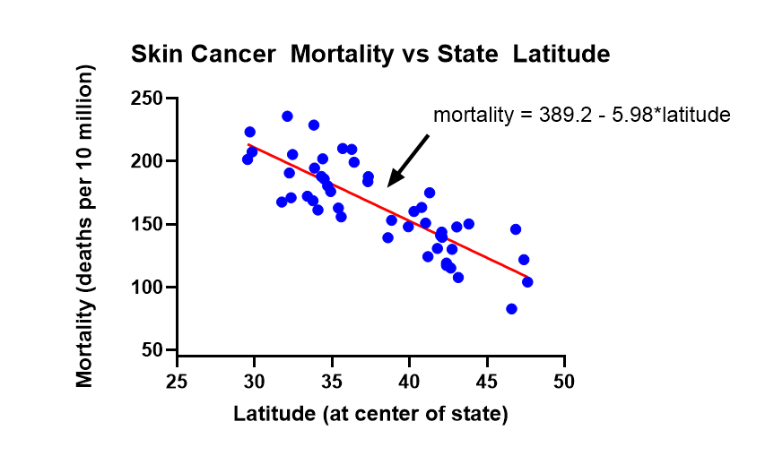
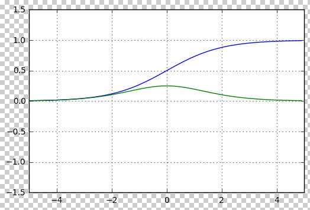

本节我们学习线性回归和 Logistic 回归，掌握交叉熵损失函数和它对 Logistic 模型参数的导数计算方法。

## 线性回归

Linear Regression

$$ y = ax + b $$

这就是我们刚才提到的线性回归。如果我们的数据满足线性规律，比如GDP的增长呈现线性趋势，我们就可以训练一个线性模型来拟合这些数据。

下图中画出了一个医学机器学习的例子。这是一些医学实验数据。每个蓝点代表一个省。这个点的横轴是这个省的纬度，纵轴是这个省内的居民得皮肤癌的概率。

如上图所示，一个省内居民得皮肤癌的概率和这个省的纬度是相关的：纬度越高，得皮肤癌的概率越小。或者说：得皮肤癌的概率会随着纬度的增加而越小。更特别的是，得癌概率随着纬度的增加而越小的速率是线性的。因此，如上图所示，我们用一个线性回归模型来拟合这个数据，这就是图上的红线。这就是线性回归。

线性回归在实际中有着广泛的应用。

##  Logistic  回归

 Logistic 回归虽然名字里有“回归”，但它其实并不是一个预测数值的回归模型，而是一个分类模型。它输出的是一个二分类的概率，也就是说，它会判断数据属于两类中的哪一类。例如，结果可能是“正常”或“异常”。 Logistic 回归的任务就是计算数据属于某一类（比如“异常”）的概率。

 Logistic  回归模型首先对输入数据 x 进行线性加权，然后通过非线性变换，最终输出结果。它的公式是：

$$ P(y=1 \lvert x) = \frac{1}{1 + e^{-(ax + b)}} $$

作为一个分类模型， Logistic 回归的输出并不是感知机中的“阶跃”函数，而是一个 Logistic 函数。 Logistic 函数是一种S形曲线，它能够输出一个介于0和1之间的概率值。其数学形式为：

$$ \sigma(x) = \frac{1}{1 + e^{-x}} $$

下图画出了该函数的波形（蓝线）及其斜率（绿线）

如上图所示，Logistic 函数有两个显著的优点：

首先，如蓝线所示，这个函数将任何实数输入压缩到0和1之间，适合用来表示分类问题中的概率。 Logistic 回归通过这种方式输出类别的“概率”。具体来说， Logistic 函数的输出是一个介于0和1之间的数字，这个数字非常适合用来表示概率。例如，它可以表示“这封邮件是垃圾邮件的概率”。这就是 Logistic 回归的一个重要优势：它的输出直接可以解释为概率。

其次，如绿线所示，它的斜率有着很简单的数学形式，这种形式使得 Logistic 回归模型非常便于优化。由于 Logistic 函数是“可微”的，我们可以计算它的梯度，并利用这个梯度进行优化。而感知机的“阶跃”函数则不是可微的，因此不容易直接进行梯度优化。

## 交叉熵

除了使用  Logistic  函数作为输出， Logistic  回归还引入了“交叉熵”作为损失函数。交叉熵用于衡量两个概率分布之间的差异，通常也称为 KL 散度。

交叉熵的数学公式是：

对于二分类问题，交叉熵损失函数可以表示为：

$$ \text{Loss} = - \left[ y \log(p) + (1 - y) \log(1 - p) \right] $$

其中：
- $$y$$ 是真实标签（0 或 1）。
- $$p$$ 是模型预测的概率，即数据属于类别1的概率 $$P(y=1 \lvert x)$$。

对于多分类问题，交叉熵损失函数的公式为：

$$ \text{Loss} = - \sum_{i=1}^{C} y_i \log(p_i) $$

其中：
- $$C$$ 是类别的总数。
- $$y_i$$ 是第 $$i$$ 类的真实标签（0 或 1）。
- $$p_i$$ 是模型对第 $$i$$ 类的预测概率。

交叉熵度量了模型预测的概率分布与真实标签分布之间的差异，损失越小，模型的预测越准确。

我们下面通过一个简单的二分类问题来举例说明交叉熵的计算。

假设我们有一个二分类问题，要预测一封邮件是否是垃圾邮件。

### 例 1:

我们有以下数据：

- 真实标签 $$y = 1$$（表示垃圾邮件）
- 模型预测的概率 $$p = 0.8$$（表示模型认为邮件是垃圾邮件的概率为80%）

根据交叉熵的公式：

$$ \text{Loss} = - \left[ y \log(p) + (1 - y) \log(1 - p) \right] $$

我们将真实标签和预测概率代入公式：

$$ \text{Loss} = - \left[ 1 \cdot \log(0.8) + (1 - 1) \cdot \log(1 - 0.8) \right] $$

由于 $$y = 1$$，第二项 $$(1 - y) \log(1 - p)$$ 为0，公式简化为：

$$ \text{Loss} = - \log(0.8) $$

计算得：

$$ \text{Loss} \approx 0.223 $$

### 例 2:

如果真实标签 $$y = 0$$（表示非垃圾邮件），而模型预测的概率 $$p = 0.8$$（表示模型认为邮件是垃圾邮件的概率为80%），我们可以使用交叉熵损失函数来计算损失。

交叉熵的公式是：

$$ \text{Loss} = - \left[ y \log(p) + (1 - y) \log(1 - p) \right] $$

代入已知值 $$y = 0$$ 和 $$p = 0.8$$，我们得到：

$$ \text{Loss} = - \left[ 0 \cdot \log(0.8) + (1 - 0) \cdot \log(1 - 0.8) \right] $$

由于 $$y = 0$$，第一项 $$0 \cdot \log(0.8)$$ 为0，公式简化为：

$$ \text{Loss} = - \log(0.2) $$

计算结果为：

$$ \text{Loss} \approx 1.609 $$

因此，交叉熵损失为约 1.609。这个值较大，说明模型的预测（认为邮件是垃圾邮件的概率为80%）与真实标签（非垃圾邮件）之间的差距较大，模型预测的效果较差。

如上例所示，交叉熵损失能够表示模型预测垃圾邮件的概率与真实标签之间的差异。损失值越小，说明模型预测得越准确。

### 例 3:

如果真实标签 $$y = 0$$（表示非垃圾邮件），而模型预测的概率 $$p = 0.2$$（模型认为邮件是垃圾邮件的概率为20%），那么：

$$ \text{Loss} = - \left[ 0 \cdot \log(0.2) + 1 \cdot \log(1 - 0.2) \right] $$

公式简化为：

$$ \text{Loss} = - \log(0.8) $$

同样，计算结果：

$$ \text{Loss} \approx 0.223 $$

可以看到，无论真实标签是 1 还是 0，交叉熵都能根据模型的预测概率来衡量预测的准确性。

## Logistic 回归损失函数对参数w的梯度

通过简单的数学变换，我们可以发现，Logistic 回归模型的交叉熵损失函数对参数 $$w$$ 的梯度非常容易计算。具体来说，梯度的计算结果是：

$$ \frac{\partial \text{Loss}}{\partial w} = (p - y) \cdot x $$

其中：
- $$p$$ 是模型的预测概率，即 $$P(y=1 \lvert x)$$。
- $$y$$ 是真实标签（0 或 1）。
- $$x$$ 是输入特征。

这个梯度的计算结果告诉我们，梯度更新的方向和大小与模型预测的结果 $$p$$ 和真实值 $$y$$ 之间的差异成正比。由于计算公式简单且直接，模型的优化过程变得非常高效。在训练过程中，我们可以通过梯度下降法来更新模型的参数 $$w$$，逐步减少损失函数，从而提高模型的准确性。

下面是具体的推导过程

### 第一步：损失函数对模型预测概率 $$p$$ 的导数

我们首先计算交叉熵损失函数对 $$p$$ 的导数。对于单个数据点，交叉熵损失函数的公式为：

$$ \text{Loss}(p) = - \left[ y \log(p) + (1 - y) \log(1 - p) \right] $$

其中：
- $$y$$ 是真实标签，取值为0或1。
- $$p = \sigma(w^T x)$$ 是模型的预测概率，即样本 $$x$$ 属于类别1的概率。

我们计算损失函数对预测概率 $$p$$ 的导数：

$$ \frac{\partial \text{Loss}}{\partial p} = - \left( \frac{y}{p} - \frac{1 - y}{1 - p} \right) $$

有了损失函数对预测概率 $$p$$ 的导数后，我们下面求预测概率 $$p$$ 对模型参数 $$w$$ 的导数。

由于预测概率 $$p = \sigma(w^T x)$$，我们又需要使用链式法则将梯度从 $$p$$ 传播到参数 $$w$$。

所以，我们下面首先求 Logistic 函数对 $$z$$ 的导数 $$\frac{\partial \sigma(z)}{\partial z}$$。

### 第二步：模型预测概率 $$p$$ 对模型参数 $$w$$ 的导数

要计算模型预测概率 $$p$$ 对模型参数 $$w$$ 的导数，我们又分为两步：

### 2.1 Logistic 函数对 $$z$$ 的导数 $$\frac{\partial \sigma(z)}{\partial z}$$

因为 $$\sigma(z) = \frac{1}{1 + e^{-z}}$$ 是一个分式，因此我们可以使用商法则来求导。

商法则告诉我们，如果 $$f(z) = \frac{g(z)}{h(z)}$$，那么：

$$ \frac{d}{dz} \left( \frac{g(z)}{h(z)} \right) = \frac{h(z) \cdot g'(z) - g(z) \cdot h'(z)}{[h(z)]^2} $$

在我们的情况中，$$g(z) = 1$$ 和 $$h(z) = 1 + e^{-z}$$，所以，我们有：

- $$g(z) = 1$$，所以 $$g'(z) = 0$$。
- $$h(z) = 1 + e^{-z}$$，所以 $$h'(z) = -e^{-z}$$。

根据商法则：

$$ \frac{d}{dz} \left( \frac{1}{1 + e^{-z}} \right) = \frac{(1 + e^{-z}) \cdot 0 - 1 \cdot (-e^{-z})}{(1 + e^{-z})^2} $$

简化后：

$$ \frac{\partial \sigma(z)}{\partial z} = \frac{e^{-z}}{(1 + e^{-z})^2} $$

上面这个式子看起来比较复杂，我们下面将 $$e^{-z}$$ 转换为 $$\sigma(z)$$，得到一个更简洁的表达式。

根据 $$\sigma(z) = \frac{1}{1 + e^{-z}}$$，我们有：

$$ e^{-z} = \frac{1}{\sigma(z)} - 1 $$

将其代入 $$\frac{e^{-z}}{(1 + e^{-z})^2}$$，我们有：

$$ \frac{\partial \sigma(z)}{\partial z} = \sigma(z)(1 - \sigma(z)) $$

上面这个式子看起来就简洁多了。这就是 Logistic 函数的导数。这个结果意味着，Logistic 函数的导数与函数值 $$\sigma(z)$$ 和它的补集 $$(1 - \sigma(z))$$ 成正比。我们下面就用这个式子。

因为我们的模型预测概率（即样本 $$x$$ 属于类别1的概率）为 $$p = \sigma(z)$$，$$z = w^T x$$，所以，我们有：

$$ \frac{\partial p}{\partial (z)} = p(1 - p) $$

### 2.2 $$z = w^T x$$ 对 $$w$$ 的导数

因为 $$z = w^T x$$ 是 $$w$$ 的函数，我们接下来计算 $$z$$ 对 $$w$$ 的导数。

由于 $$w^T x$$ 是 $$w$$ 和 $$x$$ 的点积，我们有：

$$ \frac{\partial (w^T x)}{\partial w} = x $$

### 2.3 预测概率 $$p$$ 对 $$w$$ 的导数

现在我们可以用链式法则，将 $$p$$ 对 $$z$$ 的导数和 $$z$$ 对 $$w$$ 的导数这两部分结合起来，计算 $$p$$ 对 $$w$$ 的导数了。我们有：

$$ \frac{\partial p}{\partial w} = \frac{\partial p}{\partial (z)} \cdot \frac{\partial (z)}{\partial w} $$

即：

$$ \frac{\partial p}{\partial w} = p(1 - p) \cdot x $$

因此， Logistic 函数 $$p = \sigma(w^T x)$$ 对权重 $$w$$ 的导数是：

$$ \frac{\partial p}{\partial w} = p(1 - p) \cdot x $$

这个结果表明， Logistic 函数的梯度不仅与模型输出的概率 $$p$$ 和它的补集 $$(1 - p)$$ 成正比，而且与输入特征向量 $$x$$ 成正比。

### 第三步：损失函数对模型参数 $$w$$ 的导数

我们下面使用链式法则将前面两步的结果组合起来，得到损失函数对 $$w$$ 的梯度：

$$ \frac{\partial \text{Loss}}{\partial w} = \frac{\partial \text{Loss}}{\partial p} \cdot \frac{\partial p}{\partial w} $$

代入前面的结果：

$$ \frac{\partial \text{Loss}}{\partial w} = \left( - \left( \frac{y}{p} - \frac{1 - y}{1 - p} \right) \right) \cdot p(1 - p) x $$

简化后得到：

$$ \frac{\partial \text{Loss}}{\partial w} = (p - y) \cdot x $$

这个结果非常简洁。它表明，梯度的大小和方向与预测概率 $$p$$ 和真实标签 $$y$$ 之间的差异成正比，同时也与输入特征 $$x$$ 成正比。

这种简洁的梯度计算意味着，我们只需要计算模型预测的概率 $$p$$ 和真实标签 $$y$$ 之间的差异，并将其乘以输入特征 $$x$$，就能够得到用于梯度下降优化的梯度。这种计算方式使得Logistic回归的优化过程非常高效，通过梯度下降法更新参数，我们可以逐步降低损失函数，进而提高模型的预测准确性。

正是由于这些特点，Logistic 回归成为了一个在大规模数据集上非常有效的模型，适用于实际问题中的优化任务。大家在工作中应当注意，Logistic回归是一个强有力的工具，能够帮助我们解决各种实际问题。

这些特点也为神经网络模型提供了理论基础，接下来我们将介绍神经网络模型的相关内容。

## 课本：

- SLP 课本
  - 第 5 章：Logistic 回归

## 课程材料

- 斯坦福大学 CS224n
  - Logistic 回归 PPT

## Logistic 回归（LR）复习题

- 为什么说 Logistic 回归 是 Discriminative 分类器？ 写出其优化目标函数的数学表达式，然后解释
- 写出 LR 模型的数学表达式，解释其物理意义
- （案例分析题）给定一段文本，请设计对其进行情感分类的特征
- 写出 0/1 分类问题 的 交叉熵 （Cross-Entropy）Loss 函数 的 数学表达式
- 推导 LR 模型下， Cross-Entropy Loss 的 梯度。要求给出推导过程。给出推导结果的物理意义

 

|[Index](./) | [Previous](1-3-ml-type) | [Next](1-7-perceptron) |
