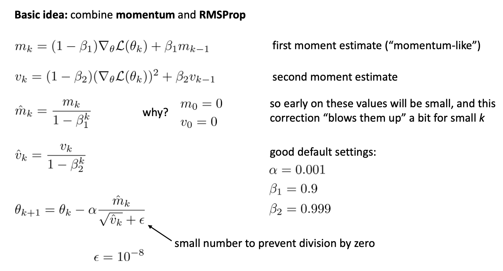

本节介绍深度学习模型的优化训练方法。我们首先介绍梯度计算的反向传播方法，然后介绍自适应梯度下降方法，最后介绍如何应对过拟合的难题。

在深度学习模型的训练时，为了让模型匹配实际数据，我们需要调整模型的参数，让它的 Loss 最小。为此，我们有各种优化训练方法。

## 反向传播计算梯度

深度学习的优化主要采用梯度下降方法。这种方法需要我们计算 Loss 函数对模型参数的梯度。

深度学习采用“反向传播”方法来“高效”计算各层神经元的梯度。首先，深度模型具有一层连着一层的层级结构，而我们需要计算 Loss 函数对各层模型参数的梯度。因此，我们可以利用这一结构，首先做 NN 的前向计算，然后做梯度的后向传播（Backpropagation），以提高计算 的效率。具体来说，我们首先从输入层开始，朝着输出层，进行前向计算。在计算的过程中，在每层的神经元处，都存下获得的值，供后面梯度计算用。计算到输出层后，从输出层往前，利用前面存储到值，按照求梯度的“链式法则”，依次计算出每一层参数的梯度。

## 自适应梯度下降

神经元网络的优化不是一个凸优化问题。它的 Loss 函数千奇百怪。因此，按照梯度下降来进行优化，很容易陷入各种困境。具体来说，梯度下降法可能遇到以下三种困境。它们在深度模型的优化中严重程度如下：
- 局部最优：这个的问题不大，因为局部最优通常比全局最优差不了太多。
- Plateau（高原）：针对这个问题，人们想出来 momentum（动量）方法进行解决。
- 鞍点：这是主要出现的问题。

为了解决上述问题，人们想出各种优化“步长”的控制方法。下面重点介绍两种思路。

第一种思路是 Momentum（动量）方法。它的基本思想是：如果连续多次梯度都指向相似的方向，就迈更大步。它的具体实现方法是：当前梯度 + 上一个方向的梯度 * 0.99，作为移动的方向。这样做，相当于对梯度做了滑动平均。这样能够减少来回震荡，但在一直保持的方向上加速。请访问[网页](https://distill.pub/2017/momentum/)体验该方法的效果。

第二个思路是：在各个维度不再共用一个梯度，而是各自进行梯度的尺度调节。具体的尺度调节方法是对梯度平滑后，用它的二阶钜（平方）做归一化。这样也能减少震荡，但在一直以来对方向上加速移动。

上述思路有两种类似的实现方法。第一种是 RMSProp，它对梯度做滑动平均，适合深度学习；第二种是 AdaGrad，它会累积过去的梯度，这样的话，步长会越来越小，适合 Convex 问题。

我们目前常用的 Adam 方法，综合了上述两种改进思路。它的方法如下图所示：

如上图所示，Adam 采用了以下方法
- 对一阶矩、二阶钜，做平滑
- 在迭代的开始，放大它们
- 用一阶钜作为梯度，用二阶钜来做归一化

在实际训练中，为了提高训练速度，我们还有随机梯度下降（SGD）、Mini-batch 等方面，以增加模型参数的迭代次数，加速训练。

## 过拟合问题及其解决

深度模型的能力很强，因此很容易过拟合。

解决过拟合的基本原则是奥卡姆剃刀准则：同样的准确度下，模型越简单越好。因此，一般用 Regularization 方法来限制模型的复杂度，如 L2，L1 正则。其中 L1 正则可以带来稀疏特征。

深度模型的训练中，常用 Early Stopping 和 Dropout 两种方法，防止模型过拟合。

Early Stopping 方法针对的是这样一种现象：训练集 Loss 会一直下降，但测试集 Loss 先下降，然后上升；因此，当我们发现测试集 Loss 上升时，就说明模型过拟合了，此时就停止训练，就用当前训练好的模型。

Dropout 是在训练的过程中，随机设置一些神经元的激活输出 为 0，这类似于关掉这些神经元，因此，就会“逼”着那些没有被“关掉”的神经元“努力”训练，这就让每一个神经元都得到了训练。因此，Dropout 是一种启发式的方法。提出这个方法的论文，被国际会议拒稿，因为它实在太简单了，没有“学术价值”。所以它至今只是发表在 ArXiv 这个论文的预印版的网站上，但它的影响力却是巨大的，是基本上所有深度学习模型在训练中都会采用的方法。

## 课本

- Dive in Deep Learning
  - [5. Multilayer Perceptrons](https://d2l.ai/chapter_multilayer-perceptrons/index.html) 
  - [6. Builders’ Guide](https://d2l.ai/chapter_builders-guide/index.html)
  - [12. Optimization Algorithms](https://d2l.ai/chapter_optimization/index.html)
  - [13. Computational Performance](https://d2l.ai/chapter_computational-performance/index.html)

- Mining Massive Dataset，Ch.13, Neural Network and Deep Learning

## 课程材料

- 伯克利
  - 梯度下降 PPT，练习（带答案），用 ax2 + by2 的例子，很好地解释了各种梯度下降方法的原理
  - Batch Normalization PPT

## 复习题

- 画出 ReLU 激活函数的形状，给出其数学公式
- 给出 Softmax 的数学表达式
- 画图说明 NN 计算时的 Forward Pass 和 Backward Differentiation 的基本原理

## 练习

我们下面练习深度学习模型的构建和训练过程。

### 深度学习模型训练过程体验

我们可以在浏览器中方便地体验深度学习模型的训练过程。请登陆 [Tensorflow Playground](http://playground.tensorflow.org/) 网站 ，尝试基于神经元网络的分类任务，获得直观体验。

该网站为互动网站。我们可以在上面完成以下各种设置，完成深度神经元网络的训练：

- 数据输入：二维x
- 输出：0/1分类
- 神经元、“层”的概念
- 增加神经元的层数、每一层的神经元的个数，感受模型能力的增长
- 调节激活函数、学习率、优化方法，感受模型能力的变化

### 梯度下降优化编程练习

我们下面动手实现一个梯度下降算法，感受梯度下降的优化过程。我们用线性回归模型来练手。下面是材料：

- 布朗大学，线性回归，梯度下降 实验，代码：[ipynb](http://yishuai.github.io/bigalgo/hw/soln_gd.ipynb">ipynb</a>

- 往届同学，Lisben ML 夏令营 Python和梯度下降入门实验报告：[腾讯文档](https://docs.qq.com/doc/DT01ZaXpsck5IblJp)

- Dive in Deep Learning，[3.4. Linear Regression Implementation from Scratch](https://d2l.ai/chapter_linear-regression/linear-regression-scratch.html)

### 神经元网络编程练习

多伦多大学 Pascal Poupart 老师 AI 课程的 [练习](https://cs.uwaterloo.ca/~ppoupart/teaching/cs486-spring23/assignments.html) 3 中的 Neural Network 部分练习。练习内容为：根据房子的属性，分类其售价是高还是低。需要编码的内容包括：层数优化、激活函数、Dropout

 

|[Index](./) | [Previous](1-3-mlp) | [Next] (3-3-cnn)
