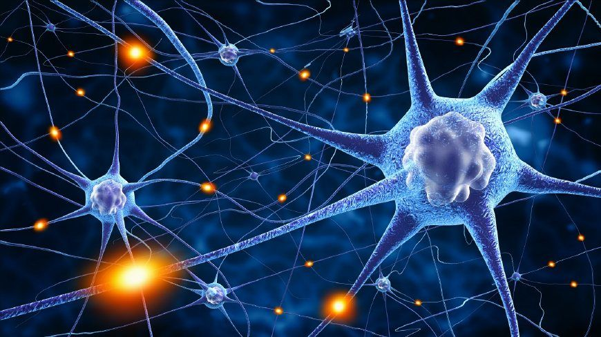
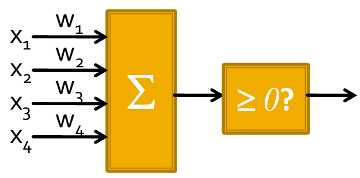
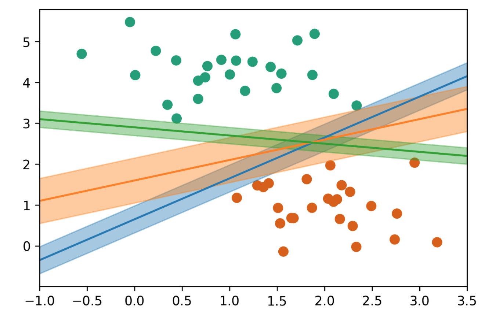
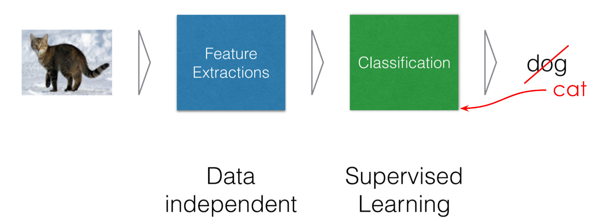

人工智能的起源可以追溯到“感知机”模型。1958 年，Rosenblatt 参考了人脑神经元的信号处理方式，提出了“感知机”模型。

接下来，我们将重点介绍这个感知机模型。它是模仿人类神经元工作原理的第一代人工智能模型，也可以看作是早期的机器学习模型。

## 大脑模型

生物学家通过研究动物和人的大脑，发现大脑是由很多神经元连接而成的复杂系统。这些神经元之间通过突触进行通信。当一个神经元接收到来自其他神经元的电信号时，它会做出反应。如下图所示。

生物学家发现大脑中的神经元在互相通信中有以下两个特点：

首先，一个神经元对来着不同神经元的信号，有不同的反应：有的反应强烈一些，有的反应弱一些。因此，为了计算一个神经元对来着不同神经元的信号的总反应，我们可以给不同的信号赋予不同的权重。例如，一个信号的权重可能是 0.1，而另一个信号的权重可能是 10。这样就反映了它们对一个神经元的影响不同。

其次，神经元有一个“激活”机制，即：当输入信号较小时，神经元不会产生反应；而当输入超过一定阈值时，神经元才会被激活。

就是通过上述两个看似简单的通信机制，我们的人脑中数十亿个神经元，构成了极其复杂的网络，支持我们的各种智能。

通过几百万年的进化，人类的大脑已经固定了一些功能，比如语言。我们出生后，并不是一张白纸：我们的大脑中已经有了一些预设的结构和机制。因此，孩子们学习语言才会学得那么快。孩子学习语言的过程，很可能就是激活大脑中与语言相关的区域，孩子们就能开始说话了。

而我们大脑的学习过程，就是通过各种经验，不断强化或拆除这些神经元之间的连接，同时调整权重。在这个过程中，神经元之间的连接权重（W）会不断调整。大脑就是通过这样的方式来处理各种信息的。

## 感知机模型

受到上述大脑神经元模型的启发，科学家提出了模拟人脑神经元的感知机模型。它包括两部分。

第一部分模仿神经元的输入加权机制，对输入进行线性加权。我们有：
- $$x_i$$：神经元的输入
- $$w_i$$：连接的权重
- $$w_1 x_1 + w_2 x_2 + b$$：加权求和

第二部分模仿神经元的“激活”机制。即，当输入信号较小时，神经元不会产生反应；而当输入超过一定阈值时，神经元就会突然激活。为此，我们在模型中引入了对加权和的大小进行阈值判断的条件，即判断 $$w_1 x_1 + w_2 x_2 + b \geq 0$$ 是否成立，来模拟这种激活行为。

最终，我们就得到了如下感知机模型，它将判断 $$w_1 x_1 + w_2 x_2 + b \geq 0$$ 是否成立。它由两部分组成：输入的线性加权和非线性激活函数输出。它非常简单。首先通过权重（W）和输入（X）进行加权计算，然后把激活函数加到最后。

值得注意的是，我们上面采用的激活函数不是线性增长的，而是一个“阶跃”（Step）函数。它的输出结果要么是 0，要么是 1。因此，它能够进行 0/1 分类的工作，比如判断一封邮件是否是垃圾邮件。随着输入的增长，当某个阈值被突破时，神经元会突然激活并跳跃式增长，输出 1。这就是感知机的基本模型。

如上图所示，感知机的输出会对输入进行线性加权和，然后通过一个非线性激活函数 $$\sigma(x)$$ 进行处理。我们有：

$$ y = \sigma (w_1 x_1 + w_2 x_2 + b) $$

其中，非线性激活函数 $$\sigma(x)$$ 的形式是：当 $$x \geq 0$$ 时，输出为 1，否则输出为 0。

因为发明感知机的科学家是电子工程师，所以当时，他们是通过电子电路来实现这些神经元，并将它们连接起来的。随着技术的发展，尤其是计算机的普及，我们现在可以通过计算机来实现。

## 感知机的模型训练

像我们前面介绍过的那样，作为一个机器学习模型，感知机是通过错误来学习的。

要理解感知机从错误中学习的过程，让我们考虑这样一个几何平面。平面上有两类数据点。感知机的目标是找到一根分割线，将这两类数据完美区分开。分割线的一侧是一类数据，另一侧是另一类数据。这根线被称为判决平面。如下图所示。

那么，感知机是如何学习到最佳的判决平面的呢？它如果观察到某些数据被错误分类，就会将判决平面朝着这些错误的数据点稍微转过去一点，试图将这些错误分类的数据纳入正确的分类区域。这种旋转操作其实就是调整模型的权重 $$w$$，以改变分割平面的斜率和位置。通过这种方式，感知机不断调整，以减少错误的分类。最终，当判决平面调整到一个合适的位置，不再有分类错误时，感知机会将这根线保留下来，也就是保存下模型的参数 $$w$$。这就是感知机模型的工作原理。

因此，感知机的学习过程就是发现错误并调整分类边界，也就是调整模型的参数 $$w$$。

我们的大脑其实也是像这样学习的。我们每天都在自己的各种经验中进行学习。这个过程在我们的大脑中，就是不断调整神经元之间的连接，不断强化或弱化它们连接的权重 $$w$$ 的过程。

这就是为什么我们要对错误保持开放态度的原因：因为我们需要在错误中学习。所以，我们需要允许一些失误，这样才会有创新。否则，我们就不能探索新的领域，就会固步自封，变得僵化，成为教条主义的奴隶。

上面的例子是关于二维感知机模型的。它看起来比较直观。对于更高维的数据，我们也可以采用感知机模型，并采用类似的训练方法，只是这些模型更加复杂。例如，对图像分类，一张图片可能包含几百万个像素点。这些像素值输入我们的模型后，我们可以用很多神经元来处理它。这些神经元还可能组成很多层。每一层神经元逐级处理这些信息，最后输出一个结果，告诉我们这是一只狗还是一只猫。

类似的，如果图像显示的是猫，但模型输出的是狗，我们就会告诉模型：你的某些模型权重可能有问题，需要调整。比如说，某些较大的权重应该调小，较小的权重应该调大。模型就会根据这些反馈调整这些权重，然后再次预测。如果仍然是错误的（比如依旧识别为狗），我们就继续调整，直到最终正确识别出猫为止。如下图所示。

这个训练过程完成后，我们会保存下这些调整过的比较好的模型权重（也就是模型参数），之后就可以使用它们进行类似的识别任务。我们常用的人脸识别模型就是这样训练出来的。

因此，感知机模型学习的基本思路就是：发现错误后，调整模型参数，将原来过大的权重调小，过小的权重调大。如果最终正确，就保留当前的权重，不再调整。这也是目前常用的人工智能模型训练的基本过程。

作为一种提出得很早的机器学习模型，感知机的缺陷也很明显。首先，它的输出非常简单，要么是 0，要么是 1，这限制了它的应用范围，尤其是在需要更细致输出的场景中。其次，单个感知机的能力有限。我们后面介绍的神经元网络会改进这些问题。

 

|[Index](./) | [Previous](1-5-ml-model) | [Next](1-9-svm) |
