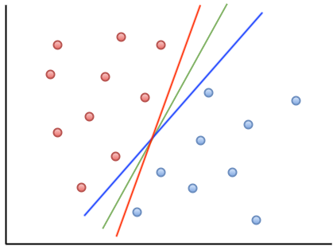
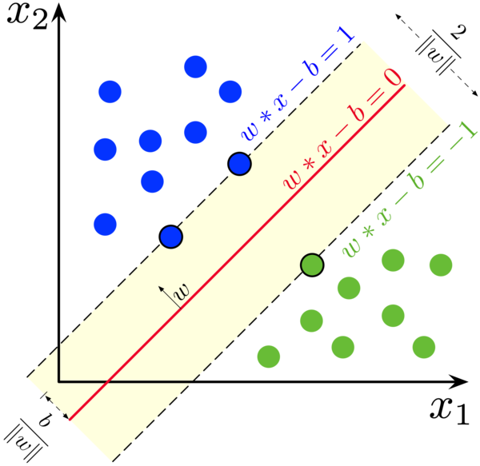

感知机模型是基于错误进行学习的。当它将判决平面调整到刚好能够将两类数据分开时，就会停止训练。然而，此时的判决平面往往紧贴着某一类数据。如下图所示，红色线和蓝色线，就紧紧地挨着一类数据。

这会导致一个问题：当训练好的模型被实际应用时，如果这类实际数据与训练数据存在一点点差异，稍微超出判决平面划定的范围，就可能被误判为另一类。这种现象说明，感知机得到的判决模型过于敏感，对数据变化的容忍度较低。

因此，在处理实际问题时，感知机的适用性往往受到限制。这种缺陷也是感知机在面对复杂任务时表现有限的一个重要原因。

那么，如何改进这个判决平面呢？我们不能让判决平面紧贴着某一类数据，而是应该将它置于两类数据的中间位置，并且尽可能让它离两类数据的距离都远一些。这样，模型对数据变化的容忍度会更高，分类的稳定性也会增强。如上图所示，相对于红色线和蓝色线，绿色线就离两类数据的距离都远一些，满足这一要求。

支持向量机（SVM）就能够实现这样的改进。它通过学习，找到一种理想的判决平面，使其不仅能正确分开两类数据，还能最大化两类数据与判决平面的距离。这种距离被称为“间隔”（Margin），支持向量机的目标是寻找一个最大化间隔的判决平面。如下图，作为判决平面的红线离两边数据点的距离（即 Margin）就都比较远。

与感知机不同的是，支持向量机的学习并不是基于错误的调整，而是通过将问题建模为一个优化问题来求解。它会在确保分类正确的前提下，通过数学优化方法计算出最优的判决平面。这种方式让支持向量机在处理复杂任务时表现得更加稳健和高效。

那么，为什么这个模型叫做支持向量机呢？如果我们将一个二维数据的支持向量机的判决平面画出来，就会发现，这个平面实际上是由少数几个关键点决定的。这些点正好位于离判决平面最近的两侧，或者说是这些点“支撑”住了整个判决平面。如上图所示，离红色判决平面最近的两个蓝点、一个绿点，就是这个红色判决平面的 3 个支持向量。

在数学上，几何空间中的点通常用“向量”来表示，因此这些关键点被称为“支持向量”。支持向量决定了判决平面的具体位置和方向，而与其余的点无关。正因为如此，这种模型被命名为“支持向量机”（Support Vector Machine）。这种依赖少量关键点进行判决的特性，使得支持向量机在处理高维数据时非常高效。

## 模型

支持向量机的优化模型可以形式化地表示为一个凸优化问题，其目标是最大化分类间隔，同时确保分类的正确性。我们下面来看其基本模型。

假设数据点为 $$(x_i, y_i)$$，其中 $$x_i$$ 是输入特征向量，$$y_i \in \{-1, +1\}$$ 是分类标签。

支持向量机的优化目标是：找到一个超平面 $$w \cdot x + b = 0$$，使得数据点到超平面的间隔（Margin）最大，并且所有数据点被正确分类。

为此，我们首先得到数据点到超平面的间隔（Margin）的数学形式。

### 1. **数据点到超平面的间隔距离**

在数学上，一个点 $$x_i$$ 到超平面 $$w \cdot x + b = 0$$ 的距离可以表示为：

$$ \text{距离} = \frac{|w \cdot x_i + b|}{\|w\|}$$

### 2. **数据点相对于超平面的位置**

而 $$w \cdot x_i + b$$ 的正负号，反映了点 $$x_i$$ 在超平面的哪边。我们就可以利用这个正负号，对数据点进行分类。

我们用 $$y_i$$ 表示数据的类别标签：$$y_i = +1$$ 表示数据点在超平面的一侧；$$y_i = -1$$ 表示数据点在超平面的另一侧。当 $$w \cdot x_i + b$$ 的符号和数据的类别标签 $$y_i$$ 相同时，我们就说它的分类是正确的；如果不同，我们就说它的分类是错误的。

因此，当模型对一个 $$x_i$$ 点的分类结果是正确的时，我们有

$$ y_i (w \cdot x_i + b) \geq 0$$

### 3. 原始优化问题（Hard Margin SVM）

在实际中，由支持向量 $$x_i$$ 到超平面 $$w \cdot x + b = 0$$ 的距离取决于支持向量们的坐标，比如，在二维平面上，我们有三个支持向量。因为我们的判决平面离这些支持向量的距离都相等，所以我们设它们到超平面的距离为 $$d$$。这时，我们有

$$ \text{距离} = \frac{|w \cdot x_i + b|}{\|w\|} = d$$

我们的优化目标，就是最大化这个距离。为了简化这个优化问题，我们将三个支持向量的 $$|w \cdot x_i + b|$$ 设定为 1。如上图所示，三个支持向量就满足这个方程。

此时，这三个支持向量数据点到超平面的距离就是 $$1 / \|w\|$$了。因此，我们的目标函数可以表示为：

$$ \min_{w, b} \quad \|w\|$$

即间隔的最大化等价于 $$\|w\|$$ 的最小化。

由于优化问题中的目标函数通常需要是二次可微的，为了方便求解，我们将其改写为：

$$ \min_{w, b} \quad \frac{1}{2} \|w\|^2$$

而约束条件则变为：

$$ y_i (w \cdot x_i + b) \geq 1, \quad \forall i$$

这个约束条件包括了两部分的含义：
- 数据点 $$x_i$$ 被正确分类，即：分类结果 $$w \cdot x_i + b$$ 和标签 $$y_i$$ 的符号一致。
- 数据点到超平面的距离至少为 $$1 / \|w\|$$，因为支持向量数据点到超平面的距离是 $$1 / \|w\|$$，而其它数据点到超平面的距离还要更远。

这一约束确保模型能够正确分类所有数据点，并在此基础上，优化目标函数最大化间隔。

### 4. 带松弛变量的优化问题（Soft Margin SVM）

在实际中，数据可能存在噪声，不能完全被线性分割。此时引入松弛变量 $$\xi_i$$ 来允许一定程度的误分类：

$$ \min_{w, b, \xi} \quad \frac{1}{2} \|w\|^2 + C \sum_{i=1}^N \xi_i$$
约束条件为：
$$ y_i (w \cdot x_i + b) \geq 1 - \xi_i, \quad \xi_i \geq 0, \quad \forall i$$

其中，$$\xi_i$$ 表示每个数据点的误差，$$C$$ 是一个正则化参数，用于平衡间隔最大化和误分类惩罚。

## 优化求解

在求解上述 SVM 的优化方程时，经典的方式是用最优化的拉格朗日乘子法。此时，支持向量机的优化问题被转化为其对偶形式：

$$ \max_{\alpha} \quad \sum_{i=1}^N \alpha_i - \frac{1}{2} \sum_{i=1}^N \sum_{j=1}^N \alpha_i \alpha_j y_i y_j (x_i \cdot x_j)$$
约束条件为：
$$ \sum_{i=1}^N \alpha_i y_i = 0, \quad 0 \leq \alpha_i \leq C, \quad \forall i$$

从上述优化目标中可以看出，它需要计算的是两个数据点的点积 $$(x_i \cdot x_j)$$，而点积代表的是这两个数据点之间的相关性。

## 对非线性的支持

支持向量机（SVM）的线性模型只能找到线性分割平面，但现实中的问题往往需要更复杂的分界面，比如曲线或曲面。这种情况下，我们有两种方法。

第一种方法是引入 **非线性变换**，将原始数据映射到一个更高维的空间，从而使得在高维空间中找到线性分割平面成为可能。

例如，我们可以对数据进行如下非线性变换：
- 对输入特征 $$x$$ 取平方，如将原始二维特征 $$(x_1, x_2)$$ 转换为三维特征 $$(x_1, x_2, x_1^2 + x_2^2)$$。在这个新空间中，原本需要曲线分割的数据可能变得线性可分。
- 对输入特征进行开根号、对数或其他非线性操作，生成新的特征维度。

通过非线性变换的方式，支持向量机可以间接处理非线性分割问题。然而，直接对数据进行非线性变换可能计算量巨大，尤其是当数据维度很高时。

第二种方法是**核技巧**（Kernel Trick）。这种方法通过核函数来引入非线性。这样就能够获得弯曲的风格平面，如下图所示：

具体来说，因为 SVM 的优化中会计算两个点之间的相似性，所以我们引入非线性的核函数来计算两个点在非线性变换后之间的相似性，而无需首先对它们进行非线性变换，因此大大降低了计算复杂度。

引入了核函数 $$K(x_i, x_j)$$ 后，SVM 的优化对偶形式就变成了：

$$ \max_{\alpha} \quad \sum_{i=1}^N \alpha_i - \frac{1}{2} \sum_{i=1}^N \sum_{j=1}^N \alpha_i \alpha_j y_i y_j K(x_i, x_j)$$

我们可以通过尝试不同的核函数（如多项式核、RBF 核等），选出效果最好的模型。

 

|[Index](./) | [Previous](1-7-perceptron) | [Next](1-11-data) |
