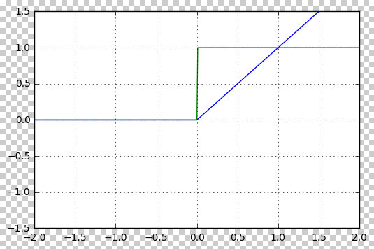
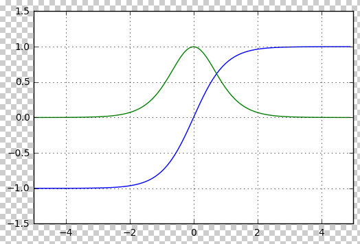
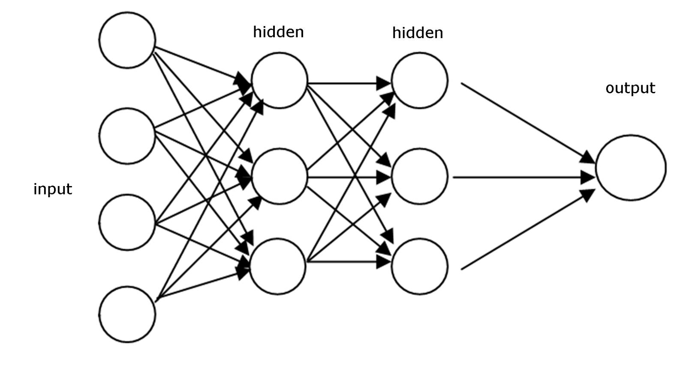
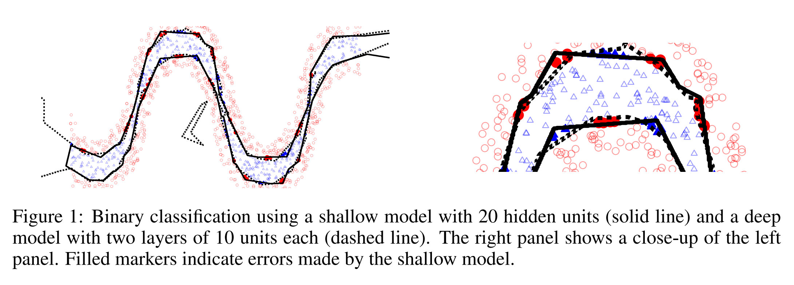
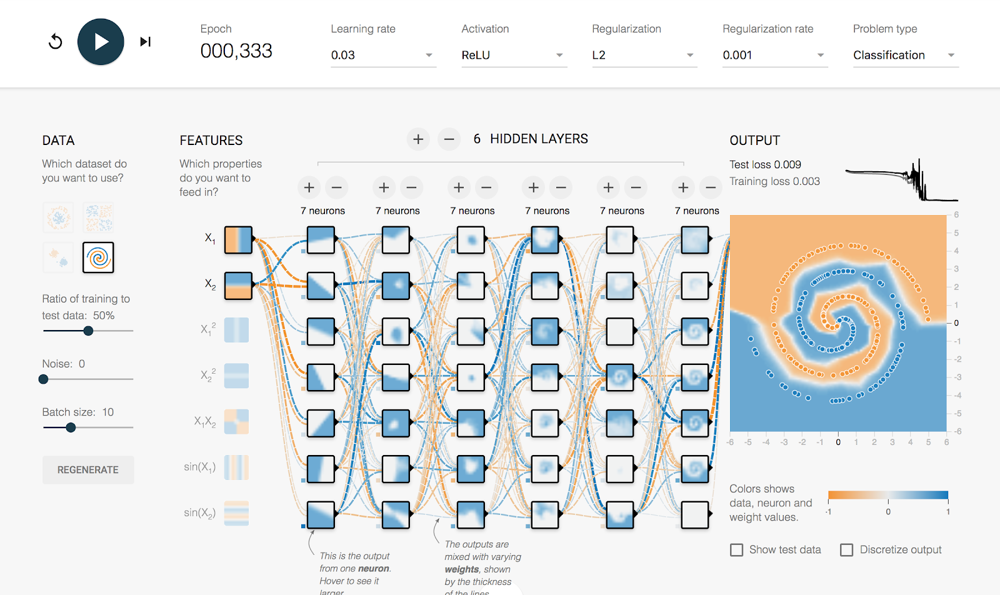

深度学习模型由许多类似于感知机的神经元单元构成。这些神经元通过连接形成了复杂的神经网络结构。每个神经元的工作方式与感知机相似，会首先对输入 $$x$$ 进行线性加权求和。然后，与感知机不同的是，深度学习中的神经元会用各种非线性激活函数，对加权求和的结果进行非线性变换。

## 激活函数

常用的激活函数包括 ReLU、Sigmoid 和 Tanh。它们的数学形式分别如下：

ReLU（Rectified Linear Unit）：

$$\text{ReLU}(x) = \max(0, x)$$

ReLU 将所有负值输出为 0，正值保持不变。它通常用于深度学习中的隐藏层激活函数，能够加速网络的训练。

下图画出了 ReLU 函数的波形（蓝线）和梯度（绿线）

Sigmoid：

$$\sigma(x) = \frac{1}{1 + e^{-x}}$$

Sigmoid 将输入压缩到 0 到 1 的范围内，常用于二分类问题中的输出层。

下图画出了 Sigmoid 函数的波形（蓝线）和梯度（绿线）

Tanh（双曲正切函数）：

$$\text{tanh}(x) = \frac{e^x - e^{-x}}{e^x + e^{-x}}$$

Tanh 将输入压缩到 -1 到 1 的范围，相较于 Sigmoid，Tanh 的输出具有零均值，常用于隐藏层。

下图画出了 Tanh 函数的波形（蓝线）和梯度（绿线）

这些激活函数在神经网络中起到了引入非线性因素的作用，使得模型可以处理复杂的任务。

## 深层模型

深度学习模型通常由多层神经元网络构成，其中最基本的深度学习模型是前向神经网络（FFN，Feed Forward Network）。顾名思义，这种网络的计算是单向的——信息总是从一层传递到下一层，而不会回传到上一层。这种结构确保了神经元的输出始终送到下一层神经元的输入，形成一条“前向”传递的路径。

前向神经网络的设计灵感来源于人脑的工作机制。生物学家研究发现，人脑中的神经元处理信息的方式是分层的。举个例子，当我们的眼睛看到一个物体时，视网膜将图像转换为电信号，然后这些信号会依次传递到大脑的不同区域。每个区域对信息进行不同的处理，再将处理后的信息传递到下一个区域。这种层层传递的信息处理方式，正是深度学习模型所模仿的。在深度学习中，模型的设计也是一层一层的，每一层的神经元处理输入信息，并将结果传递到下一层。

具体来说，一个前向神经网络由多个“层”构成，每一层包含多个并列的神经元。前一层的输出会作为输入传递到下一层，层与层之间通过这种方式连接起来，形成一个“深度”神经网络。如下图所示。

如上图所示，前向神经网络的这些层包括输入层、隐藏层和输出层。输入层接收来自外部的数据，输出层负责生成最终的预测结果，而中间的层则称为隐藏层，因为它们处于网络的中间，不直接与外部交互。

在输出层，神经网络根据任务的类型进行不同的输出操作，并选择不同的损失函数作为优化目标。例如，在进行多元分类任务时，网络首先使用 Softmax 函数计算各个类别的概率，然后采用交叉熵作为损失函数（Loss）。Softmax 和交叉熵的组合使得梯度计算变得更加简便，便于网络优化。

通过构造多层神经元网络，深度学习模型能够实现多层次的信息传递，从而处理更复杂的任务和数据。每一层都能从数据中提取更为抽象和复杂的特征与模式。随着层数的增加，模型能够学习到更深层次的结构和关联，进而提高其处理能力。

一般来说，深度学习模型的层数越多，其能力也就越强。这样，通过不断加深网络的层次，深度学习模型可以不断提高在复杂任务中的表现和精确度。下图画出了只有一层的一个网络和有两层的一个网络的性能比较。这个一层的网络包括 20 个隐藏节点，而二层的网络的每一层包括 10 个隐藏节点。所以，它们的神经元数目是相等的，差别只是层数的不同。这个任务是一个二元分类。其中的红色和蓝色点代表被错误分类的点。左小图是全图，而右小图是左小图中的一个局部的放大图。黑色实线是单层模型学会的边界，而虚线是双层模型学会的边界。

如上图中的右小图所示，相比较于黑色实线来说，虚线边界更加细致地刻画了两类数据的边界，避免了黑色实线产生的错误分类，因此有更好的效果。

总之，通过引入非线性激活函数并构建深层次的神经元网络，深度学习模型获得了强大的能力，能够有效处理非线性的数据。其中，非线性激活函数使得神经网络能够学习和表达复杂的模式，而多层网络则通过逐层传递和处理信息，进一步增强了模型在各种任务中的表现。这种设计使得神经网络能够从数据中提取深层次的特征和复杂的关系，从而实现对非线性问题的强大建模能力。

## 深度学习模型训练过程体验

我们可以在浏览器中方便地体验深度学习模型的训练过程。请登陆 [Tensorflow Playground](http://playground.tensorflow.org/) 网站 ，尝试基于神经元网络的分类任务，获得直观体验。

这个小网站是一个基于浏览器的TensorFlow实验平台。登录后，你会看到一个动画界面，如下图所示。

如上图所示，用户可以在这里像玩游戏一样，添加神经元，设置层数，并观察数据学出来的效果。这个小程序由TensorFlow团队开发，旨在帮助大家直观地理解和探索深度学习模型的行为和效果。

该网站为互动网站。我们可以在上面完成以下各种设置，完成深度神经元网络的训练：

- 数据输入：二维x
- 输出：0/1分类
- 神经元、“层”的概念
- 增加神经元的层数、每一层的神经元的个数，感受模型能力的增长
- 调节激活函数、学习率、优化方法，感受模型能力的变化

## 反向传播

深度学习模型通常由多层神经网络（NN）组成，每一层神经网络与上一层通过权重和偏置相连，形成层级结构。要优化这些模型参数，就需要计算每一层参数对损失函数的梯度。

反向传播（Backpropagation）是一种高效计算这些梯度的方法。它利用神经网络的层级结构，来提高计算的效率。其流程可以分为两个阶段：前向传播和反向传播。

1. 前向传播：
   - 从输入层开始，将输入数据传递给每一层神经元，经过激活函数处理，逐层传递直到输出层。
   - 在每一层中，计算出该层的激活值（即神经元的输出），并存储下来，供后续的梯度计算使用。

2. 反向传播：
   - 在前向传播完成后，我们从输出层开始，逐层往回计算梯度。
   - 在每一层，使用链式法则（链式法则是微积分中的一个规则，表示复合函数的导数是各个部分导数的乘积）来计算每一层的参数梯度。具体来说，我们首先计算输出层的梯度，然后将这个梯度“反向”传播回前面的每一层，逐层计算梯度。
   - 每一层的梯度不仅依赖于当前层的激活值，还依赖于前一层和后一层的梯度，因此我们需要逐层将梯度“传递”到每一层，直到输入层。

总之，通过反向传播，深度学习模型能够有效地计算各层神经元的梯度。这一过程首先进行前向传播，计算每一层的激活值并存储。然后进行反向传播，使用链式法则逐层计算梯度并更新模型参数。反向传播大大提高了深度学习模型进行梯度计算的效率，使得它能够高效训练，适应复杂的任务。

## 课本：

- Dive in Deep Learning，[4. Linear Neural Networks for Classification](https://d2l.ai/chapter_linear-classification/index.html)
- SLP 课本
  - 第 7 章：神经元网络
- AI4All Model - Neural Network PPT

## 课程材料

- 斯坦福大学 CS224n
  - 神经元网络 PPT
- MIT 深度学习 Lec 1 PPT

## 练习

完成多伦多大学 Pascal Poupart 老师 AI 课程的练习 3 中的 Neural Network 部分练习，[网页](https://cs.uwaterloo.ca/~ppoupart/teaching/cs486-spring23/assignments.html)

内容为：
- 根据房子的属性，分类其售价是高还是低
- 需要编码的内容包括：层数优化、激活函数、Dropout

 

|[Index](./) | [Previous](3-0-intro) | [Next](3-3-cnn) |
