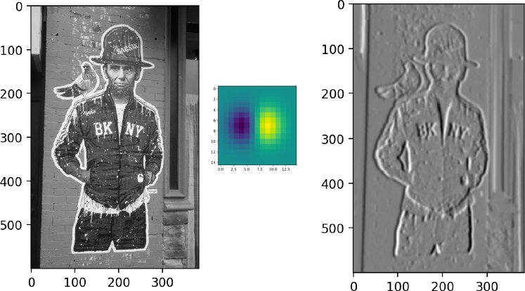
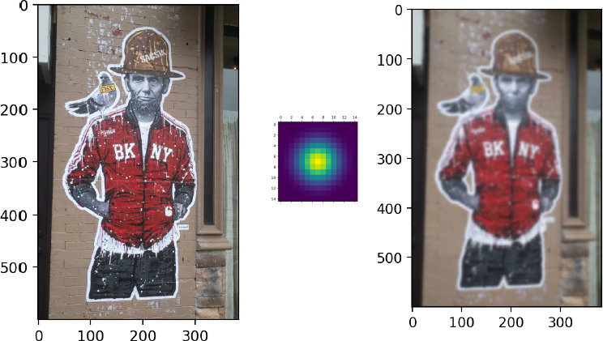
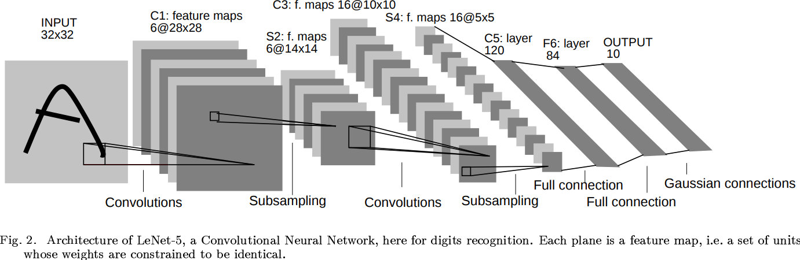
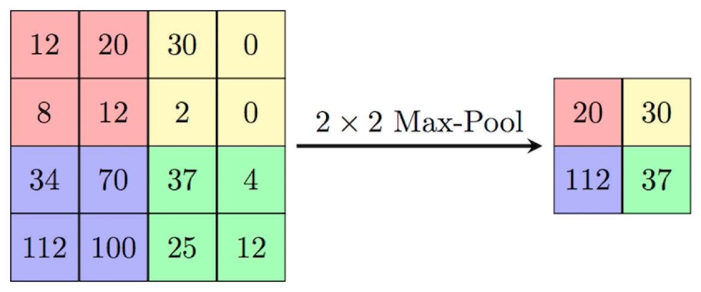
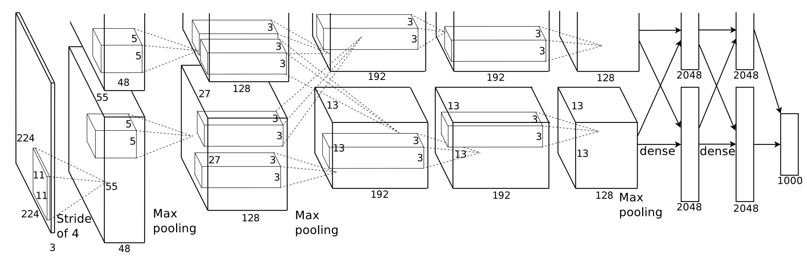
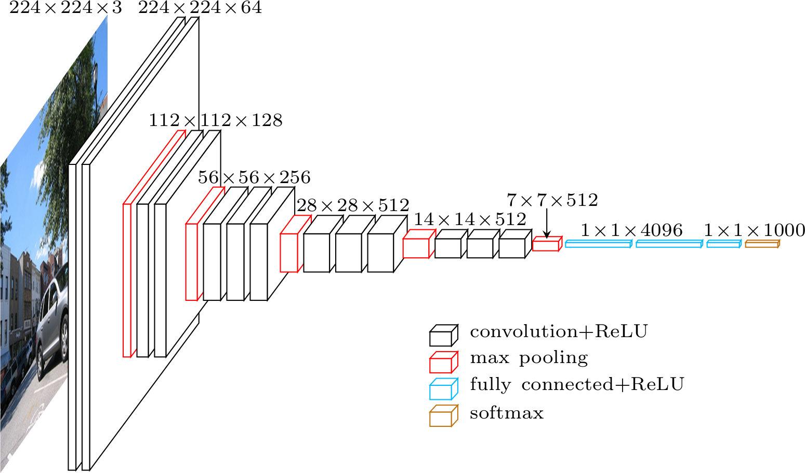
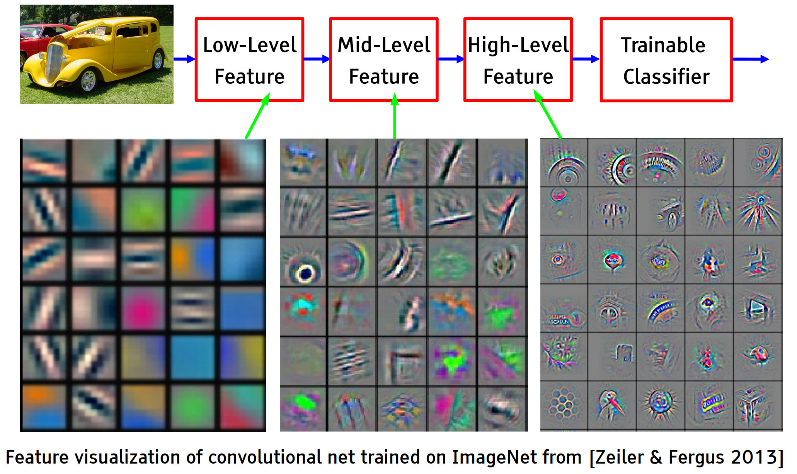

我们下面学习卷积神经元网络（CNN）。它主要应用于计算机视觉。

## 卷积的基本概念

卷积是信号处理中常用的一个概念。在信号与系统的理论中，信号通过系统后的输出通常可以用卷积来描述。

具体来说，卷积运算是线性时不变系统（LTI系统）响应输入信号的一种方式。通过卷积，我们能够提取信号中某些特定的特征，例如平滑信号或去除噪声。此时，这个 LTI 系统常被称为滤波器。

### 1. 系统的响应与卷积

在LTI系统中，系统的输出是输入信号与系统的冲激响应的卷积。冲激响应是系统对一个单位冲激（Dirac delta函数）输入的响应。卷积操作描述了系统如何通过其冲激响应对输入信号进行处理。具体来说，卷积运算给出了输出信号每个时刻的值，它是输入信号与系统冲激响应在不同时间延迟下的逐点乘积和积分。

### 2. 卷积的定义

在连续时间域中，卷积的数学表达式为：

$$y(t) = \int_{-\infty}^{\infty} x(\tau) h(t-\tau) \, d\tau$$

在离散时间域中，卷积则是：

$$y[n] = \sum_{k=-\infty}^{\infty} x[k] h[n-k]$$

这里：
- $$x(t)$$ 或 $$x[n]$$ 是输入信号，
- $$h(t)$$ 或 $$h[n]$$ 是系统的冲激响应，
- $$y(t)$$ 或 $$y[n]$$ 是输出信号。

上面的操作，在通信系统中，常被称为四步：翻转、平移、相乘、相加，即：把滤波器的冲击响应 $$h[n]$$ 首先进行翻转，变为 $$h[-n]$$，然后再对其进行平移，即 $$h[-(n-k)]$$，然后再将其和对应的输入信号 $$x[k]$$ 相乘，最后相加。

### 3. 为什么需要翻转

那么，为什么我们要对滤波器的冲击响应 $$h[n]$$ 首先进行翻转呢？这是为了确保冲激响应经过合适的时延后，再与输入信号相乘相加，以正确地反映实际的物理过程。

- 冲激响应的定义：系统的冲激响应 $$h(t)$$ 描述的是系统对一个单位冲击（一个瞬时的信号变化）的反应。而系统的响应实际上是输入信号的冲击响应经过不同时间延迟后累计的对系统输出的影响。

- 时间延迟的影响：卷积中的翻转操作是通过反转冲激响应来模拟输入信号的时间延迟。

比如，当输入的信号和系统的冲激响应为：$$h[n] = [3, 2, 1]$$，$$x[n] = [1, 2, 3]$$ 时，我们如果想要计算 $$n = 4$$ 时的输出 $$y[n]$$。此时，系统的输出是下面这三个冲击响应在 $$n=4$$ 时的值的叠加。

首先是 $$x[3]=3$$，它会产生一个输出。这个输出的值是冲击响应 $$h[1] \times x[3]$$，即 9。

然后是 $$x[2]=2$$ 在 $$n = 3$$ 时的输出。此时，它的冲击响应已经过了 1 个单位的时延了，所以，此时它的输出值是 $$h[2] \times x[2]$$，即 4。

然后是 $$x[1]=1$$ 在 $$n = 3$$ 时的输出。此时，它的冲击响应已经过了 2 个单位的时延了，所以，此时它的输出值是 $$h[3] \times x[1]$$，即 1。

大家看，此时，我们是不是有

$$y[4] = x[1] \cdot h[3] + x[2] \cdot h[2] + x[3] \cdot h[1]$$

即：

$$y[4] = \sum_{k=1}^{3} x[k] h[4-k]$$

它正好符合 $$n=4$$ 时的卷积数学表示式。

$$y[n] = \sum_{k=-\infty}^{\infty} x[k] h[n-k]$$

这就是信号处理中卷积计算需要翻转的原因。即：在信号与系统中，卷积运算是用来描述输入信号如何通过一个线性时不变系统（LTI系统）进行处理的。翻转步骤确保了冲激响应经过合适的时延后，再与输入信号相乘相加，从而正确反映实际物理过程。

## 卷积神经元网络的卷积

卷积神经元网络借鉴了上述数字信号处理的卷积操作。以二维图像的卷积为例，当输入信号是二维的（例如图像的像素值矩阵），卷积操作也需要扩展为二维形式。对于一个二维输入信号（图像）和一个二维卷积核（滤波器），二维卷积操作可以表示为：

$$y[i, j] = \sum_{m=-M}^{M} \sum_{n=-N}^{N} x[i+m, j+n] \cdot h[m, n]$$

其中：
- $$x[i, j]$$ 是输入信号（例如图像）的像素值，
- $$h[m, n]$$ 是卷积核的权重矩阵，
- $$y[i, j]$$ 是卷积操作后的输出值（例如特征图中的像素值），
- $$m, n$$ 是用于滑动窗口的索引。

如上所示，二维图像的卷积操作是卷积核 $$h[m, n]$$ 在输入信号 $$x[i, j]$$ 上滑动，逐点计算加权和，形成输出信号 $$y[i, j]$$。此时，输出信号的每个像素值是输入信号与卷积核在相应位置上的元素逐点相乘并求和得到的。

将其与通信系统的卷积相比较，我们会发现它不需要做翻转的操作。这是因为卷积神经元网络的核心学习目的是通过学习输入数据与滤波器（卷积核）之间的关系来提取局部特征，并构建更高层次的表示，因此，它从数据中学习到最合适的权重就可以了，没有必要执行翻转操作：这不会影响特征学习的过程。

## 二维卷积动画

我们通过下面的动画展示二维卷积操作的过程。

如上面的动画所示，我们有一张 5×5 的图像，其中每个像素是一个数值，例如 0、25、75 等。我们的 卷积核 是一个 3×3 的矩阵，比图像小，因此它需要在图像上逐步滑动，对每个位置执行操作。

卷积的操作步骤如下：
 - 卷积核从图像的左上角开始，覆盖图像的一部分像素。
 - 卷积核的每个元素（权重）依次与覆盖区域的图像像素值相乘。
 - 乘积的结果被加总，得到一个新的值，存储在输出图像的相应位置。
 - 卷积核沿着图像从左到右、从上到下滑动。每滑到一个位置，重复上述操作。直到整个图像完成计算。

我们可以看到，上面这种二维卷积操作与之前的神经元的操作是类似的：
- 输入像素值类似于输入神经元，
- 卷积核的权重类似于网络的权值 $$W$$，
- 逐点相乘和求和相当于神经网络的前向加权求和计算。

这就是二维卷积的基本原理和直观过程。

## 二维卷积的图像处理原理

二维卷积是图像处理中的核心工具，通过设计不同的卷积核（滤波器），我们可以实现多种图像处理任务，如 边缘检测、模糊处理和特征提取。

以边缘检测为例。通过选择合适的卷积核，我们可以用卷积操作来计算图像的像素梯度，从而检测出图像中的边缘。下图画出了用卷积获得图像梯度，提取边缘的卷积核和效果。

如上图中间的卷积核所示，该卷积核的一边的值为正，另一边的值为负。这样的话，当卷积核扫描图像时，如果遇到图像中也出现一边值为正，另一边值为负的情况，就会在该位置产生一个较大的正值。那么，一边的值为正，另一边值为负的情况，代表什么图像的模式呢？就是一边白，一边黑的模式。这是不是两种不同颜色的图像之间的边缘的感觉？因此，我们在这里就通过设置合适的卷积核，达到了边缘检测的效果（右图）。

如果我们把卷积核都设置为正值，比如高斯分布，如下图所示，那么就能实现图像平滑，或者图像模糊化的效果。下图是获得的效果图

因此，在卷积神经元网络中，我们就是通过学习合适的卷积核，来完成图像特征提取的。

## 卷积神经元网络的诞生

卷积神经网络（CNN）的概念最早可以追溯到 1988 年，由 Yann LeCun 提出。

Yann LeCun 是人工智能领域的先驱之一，也是在深度学习发展中作出重要贡献的科学家。他后来因深度学习领域的突出成就荣获了图灵奖。LeCun 在 1980 年代末期任职于贝尔实验室，当时美国邮政局向他提出一个实际任务：开发一种方法，用于自动识别邮政编码中的手写数字。为了解决这个问题，LeCun 设计了 LeNet，它成为了卷积神经网络的开端。

LeCun 老师开发了一种名为 LeNet 的网络结构，最初用于手写数字识别任务。下面是它设计的 LeNet 卷积网络的结构：

LeNet 的设计非常适合手写数字识别任务：在第一层卷积和池化后，网络能够识别出数字的大致轮廓和结构。经过第二层处理后，特征更加抽象，适合进一步分类。

这项技术在当时是一个重大突破，不仅成功解决了美国邮政编码的识别问题，也为卷积神经网络的广泛应用奠定了基础。LeNet 的诞生标志着卷积神经网络的开端，尽管当时的计算资源有限，但其基本思想依然在现代深度学习中被广泛使用于各种复杂的任务，比如图像分类、目标检测和语义分割等。

## CNN 常用结构

下图画出了 CNN 目前的常用结构。

如上图所示，CNN 包括如下三个核心操作。它们构成了 CNN 的基础功能模块。

#### 1. 卷积：提取特征并减少参数
卷积层用于提取图像中的基本特征，如边缘和轮廓。通过卷积操作，输入图像中的局部信息被转化为特征图。

卷积操作的核心在于使用小尺寸的滤波器（Filter）对图片进行逐点扫描，以提取局部特征。例如，可以使用一个 $$3 \times 3$$ 或 $$5 \times 5$$ 的滤波器对图片进行操作。

卷积的主要作用是：
- 特征提取：将图片中重要的信息（如边缘、角点）转换为特征表示。
- 特征变换：通过多层卷积，将低级特征逐步转化为高级特征。

与将图片中每个像素连接到一个神经元相比，卷积操作极大地减少了参数数量。滤波器通过共享权重的方式，实现对局部特征的提取，同时保持计算高效。

#### 2. 非线性：增强模型的表达能力
为了增加模型的非线性能力，我们在卷积层后引入了非线性激活函数，常用的函数包括 ReLU（Rectified Linear Unit）。ReLU 的作用是：
- 将负值置零，仅保留正值。
- 提高模型的非线性表达能力，使其能够处理复杂的特征。

#### 3. 池化：降维与高效计算
池化操作通常紧随卷积层，用于对高维的卷积结果进行降维。池化的常见方式包括：
- 最大池化（Max Pooling）：选取池化区域内的最大值。
- 平均池化（Average Pooling）：选取池化区域内的平均值。

下图画出了最大池化方法的原理。

如上图所示，最大池化就是把输入的 4 * 4 矩阵分为 4 个 2 * 2 的小矩阵，然后在每个小矩阵的 4 个数中，选一个最大的值。最终，它返回一个 2 * 2 的矩阵。

从中我们可以看出：池化能够降低特征图的分辨率，同时保留重要信息，减少计算量，并增强模型的鲁棒性。具体来说，
- 降维：通过降低数据维度，减少后续层的计算量和参数数量。
- 增强鲁棒性：对输入的轻微变动（如平移、旋转）具有不变性。

#### 4. 多通道卷积：捕捉多样特征
为了捕捉图片的多种特性，一个卷积核往往不足以描述复杂的特征。因此，在 CNN 模型中，通常会为一个输入训练多个卷积核。每个卷积核对应一个特征通道（Channel），每个通道提取不同类型的特征，如边缘、纹理等。这些通道的输出会在后续层被神经元结合，以形成更高层次的特征表示。

最后，我们用一个全连接层，将卷积和池化后提取的特征整合起来，做 Softmax 后，用于最终的分类任务。

## Batch Normalization 训练方法

在深度卷积神经网络（CNN）的训练过程中，常常采用 Batch Normalization（批量归一化）的方法。这种方法的主要目的是通过对每一层的输入数据进行尺度变换，使其均值为 0，方差为 1，从而加速模型的训练过程，并提高训练的稳定性。

在深度网络中，随着层数的增加，输入数据往往会出现分布变化，导致训练过程变得更加困难。为了解决这个问题，Batch Normalization 会对每个 Mini-batch（小批量数据）进行标准化。它首先计算该 Mini-batch 的均值和方差，然后用计算得到的均值和方差对输入数据进行归一化处理，使得归一化后的数据均值为 0，方差为 1。归一化后，为了让网络具有更多的自由度，通过一个可学习的线性变换（即乘以一个标量 a 并加上一个偏置 b），使得模型可以统一地对数据进行尺度变换和平移。这里的 a 和 b 是网络中的可训练参数。

Batch Normalization 通过规范化每一层的输入，减少内部协变量偏移（internal covariate shift），使得训练更加稳定，从而加速训练过程。归一化操作也使得每一层的输入数据分布稳定，减少了参数更新的震荡，从而提高了训练过程的稳定性。

Batch Normalization（批量归一化）的数学描述如下：

假设输入数据为一个 Mini-batch，记为 $$\{ x_1, x_2, \dots, x_m \}$$，其中 $$m$$ 为 Mini-batch 中的样本数。每个样本 $$x_i$$ 是一个 $$D$$-维的向量，$$D$$ 为特征的维度。Batch Normalization 的目标是对这个 Mini-batch 的每个特征进行标准化，确保每个特征的均值为 0，方差为 1。

它首先计算 Mini-batch 中所有样本的每个特征的均值和方差：

- 均值：$$ \mu_B = \frac{1}{m} \sum_{i=1}^m x_i $$

- 方差：$$  \sigma_B^2 = \frac{1}{m} \sum_{i=1}^m (x_i - \mu_B)^2 $$

然后，使用计算得到的均值 $$\mu_B$$ 和方差 $$\sigma_B^2$$ 对每个样本进行归一化操作：

$$\hat{x}_i = \frac{x_i - \mu_B}{\sqrt{\sigma_B^2 + \epsilon}}$$
其中，$$\epsilon$$ 是一个非常小的常数，用于避免除以零的情况。

归一化后的结果 $$\hat{x}_i$$ 可能并不适合直接用于下一层的输入。因此，引入两个可学习的参数 $$\gamma$$ 和 $$\beta$$，对归一化后的数据进行线性变换：

$$y_i = \gamma \hat{x}_i + \beta$$

其中，$$\gamma$$（尺度参数）和 $$\beta$$（平移参数）是可学习的参数，在训练过程中进行更新。这一步确保了网络能够适应不同的数据分布。

因此，Batch Normalization 的数学公式最后可以表示为：

$$y_i = \gamma \left( \frac{x_i - \mu_B}{\sqrt{\sigma_B^2 + \epsilon}} \right) + \beta$$

其中：
- $$\mu_B$$ 和 $$\sigma_B^2$$ 分别是 Mini-batch 的均值和方差，
- $$\gamma$$ 和 $$\beta$$ 是可训练的参数，
- $$\epsilon$$ 是避免除零的一个小常数。

## 演进

LeNet 之后，引爆深度学习浪潮的是由 Hinton 老师的两位学生 Alex Krizhevsky 和 Ilya Sutskever 在 2021 年被提出的另一个卷积神经元网络的工作：AlexNet。在 2012 年的 ImageNet 挑战赛中，AlexNet 击败了传统的计算机视觉方法，将错误率从上一年的 26% 降至 15%，震惊了学术界和工业界，引领了深度神经网络的广泛应用。

下图是 AlexNet 的网络结构。

如上图所示，AlexNet 的结构是非常复杂的。它包含 8 层神经网络，其中包括 5 层卷积层和 3 层全连接层。这些层通过 ReLU 激活函数连接，并通过 Dropout 减少过拟合。输入图像大小为 224×224×3（RGB图像），经过卷积层逐步提取特征，最终通过全连接层输出 1000 个类别的概率分布。最终，它共有 6000 万个参数和 65万个神经元，远远超过当时的模型规模。这是对计算资源的一大挑战。

因此，AlexNet 创新性地引入了 GPU 进行加速训练。GPU 的作用是进行并行计算。在神经网络的训练过程中，大量的神经元需要进行复杂的计算，而 GPU 拥有数千个计算单元，能够同时处理多个任务，极大地提高了计算效率。

比如说，在图像处理任务中，图像通常包含数百万个像素，每个像素都需要进行计算。GPU 可以同时处理这些计算任务，每个计算单元可以独立计算不同的像素，从而大大加速处理过程。这就是为什么我们在深度学习和大规模计算中，越来越依赖 GPU 来加速训练。GPU 在游戏中的应用也类似。游戏画面每秒需要渲染出几十帧，每一帧包含成千上万个像素，GPU 就是用来并行计算这些像素的。

在模型的设计上，AlexNet 创新性地设计了 ReLU 激活函数、Dropout 技术。它采用的数据预处理也非常有效：为应对大规模数据，在训练时采用了数据增强技术，包括图像裁剪、翻转和亮度调整，从而增加数据多样性。

此后，在 2014 年，VGGNet 提出了一个新的方法，通过将更多的卷积层叠加在一起，成功地将网络深度提升至 138M 个参数的规模。下图画出了 VGG 的网络。

通过这种层层深入的处理，卷积神经网络可以逐渐从简单的边缘检测到更复杂的物体识别，最终实现准确的图像分类或识别。

## 残差网络

2016 年，ResNet（残差网络）的出现进一步推动了深度神经网络的发展。ResNet 引入了 "Skip Connection"（跳跃连接），通过这种方式，输入信息和梯度可以快速传播到网络的更深层，从而有效解决了梯度消失的问题。下图画出了它的示意图。

一般来说，随着深度神经网络的层数不断增加，模型的优化变得更加困难，性能也可能出现下降。然而，ResNet 的残差结构使得网络层数得以继续加深，甚至能够训练数百层的网络，这一突破使得深度学习在更复杂的任务中取得了更好的表现。

残差网络的关键创新在于通过跳跃连接，允许网络在训练过程中“跳过”一些层的训练，使得网络能够更深、更高效地进行训练。通过引入“残差”，网络不仅能保持稳定的训练过程，还能在更深层次上获得更好的性能。正因如此，残差网络在深度学习领域得到了广泛应用，非常值得掌握。

## 利用预训练的 CNN 模型

在日常工作中，我们可以利用已经训练好的卷积神经网络（CNN）模型，提取图片数据的特征。通过这种方式，我们无需从头开始训练一个深度学习模型，而是可以基于已有的预训练模型，提取出图片中的关键特征。然后，基于这些特征，我们可以进一步训练自己的分类模型，进行特定任务的应用，如物体识别、图像分类等。这种方法不仅节省了计算资源，还能有效提高训练效率，尤其是在数据量较少的情况下。

## 对各层卷积核的理解

在卷积神经网络（CNN）的每一层，我们实际上可以对它进行可视化，以帮助我们理解网络究竟学到了什么。下图画出了在图像分类任务中，将一辆汽车图像输入到CNN中后，对每一层神经元的激活函数分析的结果。

如上图所示，底层卷积核提取的是图像的基本特征，如边缘和纹理。这些特征是构成图像其他复杂特征的基础。而高层卷积核则通过组合这些简单特征来识别图像中的复杂模式和对象，如在高层网络似乎已经开始识别汽车的轮子，这是一个具体的部分特征。再往上一些层，网络的识别能力变得更加抽象，能够识别更高层次的语义信息，如汽车的整体形状和构造。每一层的神经元网络逐渐提取出越来越有意义的特征。

从中我们可以体会到，深度神经元网络正是通过这种层层递进的学习过程，将低级特征逐步组合成高级语义信息，使得它能够对数据进行更高层次的理解。这种逐渐深入的特征提取和语义理解过程是深度神经网络强大分类能力的核心所在。对于图像任务来说，这使得 CNN 能够从原始像素到高级语义进行高效的图像分析，从而理解图像中的物体、背景和结构，从而进行更高级的任务，如物体识别、场景分类等。

## CNN 演示

ConvNetJS 是由斯坦福大学的博士 Andrej Karpathy 开发的一个 CNN 演示界面。它使得我们能够在浏览器中训练卷积神经网络（CNN），并实验像 MNIST 手写体识别这样的任务。链接：[ConvNetJS Demo - MNIST](https://cs.stanford.edu/people/karpathy/convnetjs/demo/mnist.html)

在这个网页上，我们可以亲自体验如何在浏览器中训练 CNN，感受卷积神经网络的工作原理，尤其是应用在手写体识别的场景中。这是一个非常直观的实验工具，非常适合想要了解 CNN 基本操作和训练过程的用户。

## 相对于 MLP 的优势

卷积神经网络（CNN）相较于多层感知器（MLP）在处理图像任务时具有显著的优势。这是因为：如果用传统的全连接神经网络（MLP）处理图像的话，每个输入像素都会被连接到每个神经元，这就意味着每个像素都会有一个权重参数。对于一张拥有百万像素的图像，这会导致极其庞大的参数量，显然这种方式对于图像分类任务来说既不高效，也不必要。

因此，CNN 借鉴了信号与系统中的“滤波器”概念，使用比图像尺寸小得多的“滤波器”或“卷积核”来对图像进行卷积操作。这意味着，CNN 网络不再为每个像素分配独立的权重，而是通过共享卷积核来提取局部特征，大大减少了模型的参数数量。

因此，卷积神经网络尤其适合处理像图像、视频等数据。相比全连接网络，表现出更优的性能和更高的计算效率。

## 课本

- Dive in Deep Learning
  - [7. Convolutional Neural Networks](https://d2l.ai/chapter_convolutional-neural-networks/index.html)
  - [8. Modern Convolutional Neural Networks](https://d2l.ai/chapter_convolutional-modern/index.html)

- 斯坦福 CS231n [CNN 介绍](https://cs231n.github.io/convolutional-networks/)

## 课程材料

- 伯克利 CNN PPT
- MIT CNN PPT
- AI4All Play - Environment PPT
- AI4All Model - CNN PPT

## 体验

- Andrej Karpathy 开发的基于卷积神经元网络的图片分类任务的[网站](https://cs.stanford.edu/people/karpathy/convnetjs/demo/mnist.html)，获得直观体验。

## 示例

- Berkeley DeepRL Camp Lab 2: Introduction to Chainer. You will implement deep supervised learning using Chainer, and apply it to the MNIST dataset. [website](https://sites.google.com/view/deep-rl-bootcamp/labs)

- CNN Explainer, [Website](https://poloclub.github.io/cnn-explainer/), [Github](https://github.com/poloclub/cnn-explainer), [Paper](https://arxiv.org/abs/2004.15004)

## 练习

完成多伦多大学Pascal Poupart 老师深度学习课程的练习 3。[网页](https://cs.uwaterloo.ca/~ppoupart/teaching/cs480-winter23/assignments.html)：

内容包括：练习 3: CNN 图片分类模型
* 代码已可以跑通。
* 需要对代码进行如下修改：
	* 模型结构、激活函数、Dropout、优化器、CNN filter

- AI4ALL MNIST Mini-Project, CNN handwritten digit recognition, [Colab](https://colab.research.google.com/drive/1iTn-955vrJ9Ezd-p99Ba-niIjwx_Ap10#scrollTo=G1O50g42BalH)
- AI4ALL CIFAR-10 Mini-Project Students, [Colab](https://colab.research.google.com/drive/1KTQQxkj37_2dydQee4uI4j-kEPl1WKOp)

 

|[Index](./) | [Previous](3-2-mlp) | [Next](5-3-rnn) |
