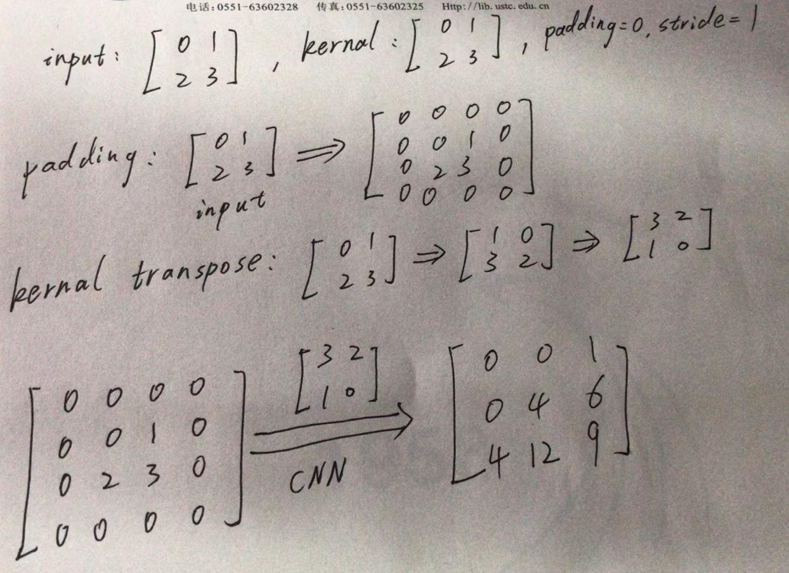

图片经过 CNN 提取特征后，可以进行各种具体的视觉应用，比如：目标定位、目标检测和目标识别（图片中有很多目标，输出这些目标的类型和 Box），语义分割（对每个像素进行分类），风格迁移等。我们下面介绍这些模型。

#### 目标定位

目标定位（Localization）任务输入的图片中只有一个目标，然后模型输出目标的 Box（四个坐标）和目标类别。

为了获得 Box 的四个坐标，我们将其作为一个“回归”问题，即预测这四个坐标的值。为了评估 Box 预测的准确性，我们常采样的评估方法是 IoU：Intersection over Union（重叠的面积/总面积）。

最后，我们采用的 Loss 函数是 Box 坐标的 MSE 和目标类别的交叉熵的和。

目标定位最经典的方法是 OverFeat 算法。OverFeat 大量地采用“滑动窗”技术。它的算法包括三部分：首先，用分类做预训练：在不同尺度和位置，用滑动窗，做目标类别的分类；然后，用预训练获得的模型，提取特征，用不同尺度、位置，用滑动窗，做目标位置的四个坐标的回归；最后，按预测的概率，组合各个滑动窗，获得对 Box 的最后预测。

基于 CNN 的 Filter 机制能够很容易地实现 OverFeat 要做的滑动窗操作。所以 OverFeat 运行很快。最后的分类和回归，通过 1x1 卷积完成。

#### 目标检测

目标检测的输入图片中有很多目标。模型需要输出这些目标的类型和 Box。它的性能评估指标是 MAP（Mean Average Precision），即：先计算每一类目标的AP（Average Precision），然后平均各类的平均。

目标检测最经典的算法有四个：

首先是 YOLO。它把图片切成小块，每块做自己的目标定位，输出四个坐标、IoU、标签，然后再组合。

然后是 Fast R-CNN。它不简单地做滑动窗了，提出“聪明的”滑动窗，即首先估计可能“感兴趣的区域”（Region of Interest Proposal），大约 2k 个。R 就是 Region 的意思。然后在这些区域进行检测。这样就提高了计算速度。

然后，Faster R-CNN 不估计 2k 个区域了，因为这些区域还是太多。相反，它基于 CNN 的输出，预测“感兴趣的区域”，以获得更准的“建议区域”。因此，它新加了一个 Region Proposal Network 来预测 Region。最终的 Loss 函数中包括四部分 Loss。

最后是 SSD（Single Shot Detection），它直接分类位置和 Box 的形状。

#### 语义分割

语义分割是将图片按照对象的语义，进行分割，得到每种对象的轮廓区域。因此，它需要对每个像素进行分类。

语义分割和实例分割不同。语义分割是把某类对象的多个实例（instance）合在一起。比如很多牛如果靠在一起，会被分到一起，因为它们的语义都是“牛”。如果我们把每个实例进行分割，即每条牛，单独分割，那就是 Instance 分割：实例分割。

语义分割常采用两种模型：FCN 和 U-Net。我们下面分别介绍它们。

FCN（全卷积网络）采用瓶颈结构，包括 Downsampling / Upsampling 操作。它首先对图片做 Downsampling，把图片转变为很多“低清晰度”卷积层。每个卷积层就是一个 Channel。然后，将这些 Channel 合在一起，进行 Upsampling。这样就可以合并图片各个部分的上下文信息，聚合具有相同语义的图片相邻像素，获得图像语义的轮廓。这非常有意思。

它的 Up-Sampling 操作包括 Transpose 卷积和 Un-pooling。Transpose 卷积请参考 B 站视频 [转置卷积（transposed convolution）](https://www.bilibili.com/video/BV1mh411J7U4/)。下面是熊治杰同学手写的一个例子：

如上图所示，为了将输入 2 * 2 矩阵变为 3 * 3 矩阵，我们首先将它 Pading 为 4 * 4 矩阵，然后对 Kernel 做 Transpose 操作，最后做卷积，得到 3 * 3 矩阵，这就是 Up-Sampling 过程。在实际中，我们可以设 Stride = 1/2，然后对重叠的部分，求平均。

Un-pooling 方法是记住 Max pooling 时选择的 Max 值的位置，然后恢复回去。

我们然后看 U-Net 模型。它的特点是：每个 down-sampled 的输出，都通过残差连接，送到对应的 up-sampled 层。这样就给 Up-Sampling 更多的信息。此外，它的 Up-Convolution 的参数是可以学习的。

#### 风格迁移

风格迁移是一种很有意思的深度视觉算法的应用。比如我们熟悉的把一张图片转变为梵高的风格。

风格迁移模型的基本思想是固定 CNN 的模型参数，但调节输入图像（即 x），让我们设定的 Loss 函数最小。具体来说，它包括三步：

首先，它做图像编码：将原图像 p，通过一个CNN，如 VGG-19，取前面、中间层的激活函数输出得到 C(p)；

然后，它做风格编码：将风格图像 a，通过同一个 CNN，取前面、中间层激活函数输出，计算它们的Gram 矩阵 S(a)。 Gram 矩阵就是协方差函数，反映得到的不同 Feature 之间的互相关；

最后，通过优化方法，合成新的图像 x，让 C(p) = C(x), S(x) = S(a)。这样得到的图像，就是融合了风格图像 a 的风格的原图像 p 的变换了。

这是不是很有意思？

### 语言-图像预训练模型

OpenAI 的 CLIP 语言-图像预训练模型，是采用基于对比的语言-图像预训练，在海量（图像、文本）对上训练的神经网络。该模型可以用自然语言指示它在给定图像的情况下直接预测最相关的文本片段，类似GPT 的零样本功能。

## 课本

- Dive in Deep Learning，[14. Computer Vision](https://d2l.ai/chapter_computer-vision/index.html)

## 课程材料

- 伯克利大学，计算机视觉 PPT，图像风格转换 Note

## 练习

- CNN 图片分类练习: 多伦多大学 Pascal Poupart 老师 CS480 深度学习课程的[练习3](https://cs.uwaterloo.ca/~ppoupart/teaching/cs480-winter23/assignments.html)。内容为 CNN 图片分类。代码已可以跑通。需要对代码进行如下修改：模型结构、激活函数、Dropout、优化器、CNN filter
- 简明人脸识别练习: 深度学习人脸识别开源库：号称世界上最简单的人脸识别库，三句代码就搞定。[代码](https://github.com/ageitgey/face_recognition)，[中文简介](https://github.com/ageitgey/face_recognition/blob/master/README_Simplified_Chinese.md)，
- TorchXRayVision: A library of chest X-ray datasets and models. Classifiers, segmentation, and autoencoders. [Github](https://github.com/mlmed/torchxrayvision)
- CheXpert competition models -- attention augmented convolutions on DenseNet, ResNet; EfficientNet, [Github](https://github.com/kamenbliznashki/chexpert)

## 体验

- Gifsplanation - Explaining neural networks with gifs! [Website](https://mlmed.org/gifsplanation/)

## 工具

- segmentation_models, [PyTorch Github](https://github.com/qubvel/segmentation_models.pytorch), 8.4k stars, [Tensorflow/Keras Github](https://github.com/qubvel/segmentation_models), 4.5k stars
- Image Test Time Augmentation with PyTorch! [Github](https://github.com/qubvel/ttach)

 

|[Index](./) | [Previous](3-3-cnn) | [Next] (5-3-rnn)
