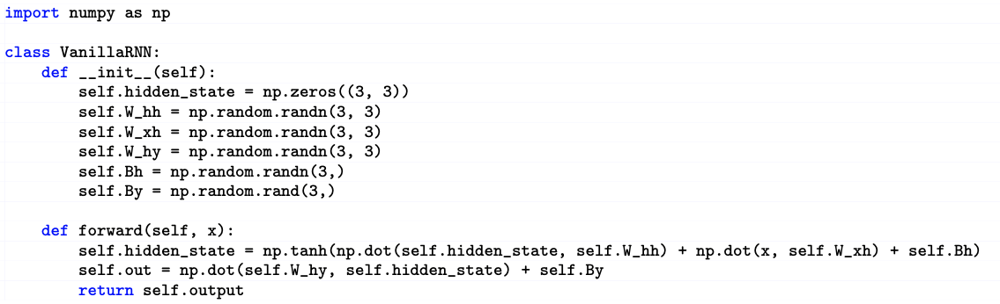

我们下面学习 RNN 模型的原理、设计和优化，包括LSTM、解码输入的方法。

世界充满了序列信息：视频、语言模型、时间序列。我们理解它们的方式，是“循环（Recurrence）式”的，比如，我们看一个字的时候，不是把它单拿出来，只读它的意思，而是会基于前面看过的字的内容，获得对这个字的理解。这就是“Recurrence”的，即：利用先前发生过的事件、获得的知识，推理后面的事件。

循环神经网络（RNN）是一种特殊的人工神经网络，它最大的特点是包含"记忆单元"，能够处理时间序列数据和自然语言处理（NLP）任务。与传统的前向神经网络逐层堆叠不同，RNN的神经元是循环连接的，独特之处在于它会将上一个时刻的输出重新输入到网络中。

这种循环结构使得RNN与众不同。传统神经网络是一层叠一层，而循环神经网络则像是一个有"记忆"的系统。它会不断利用相同的神经元和参数，将前一刻的计算结果再次送回网络，形成一种类似"回音"的处理模式。

## 应用场景

具体来说，深度序列模型有三种主要的应用场景：

1. Many to One（多对一）：这种模型典型应用是文本分类。它使用RNN编码器将输入的变长序列（如一篇文章或一段评论）转换为固定长度的特征向量，然后进行分类。例如，可以通过这种方式判断一篇文章的情感倾向是积极的还是消极的。

2. One to Many（一对多）：主要应用于文本生成和图像描述等任务。使用RNN解码器，可以从单一输入（如图像或关键词）生成序列输出。比如根据一张图片自动生成描述性文字，或者基于某个主题开始续写文章。

3. Many to Many（多对多）：最典型的应用是机器翻译。这种模型使用Seq2Seq（序列到序列）架构，能够将一种语言的输入序列转换为另一种语言的输出序列。它不仅处理输入，还能生成对应的输出序列。

## Seq2Seq 模型

其中，Seq2Seq 模型的应用尤其广泛。它由两个关键部分组成：编码器和解码器。这种模型不仅在语言处理中表现出色，在时间序列分析方面同样引人注目。

语言模型就是一种序列模型。它能够基于已有的文本内容，智能地预测下一个可能出现的单词，就像我们人类在对话中能够预测对方可能说的话一样。

时间序列分析的魅力在于其"记忆"特性。就像人类根据过去的经验来预测未来，这些智能模型也能捕捉数据的历史关联。以网络流量预测为例，当前的数据总是与之前的状态息息相关。通过循环神经网络，我们可以精准地捕捉这种时间维度上的微妙关系，从而做出更加准确和可靠的预测。

因此，Seq2Seq 模型就像是一个具有记忆功能的智能助手，能够从海量的历史数据中学习模式，并将这些模式应用于未来的预测。

## RNN

RNN 模型的特点是“自环”（Loops），即：神经元的输出，会回到它的输入，参与新的输入的处理。通过这种方法，它能让先前输入的信息，帮助未来输入的信息的处理，这就允许了历史信息会被利用。

RNN 的代码实现其实非常简单。下面是用 numpy 对其的实现：

如上图所示，它的代码其实不复杂。指定好输入输出之后，就可以了。

其数学模型如下：

隐藏状态 $h_t$ 的计算：

$h_t = \tanh(W_{hh} h_{t-1} + W_{hx} x_t + b_h)$

其中的非线性激活函数 $\tanh$ 为网络引入非线性表达能力。

其中的变量为：
- $h_t$：$t$ 时刻的隐藏状态向量
- $h_{t-1}$：前一时刻的隐藏状态向量
- $x_t$：$t$ 时刻的输入向量
- $W_{hh}$：隐藏状态间的权重矩阵
- $W_{hx}$：输入到隐藏状态的权重矩阵
- $b_h$：隐藏状态的偏置向量
- $\tanh$：双曲正切激活函数

输出 $y_t$ 的计算：

$y_t = \text{softmax}(W_{yh} h_t + b_y)$

其中的概率输出 $\text{softmax}$ 确保输出是有效的概率分布。

其中的变量为：
- $y_t$：$t$ 时刻的输出向量
- $W_{yh}$：隐藏状态到输出的权重矩阵
- $b_y$：输出层的偏置向量
- $\text{softmax}$：将输出归一化为概率分布的函数

注意，在上面的参数中，权重参数，如 $W_{hh}$、$W_{hx}$、$W_{yh}$ 在所有时间步是保持不变的。这有点像卷积网络的卷积核参数在一张图片上做移动加权的时候，不变那样。

这些公式数学地描述了 RNN 如何在序列处理中维持"记忆"$h_t$，并在每个时间步动态更新信息。

## RNN BPTT 梯度计算

RNN 的 BPTT 梯度计算比较神奇。这是因为 RNN 的同一套模型参数，在它循环计算的过程中，被多次用到了。结果是：以 $s$ 为隐状态，观察它对 $w$ 的导数 $R = ds/dw$，我们能够以一种“循环”的形式，计算每一步的梯度，计算公式如下

对于隐藏状态 $s_t$ 关于参数 $w$ 的导数 $R = \frac{ds_t}{dw}$，其计算公式可以表达为：

$$R = \frac{ds_t}{dw} = \sum_{k=0}^{t} \left(\prod_{j=k+1}^{t} \frac{\partial s_j}{\partial s_{j-1}} \right) \frac{\partial s_k}{\partial w}$$

其中的符号分别为：
- $s_t$：$t$ 时刻的隐藏状态
- $w$：网络参数
- $R$：隐藏状态对参数的导数

如上式所示，我们利用链式法则来计算跨时间步的梯度。因此，其中每一项 $\left(\prod_{j=k+1}^{t} \frac{\partial s_j}{\partial s_{j-1}} \right)$ 代表了从 $k$ 到 $t$ 时刻梯度的连续传播。这就带来一个问题：由于连续相乘，远距离时间步的梯度可能会急剧减小或增大，这也是标准RNN面临的梯度消失或爆炸问题。

比如，如果使用 tanh 激活函数，loss 对 $w$ 的导数可能会很小，因此，这样循环计算后，梯度会消失；而如果使用其它激活函数，loss 对 $w$ 的导数可能很大或者很小，导致梯度爆炸或者消失。

因此，在实际系统中，RNN 的工作很不稳定，并不常用。这促使后续出现了LSTM和GRU等改进的循环神经网络结构。

## LSTM

长短期记忆网络（LSTM）是循环神经网络（RNN）的一种重要改进，它巧妙地解决了传统RNN中梯度爆炸和梯度消失的关键问题。这种创新设计让神经网络能够更好地处理长序列数据。

LSTM 具体包括以下两方面的革新：

首先，它有两个状态。一个状态是 cell memory $a$：每一步改变不大，管长期记忆；另一个状态是隐状态 $h$：每一步改变大，管短期记忆。

其中，cell memory 不直接输出。它做一个 tanh ，得到 $h$，然后通过 $h$ 再得到 cell 的输出。

这就和 RNN 有本质的区别：RNN 的 $h$ 既做输出，又做存储，因此 $h$ 会被 $w$ 乘。然后，因为“循环”，所以会梯度爆炸或者消失。而 LSTM 就没有这个问题。

LSTM 这么做，是为了解决 RNN 的梯度爆炸和梯度消失的问题。它这么做之后，每一级模型对隐状态 $a$ 的变换函数 $q$ 对 $a$ 的梯度 $dq/da$ 就约等于 1 了。这样的话，即使我们迭代很多次，它也不会爆炸或者消失。

其次，它在网络结构中增加了几个门，这些门在网络的运作中起着重要的控制作用。

首先是遗忘门，它允许网络在循环过程中选择性地忘记一些不重要的信息。通过这个门，循环神经网络可以专注于当前任务，而不是被所有过去的信息所累。

其次是输出门，当我们需要输出信息时，这个门会打开，从而控制信息的传递。

这些门都是通过 sigmoid 函数实现的：它们的输出值为 0-1。然后它们和要控制的值做乘法，0 就相当于门全部关闭；1 就相当于门全部打开。

基于这些状态和门，LSTM 的工作机制如下：

首先，cell memory 的变化，由“遗忘门”和“输入门”控制。这两个门由输入 $x$ 和隐状态 $h$，做 $\tanh ( w*h + x )$ 获得。

在这两个门的作用下，cell memory $a$ 会以“滑动平均”的方式，逐渐“遗忘”老信息，加入新的输入信息。因此，它的变化很平缓，是一种长期 memory。这就意味着它的梯度接近 1，所以不会梯度爆炸或消失。

在这一点上，LSTM 有点像 ResNet 的 Skip 连接。ResNet 也是通过 Skip 连接，让模块的梯度约等于 1，避免了梯度爆炸和消失的问题。

其次，cell memory 不直接输出。它做一个 tanh ，得到 $h$，然后通过 $h$ 再得到 cell 的输出。然后，我们也有一个“输出门”，控制 $h$ 的输出。

这就和 RNN 有本质的区别：RNN 的 $h$ 既做输出，又做存储，因此 $h$ 会被 $w$ 乘。然后，因为“循环”，所以会梯度爆炸或者消失。而 LSTM 就没有这个问题。

通过上述设计，LSTM能够更有效地处理序列数据，防止信息的长期依赖问题。这个设计虽然看起来复杂，但确实在解决特定问题上表现出色。

## RNN 实际训练中的问题

在 RNN 的实际训练中，有一个“自回归模型的分布漂移问题”，即：我们在做模型训练的时候，会把训练数据中的“真实”单词，送进模型，获得下一个单词。但在测试的时候，“自回归模型”产生的单词是由模型产生的，因此，输入模型的单词，也是模型上一步输出的单词。那么，这些模型产生的单词的分布，和训练时用的真实数据中的单词的分布可能不一样。这样就导致训练和测试的数据，并不匹配，很可能导致模型性能恶化。

为了缓解这个“分布漂移”的问题，人们提出了在训练时，逐渐增加后者（输入模型输出的单词）的概率的方法，这就是所谓的“Scheduled Sampling”方法。

此外，在实际模型的构建中，一般通过堆叠 RNN 的编码器、解码器，构造双向 RNN，从而让信息可以双向流动，获得更好的性能。比如语音识别，就可以通过这种方法，用后面的音素来帮忙识别前面的音素。

在生成序列时，通常会用 Beam Search 的解码方法，通过容忍多个可能的输出，最后选择一个合适的序列。

<!-- # 复习：通信系统中的卷积码
有记忆

.center[.width-80[]] -->

## 课本

- Dive in Deep Learning
  - [9. Recurrent Neural Networks](https://d2l.ai/chapter_recurrent-neural-networks/index.html)
  - [10. Modern Recurrent Neural Networks](https://d2l.ai/chapter_recurrent-modern/index.html)

- Mining Massive Dataset，Ch.13, Neural Network and Deep Learning

## 课程材料

- 伯克利 RNN PPT：Sergey Levine，[PDF](https://cs182sp21.github.io/static/slides/lec-12.pdf)，伯克利 CS W182/282A Designing, Visualizing and Understanding Deep Neural Networks 课程，2021，
- MIT 6S.191 RNN PPT，[PDF](http://introtodeeplearning.com/slides/6S191_MIT_DeepLearning_L2.pdf)
- AI4All Model - RNN Transformer PPT

## 练习

完成多伦多大学 Pascal Poupart 老师深度学习课程的练习 4。[网页](https://cs.uwaterloo.ca/~ppoupart/teaching/cs480-winter23/assignments.html)

内容包括：练习4: RNN自然语言处理模型

* 模型包括：RNN 编码器（分类），解码器（生成），Seq2Seq（翻译）
* 代码已可以跑通。
* 需要对代码进行如下修改：
    * GRU/LSTM、解码输入（包括Category）、Attention、Transformer

 

|[Index](./) | [Previous](3-3-cnn) | [Next](5-5-attention) |
