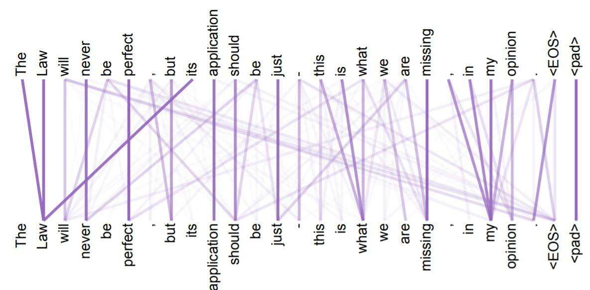
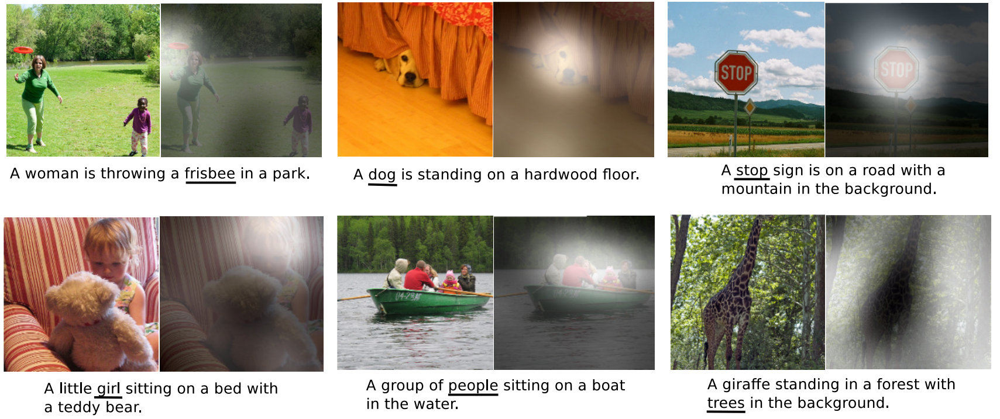

## 注意力机制的原理

假设我们有一段话，其中的一些单词之间有一定的关系。我们可以使用注意力机制，将这些相关的单词联系起来，帮助它们之间的学习。这就像我们人类看书时的注意力，可能会集中在某两个单词上，这种集中注意力的过程就是注意力机制的基本原理。

比如，我们有一句话：“小猫在花园里快乐地玩耍。”在这句话中，一些单词之间的关系更为紧密。比如“快乐地”这个词组与“玩耍”有直接的关系，而“花园”则是描述场景的背景信息。下图画出了一句更加复杂的话中各个单词之间的关系。

如上图所示，在这句更加复杂的话中，单词之间的关系跨度可以很远。

在翻译任务中，注意力机制也能够帮助我们更好地理解和处理文本。比如，我们要将一句英文翻译成中文：“The cat sat on the mat.” 在生成一个中文翻译的词时，注意力机制会帮助模型关注英文句子中的特定单词。例如，当模型输出“猫”这个单词时，注意力机制会突出关注英文句子中“cat”这个词。

因此，注意力机制通过学习单词之间的关系，帮助模型更好地理解和处理文本。这种方法使得模型能够更加精准地捕捉到重要信息，提高了其在自然语言处理任务中的表现。

在图像自然语言理解的应用中，注意力机制也可以发挥作用。例如，当我们需要生成图像的文字描述时，注意力机制能够帮助模型将文字与图像中的目标匹配起来。

举个例子，如果我们有一张图片，并希望描述其中的内容，注意力机制可以帮助确定哪些部分的图像与文字描述中的关键词对应。下图画出了一个例子。

以上图第一行中间的图片为例，比如，当模型处理描述中的“dog”（狗）时，注意力机制会将注意力集中到图像中相应的狗狗所在的位置（即右小图中的白色区域）。这种匹配过程提高了生成文字描述的准确性和相关性。

## 注意力机制的实现

在注意力机制中，每个单词都会与其他所有单词之间建立一个权重关系，这些权重代表了它们之间的重要性。例如，“快乐地”这个词对“玩耍”的注意力权重大，因为它们一起描述了动作的情感。而“花园”对“玩耍”的注意力权重可能较小，因为它们之间的直接联系不如“快乐地”紧密。

通过这种方式，注意力机制能够帮助模型更好地理解句子中的重点和结构，从而生成更准确、更有意义的输出。

## 注意力机制和 CNN、RNN 的区别

如果说卷积神经网络（CNN）是在数据中寻找模式，而循环神经网络（RNN）是对历史数据进行压缩，这两者都在试图建立一个抽象的世界模型，那么注意力机制（Attention Mechanism）则彻底解放了我们的思维，进入了完全基于原始数据驱动的计算模式。

具体来说，Attention 机制使我们可以针对每一个输入 Token 单独进行处理，基于这些 Token 之间的相互关系（即注意力）来学习并合作生成输出。与 CNN 试图找出一般模式（如卷积核）不同，Attention 机制不再依赖固定的模式，也不像 RNN 那样依靠系统的内部状态来反映序列数据的生成过程。它完全依靠原始数据进行驱动，背后需要强大的计算能力和大量的数据支持。

需要注意的是，这些注意力机制的模型参数都是通过大量数据学习得来的。因此，训练这些模型需要庞大的数据集。事实上，目前所有令人印象深刻的深度学习模型背后，都依赖于海量数据的训练。这种数据驱动的方法使得模型能够从丰富的样本中提取出有效的信息和模式，从而在各种任务中表现优异。无论是自然语言处理还是图像识别，数据的质量和数量都对模型的性能起着至关重要的作用。

我们下面介绍 Attention 和 Self-Attention 的具体实现。

## 注意力

注意力机制最初被用来改进基于循环神经网络（RNN）的Seq2Seq模型。基于RNN的Seq2Seq模型存在一个问题：所有输入序列的信息都被编码器压缩到一个隐状态（即一个向量）中，然后解码器依靠这个向量生成输出序列。因此，这个隐状态向量成为了信息传递的“瓶颈”。

注意力机制通过允许解码器在生成输出序列时，直接访问输入序列编码过程中的各个隐状态，解决了这一问题。例如，在翻译任务中，采用注意力机制的解码器在解码每个单词时，可以直接查询编码器对每个输入单词的隐状态。这意味着，每个单词的翻译可能主要依赖于一个或多个特定的输入单词，而不是均匀地依赖所有输入单词。注意力机制通过给每个编码单词分配不同的权重，反映了这种不均匀的“注意力”特性。

这种方式显著提高了翻译的准确性和灵活性，使得模型能够更好地处理长句子和复杂的语义结构。

Seq2Seq 模型中 Attention 机制的实现首先做的是计算Context 向量。它包括两步：

第一步：计算对齐分（Alignment Score）

在这一步，使用各个单词的编码状态 $$h_t$$ 和解码状态 $$s_l$$ 进行计算，得到“对齐分”（Alignment Score）。然后，对这些得分进行 Softmax 处理，得到各个单词的 Attention 权重。公式描述如下：

$$
e_{ij} = f(s_{i-1}, h_j)
$$

这里的 $$f$$ 是一个打分函数，通常可以选择点积（Dot Product）、双线性函数（Bilinear Function）或多层感知机（Multi-layer Perceptron, MLP）。

然后，对对齐分进行 Softmax 处理，得到 Attention 权重：
$$
\alpha_{ij} = \frac{\exp(e_{ij})}{\sum_k \exp(e_{ik})}
$$

第二步：计算 Context 向量
$$
a_i = \sum_j \alpha_{ij} h_j
$$

即使用得到的 Attention 权重对编码状态 $$h_t$$ 进行加权，生成 Context 向量 $$a$$。

得到了 Context 向量后，用它进行以下两方面工作：

第一，解码器更新
将 Context 向量 $$a_i$$、解码状态 $$s_{i-1}$$ 和输入单词 $$x_i$$ 送入解码神经元，得到新的解码状态 $$s_i$$。然后将其传递到下一层 RNN。

第二，输出：基于 Context 向量 $$a_i$$ 和解码状态 $$s_i$$，生成输出 $$y_i$$。

这就是 Seq2Seq 模型中的 Attention 机制。Attention 机制最初就是这么被提出来的。

## 自注意力机制（Self-Attention）

在上面的 Seq2Seq 模型中加入了注意力机制后，我们仍需要更新基于 RNN 的解码器状态。然而，正如前面提到的，RNN 的循环更新过程相对复杂，实施起来并不容易。因此，人们开始思考是否可以完全抛弃 RNN。经过分析，人们发现这是完全可行的。事实上，利用注意力机制后，解码器在解码每个单词时，可以直接查询编码器对输入各个单词的隐状态，然后生成输出。既然如此，为什么还需要 RNN 呢？

这就引出了自注意力机制（Self-Attention）。自注意力机制同样计算注意力，但它关注的是单词之间的注意力关系，因此被称为自注意力。通过自注意力机制，模型可以在解码过程中更高效地处理每个输入单词的关系，从而提升性能和效果。

下面是自注意力机制（Self-Attention）模型的基本公式描述。以文本处理为例。

首先，对于输入序列中的每个单词，我们计算其 Query、Key 和 Value。具体来说，对于每个输入向量 $$x_i$$，我们通过线性变换得到：

$$
Q_i = W^Q x_i + b^Q
$$
$$
K_i = W^K x_i + b^K
$$
$$
V_i = W^V x_i + b^V
$$

其中，$$W^Q$$、$$W^K$$、$$W^V$$ 是用于生成 Query、Key 和 Value 的权重矩阵，$$b^Q$$、$$b^K$$、$$b^V$$ 是对应的偏置项。

接下来，我们计算每个 Query 和所有 Key 之间的点积，得到注意力得分 $$e_{ij}$$：

$$
e_{ij} = \frac{Q_i \cdot K_j}{\sqrt{d_k}}
$$

其中，$$d_k$$ 是 Key 向量的维度。

这个点积的结果再通过 Softmax 函数，得到注意力权重 $$\alpha_{ij}$$：

$$
\alpha_{ij} = \text{softmax}(e_{ij})
$$

最后，我们使用这些注意力权重对 Value 进行加权求和，得到每个单词的输出表示 $$z_i$$：

$$
z_i = \sum_j \alpha_{ij} V_j
$$

通过上述步骤，我们可以得到输入序列中每个单词的自注意力表示，从而让一个单词的表征更好地结合与其相关的单词的信息，从而更好地表征这个单词。

在实际中，我们常常通过堆叠多层 Self Attention，获得更强大的模型。

## 输入 Padding

为了应对输入序列长度不一的问题，我们常常会对输入序列进行填充（Padding），将其变成一个适合模型输入的固定长度。这意味着我们会在序列的末尾添加特殊的 Padding Token，使所有序列达到相同的长度。

在这种情况下，我们需要确保这些 Padding Token 不会对模型的训练产生影响。因此，我们会将 Padding Token 对应位置的注意力分数（Attention Score）设为负无穷，这样在进行 Softmax 处理后，这些分数就会变得极小，基本上被忽略，从而不影响模型的计算和训练。

通过这种方法，我们可以处理不同长度的输入序列，确保模型在训练和推理时能够保持一致的输入格式和性能。

## 课本

- Dive in Deep Learning，[11. Attention Mechanisms and Transformers](https://d2l.ai/chapter_attention-mechanisms-and-transformers/index.html)

## 课程材料

- 伯克利大学 Seq2Seq PPT，Transformer PPT
- AI4All Model - RNN Transformer PPT

 

|[Index](./) | [Previous](5-3-rnn) | [Next](5-7-transformer) |
