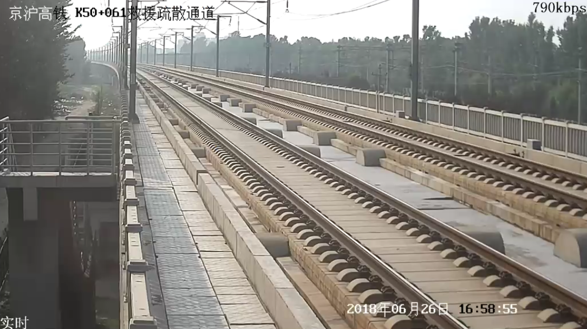
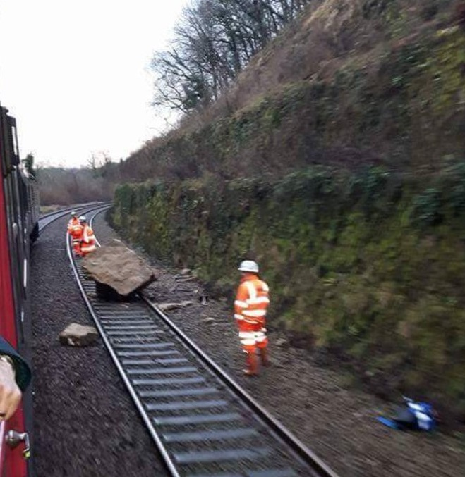
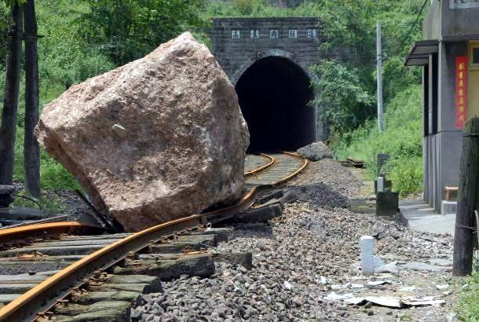
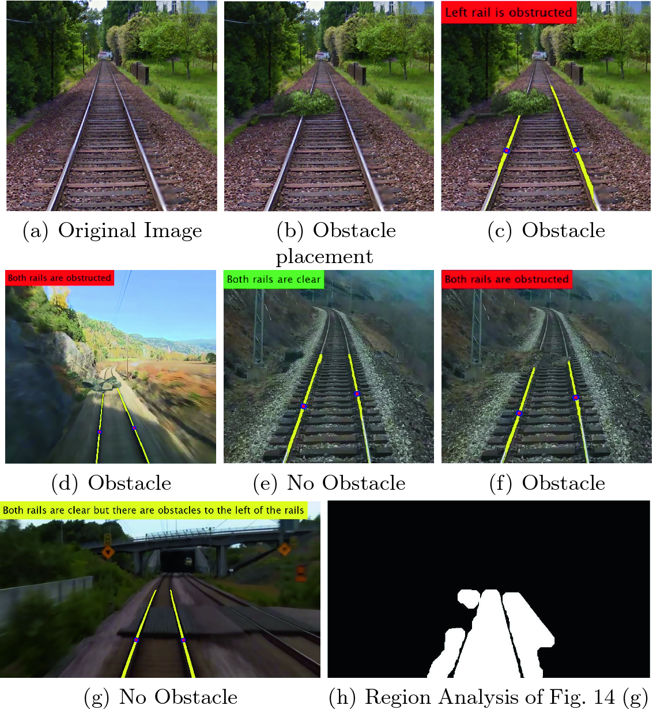
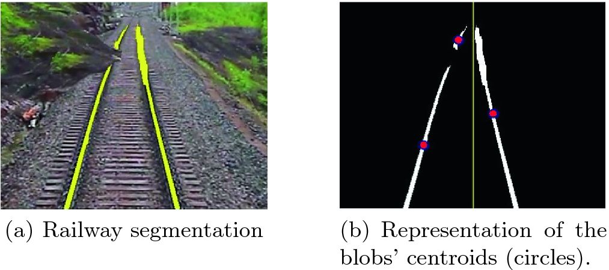
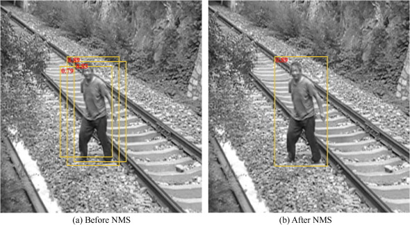
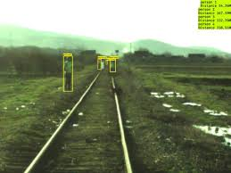
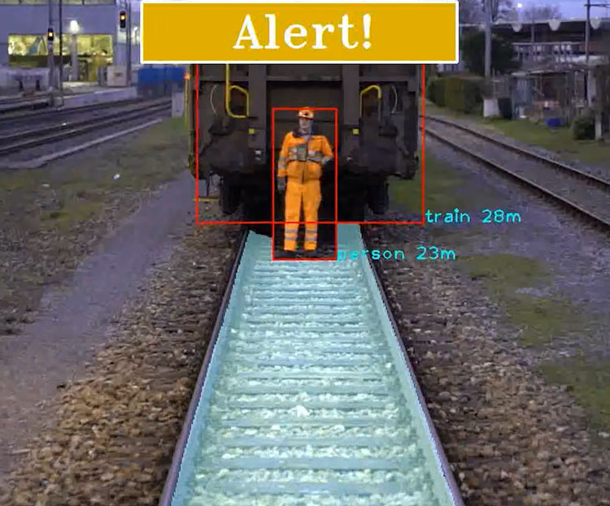
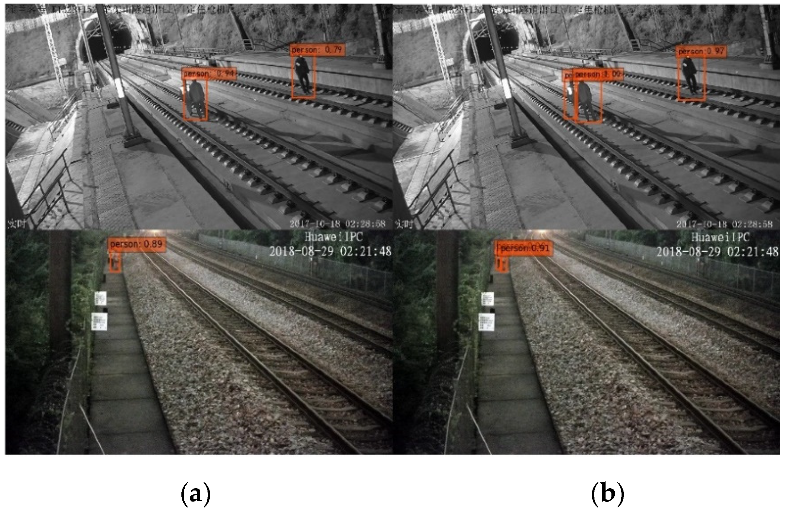
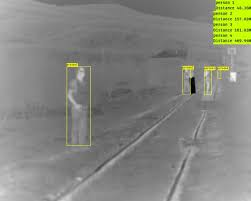

我们来看一些在铁路上见过的视频监控场景。

下图是京沪高铁的视频监控图像。从图像的分辨率来看，效果非常清晰。

## 安全监控

为了保证安全，对铁轨、铁轨上的障碍物、道口、信号灯、行人、车辆的识别非常关键。为此，我们可以使用实例分割算法将这些物体的轮廓框出。

下面是铁路安全监控的一些应用。

### 轨道及轨道上的障碍物识别

在铁路上，有时可能会发生像山体滑坡等突发事件，比如一块大石头突然掉下来。如下图。

通过视频监控和实例分割技术，我们可以实时识别轨道，并跟随机车的前进方向进行监控，实时发现前面的障碍物。识别效果如下图

### 行人识别

当行人闯入轨道时，系统能够自动识别并报警。如下图。

在站场内部，当工人出现在危险区域时，系统还会提醒保持足够的安全距离，避免事故发生。如下图

### 巡检机器人

现在，巡检机器人的应用越来越广泛，尤其是在铁路和电力行业。例如，铁路上的巡检机器人配备了摄像头，能够每天自动巡检，减少了人工检查的需求。而在电力行业，由于电网设备通常安装在较高的地方，传统的人工巡检需要借助望远镜，既费力又不安全。为了提高效率，许多电力公司开始使用无人机进行巡检，只需简单设置，无人机便能自动巡回检查设备，极大地减少了工作难度和风险。

在这些智能巡检设备的帮助下，操作人员可以通过手机实时查看巡检画面，发现问题时可以放大或缩小图像进行细节观察。同时，这些设备还配备了自动故障检测功能，一旦发现异常，系统会立即报警，让管理人员可以及时处理问题，而不需要全天候盯着监控画面。

### 挑战

上述视频监控任务的挑战在于：在实际应用中，仍然会遇到各种复杂的情况，比如夜间、光线不足、夜晚场景或背光环境。如下图。

从事视频监控的研究人员经常为此头疼，因为在这些情况下，很难清楚地识别图像内容。为此，我们可以通过图像处理的方法来提升图像的清晰度。目前，这仍然是一个挑战，解决起来相当困难。

## 日常监控

人脸识别也是我们常见的一种视频监控应用，特别是在特别密集的场景下，识别出每一张人脸。目前，人脸识别技术已经非常成熟，大家也能看到，许多地方都在使用刷脸技术。比如，现在无人售货店正在成为一种新型的零售模式。顾客只需刷脸进入，系统就能自动识别顾客身份。接着，顾客可以自由选取商品，系统会实时监控并识别所拿的商品，完成后自动通过支付宝扣款，无需人工结账。视频监控在其中扮演着至关重要的角色，帮助实现了全自动、无人干预的零售模式。

在室内，视频安全监控系统，通过摄像头实时监控室内情况，确保家居或工作环境的安全，防止盗窃、火灾等突发事件。它还可以与智能家居系统联动，实现媒体播放、智能照明调整和温度控制等功能。例如，当摄像头检测到有人进入房间时，自动开启灯光并调节温度。此外，智能门铃和重点区域的监视器，能够实时记录和传输门口、走廊等重点位置的视频，增强家庭或办公区域的安全性。

在户外，视频监控技术也被广泛应用于交通管理、停车场、以及商场等公共场所。例如，信号灯和停车场的监控可以通过传感器实时监测人流和车流，确保交通的顺畅和安全。在商场的入口处，传感器可以检测进入的人员数量和流动速度，从而有效管理高峰时段的拥堵情况，优化人流分配。下图演示了停车场车辆监控的画面。

如上图所示，车辆监控系统不仅可以识别出车辆是什么类型，还可以识别车牌号码和车辆型号，跟踪它的轨迹，进行各种智能分析和预测。此外，我们还可以进行计数。

### 无人机视频监控

无人机在现代技术中确实越来越受到关注，尤其是在低空经济的背景下，很多城市和国家已经开始将空域出售或出租。这是因为无人机的应用领域越来越广泛，从交通管理、城市监控到基础设施巡检、环境监测等，都有着不可或缺的作用。例如，国家电网使用无人机进行电力线路的巡检，通过空中视角更加精准地检测线路问题，从而提高效率和安全性。

低空经济的发展意味着无人机将成为常见工具，甚至变成一种产业。像荷兰等国家已经开始通过空域使用权来获取收益，类似于出售土地或水域的使用权一样，卖空域使用权可以为政府带来一笔可观的收入。无人机飞行的运营商需要购买相应的空域使用权才能合法地进行飞行，这为无人机行业带来了新的商业模式和市场机遇。

在视频监控方面，无人机的应用也在增加。无人机配备了高质量的摄像头和传感器，能够在较大范围内进行实时监控，极大地提高了效率。无人机的使用将为监控系统带来更多的数据和视角，同时也促进了更高效的管理和运营。

 

|[Index](./) | [Previous](6-3-cv) | [Next](6-7-vis-robot) |
