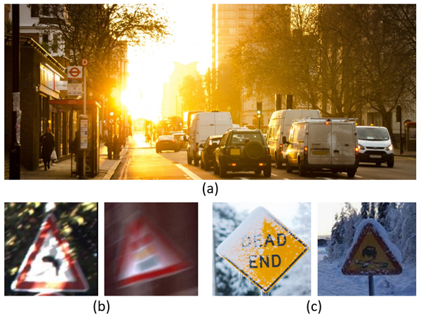
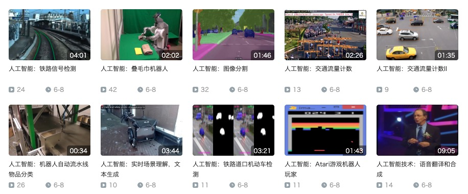

## 工业机器人

我们接下来看看视觉机器人的应用。下面是一个工业机器人的动画。

如上图所示，这个工业机器人能够通过识别物体，然后控制机械手，将其移动到指定的位置。这个过程是基于视觉技术实现的。其中包含两个关键步骤：

首先，它需要完成“实例分割”的任务。也就是说，机器人通过视频识别图像中的各个物体，例如螺栓，并将它们从背景中分割出来。这样，它就能够确定螺栓的位置和形状。

接下来，机器人会控制其机械手臂进行操作。通过视觉监控系统的辅助，机械手臂可以精准地抓取螺栓，并将其放置到指定的位置。整个过程依赖于视觉信号的实时分析与反馈，最终实现了高效的自动化操作。

## 自动驾驶

目前，基于视觉的自动驾驶系统正在普及。这些系统采用了实时语义分割技术。比如，当你购买一辆带有摄像头的智能汽车时，其内部实际上配备了强大的处理器，能够识别道路标线、前方物体和交通标志等。下图是一辆行驶在道路上的汽车看到的场景的实例分割效果。

这些视觉信息通过复杂的算法被处理后，用于控制方向盘、刹车和油门，仅靠这三个控制点即可实现自动驾驶功能。2016年，英伟达（NVIDIA）在乡间小路上展示了一款基于人工智能的自动驾驶系统。系统在试验中会犯错误，但它通过学习逐渐改进，就像人类儿童从错误中学习一样。目前，华为在无人驾驶领域也取得了很好的成绩。现在售价15万元以下的汽车都已经配备了摄像头，具备基本的视觉功能，为未来的自动驾驶奠定了基础。

基于视觉的自动驾驶技术在实际中也有一些挑战。比如在不同天气条件下的表现。例如，交通标志可能被雨雪遮挡，或者在阳光背光的情况下，识别效果会变差。如下图所示。

这些都是现实中遇到的问题，需要通过改进算法和技术来应对这些挑战

## 家用和流水线机器人

随着老龄化的严重，家用机器人有着越来越多的需求。2010 年，有研究者就演示了一个折毛巾的家用机器人。这个机器人也是基于视觉技术的。它配备了两个摄像头，用来识别和寻找物体的角落。例如，它可以找到毛巾的角，并且在找到之后，它会自动帮你叠起来。

这种识别过程其实并不简单，因为毛巾角的颜色和形状较为复杂，而且它不像我们直接抓取一个物体那样容易。尤其是弯曲的物体，对机器人来说识别和操作都是一个挑战。

现在，很多创业公司也在开发类似的机器人。最近有个新闻提到，斯坦福大学研发了一款炒菜机器人。它能识别菜肴中的食材，如胡萝卜、青椒、辣椒等，并将它们放入锅中开始炒菜。

2018 年，研究者演示了一个分捡物体的流水线机器人。机器人需要识别传送带上的小石头，把它捡起来，扔进右边的槽里。刚开始时，机器人会犯错误，无法准确地将石头扔进去。这就像小孩子刚开始做事情时，他们可能也会遇到困难。比如当你让孩子把东西放进盒子里时，他们可能会做不对，但一旦完成任务并得到奖励，他们就会学到如何做得更好。在这个案例中，机器人的失败是训练的一部分，通过不断的尝试和奖励，它最终学会了如何正确地识别小石头并将其丢进槽里。

在未来，还会有更多的机器人帮助我们工作，提高我们工作的效率。这种技术的应用，正是推动智能化运营管理的一个重要方向。

要观看上述视频，请访问 B 站《AI 入门》视频合集（[链接](https://space.bilibili.com/88039759/channel/collectiondetail?sid=415701&spm_id_from=333.788.0.0)）。下图为该视频合集中的目录。

## 挑战

目前，阻碍机器人应用的主要原因是技术还不成熟、硬件成本高、安全性不能保障。

特别是安全性。我们非常担心机器人可能会做出一些危险的行为，甚至伤害到人。如果发生这种情况，责任该由谁来承担？是机器人制造商，还是使用者，或者其他方面的责任人？类似的问题也存在于无人驾驶技术中。目前，虽然无人驾驶汽车在技术上不断进步，但我们仍然不太敢让它们上路。因为一旦发生事故，究竟是由司机负责，还是由汽车制造商或技术提供商承担责任。因此，现阶段，无人驾驶汽车在遇到潜在危险时，通常会选择紧急停车，而不是冒险行驶。这是因为，撞到一个人可能带来无法承担的后果。为了避免风险，许多无人驾驶车辆宁愿停在路上，也不敢贸然前进。这个问题的解决，需要技术、法律和道德等多个方面的共同进步。

 

|[Index](./) | [Previous](6-5-vis-rail) | [Next](6-9-vis-decision) |
