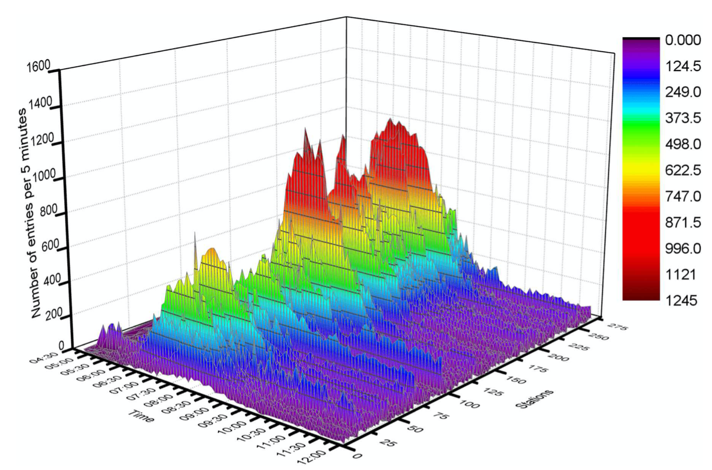
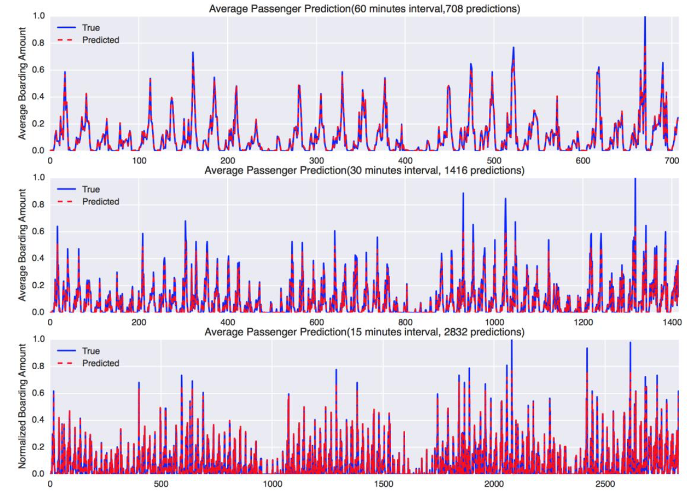

视频监控是大数据时代下铁路运营平台的一部分。如今，我们正处于一个大数据时代，速度和效率至关重要。通过对视频数据的分析，我们可以为管理层提供支持，帮助决策。这种基于视觉的数据分析，不仅能够帮助我们实时监控情况，还能通过数据的汇总和分析，为未来的运营优化提供宝贵的参考。

## 流量监控

首先，我们可以基于视觉进行客流的监控。下图画出了提高视频监控能够获得的客流随着时间变化的流量图。

从图中可以看出，我们的客流量随着时间的变化而波动，早高峰、晚高峰和周末的流量都有显著差异。通过对这些数据的分析，我们能够清晰地了解不同时间段的客流情况。这不仅有助于我们预测高峰时段的交通压力，还能为交通管理提供科学依据，从而优化运营调度，改善乘客体验。

## 流量预测

有了流量历史数据之后，我们可以进一步进行流量预测。下图是一个可能的预测结果示意图。

如上图所示，我们不仅仅可以对日常流量的预测，还包括在重大节假日和特定场景下的流量预判。例如，在节假日的高峰期，我们能够预测到某些时段可能会出现的人流密集情况。基于这些预测数据，管理者可以采取提前控制措施，比如在高峰时段封闭某些路口或进行流量分流，从而避免过度拥堵和交通混乱。这种预测和控制不仅可以提高运营效率，还能确保公共安全，减少潜在的风险。

## 小结

总之，视频是一个重要的管理信息源。这些信息非常宝贵，因为它们帮助我们更好地理解和管理周围的环境。

对于人类来说，眼睛是最重要的感知器官之一，我们依赖它来获取视觉信息。而视频监控团队，实际上就像是铁路系统的“眼睛”。通过发挥“眼睛”的作用，我们能够实时获取重要的信息，做出更加精准的决策。

未来，要实现铁路的真正智能化，视频监控系统将发挥至关重要的作用。它不仅仅是监控工具，更是智能化管理的核心组成部分。通过进一步优化视频监控的应用，我们将能够更好地管理铁路运营，提高效率，并保障安全。

 

|[Index](./) | [Previous](6-7-vis-robot) | [Next](6-11-vis-cloud) |
