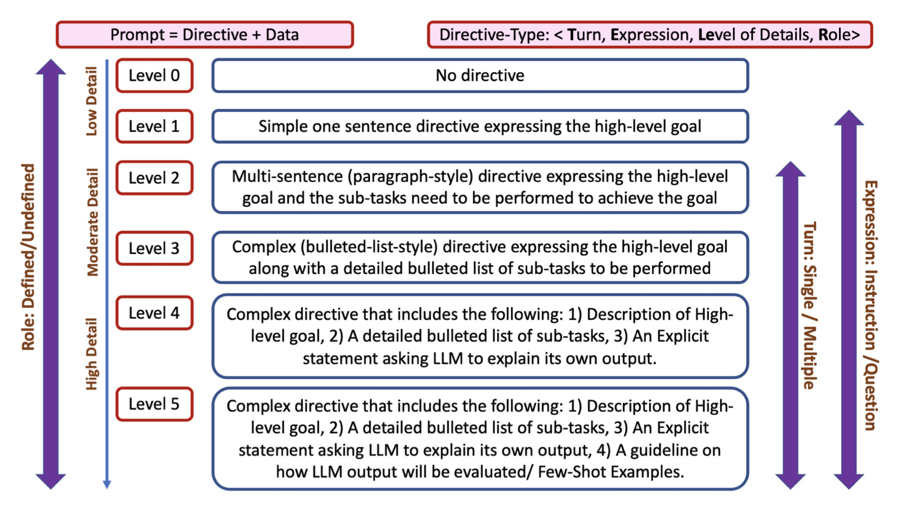

我们下面介绍常用的 Prompt 方法。

## 5 级 Prompt

《[TELeR: A General Taxonomy of LLM Prompts for Benchmarking Complex Tasks](https://arxiv.org/pdf/2305.11430.pdf)》论文中总结了 5 级 Prompt 方法，如下图所示。

如上图所示，第一级的 Prompt 只是简单地用一句话表示高级的目标；第二级的 Prompt 还包括各个子目标；第三级的 Prompt 还包括一个列表，详细给出要完成的高级任务的步骤；第四级的 Prompt 还要求模型解释它的输出；第五级的 Prompt 还包括一个描述：指出会如何评估模型的输出，并给出 Few Shot 的例子。

## 6 个策略

OpenAI 官方的 Prompt 工程指南（[英文版](https://platform.openai.com/docs/guides/prompt-engineering)，[中文简介](https://mp.weixin.qq.com/s/4HMdDXFdAanrCwZyAZcNXg)）给出了 6 个策略：

第 1 个策略是：写清楚指令，这包括：
- 提示中尽量包含更详细的指令信息
- 提供示例
- 指定模型完成任务时所需的步骤
- 指定模型输出的长度
- 使用分隔符来明确划分提示的不同部分
- 让模型扮演不同的角色，以控制其生成的内容。

第 2 个策略是：提供参考文本，要求从这个文本中提取答案，减少幻觉，这包括：
- 指示模型使用参考文本回答问题
- 指示模型从参考文本中引用答案

第 3 个策略是：将复杂的任务拆分为更简单的子任务，这包括：
- 使用意图分类来识别与用户查询最相关的指令
- 对长对话，总结或过滤以前的对话
- 分段总结长文档，递归构建完整摘要

第 4 个策略是：给模型时间去思考，这包括：
- 指示模型在得出结论之前先找出解决方案
- 使用 inner monologue 来隐藏模型的推理过程
- 询问模型是否遗漏了任何内容

第 5 个策略是：使用外部工具，这包括：
- 文本检索系统（有时称为 RAG 或检索增强生成）可以告诉模型相关文档
- Code Interpreter 可以帮助模型进行数学运算并运行代码

第 6 个策略是：系统测试提示修改带来的变化，这包括：
- 确定一组具代表性的示例，在它上面进行测试

### 练习

- 《[The Art and Science of Prompt Engineering](https://wandb.ai/darek/llmapps/reports/The-Art-and-Science-of-Prompt-Engineering--Vmlldzo1MzM1NDMy)》

- Yandex 2022 LLM [ipynb 练习](https://github.com/yandexdataschool/nlp_course/blob/2022/week08_llm/practice.ipynb) 的第一部分。

- 斯坦福 DeepLearning.AI Short Course，[Prompt 工程教程](https://learn.deeplearning.ai/chatgpt-prompt-eng/lesson/1/introduction)，在网页上可以练习

- 微软 Generative AI for Beginners，[第四章：提示工程基础，](https://github.com/microsoft/generative-ai-for-beginners/blob/main/04-prompt-engineering-fundamentals/translations/cn/README.md?WT.mc_id=academic-105485-koreyst)，[第五章：创建高级的提示工程技巧](https://github.com/microsoft/generative-ai-for-beginners/blob/main/05-advanced-prompts/translations/cn/README.md?WT.mc_id=academic-105485-koreyst)

### 课程

- Berkeley CS294/194-196: Responsible GenAI, Omar Khattab, Stanford, App Development Layer: Prompt Engineering, Chains, Tools

- Learn Prompting 课程, [Website](https://learnprompting.org/docs/intro)，[Basic](https://learnprompting.org/docs/category/-basics)，[Basic Applications](https://learnprompting.org/docs/category/-basic-applications)，[ChatGPT Tutorial](https://learningprompt.wiki/docs/chatgpt-learning-path) 

- 提示工程指南，[网站](https://www.promptingguide.ai/)

- 上海科技大学电力电子与再生能源实验室，[如何让 ChatGPT 助力科研进程](https://zhuanlan.zhihu.com/p/662192875)？2023 年 10 月

- 西湖大学智能无人系统，[ChatGPT提示工程师：必备知识与技巧解析](https://www.bilibili.com/read/cv27830700/)，2023 年 11 月

- Summary, Sentiment, Question Answering & More: 5 Creative Tips for GPT-3 Prompt Engineering，[网页](https://wandb.ai/ivangoncharov/GPT-3/reports/Summary-Sentiment-Question-Answering-More-5-Creative-Tips-for-GPT-3-Prompt-Engineering--VmlldzoxODY0Nzky)，2022 年

- Jasper 101 Training (https://www.jasper.ai/101)

- Ultimate GPT-4 Crash Course (https://abhishekhq.gumroad.com/l/pqdfx)

## Prompt 优化工具

微软的 [Promptflow](https://github.com/microsoft/promptflow) 让我们能够定义 LLM Prompt 模版，包括对话历史的 Chat Prompt，和一定数量的测试集。然后，我们就可以在这个测试集上，批量运行，比较不同 Prompt 获得的回答的准确性。比如这个[数学习题求解的例子](https://github.com/microsoft/promptflow/blob/main/examples/tutorials/flow-fine-tuning-evaluation/promptflow-quality-improvement.md)。

## Playground

- GPT-3 [Colab Demo](https://colab.research.google.com/drive/16WRWYYoulZrR0FLQqjoRNoxL7frtBZ1c?usp=sharing)
- OpenAI [Playground](https://platform.openai.com/playground)，包括 Assistant、Chat、Legacy 三种模式。Assistant 的回答会简短一些，适合教育应用。

## 示例

看多了 Prompt 例子，我们就知道该怎么写了。

首先是 OpenAI 的官方 [Prompt Example](https://platform.openai.com/examples)，必看。

其次是各种 Prompt 分享社区中很多神人的分享：

- ShareGPT (https://sharegpt.com/)

- Why "Prompt Engineering" and "Generative AI" are overhyped，[网页](https://www.latent.space/p/why-prompt-engineering-and-generative)

然后是一些 GPT System 的 Prompt，包括下面的 GPT System：

- ChatGPT System Prompt，[Github 1](https://github.com/LouisShark/chatgpt_system_prompt)，[Github 2](https://github.com/spdustin/ChatGPT-AutoExpert/blob/main/_system-prompts/gpts/README.md)，[Github 3](https://github.com/linexjlin/GPTs)，[Github 4](https://github.com/mustvlad/ChatGPT-System-Prompts/)

这里是获得 System Prompt 的一些方法（[Website](https://zhuanlan.zhihu.com/p/667229277)）。

这里是我摘录的一些有趣的 Prompt
- [数据分析和运维](3-10-prompt-aiops.md)
- [编程](3-10-prompt-coding.md)
- [教育](3-10-prompt-edu.md)
- [绘画](3-10-prompt-vision.md)
- [沟通方式](3-10-prompt-style.md)

最后，OpenAI 让我们可以设置一些个性化的 Prompt，配置方法如这个 [Github](https://github.com/spdustin/ChatGPT-AutoExpert/) 所述。

## 参考

- My class required AI. Here's what I've learned so far (Mollick, 2023)
- 月薪4万的“关键”新兴岗位：研究如何向AI发出专业提问，中国企业家杂志，2024-01-23，[微信公众号](https://mp.weixin.qq.com/s/tabh8Pkcvrvy7_qe6niJ4A)
- Jason Ng，那么，我是如何使用 ChatGPT 的？可能吧，2024-01-24，[微信公众号](https://mp.weixin.qq.com/s/K3mjmkLye79Khem18QHORw)

## Paper

- Why Johnny Can’t Prompt: How Non-AI Experts Try (and Fail) to Design LLM Prompts, 2023

##
 

| [Index](./) | [Previous](3-1-run) | [Next](3-10-prompt-analysis)
