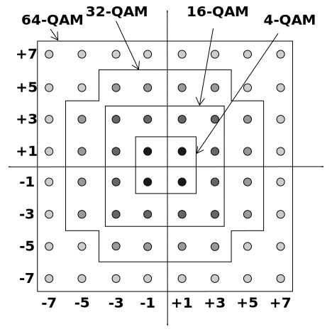
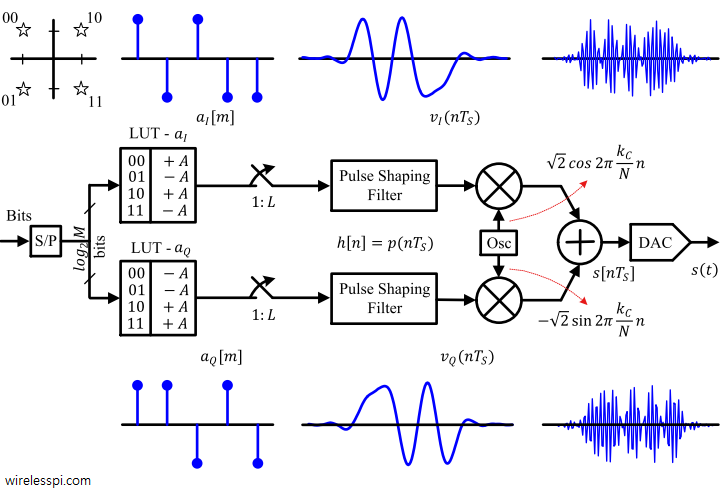
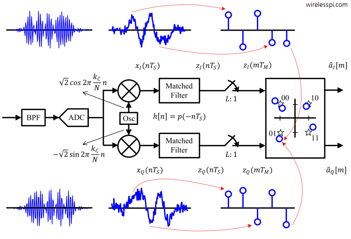

为了改进通信的有效性，提高系统的信息传输速率，提升频带利用率，我们下面学习多元数字频带通信系统。在这些系统里，M 元的符号被传输，因此，一个符号内，可以传输 $$log_2 M$$ 的比特信息。

## MASK

MASK 利用信号的幅度传递信息。理解了 MASK，有助于我们理解其他调制方式，所以，请一定要认真掌握它。

MASK 的调制相当于用一个多电平的基带信号，做幅度调制。因此，它用 DSB、SSB、VSB 其实都可以，只要在接收端能够把这个基带信号解调出来，就可以。

ASK 对应的基带信号电平，可以是 0，1，2，3，也可以是 -3，-1，1，3。你可能会说，-3，-1，1，3 不是像 PSK 信号那样，相移也发生了变化吗？是的。这里为了方便，我们还是把它作为 ASK 信号来看。

把二进制比特映射到 ASK 电平时，一般采用格雷码。这样的话，相邻两个电平的二进制比特，就只相差一位。因为误码的大多数情况下，都是从一个电平错到相邻的电平，所以，通过采取格雷码，此时我们就只有 1 个比特错误。这样就能够减少整体的误比特率，提高系统的可靠性。

MASK 的频带利用率这么计算：因为多电平基带信号的带宽是 $$R_B$$，所以，如果采用 DSB 的话，MASK 的功率谱宽度就是 $$2 R_B$$。这里的 $$R_B$$ 是 MASK 的符号速率。

MASK 的误码性能分析和 ASK 的分析类似，只是它有很多电平，因此每个电平受到高斯噪声影响后，都有对应的高斯分布。因此，它也有很多阈值电平。这些阈值电平形成的区间，就是各个电平的判决区间。基于这个模型，我们就可以求解它的误码性能。

## MQAM

QAM 同时利用信号的幅度和相位传递信息。理解了 MASK 之后，我们理解 MQAM 就简单了，因为 MQAM 就相当于两个 MASK 的正交载波调制的和。

我们首先将 QAM 的信号相位通过数学分解，写成“正交载波调制的形式”。观察这个数学形式我们可以发现，它实际上是由两个 ASK 信号经过正交载波调制后，再相加，这样形成的。这两个 ASK 信号，一个是 $$a * cos \theta$$，一个是 $$a * sin \theta$$。

要理解 QAM 的正交载波调制，最好的办法是看“星座图”。如下图所示。

让我们观察 16QAM 的星座图。如上图所示，16QAM 的星座图包括 16 个星座点。这些星座点组成一个 4 * 4 的矩形。每个星座点到原点的距离，就是它的幅度 a；它相对于 X 轴的角度，就是它的相位 $$\theta$$，如下图所示：

那么，每个星座点在 X 轴和 Y 轴上的投影，就是它代表的 QAM 信号的两个 ASK 调制信号的幅度：一个是 $$a * cos \theta$$，一个是 $$a * sin \theta$$。

从这个星座图中，我们还可以发现 16QAM 的一种神奇的生成方法。我们来观察这 16 个星座点在 X 轴和 Y 轴上的投影。它有四种不同的值，比如 -3，-1，1，3。这不就是我们学过的 4ASK 的四种幅值吗？因此，我们就可以用正交载波调制的方法，很方便地实现 16QAM。具体方法如下图所示：

我们将输入的 4 个比特作为一组，对它进行“串并转换”，变成两路。将其中的一路做 sin 载波的 4ASK （它的四个幅值是 -3，-1，1，3，能在一个符号内传输 2 个比特），另一路做 cos 载波的 4ASK （它的四个幅值也是 -3，-1，1，3，也能在一个符号内传输 2 个比特），然后把两路 ASK 信号加起来，同时传输。这就完美地实现了我们前面分析过的 16QAM。

因此，在发送端，我们只要做“串并转换”，然后分别 ASK 就可以了。在接收端，我们做 ASK 解调后，做“并串转换”就可以了。非常简单。如下图所示：

注意，上图中我们采用了匹配滤波器进行解调。匹配滤波器的内容将会在后面的最佳接收部分学习。

类似的，我们也可以得到 64 QAM（一个符号内传输 6 个比特，其中 3个 用 8ASK 在 cos 上传，另外 3个 用 8ASK 在 sin 上传）、256 QAM。

我们最后分析它的有效性和可靠性。因为 QAM 可以分解为两路 MASK 的并行传输，所以它的带宽（代表有效性）和误码率（代表可靠性）都可以通过 MASK 的相应结果推导出来的。详见课程 PPT 或课本。

## MPSK

MPSK 利用信号的相位传递信息。有了 MQAM 带给大家的正交载波调制的星座图表示，我们理解 MPSK 也就简单了。

要理解 MPSK，最好的办法也是看“星座图”。比如 8PSK，它的星座图包括 8 个星座点。这些星座点均匀分布在一个圆上。这个星座图的特点是：所有星座点的幅度是一样的，只是相位不同，因为 MPSK 是只利用信号的相位传递信息的嘛。如下图所示：

上面的 MPSK 的星座图描述也提示了我们：我们也可以用“正交载波调制”的方式实现 MPSK。具体来说，像 QAM 一样，MPSK 的一个符号也可以通过一路用 sin 作为载波的 ASK 和一路用 cos 作为载波的 ASK 加起来，进行传输。为此，我们也要像 QAM 那样，把一个星座点映射到 X 轴和 Y 轴上，获得它的 X 和 Y 坐标，然后用这两个坐标值，做为 cos 和 sin 两个正交载波的 ASK 调制的幅度，分别调制，然后相加，即可得到对应的 PSK 信号。

MPSK 的星座图在 X 轴和 Y 轴上的投影有多少个值呢？这和它采用 A 方式还是 B 方式有关。以 8PSK 为例，如果采用 B 方式，就是有四种不同的值，而如果采用 A 方式，则有五种不同的值。要进行这样的分析，观察星座图，是最好的办法。因此，我们要掌握它的星座图。

MPSK 的误码性能分析比较复杂，我们在课上是直接给出结论，没有进行推导。

## QPSK

QPSK 是一种特别常用的 PSK，因此，我们对它进行重点学习。它是 M = 4 的四元 PSK。

我们首先看 B 方式的 QPSK。基于星座图，我们立刻就能看出：B 方式 QPSK 的星座图和 4QAM 完全一致，所以，B 方式的 QPSK 就是 4QAM。因此，它的调制解调、有效性和可靠性分析也可以像 QAM 那样做。

我们然后看 A 方式的 QPSK。我们首先看它的调制。因为 B 方式的 QPSK 信号非常好生成（串并转换后ASK调制即可），所以一个想法是：能不能也用这种方式来实现 A 方式的 QPSK ？答案是“能”。我们通过数学变换，发现只要采用 $$ - \pi/4$$ 相移的 cos 和 sin 载波，就可以进行类似 B 方式的 QPSK 信号生成，即把输入比特做串并转换后，做 ASK 即可。这样的话，解调也就像 B 方式的 QPSK 那样简单了。这无疑极大地方便了 A 方式通信系统的设计。从这个例子，我们可以看到数学的巨大作用：通过数学，我们可以看到系统设计背后的真正的原理，然后利用它来获得优美的、最简单的系统设计。

最后，QPSK 在实际中有两个问题需要解决：“零包络“现象和“相位模糊”问题。下面对它们分别进行说明。

第一个问题是“零包络“现象。“零包络“现象是指：QPSK 在相位切换的过程中，如果两个比特同时变化，信号的包络就会经过 0。要理解这一点，可以看它的星座图。从它的星座图可以看出：如果两个比特同时变化，星座就会从一个点，经过 0 点，跳到对角线那边的一个点上。因此，当它经过 0 点时，包络就变成 0 了。

“零包络“现象对系统的功率放大器提出了较高的质量要求。为了简化系统，人们提出 OQPSK。OQPSK 的想法非常神奇：它巧妙地把一路基带信号延时半个符号周期，这样就造成了每次只有一个比特变化的效果，这当然就能避免“零包络“的问题了。这不得不让我们感叹我们的前辈的创造力是多么的神奇。他们绝对是我们学习的榜样。

第二个问题是“相位模糊”问题。QPSK 的每一路 ASK，其实是一个 PSK，因为它的电平是 +1/-1 啊。因此，它还是有 PSK 的“相位模糊”问题。因此，人们提出 QDPSK。类似于二元 DPSK，它用相位的变化来传递信息。比如：对 11 两个比特，它就在当前信号相位的基础上，立刻跳变 180度。通过这种方法，相位模糊导致的正负颠倒问题，就能够得到解决。

像 DPSK 一样，QDPSK 的发送端，是首先通过码变换，实现差分编码，然后做 QPSK 调制；而在接收端，有两种解调方法：一种是相干解调后，做码反变换，恢复原始比特；另一种是比较前后两个符号的相位，即差分相干解调。

## MFSK

我们下面看 MFSK。它和二进制的 FSK 类似。注意它的解调也还是比较判决。这里就不过多赘述了。请学习 PPT 和课本上的内容。

## 多元调制信号的波形

为了深入理解上面的各种调制方式，我们要能够画出这些多元调制信号的波形。具体来说，我们要能够基于各种调制方法给出的幅度、相位映射表，或者星座图，画出特定传输比特串，经过调制以后的信号波形。比如 QAM，我们就要根据映射表，画出对应的信号幅度和相位；对应 DQPSK，我们就要根据映射表，画出对应的相位跳变。请大家多做这部分的练习。

## 小结

MASK 是理解各种多元调制方式的基础。基于 MASK，利用“星座图”，我们就能够很容易地理解 MQAM、MPSK 和 QPSK。请大家仔细体会，多加练习。

## 参考文献

- Qasim Chaudhari, Quadrature Amplitude Modulation (QAM), [网页](https://wirelesspi.com/quadrature-amplitude-modulation-qam/)
 

|[Index](./) | [Previous](5-3-2-ary) | [Next](5-7-msk) |