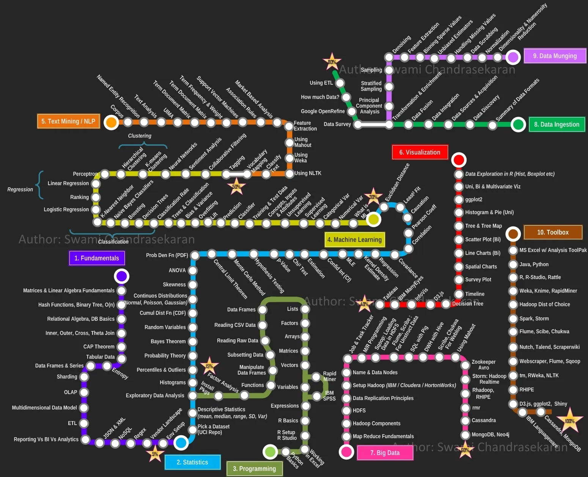

本节介绍数据科学的学习路径和一套编程练习。这个路径包括基础、大数据、分析、统计、机器学习、编程和工具。这套编程练习来自杜克大学，涵盖 Python 基础、机器学习、深度学习、Spark 大数据编程。非常优秀。

## 数据科学学习路径

 

这里有张图，是你要成为一个大数据工程师的学习路径[1]。每种颜色是一个方面。

紫色是基础。大家看，大家其实都有一点基础了，比如矩阵，线性代数。关系代数，就是关系数据库。然后表格数据，Excel表格数据，SQL，DataFrame，BI 是商业情报，Business Intelligence。很多公司有BI部门的。JSON、XML 是一种数据格式。然后是 NoSQL，就是非SQL的数据库。还有正则表达式。这是基础。我们都会学。

粉红色是大数据。我们后面会给大家讲MapReduce，然后是 Hadoop、HDFS。HDFS 就是 Hadoop 里的分布式文件系统。MR 编程就是 MapReduce 编程。用 Java 编可以，用 Scala 编也可以。Flume 传输数据。这些我们都会给大家讲。然后现在用 Spark 比较多，所以我们会给大家重点讲 Spark。然后大数据的平台里有 ZooKeeper，这是一种维护的软件，非常重要。Storm 是做实时流式处理的。

红色是分析。可视化，首先要呈现。你分析的时候，要观察。观察的时候，要画各种图，比如饼图、散点图、线图、时间序列图。给出基本的可视化结果。这是可视化方面的事。

蓝色是统计。首先是探索式的数据分析、直方图、百分数、离群点，各种概率分布。这些是我们在分析数据的时候经常会用到的。然后是假设检验，回归。

黄线是机器学习。我们就会给大家介绍线性模型，即线性回归。线性回归是一个最基本的模型，但是大家理解了线性回归模型以后，大家其实基本上就懂什么是机器学习模型了。然后介绍 Bias 和 Variation。有监督的模型介绍线性回归。无监督的模型会介绍聚类。决策树也会给大家讲一点点。然后是 Boosting，感知机。这是机器学习。然后就到了深度学习。CNN、RNN、Transformer。

绿线是编程。包括 R 语言，Python Pandas 数据处理。

褐线是工具。这些工具，我们也给大家准备了一些特别简单的入门代码。就是从 Python 入门开始，大家练一练就 ok 了。然后，Spark、Flume 这些。

所以，这门课差不多就会介绍这些内容。相当于每个地方都给大家点到，让大家多多少少都有一点全局的感觉。然后大家首先探索自我，找到自己的兴趣点，然后再根据自己的特点，有选择的去学习，去探索世界。

这本课的内容给大家都介绍差不多了。归根结底，就是通过课堂的讲解，以及大家的探索，大家能够掌握常见的数据科学的原理、架构、工具，能够上手操作。归根结底就是这个。我们一起来做这个事情，最后能够利用数据科学平台来提出、解决一些数据科学的问题。

课程具体分三部分内容

第一部分是什么是数据科学，它的各种应用、基本概念。

第二部分是数据科学平台，包括 Spark、ZooKeeper、Kafka 等大数据平台

第三部分是数据分析、模型、仿真、假设检验、可视化、表格数据处理、线性回归、机器学习。

这就是我们课程的内容

## 探索练习

我们下面利用人工智能的工具，做一个探索练习。这是我设计的一个人工智能导师：“一起探索吧”。它基于阿里的通义千问。包括手机版本和网页版本。大家点这两个链接，分别会在手机上的通义 APP 和浏览器中打开，大家首先要注册一下，然后就可以打开了。

打开后，他会问你，你想要学习点什么，你就告诉它就行。比如说我想学习大数据，或者决策树。然后大家就可以接着和他聊。他挺能聊的。任何你感兴趣的东西，都可以和他聊。我设计的是他不仅会说，还会问，这样我们聊起来，就比较好玩了。希望大家喜欢。

参考文献

- Data Analysis Enthusiast， What is the best path to learn data mining? Jul 30，2019，[Medium Webpage](https://medium.com/@lyric09220/what-is-the-best-path-to-learn-data-mining-edf4da6c6823) 

 

|[Index](../) | [Previous](5-flow-cap) | [Next](9-job) |
