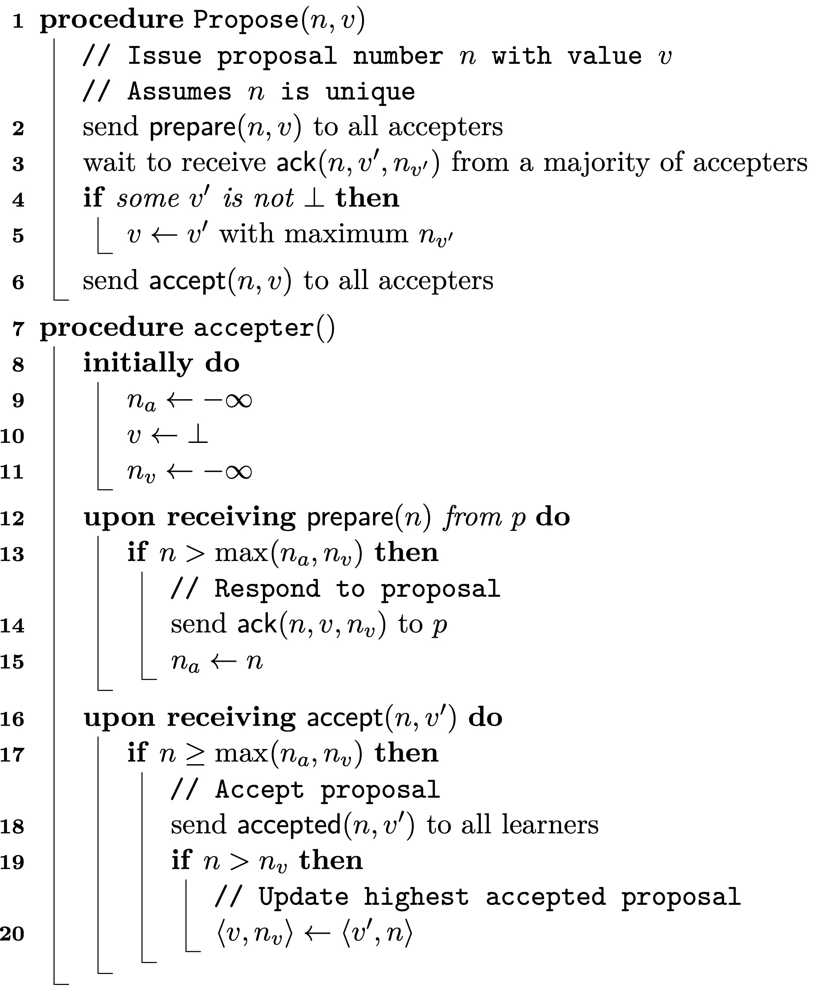
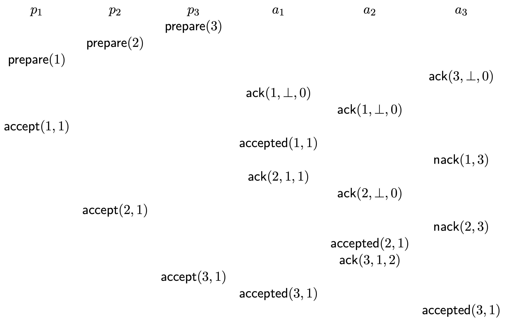

本节介绍 ZooKeeper 实现“状态一致性”的具体算法：Paxos。

## Paxos 算法提出的历史

Paxos 算法的提出特别逗。提出这个算法的 Leslie Lamport 发现了这个算法后，决定以古希腊 Paxos 岛上的议会为背景，介绍这个算法。然后它写了一篇论文。论文的摘要是：最近，在 Paxos 岛上的考古发现表明，尽管兼职的立法会成员一直在四处游荡，但议会仍然能够发挥作用。尽管这些立法会成员常常不在议会里，然后为它们传递消息的使者还经常把消息给搞丢了，这些立法会成员依旧能保持它们各自的议会记录是一致的。这是因为 Paxos 岛的议会遵循一种特别的协议。这种协议为分布式系统的设计提供了一种实现状态机方法的新方法。

Lamport 本来以为这种幽默的方法能够帮助其它人理解它发明的算法，可是事实上结果正好相反，更严重的是，人们认为它不是认真的，而是在开一个玩笑。因此，Lamport 就崩溃了。它等了 8 年，还是没有人懂它的算法，它只好又写了一篇论文。在这篇论文中，它还是不死心，还是想用比喻，所以这篇论文的名字叫 “The Part-Time Parliament”（兼职的议会）。结果人们还是不理解这篇论文。

折腾了快 10 年，Lamport 终于死心了，不再幽默了，而是用简单的英语又写了一篇论文《Paxos Made Simple（让 Paxos 变得简单）》。这篇论文的摘要中说：The Paxos algorithm, when presented in plain English, is very simple（Paxos 算法用简单的英语表达时非常简单）。可是人们还是觉得很难理解，于是很多人就自己写论文，帮着 Lamport 解释。这样慢慢地大家才终于懂了。最后 Lamport 因为这个算法得了计算机科学的最高奖：图灵奖。

## Paxos 算法的目的和挑战

Paxos 算法是在分布式系统中实现“状态一致性”，即分布式系统中的节点们如何就某一个事情达成一致，比如：谁做这些节点的 Master。因此，它是通过节点之间互相发消息，最后达成一致的。这里没有一个类似微信群的集中式的“投票”功能，让大家都来投票。所以，节点之间只能互相发消息。

为了达成分布式的状态一致，Paxos 算法面对的挑战是：节点和节点间通信都很不稳定。在分布式系统中，节点是不稳定的，可能会宕机故障，节点通信的环境也不稳定，可能会联系不上，或者你的消息发过去，结果在路上丢了；或者你给它发两个消息，结果呢？发在前面的消息，因为走的是无线网，所以传输得比较慢，而发在后面的消息，走的是有线网，所以传输得比较快，结果是，后发的这个消息比先发的这个消息，还先到。

Paxos 算法的成功之处在于，在分布式系统这么恶劣的节点和通信环境下，即使消息对方很可能收不到、延迟收到、乱序收到、重复收到，Paxos 都没事。节点们只要按照这个算法来做，最后一定能达成一致。

当然，Paxos 能够完成上述目标，也有最基本的前提条件，那就是只能有少于一半的节点失联。

## Paxos 算法

我们下面就来看 Paxos 算法。算法分两部分，如下图所示：

首先，Paxos 定义了三个角色：

- 第一个角色是 Proposer：它们专门管“提建议”，比如：它们会提建议说我想要大家去哪玩。
- 第二个角色是 Acceptor：它们专管“接不接受 Proposer 提出的建议”。
- 第三个角色是 Learner：它们专门去问 Acceptor，你们最后达成什么一致啦，比如：我们到底去哪啊？

注意，一台电脑可以同时充当上面三种角色中的多个，并不矛盾。

其次，Paxos 的算法大概分三步：第一步是大家猛提建议；第二步是大家达成一致；第三步是大家问一下：你们最后商量好了没？就这三步。

我们现在来看它的算法。

### Proposer 算法

首先是 Proposer。它先送一个 prepare 给所有的 acceptor。就是说，请你准备，我要跟你聊了。在 prepare 里，会带上它的标记 n。这个 n 是每一个 proposal 不一样的。因为 proposer 有很多，你可以 propose，它也可以 propose，所以每个 proposer 都在 prepare 里带上自己的 n，标记一下。而且这个 n 呢，还随着时间的增长而增长。

Proposer 发出 prepare 消息之后呢，就等着，直到有超过一半的 acceptor 回复 ack。注意，它会一直等到超过一半 accepter 回它 ack，它才继续。否则会一直等。这个等待，就让它不会乱发，而给系统一些时间，达成一致。

当 Proposer 收到超过一半的 acceptor 回复的 ack 后，它就检查所有收到的 ack 里面带的三个数。

第一个数是 proposer 发的 prepare 里带的那个 n。这样 proposer 就知道 acceptor 回的就是自己。

第二个数是 v'。它是发 ack 的 acceptor 目前同意的要去哪。因为当这个acceptor 收到 prepare 时，它可能前面已经接受过别人的 proposal 了，同意了要去一个地方。所以，它就把这个地方放在 v‘里，回给 proposer，意思是：我收到你的 prepare 了，我告诉你，我已经答应别人要去 v’。

第三个数是 nv'，这就是这个 acceptor 答应的那个 proposer 的 n。

当然，如果这个acceptor 收到 prepare 时，它还没接受过别人的 proposal，它就不会在 ack 里的 v‘ 和 nv’ 里填值。所以这时候它回的 ack 的意思就是：我这边还没有人跟我说要去哪，你是第一个，你就提建议吧。

Proposer 检查完所有收到的 ack 后，会发现两种情况：

一种情况是所有收到的 ack 里的 v‘ 都没有填值。这这意味着所有回复 ack 的 accepter 回 ack 的时候，都没接受过 proposal。此时，这个 proposer 就会给所有的 accepter 发 accept，里面带上自己建议要去的地方 nv。注意，这时这个 proposer 是给所有的 acceptor 发，而不是仅仅给那些回复自己 ack 的 acceptor 发。所以这个 accept 的意思其实是想告诉所有的 accepter 它的提议，比如说去颐和园。它想所有的 acceptor 都接受这个提议，因此达成一致。这也是合理的，对吧？因为我发现大家都没有意见，那我赶紧占住，对吧。

第二种情况是收到的 ack 里有填好的 v‘。比如说这个 ack 里说我已经接受提议去昆明了，那个 ack 里说它已经接受提议去上海了，这个时候怎么办呢？ 这个 proposer 就看哪个 ack 里的 nv‘ 大，就服从这个 ack 里的 v’。比如一个 ack 里的 nv‘ 是 31，另一个 ack 里的 nv‘ 是 16，那它就同意 nv’ 是 31 的 ack 的 v‘。注意，它一定得同意这个 v’。它一定得配合，不能说我不理你，我一定要去另外一个地方。这是因为所有的节点去哪都差不多，它们的目的只是要达成一致。比如，选择任何一个节点做 Master 其实都可以，关键是要一致。

然后，这个 proposer 就把刚才同意的这个 v‘ 通过 accept 会给所有的 accepter，要它们接受这个 v’。请注意，这里是理解 Paxos 的一个关键。这个操作特别重要。它意味着，这个 proposer 并不是收到了 accepter 的 v‘，知道了它同意要去哪后，就不工作了。不是这样的。相反，它知道了之后，还帮着这个 accepter 向系统中所有的 acceptor 转发，要求大家都接受这个 v’。就是这一步特别关键，因为这个 proposer 在帮 acceptor 做宣传。注意 acceptor 之间是不能直接通信的。所以只能靠 proposer 帮它们转发、传播。

上面就是 proposor 的算法。还比较简单吧？总结一下，就是四步：

第一步是给所有的 acceptor 发 prepare 消息，看有没有人回 ack。

第二步是等着，直到收到超过一半的 acceptor 的 ack。

第三步是收到超过一半的 acceptor 的 ack 时。此时，如果所有 ack 都没有说要去哪，就提议要去哪；如果有 ack 中包含了 acceptor 接受过的提议，就选择 nv 最大的 ack 中的提议 v。

第四步是向所有的 acceptor 发 accept 消息，要它们接受这个提议。不论这个提议是自己提的，还是从 ack 里面提取的。

这就是 proposer 的逻辑。

### Accepter 算法

我们现在看 acceptor。

首先是初始化。acceptor 会初始化三个变量：

第一个变量是 na。acceptor 会收到 proposer 发过来的 prepare，对不对？这个 prepare 里会带发送它的 proposer 的 n。na 里存的，就是 acceptor 收到的最大的 n。

第二个变量是 v。就是 acceptor 接受的“要去哪”。刚开始初始化的时候，
acceptor 还不知道要去哪，因为它是 acceptor，它只能 accept 别人的提议，所以初始化的时候它是空的。

第三个变量是 nv。就是 acceptor 接受的那个 proposer 的 n。是这个 proposer 发的 accept 说要去哪，然后 acceptor 接受了，所以记下它的 n。所以初始化的时候，它是负无穷。然后因为 proposer 会不断地把自己的 n 往上涨，所以 nv 是不会往下掉的。

这就是初始化的内容。

我们然后看 acceptor 完成的两个工作：第一是收到 prepare，它怎么办。第二是收到 accept，它怎么办。

我们先看它收到 prepare 怎么办。如上图所示，它会检查这个 prepare 里的 n，拿它和自己的 na 和 nv 进行比较。如果收到的 n 比 na 和 nv 都大的话，它就回 ack，带上自己的 v 和 nv。这时，如果它还没接受过 proposal，v 和 nv 里的值还是初始化时赋的空值。然后，它把 n 存到 na 里头，记下这是它回复过 ack 的最高的 n。这就是说：我现在收到的最新的 prepare 是来自 n 的，我把它记下来。以后再有 prepare 来，它的 n 如果不大于它，我是不会理的。

我们然后看它收到 accept 怎么办。如上图所示，accepter 收到一个proposer 发过来的 accept，让它接受提议 v‘。它也首先检查这个 accept 里的 n，拿它和自己的 na 和 nv 进行比较。如果收到的 n 比 na 和 nv 不小的话，说明它是最新的，就 accept 它。怎么 accept 呢？首先通知所有的 Learner，我接受了 n 的建议 v‘。这是第一点。第二点是，如果这个 n 大于 nv 的话，就把 nv 更新成 n，把 v’ 存到 v 里，这就是说：我现在接受这个 proposal 了，我现在同意去 v‘，我把它记下来，还记下我是接受谁的。以后再有 accept 来，它的 n 如果不大于它，我是不会再更新状态的。

这就是 accepter 的逻辑。

总结一下，Paxos 算法有以下三个值得注意的地方：

- Proposer 会一直等到超过一半 Accepter 回它，它才继续。否则会一直等。这个等待，就让它不会乱发，而给系统一些时间，达成一致。

- Proposer 收到 Accepter 已接受的状态 v 后，会帮忙转发给所有 Accepter。这是它在帮这个 Accepter 做推广。

- Accepter 的工作相对单纯。它会检查收到的 n，如果是最新的，才理。如果这个 n 是个老的，它就忽略。

## 例

我们下面看一个例子。下图画出了三个 Proposer 和三个 Acceptor 执行 Paxos 算法的一种情况。从上往下，是时间的演进过程。

如上图所示，一共有三个 proposer：p1，p2，p3；三个 acceptor：a1，a2，a3。

首先，P3 向所有 acceptor 发 prepare。所以，它向 A1 A2 A3 都发了。然后它就等超过一半的 acceptor 回它 ack。因为一共有 3 个 acceptor，所以必须要有 2 个 acceptor 回它 ack，它才会继续。类似的，P2 和 P1 也发出了 prepare。

然后，你看，A3 回复了 P3（因为 A3 发的 ack 里的 n = 3）。但这还不够，所以 P3 继续等着。

此时 P1 特别幸运。A1 和 A2 都理它了（注意 A1 和 A2 发的 ack 里的 n = 1。因此，它就收到了超过一半的 acceptor 的 ack 了。所以它就会继续：它会检查收到的 ack 里面的 v 是不是空。然后它发现 A1 和 A2 回复的 ack 里的 v 都是空。所以这时 P1 就会 propose 自己的提议。它就发出 accept 1 1，意思是我要去 1。注意，这个 accept 1 1 会发给所有的 acceptor，就是它会向 A1 发，也会向 A2 发，也会向 A3 发。

然后，A1 收到了 accept 1 1。它就检查这个 n，发现它等于它回复 ack 的 n，而且大于 nv （它被初始化为了负无穷），所以，A1 就接受了这个提议，把自己的 v 改成了 1。

这时候最有意思的是，A1 收到 P2 发给它的 prepare 了。它就回 P2 ack 2 1 1。它为什么回 2 1 1 呢？因为它收到 P2 的 prepare。这个 prepare 的 n 比它前面回的 P1 的 n 和 nv 都要大（现在 n 和 nv 都等于 1），所以它就回给 P2 回复 ack 2 1 1。

这时，P2 的运气来了，它又收到了 A2 给它的 ack 2 na 0。它就收到了两个 acceptor 的 ack 了，对不对？这就是说它终于等到了超过一半的 acceptor 给它 ack，所以 P2 现在可以不用再等了。它就提取出 A1 给它的 1，然后给所有的 acceptor 发 accept 2 1。

然后 A2 收到了这个 accept 2 1。A2 检查这个 n，发现它等于它回复的 ack 里的 n，所以它就 accept 它。而且它还大于 nv （它被初始化为了负无穷），所以，A2 也接受了这个提议，把自己的 v 改成了 1。

这时候 A2 又收到了 P3 的 prepare 了。它检查了 P3 的 n 后，发现这个 n 大，所以给 P3 回 ack。

这下 P3 终于收到了两个 ack，因此它不用再等了。它就要拿着这个 1，并且给所有的 accepter 发 accept 3 1。

这时候 A1 和 A3 都收到了 accept 3 1，它们检查 n 后，更新自己的状态。这时所有的 acceptor 的状态都是 1 了，大家就达成一致了。

这就是分布式 Paxos 算法运行时的一种情况。简单一点说，就是：

首先 a1 和 a2 回 p1 的 prepare 的 ack 了，所以 p1 就发 accept 了。注意 p1 是给所有 accepter 发，要大家接受 1。 a1 收到后，接受了 1。

然后，a1 收到 p2 的 prepare 了，就会把这个接受的 1 给 p2。p2 收到 a1 的 ack，又收到 a2 的 ack ，就收到超过一半的accepter的 ack 了，就帮忙把这个 1 又发给所有accepter。然后 a2 就收到了。

a2 又给 p3，p3 又给 a1 和 a3。这时，大家就都一致了。

最后， accepter 会给所有的 learner 发送自己的状态信息。这些 learner 一看，一半以上accepter 都一致了，就认为系统已经达成一致了。

所以你看有两个东西特别神奇：

首先是 proposer 一定要等到超过一半以上的 acceptor 人给它 ack，它才会提出建议，让 acceptor 做 accept。这就是说：“提案者”需要获得半数以上“接受者”的“沟通”允许，才开始提出自己的提案。这样做的好处是：任何时候，不可能有 2 个“提案者”同时成为这样的人。坏处是，它们可能会等很久，因此这个过程可能很耗时，因为所有 proposer 都达不到这个数的要求。当然，这个等的过程也有好处。如上例所示，在这个 proposer 等待的时间内，系统中的 accepter 已经达成一致了，因此，它不去着急去抢，也有好处。

其次，proposer 会帮着 accepter 传播其接受的状态。正是通过这个操作，一个 accepter 接受的状态，才扩散到所有 accepter 去的。

这就是Paxos算法，大家能用自己的话说出来吗。

最后说一句，ZooKeeper 使用的是 Paxos 的一种变种：Multi Paxos 算法。该算法会先走一次 Paxos 流程，选取一个 Leader。下面就由 Leader 来 Propose。这样就避免了上面说的，因为所有 proposer 都达不到超过一半的accepter 数目的要求，而等待，以致这个过程很耗时的问题。因为如果只有一个 Leader 在 propose 的话，那就不要 prepare 了，就直接发 accept 就行了。这样就快了。如果 Leader 宕机了，那就再跑一次 Paxos 流程，重新来过，再选一个 Leader。

## 分布式系统理论

分布式系统的状态一致性算法，除了 Paxos，还有 Raft。如果对 Raft 感兴趣，请参考 MIT 6.824 分布式系统的课件。这个课非常经典。强烈推荐。

大家如果对分布式系统理论有兴趣的话，还可以看 James Aspnes 的分布式系统理论的课程笔记。该笔记详细介绍了分布式系统的 message passing 机制，leader 选举算法，同步，安全，paxos，故障检测，区块链，共享内存等等。本节的 Paxos 算法及示例就来自 James 老师的这个笔记，特此致谢。

## 参考文献

- James Aspnes，Ch.12 Paxos, Notes on Theory of Distributed Systems，2023-08-31 22:44

 

|[Index](../) | [Previous](9-1-zookeeper) | [Next](9-5-resource) |
