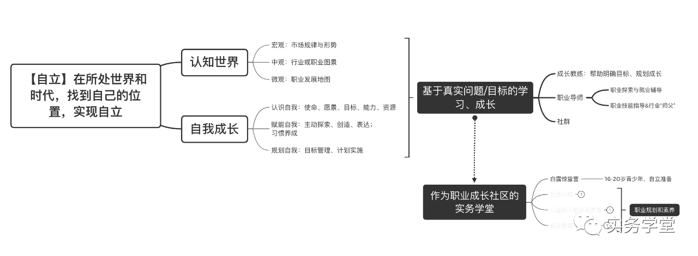

实务学堂做“基于自立的职业教育”。目标是“支持青少年自立”，愿景是：“探索农村青少年职业发展新路径，为好的社会培养珍贵的普通人”。我是它的志愿者。

下图画出了学堂的培养目标。

如图所示，学堂拟培养的学生自立，包括两方面内容：1）认知世界；2）自我成长。其中，认知世界，包括宏观、中观和微观三个层面，以全方位地认知世界；自我成长，包括认识自我，赋能自我，规划自我三个层面，以全方位地打开自我，知行合一，走向世界。

在 5 个月内让一个青少年“自立”起来，很不容易。首先，传统的“听话式”教育、亲人们长期的呵护、与外部世界的交流匮乏、信息隔绝，都带给孩子们各种各样阻碍他们“自立”的恐惧、意识和习惯。“等、靠、要”成为常态。要在短时间内克服这些习惯，养成新的习惯，很难。其次，要让这些孩子走上职业道路，以积极主动的状态去面对工作，也不容易。实务学堂的学生主要是来自农村的青少年，他们在我国注重精英筛选等教育体系中，被边缘化，是落水的孩子。欧阳老师说，很多同学见面的时候，身体都是缩着的。如此，如何带他们走上他们的职业道路，而且还能“积极主动地面对人生”？

为了实现上述目标，学堂采用“基于真实问题/目标的学习和成长”方式，主要包括两部分：

1）成长教练：重塑认知习惯，培养通用素养；

2）职业导师：职业探索与就业辅导，帮助孩子尽早加入真实职场。同时，学堂构建“作为职业成长社区”的实务学堂，通过建立同学们之间、同学与外部世界之间的连接，支持孩子们成为“主动、长期、成长”的职场人才。

具体来说，实务学堂目前在探索一种新的培养方式。下图是学堂的两阶段培养框架图。

如上图所示，学堂对接认可学堂培养理念的教育公益组织、个人、创新教育的关注者和实践者，接受这些被点燃、有自立的心，但在体制教育中不适应，处于劣势的孩子，然后用两个阶段，陪伴他们实现“自立”和“走向职场”的目标。这两个阶段是：
- 6-12 个月的“学堂内学习”（即白露营和惊蛰营），支持青少年“自立”，走上他们本来不敢想象的职业道路，以积极主动的状态去面对人生
- 2 年的“学堂外支持”（即学友社区），继续陪伴这些学生成为“主动、长期、成长”的不同岗位上的熟手，成为“有用的人”。

目前，时长 12 个月的“学堂内培养”已经完成了 1 届，而时长 2 年的“学堂外支持”正在进行中。下面分别介绍两部分的培养过程。

2023 年 8 月，我有机会深入地了解学堂。我首先有幸和深度参与学堂事务的钱老师进行了深入、细致、坦诚的讨论，了解了很多情况。然后，我和欧阳老师聊了很久。她细致地向我介绍了各方面的情况，最后，我来到学堂的校舍，见到了两位认真、真诚的老师、两位已毕业的同学和十几位新入学的同学。我们一起进行了 3 次偏技术一点的讨论（编程思维、推荐系统、ChatGPT），也和各位老师、同学进行了细致的交流。从广州回来之后，我又细致地学习了上一届同学在 5 个月的学堂内学习中学习的课程材料和完成的作品，以及学堂公众号上同学们、老师们、媒体的报道。

下面是我的一些观察。第一节介绍我在和学堂新生和毕业生的交流中对学堂培养效果的观察；第二节和第三节分别介绍“学堂内培养”阶段的“认知习惯和通用素养培养”和“职场对齐”两部分。第四节介绍“学堂外支持”阶段。

 

| [Index](./) | [Previous](5-11-ethic) | [Next](6-1-result)

