2024 年春节，冻雨。我和 Kassy 来到长沙，和吴不不一起，先坐地铁，再坐出租车，来到湖南辛亥革命人物纪念馆。

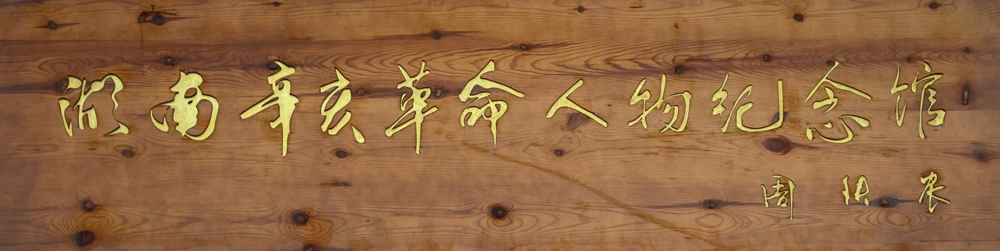 

进门后，迎面是一颗 50 年的大樟树，院子里弥漫着樟树的香味。山茶花盛开。

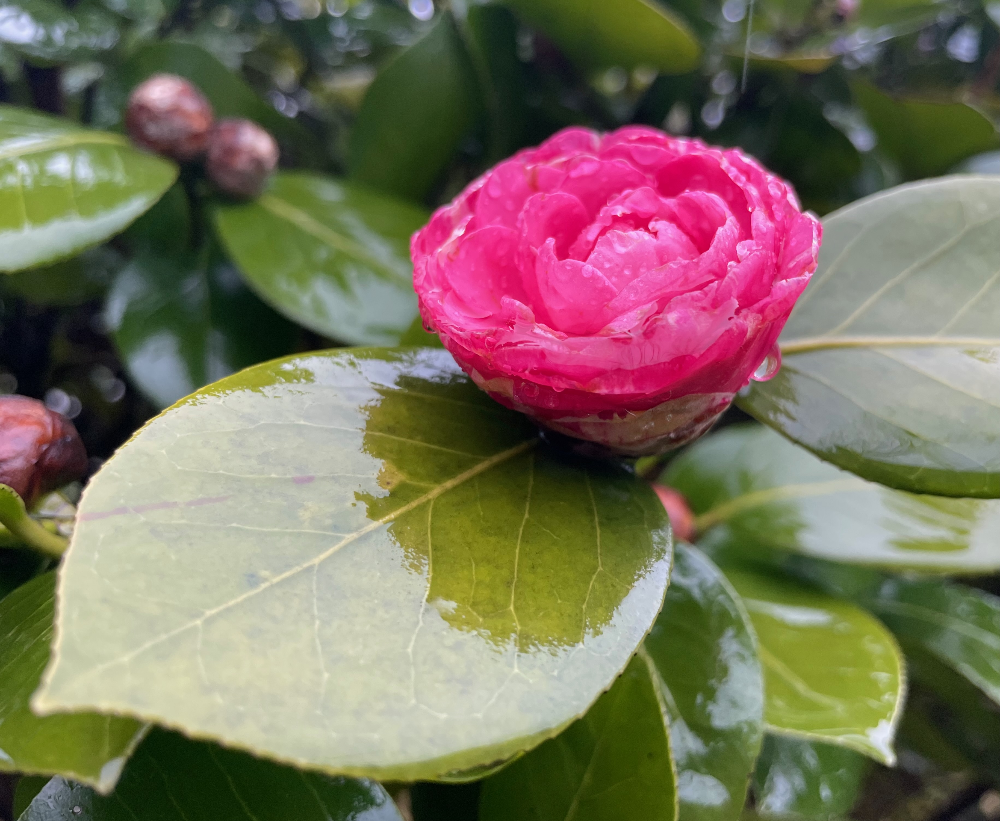 

穿过树林，来到纪念馆前，就看到一面很大的辛亥革命人物浮雕。

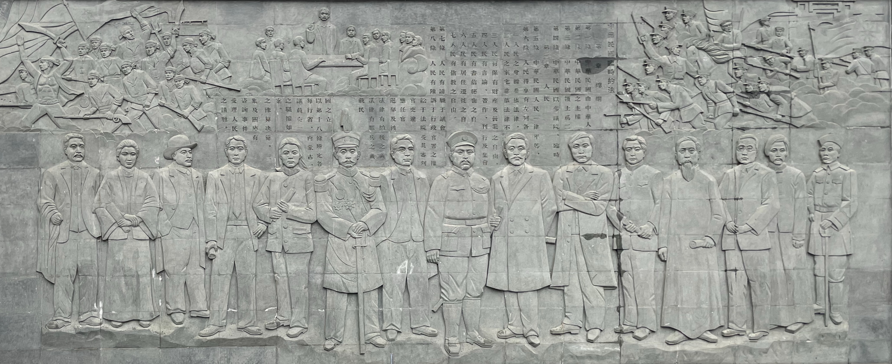 

我在浮雕前辨认雕塑中的人物，Kassy 和不不已经走进了纪念馆。

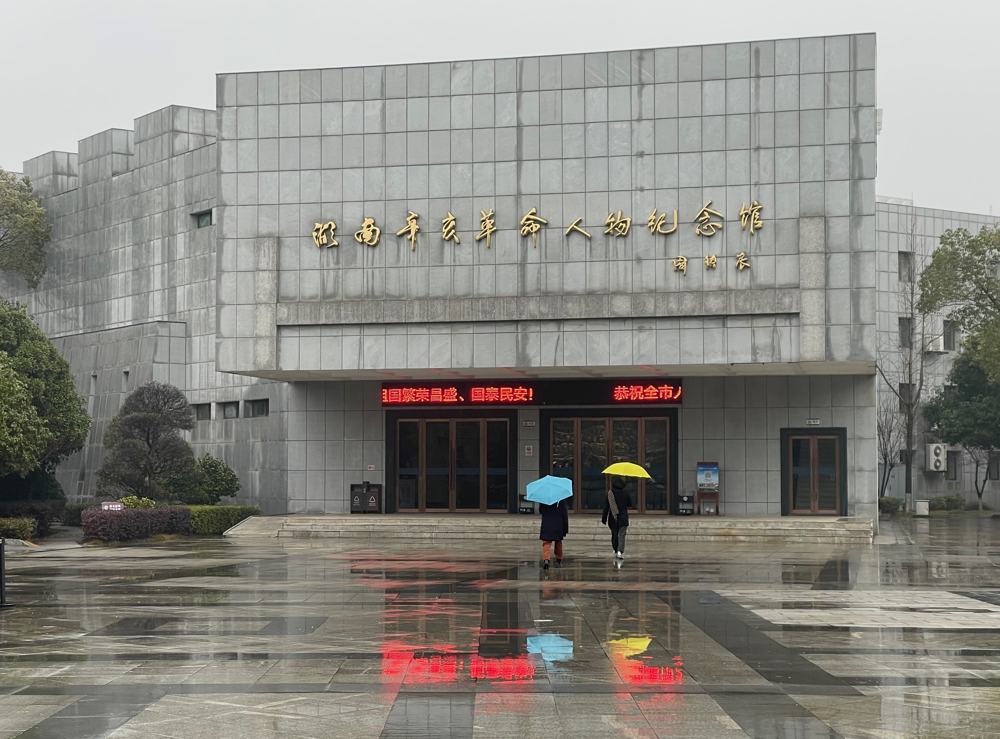 

# 蔡锷

在纪念馆里，我看到蔡锷的陈列，旁边的介绍文字上写的着“热血青年”。

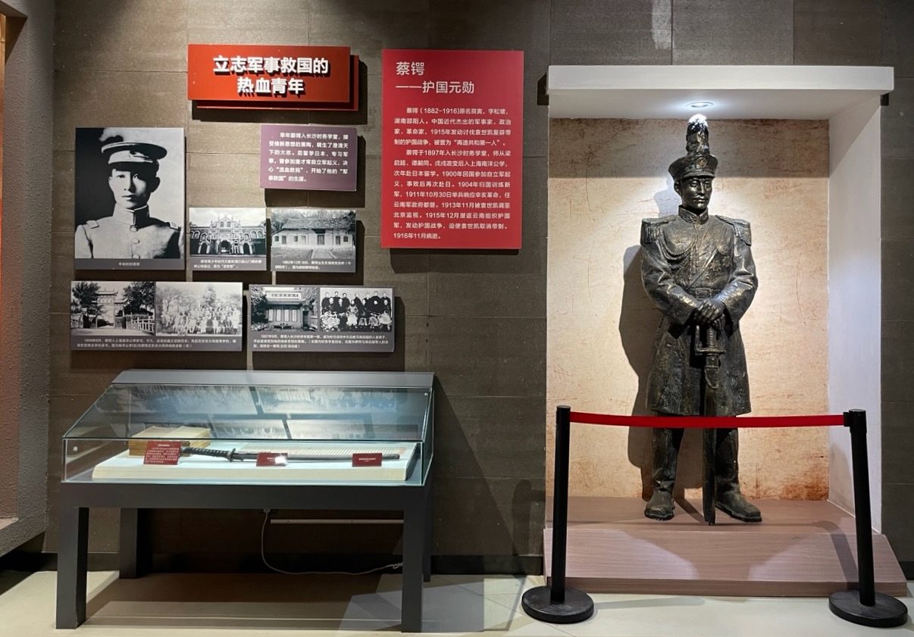 

蔡锷的像：

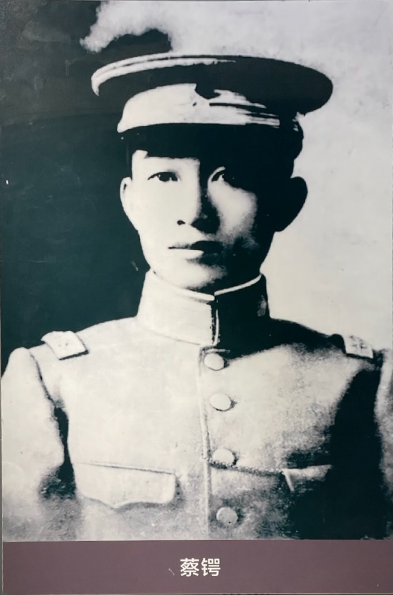 

他的刀、字和书：

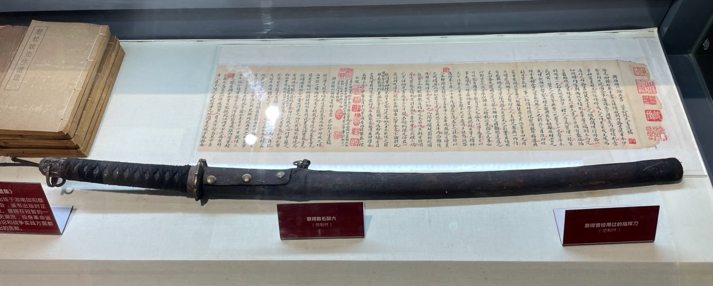 

黑色的指挥刀，是皮质的。

字是两封信。是他初到广西和云南两地时，给在日本的好友石醉三写的两封信。

第一封是他在广西办军校之初写的。

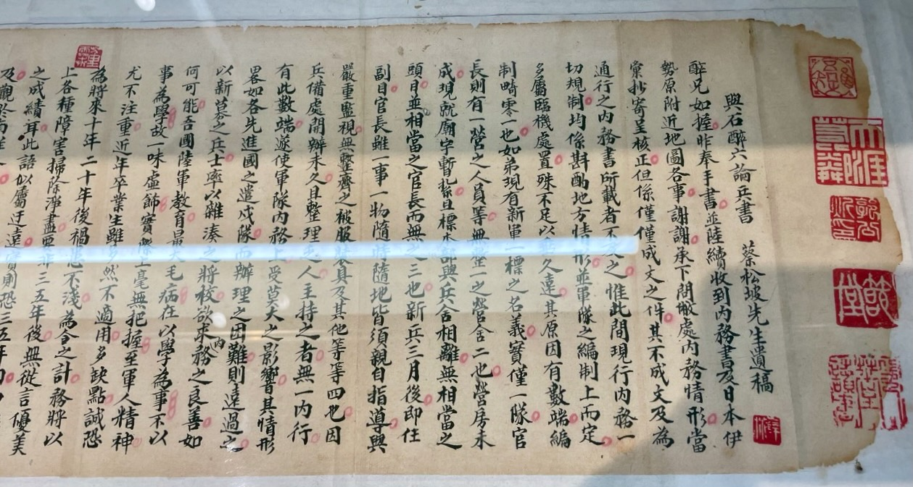

信中，他首先讲述了面临的困难：
- 内务管理的困境：没有营房，主持的人是外行，将校是杂凑起来的；
- 军事教育的现状：虚张声势，不重实务，所以学生在实战中毫无把握；不注重军人精神，毕业的学生有很多缺点。

因此，他非常忧虑：这样学出来的军官，后面会“祸患国家几十年”。

所以，他决心认真规划“将校团”的教育，用 3 到 5 年的时间来扫除上面的问题。实际上，他觉得 3 到 5 年还不够，需要更长的时间。因此，他请好友在日本帮忙收集以下材料：
- 日军“将校团”教育体系的各种材料，包括科目、学习顺序、实施情况；
- 日军培训教程，包括：冬季作业、兵棋、射击、体操、击剑、野外作业等；

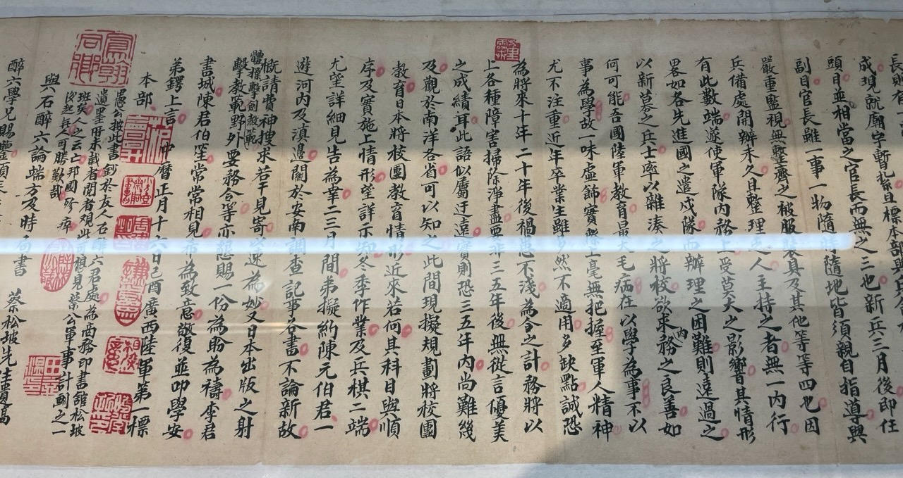

最后，他说下面准备去越南考察，因此请好友也搜集一些日本最新出版的相关资料。

看完了这些，我觉得蔡锷做事非常专业。他非常懂得“研究”，能发现问题，收集资料，进行研究；他也有把事情做成的愿望和办法，有长久的规划，愿意花很长的时间，把事情办好。在我看来，这就是专业。

第二封信是他初到云南给友人的信。

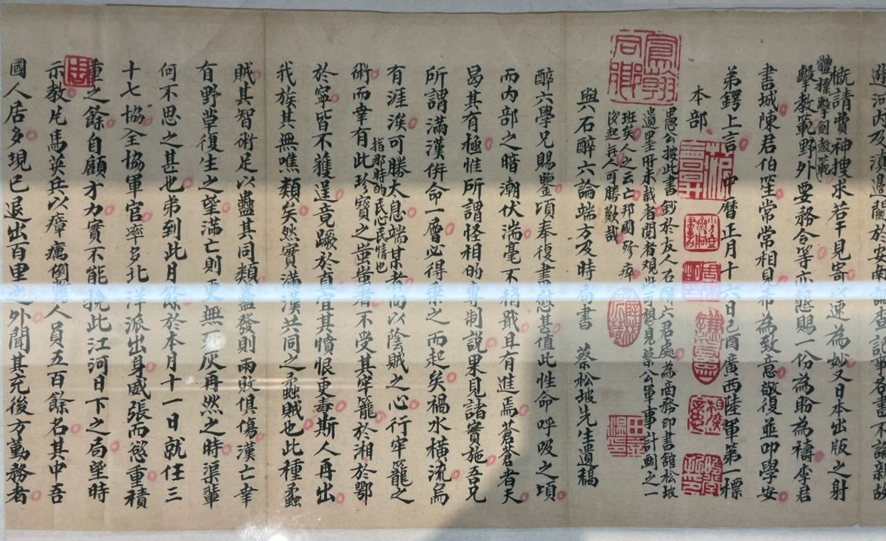

在信中，他讲述了刚到云南，暗潮涌动的云南满汉之间的关系，英军入侵云南的情形。从中可以看出他非常有见识，懂得和满族、英军打交道的办法。

书是厚厚的一沓。

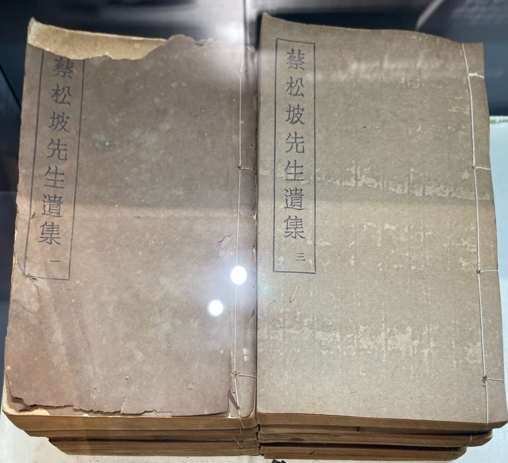 

我好奇：一个军人，为什么会写这么多书？

展览介绍上说：《蔡松坡遗集》，1943 年 10 月出版于湖南邵阳蔡公遗集编印委员会。该书出版时，正逢中日之战，常德会战爆发。

常德会战我是知道的：我们的军人，凭着忠义血性，对日军进行了顽强抗击，保卫了民族。为什么在这个国难当头的时刻，蔡锷已经快 30 年了，大家还记得他？他的这些写作和我们民族的危亡有什么关系？

# 发现

于是我进行了学习，有如下发现：

1. 人们非常佩服他：朱德把他称为自己的“北极星”；他的外语教师对别人说：如果中国人都像蔡锷，就没有什么可以阻挡这个国家了。

2. 他善于谋略和执行，深谙带兵和用兵的办法，对国事、政略、战略都有自己独到的、系统的思考，并且热爱写作，因此，他把自己的这些思考和做事的办法都写了出来了。他写的这些内容，让一百年后的我，深受启发。

3. 他和民国初年主流的四种力量的关系极深，由此带来了一个观察当时各种思潮、力量，理解其复杂诉求和关系的极佳视野和视角。比如蔡锷和梁启超（立宪派）、黄兴（革命派）、袁世凯（北洋）、唐继尧（西南地方势力）这四种主流力量都有极深的交谊。通过蔡锷，我体味到当时这些生命交融产生的强烈冲突和历史美感，非常震撼。

4. 他对民权的信仰、对独裁统治的痛恨和他对自由主义、议院政治在中国现实政治中实现时的变形而存有的犹疑，生动地说明了我们这一代人既想拯救民权，消灭民贼，又想富国强兵、救亡图存，又不想陷入现实派系斗争的旋涡的内在矛盾。他和梁启超所持的“开明专制”梦想的破灭，给我很深的启发。

# 收获

通过跟踪他的生命旅程，我最后学到了以下三方面内容：

- **“志行”**。我发现蔡锷之所以得到人们的尊重，在于他的“志行”，即“立志”和“践行”。正是这两者让他能够以几千人就把一个几亿人大国、几十万军队的首脑掀翻马下。这种审时度势、谋、忍、熬、撑，以及主动出击的能力，非常令人震撼。在他面前，我感到汗颜，知道自己做得太差了。

- **近代中国社会转型的历史教训**：我理解了高华老师在他的《近代中国社会转型的历史教训》总结的蔡锷所处的中国近代的历史教训。这些教训很多，很给我思考。

- **工作习惯的重要性**：蔡锷在无形中也承受了自己隐匿的性格和事必躬亲的习惯的后果：因为长期积劳成疾，作风隐匿，他很早就染上重病，撒手人寰。他用自己的生命告诉我们：要善待自己的身体，要开心。当然，我说出这句话，是知道这是很难做到的。

# 分享

下面，我就分享我的这一探索过程及其发现，分两部分：

1. **革命**。我们回顾蔡锷走出乡间，走进长沙时务学堂；来到日本，进入陆军士官学校；进入广西、云南军界，然后参加辛亥革命的历程，特别品味他在这个过程中留下的文字，理解他如何“立志”，接受自由、民主、人权、共和、三权分立这些理念的，又是如何“践行”，通过为人、做事、治军、管理、建设，试图实现自己的志向的。

2. **护国**。我们来看蔡锷面对袁世凯称帝、民权覆灭的威胁，是如何和梁启超细心谋划，然后带着重病，单枪匹马，逃离北京，绕道日本、越南，进入云南，然后带兵三千，攻入四川，在地理、兵力、装备等各方面都处于劣势的情况下，多次失败，但依旧鼓励军心，顽强坚持，死撑到各省响应，袁世凯不得不取消帝制，黯然下野，暴死皇城的。

这是我在过去一个月里经历的一个精彩的旅程。让我们开始吧。

 

|[Index](./) | [Next](0-4-intro)|
