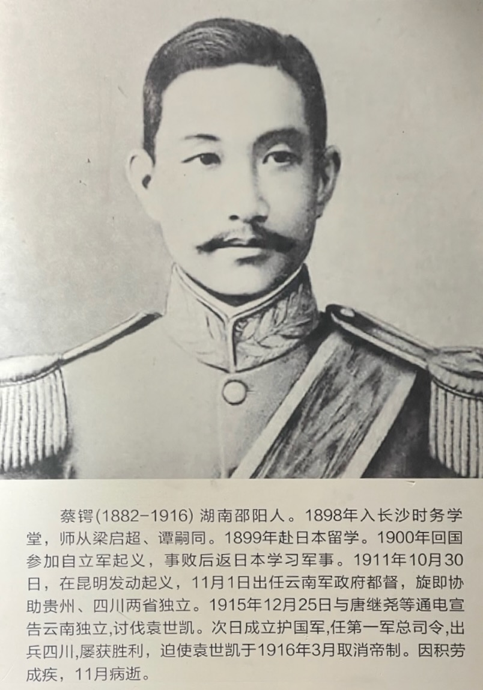

 

蔡锷（1882-1916），原名艮寅，字松坡，湖南邵阳人。中国近代军事家、政治家、革命家，1915 年发动讨伐袁世凯复辟帝制的护国战争，被誉为“再造共和第一人”。

蔡锷 34 岁的一生大致可分为三个阶段：学习、辛亥和护国。

# 学习

蔡锷 13 岁时，进入长沙时务学堂，接受维新思想的熏陶，萌生了澄清天下的大志。后留学日本，专习军事，曾参加唐才常自立军起义，决心“流血救民”，开始了他的“军事救国”的生涯。

- 1897 年入长沙时务学堂，师从梁启超、谭嗣同
- 1899 年，戊戌政变后，赴日本留学
- 1900 年回国参加自立军起义，事败后再次赴日，学习军事
- 1904 年归国训练新军

# 辛亥

1911 年，蔡锷与革命党人李根源等发动新军云南起义，响应辛亥革命，被推为总指挥。云南军政府成立后，任都督，治理云南，并协助贵州、四川两省独立。

- 1911 年春，任云南新军第十九镇三十七协协统
- 1911 年 10 月 30日（辛亥农历九月初九），发动新军云南起义

# 护国

1913 年，蔡锷在北京被袁世凯封为昭威将军，任全国经界局督办等职。袁世凯称帝意图显露后，蔡锷决心武力讨袁，“为四万万人争人格”，逃离京城，取道日本，辗转香港、河内等地，返回云南，通电讨袁，发起讨袁护国战争，直至胜利。

- 1913 年 11 月被袁世凯调至北京
- 1915 年 12 月潜返云南组织护国军，发动护国战争，讨伐袁世凯。任护国军第一军总司令，出兵四川，屡获胜利，迫使袁世凯于 1916 年 3 月取消帝制，并下台
- 1916 年 11 月病逝

 

| [Index](./) | [Previous](0-3-preface) | [Next](1-1-home) |

