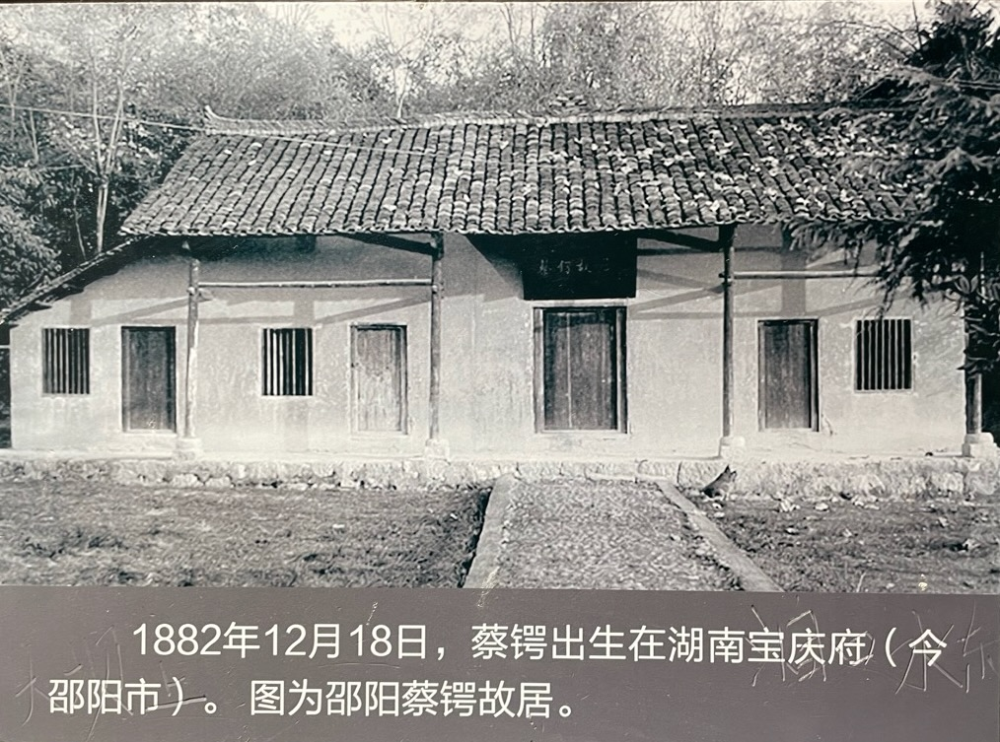
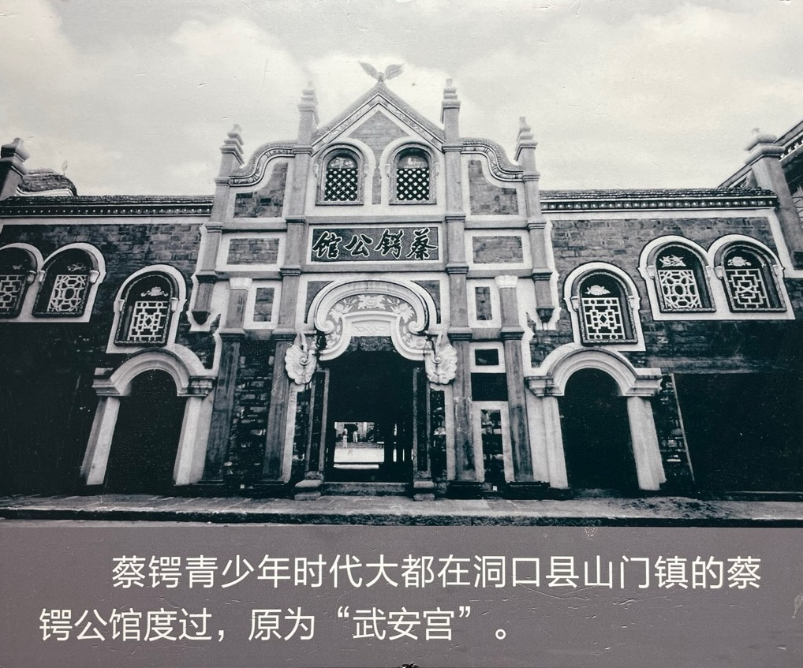

蔡锷的父母都很爱他，重视他的教育。为了生活和方便儿子求学，蔡锷家迁到镇上，做起了酿米酒、打豆腐、送货的生意。

# 母亲

蔡锷的母亲 3 岁时，逃荒，父母迫不得已，将她捆在树上丢弃。被王家老人路过，救下，抚养成人。她勤劳、俭朴、能干，远近闻名。

蔡锷和母亲相依为命，感情十分好。身材瘦小的蔡锷到山上砍柴。母亲看着他看下来的柴，边烧边流泪：“我一面烧火，一面掉眼泪，想着老满（指小儿子）这么小的年龄，就受生活的煎熬。他力气小，砍不动，一根柴火总有五六个、七八个刀口，我烧起来都不忍心。”

蔡锷家也卖饭。挑夫买饭是赊账，等回来后才还饭钱。一天接连过了很多挑夫，把饭都吃完了。晚上，妈妈问蔡锷饿不饿，蔡锷说：米都没了，还饿什么。

蔡锷小时候出门三天，家里给他带了一个咸鸭蛋。一路上只买饭，不买菜，一个咸鸭蛋吃了三天。

蔡锷成名后，母亲住不惯城市，宁愿自己呆在老家，做自己的事。蔡锷请人回乡迎接，她说：“只要他没有忘记我这个老娘就要得了。“她离开北京时对人说：“金窝银窝，不如自家的狗窝。”

蔡锷病危要去日本时，给朋友写信，说想见母亲一面，但未能如愿。

所以蔡锷从小知艰苦、懂感恩。他理解普通老百姓生活的疾苦，懂得感恩普通大众，因为他就是他们中的一员。

# 学习

蔡锷的舅舅樊锥是当地非常有名的维新派人士，对他影响也很大。蔡锷的舅舅樊锥觉得蔡锷可教，就把他带在自己身边，免费教他。樊锥学识渊博，思想激进，在邵阳很有名气。除了教他先秦诸子，老子，韩非子，也教他改革时弊的维新思想，还教他要有品德。

蒋百里后来回忆说：公少颖异常，衣布袍，手老子道德经，且诵且行于途。

# 故居

蔡锷去世后，家乡人民在他幼时启蒙私塾建立松坡学校，将其生活过的小巷命名为松坡街，又筹资将蔡家住过的武安宫改建为蔡锷公馆，以示永久纪念。

 

| [Index](./) | [Previous](0-4-intro) | [Next](1-3-school) |

