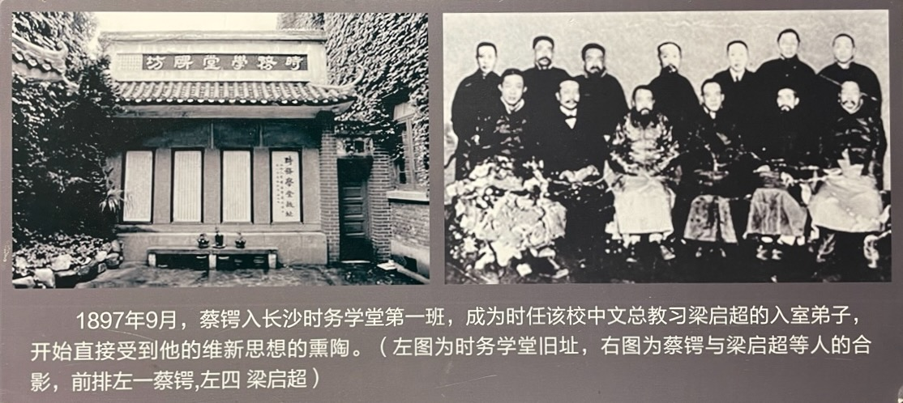
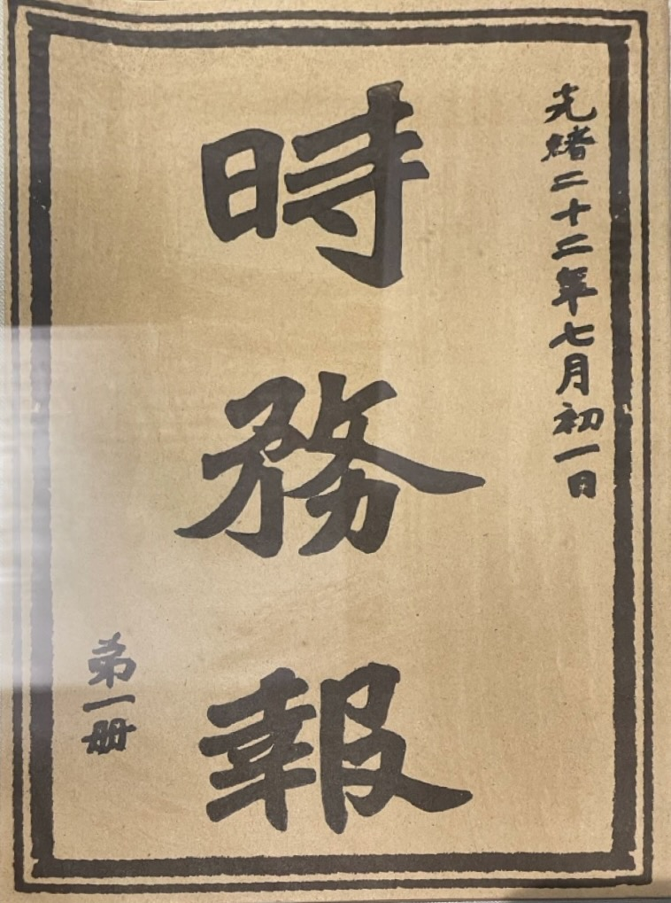
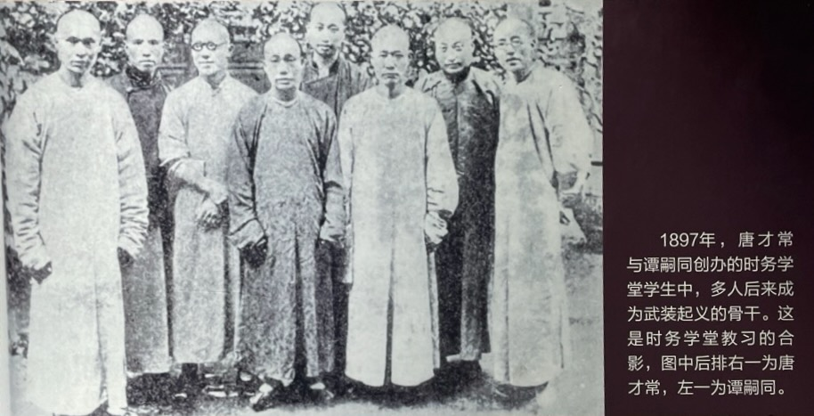
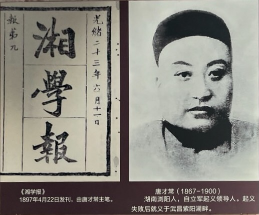
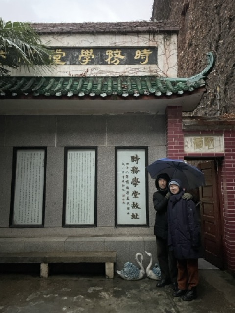

14 岁，蔡锷考入长沙时务学堂。时务学堂是湖南维新运动的一部分。

# 湖南维新运动

湖南当时走在全国维新变法的前列。“公车上书”后，维新变法呼声高涨。湖南巡抚陈宝箴和他周围的一些官员，如按察使黄遵宪、督学江标、继任督学徐仁铸，以及谭嗣同、唐才常等在湖南推动维新变法。

陈宝箴推动维新是湖南建设的需要。谭嗣同在《上江标学院》书中说得很明确，“为今日湖南计，非开矿无以裕商源，非制器无以饬军政，而开矿、制器诸事，随在与算学相资，故兴算一节，非当世之远模，抑亦湘省之亟务”。他的这一看法与湖南地方官吏陈宝箴，江标等人不谋而合。甲午战争前后，湖南天灾人祸不断，社会财富主要集中在立有殊勋的湘军将领家族手中。连年的反洋教、拒洋务，更是社会动荡不安，水旱灾害，使湖南粮价飞涨，战后赔款，湖南每年要负担70万两，湖南财政更是雪上加霜，而要举行新政，更是处处需款，因此，开辟财源就成了新任湖南巡抚陈宝箴的当务之急。他首先推行的新政措施就是兴办近代工商实业，他的这一措施获得了湖南绅士的广泛支持。湖南绅士刘镇、张通典、邹代钧、朱昌琳等积极投身于湖南的矿业建设；谭嗣同、熊希龄、王先谦、蒋德钧等绅士则投身于内河航运业和争取粤汉铁路从湖南经过的活动；绅士王先谦、张祖同、熊希龄、刘国泰、杨巩等投资于近代的制造业。“由于外患的刺激，湖南官绅力图挽回利权、富国强兵，对兴办工商实业表现出了极大的热情，使素以仇视洋务出名的湖南风气渐开”。

因此，时务学堂刚开始的目标是发展实业。学堂的章程中规定，课程中西并重，毕业后能够进入新式工厂、企业，能出洋留学。为此，要求“通古今、达中外”，兼讲中西之学。这其实也是谭嗣同他们刚开始的理想。后面看到蔡锷每次提到要退隐，就说要去办矿，说明他心里也一直惦记着这一技术路线。

后来，时务学堂的目标转向维新运动。随着熊希龄的主持，黄遵宪、徐仁铸、梁启超的到来，时务学堂开始转向维新运动。熊希龄改变了学校的宗旨，邀请维新派的谭嗣同、黄遵宪参加。黄遵宪是新任湖南按察使。他说湖南官员中唯一亲身到过日本、欧洲、美国的，因此眼界最开阔，思想最新。

黄遵宪、谭嗣同、熊希龄从北京《时务报》请来了梁启超、李维格，分别任中文和西文总教习。《时务报》是黄遵宪创立的。

在梁启超的坚持下，学堂然后确定了“由总教习自主聘任分教习”的原则。梁启超根据自己知道的万木草堂、两湖书院等学校开办的经验，和熊希龄等人反复沟通，说服了大家同意“由总教习自主聘任分教习”的原则。他的理由是：这样能够防止总教习和分教习的分歧、观念差别太大，影响教学质量。最终，熊希龄为提调（校长），谭嗣同为学堂总监，唐才常等分任讲席。

# 学报、学堂和学会

湖南维新运动有三个教育的阵地：学报、学堂和学会。

学报是《湘学报》。1897 年 4 月，江标、唐才常等人创办《湘学新报》（后改名《湘学报》），面向民众，宣传维新变法。

学堂是时务学堂。1897 年 10 月，陈宝箴、黄遵宪、江标创办湖南时务学堂，培养维新人才。

时务学堂的目标是“开民智”。由梁启超起草的开学宣言中，学堂说明自己的重要任务是：“用可用之士气，开未开之民智。”蔡锷认同“开民智”的方法。他在《秦始皇功罪论》中说：秦始皇“不智民，而愚民而已”，这是秦始皇的一大过错。除了时务学堂外，梁还要求“全省书院官课、师课，改课时务”。

学堂和学报关系密切。教习唐才常先任《湘学报》和《湘报》主笔，时务学堂不少师生则成为这些报刊的热心作者；蒋德钧、梁启超、李维格、谭嗣同、邹代钧、唐才常、熊希龄等兼任《湘报》董事，《湘报馆章程》并明确宣称：“本报与学堂、学会联为一气。”

学会的目标是培养为民众争民权的议员。在时务学堂期间，梁启超写信给湖南巡抚陈宝箴，提出湖南应办之事：今之策中国者，必曰兴民权。兴民权，斯固然矣，然民权非可以旦夕而成也。权者生于智也。

具体来说，梁启超提出“开绅智”和“开官智”。“开绅智”即兴办“南学会”。“开官智”即开办“课吏堂”，对官员进行培训，类似于现在的“政治学院”。

“南学会”的目标是培养“议员”，具体方法是：“通上下之情”，“先由学会绅董，各举所知品行端方、才识开敏之绅士”，“日日读书，日日治事”，“一年之后，会中人可任为议员者过半矣”。梁启超说：欲兴民权，宜先兴绅权，欲兴绅权，宜以学会为之起点……今欲更新百度，必自通上下之情始；欲通上下之情，则必当复古意，采西法，重乡权矣。然亦有二虑焉：一曰虑其不能任事，二曰虑其藉此舞文也。欲救前弊，则宜开绅智；欲救后弊，则宜定权限。定权限者何？西人议事与行事分而为二：议事之人，有定章之权，而无办理之权；行事之人，有办理之权，而无定章之权。将办一事，则议员集而议其可否，既可，乃议其章程，章程草定，付有司行之，有司不能擅易也。若行之而有窒碍者，则以告于议员，议而改之。西人之法度，所以无时不改，每改一次，则法益密，而其于民益便，盖以议事者为民间所举之人也……今中国绅士，使以办公事，有时不如官之为愈也。何也？凡用绅士者，以其于民间情形熟悉，可以通上下之气而已。今其无学无智，既与官等，而情伪不如官之周知，然则用之何为也？故欲用绅士，必先教绅士。教之惟何？惟一归之学会而已。先由学会绅董，各举所知品行端方、才识开敏之绅士，每州县各数人，咸集省中，入南学会。会中广集书籍图器，定有讲期，定有功课，长官时时临莅以鼓励之；多延通人，为之会长，发明中国危亡之故，西方强盛之由，考政治之本原，讲办事之条理。或得有电报，奉有部文，非极秘密者，则交与会中，俾学习议事。一切新政将举办者，悉交会中，议其可办与否，次议其办法，次议其筹款之法，次议其用人之法。日日读书，日日治事，一年之后，会中人可任为议员者过半矣。此等会友，亦一年后，除酌留为总会议员外，即可分别遣散，归为各州县分会之议员。复另选新班在总会学习。

梁启超、谭词同的计划是：培养了议员之后，陈宝箴让权于绅，实现乡绅自治，以达民主政治。他说：绅智既开，权限亦定，人人皆知危亡之故，即人人各思自保之道，合全省人之聪明才力，而处心积虑，千方百计，以求办一省之事，除一省之害，捍一省之难，未有不能济者也。

这个计划并没有得到实行。陈宝箴仅仅将南学会作为一个书院，希望能够改变保守的时代风气，比如不要打洋人；而左宗棠的评价是：平等、平权，一万年做不到，一味呓语。

梁启超流亡日本后作《戊戌政变记》中回顾了这段谋划：及陈宝箴为湖南巡抚，其子陈三立佐之，黄遵宪为湖南按察使，江标任满，徐仁铸继之为学政，聘梁启超为湖南时务学堂总教习，与本省绅士谭嗣同、熊希龄等相应和，专以提倡实学，唤起士论，完成地方自治政体为主义。今将去年十二月梁启超上陈宝箴一书《论湖南应办之事》者录于下……此书即为湖南办事之起点，后此湖南一切事，皆依此书次第行之，而南学会尤为全省新政之命脉，虽名为学会，实兼地方议会之规模。先由巡抚派选本地绅士十人为总会长，继由此十人各举所知，展转汲引，以为会员。每州县皆必有会员三人至十人之数，选各州县好义爱国之人为之。会中每七日一演说，巡抚、学政率官吏临会，黄遵宪、谭嗣同、梁启超及学长□□□等轮流演说中外大势、政治原理、行政学等，欲以激发保教爱国之热心，养成地方自治之气力。将以半年之后，选会官（员）之高等，留为省会之会员，其次者则散归各州县，为一州一县之分会员……当时所办各事，南学会实隐寓众议院之规模，课吏堂实隐寓贵族院之规模，新政局实隐寓中央政府之规模。巡抚陈宝箴、按察使黄遵宪皆务分权于绅士，如慈母之煦覆其赤子焉。各国民政之起，大率由民与官争权，民出死力以争之，官出死力以圧之。若湖南之事势则全与此相反。陈、黄两公本自有无限之权，而务欲让之于民。民不知其自当有权，而官乃费尽心力以导之。此其盛德，殆并世所希矣。

梁启超希望通过学报、学堂、学会，改良中国政治、经济和社会，实现他的老师康有为向往的《礼运篇》中的“大同”：大道之行也，天下为公，选贤与能，讲信修睦。故人不独亲其亲，不独子其子，使老有所终，壮有所用，幼有所长，矜寡孤独废疾者，皆有所养；男有分，女有归；货恶其弃于地也，不必藏于己；力恶其不出于身也，不必为己。是故谋闭而不兴，盗窃乱贼而不作，故户外而不闭，是谓大同。

# 风波

时务学堂的教育活动一旦展开，学生的思想就非常开放，以致不容于湖南的地方守旧势力。因为鼓励学生问问题，年轻学生什么都敢想，老师也是当时中国思想最开放的一批人，所以他们最终形成的思想，内容就非常多样化了，比如去跪拜、变服饰、兴民权、开议院，甚至有对《扬州十日记》这样的禁书的讨论，在当时引起相当大的舆情。为此，陈宝箴也不得不介入，更换了熊希龄和三位中文教习，任命黄遵宪主持学校。

需要注意的是：反对时务学堂的人士并不反对学习西方技术，而是不能触及君主制度、中国传统的孔教和封建道统。比如保守派中的王先谦本身就是与郭嵩焘谈洋务的知音，也是创办和丰火柴公司、宝善成机器公司，兴办湖南矿务局、创设湘轮以及兴办时务学堂等湖南新政初期许多新政机构的积极参与者。他还撰文抨击旧科举制度，改革岳麓书院课程，增加算学、译书等新科目，并购买宣传维新变法新思想的《时务报》，供岳麓书院学生阅读。他说：“盖所谓西学者，今日地球大通，各国往来，朝廷不能不讲译学。西人以工商立国，用其货物，朘我脂膏。我不能禁彼物使不来，又不能禁吾民使不购，则必讲求工艺以抵制之，中国机庶可转。故声光化电及一切制造矿学，皆当开通风气，力造行之，未为过也；绅士和之，未为过也。故从前火柴机器各公司，先谦与闻其事，确系中心之诚，以为应办；至今并无他说”。

所以这些反对学堂的始终不承认自己是守旧派的代表。他们甚至还主动地把自己的爱徒送往时务学堂学习。他们反对的是维新派的民权、平等学说，因为儒家千年的教育是有三纲五常的。

# 解散

对学堂更严重的打击在戊戌政变。戊戌政变前一天，就是 9 月 20 日，70 名学堂考取留学日本的学生的留学资格被取消。21 日，戊戌政变发生，学堂老师谭嗣同喋血菜市口，学堂中文总教习梁启超流亡海外。随之而来的是湖南维新派人物被全部清洗：陈宝箴、陈三立、江标、熊希龄、徐仁铸被革职，永不叙用；黄遵宪被开除；学堂被改名，迁址。学生全部离开。

学堂随之改名，被改为求实书院，后与岳麓书院合并为湖南高等学堂，成为湖南大学的前身之一。

时务学堂存在了仅 9 个月，但对湖南的教育和文化变革影响颇大。它改变了传统的教育内容和教学模式，引进了变革文化和民主、民权观念，激发了学子们对“仁义相兼”的太平盛世的渴望，开阔了学生们的文化视野，引发了他们对现实问题的思考，使他们从愚昧和盲从中得到了解放，“湘中诸学子经此启发，风气为之一变”。

# 旧址

1938年，时务学堂毁于“文夕大火”。

抗战胜利后，著名实业家陈云章先生购买三贵街地皮，在时务学堂废址上盖起住宅“天倪庐”，并立“时务学堂故址”牌坊，今为长沙市文物保护单位。现在，走进旧址，还能看到梁启超 1922 年手书的“时务学堂旧址”。然后是学生李肖聃的题记、李况松的跋、陈云章的补记依次排列，四块碑石连成一排。

该旧址只是学堂的一小部分。包括天倪庐在内到连升街，往前一直到小东街(现在的中山路)以前都是时务学堂范围，面积大概是四五亩。

2024 年 2 月 5 日，我们在旧址的合影：

 

| [Index](./) | [Previous](1-1-home) | [Next](1-5-learn) |

