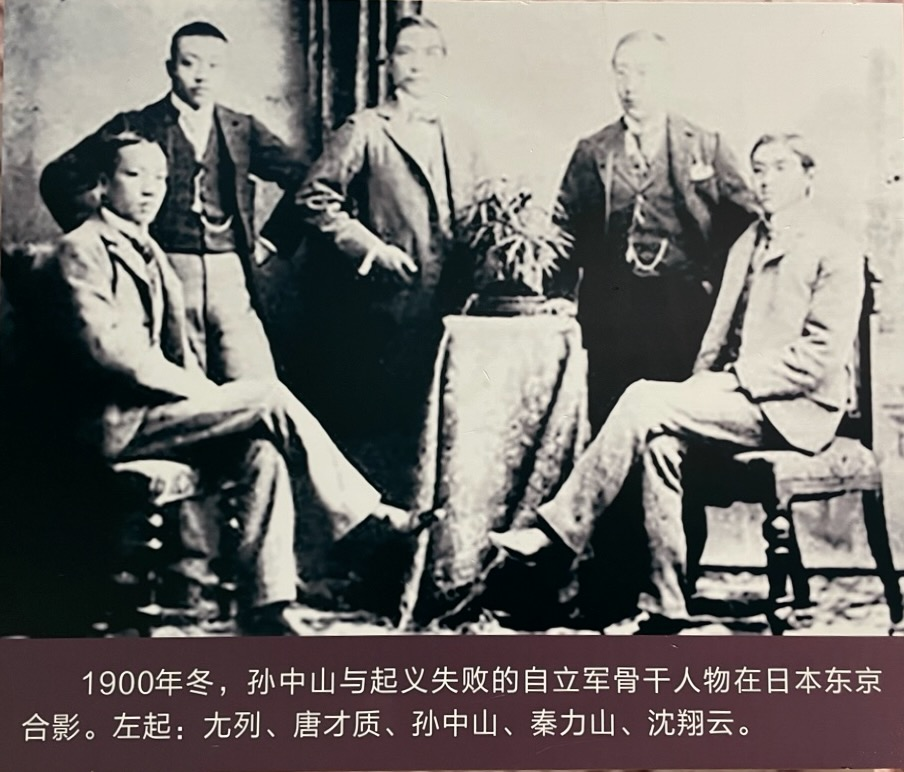

基于《孟子》和《春秋》，蔡锷和老师、同学们也讨论了当时中国之现状和个人应对方法。

# 中国之现状

蔡锷的同学唐才质思考了中国当时的状况，认为中国处在“无政、无事、无学、无权、无力、无公法”的乱世当中。他在札记中写道：有权力之世界，有公法之世界。孟子曰：以力服人者，此权力之世界也；以德服人者，此公法之世界也。故仁者能处公法世界，智者能处权力世界。如汤与文王者，公法世界之人也。大王与勾践者，权力世界之人也。方今泰西各国，以俄国为权力之世界，美国为公法之世界。惟中国则几至于无政、无事、无学、无权、无力、无公法之世界，而未知所底，岂不痛哉。

对此，梁启超回复说：仁者能造成公法世界，智者能造成权力世界，所论两种世界，极通。权力世界亦有两等，一据乱之权力，二升平之权力。公法世界亦有两等，一升平之公法，二太平之公法。今俄国之权力近于升平矣，美国之公法亦不过升平而已。故吾尝谓今日乃升平之运也。

唐才质后来也一直活跃在革命的舞台上。下面是他和孙中山等人的合影：

# 力

那么，面对这样一个乱世，个人该如何应对？

梁启超指出：“据乱世以力胜，太平世以智胜”。梁启超在《学校总论》一篇中倡言：吾闻之，《春秋》三世之义，据乱世以力胜，升平世智、力互相胜，太平世以智胜……世界之运，由乱而进于平；胜败之原，由力而趋于智。故言自强于今日，以开民智为第一义。梁启超也说：性有三义：据乱世之民，性恶；升平世，有善有恶；太平世，性善。所以，对待乱世的恶人，只能以力。

“据乱世以力胜”的观念当时非常普及，导致去日本的留学生主要是学习军事。蔡锷后来也选择了学习军事。他看得自己的老师和同学因为革命而牺牲后，毅然决定转学军事。同样的，黄兴到了日本后，虽然学的是师范，但也花了很多时间学习军事。而现在，很多人心里也还信仰着“力”的作用，这反映了人们对目前的社会状态的基本判断。

# 法

在大家都选择“力”时，宋教仁却选择了“法”，显示出他独到的见解。宋教仁到了日本后，也先学习了一段军事，然后就转向了学习政治和法律。此后，黄兴他们带兵在全国各地不断起义，他就在旅馆里写作各种革命后要颁布的法律、制度，在起义成功后，拎着装有他写好的各种法律制度，到现场去颁布，非常精彩。比如辛亥革命后颁布的《中华民国临时约法》就是他的手笔。

为什么梁启超能够提出来“据乱世以力胜，太平世以智胜”，却忘了“法”呢？这是梁启超就学于康有为所不能学到的。等梁启超到了日本后，学习了西方的法治观念，也就理解了。

蔡锷后来在日本也认真地学习法，写作了《国际公法》的著作。他的学习方法，就是写作。

# 侠

除了“力”，还有“侠”。“侠”是一种路见不平，拔刀相助的精神。面对现实，蔡锷痛感“侠义”的丧失，在另一条札记中，大发感慨地说：“宋万弑其君，闵公自取之也。孟子曰：‘君之视臣如草芥，则臣视君如寇仇。’可以痛警据乱之世矣。”又说：“曹沫片语，而复汶阳之田，千古之大侠也。我四十不动心，孟子之侠也。一心侠，一气侠，至今其种无一存也，以致外人欺伺。其患皆成于诸臣昏庸残暴者鞭笞之，束缚之也。请论学时，此条万不可不先及之。不然，再阅百年，则黄种成豕马，成木石，听人舞弄而不知矣。”

梁启超对此非常赞同，并期望蔡锷他们学有所成，行侠仗义。他回复道：“今日已为豕马、木石矣，有待百年？吾辈日日以此呼号于众，而一二人之口犹无济也，愿诸君之学速成，更学辩才，以发其热肠，则此义或不可绝于天壤也。”

蔡锷后来的“为四万万人争人格”，也就是一种侠义的体现，因此赢得了人民的尊重。

# 让

在对待名利上，蔡锷此时已经学会了“让”。他在札记中写道：“外小事不书，何以书宋之渴葬？闵贤君之葬不得时也。何以贤？以其能让国也。故《春秋》极重不在争。”

梁启超批道：“此是大义。能让国者十世犹将宥之。”

蔡锷的“让”，来自孟子。孟子说：“利而国危”。《孟子》的第一句：“孟子见梁惠王，王曰：‘叟，不远千里而来，亦将有以利吾国乎？’”孟子由此讲了“利而国危”的道理，提出了著名的论断：“未有仁而遗其亲，未有义而后其君者也。王亦曰‘仁义’而已矣，何必曰‘利’！”“天下不收其利”一语，典出于《孟子·尽心》：“墨子兼爱，摩顶放踵利天下，为之。”梁启超撰《读〈孟子〉界说》，其第五义是“‘仁义’二字为孟子一切学问宗旨”；其第七义是：“孟子言‘无义战’为大同之起点。”梁对墨子的“兼爱”思想也一直很赞赏。

后来的一生中，面对各种利益、权力，蔡锷真的就没有争过。这是他后来得到一致赞誉的重要原因。他在护国战争前夕说的“成功就下野，绝不争地盘”就是这一思想的体现。这样他才能团结所有人。

# 隐

在行事方式上，蔡锷学会了隐：做事不求闻达。他引用曾国藩的活：“君子欲有所树立，必自不妄求人知始”。这句话的意思是：一个有志向的人想要有所成就和立足，就必须从不刻意寻求他人的了解和认可开始。意思是，真正的君子在立业和做人上，不会一开始就到处炫耀或寻求他人的赞赏，而是脚踏实地，专注于自己的目标和行为，以实际行动来证明自己。

蔡锷发表文章时，从不用真名。比如他发表的军国民篇，他就坚决不承认是自己写的。此后，蔡锷给黄兴、杨笃生创办的《湖南游学译编》投稿，就用的“湖南留学生”的名字。而他写作的云南方面的文章，也都是匿名。

章士钊很理解蔡锷为什么要隐。他说：蔡锷志存颠复，迹求隐晦，平日谨言词，慎交游。常恐以意外之疏忽，而招来本事之损害。他习陆军，规久远，以攫取清廷兵权为第一步，不可使满族俊才如良弼等嫉妒陷害，故行动尤其矜慎。

隐也提高了蔡锷的学习和工作效率。他一旦认准了要做的事，就一心把这个事做好了就行，其它的越简单越好。这样可以最大限度地节约时间，减少干扰。这也是他日常公务繁忙，但是还能如此大量地思考和写作的原因。

但蔡锷的隐并不是不说：他一直写作，发表文章，虽然匿名；也不是不做，而是“时机不到做不得，时机一到一定支持”。所以他的隐是一种策略，因为兵法需要虚虚实实，出奇制胜。

# 诚

在待人处事上，蔡锷学会了“诚”。他不做表面工作，迎合大众，而是保持真诚和正义感。他不愿做孔子称为“乡愿”的那种人。“乡愿”这个词语出自《论语·阳货》，意为表面上行为符合传统美德，但内心虚伪、讨好他人、不具真实道德操守的人。孔子对此非常反感，认为他们损害了真正的道德，称他们为“德之贼”。

因此，蔡锷后来能够得到了几乎所有人的信任，知道他是以诚待人的。

# 小结

蔡锷从《孟子》《春秋》中悟到的这些，因为是他自己思考得来的，所以就真的深入了他的内心，成为了他后来一生的准则。这说明时务学堂的教育方法是有效的。蔡锷后来又把这些都总结到了自己整理的《曾胡治兵语录》中。我们后面会更细致地讨论。

 

| [Index](./) | [Previous](1-7-politic) | [Next](1-9-student) |
