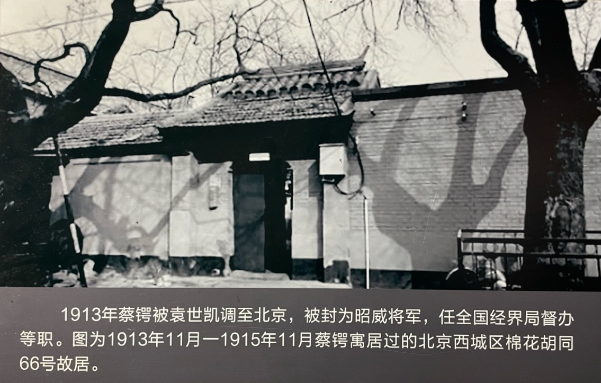
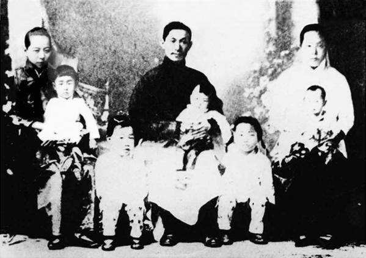

10 月 4 日，蔡锷到达北京。

到北京之前，蔡锷有希望去湖南，却被袁世凯阻止。进步党的熊希龄组阁期间，熊希龄很想将蔡锷由云南调去湖南。蔡锷是湖南人，因此也想去湖南。湖南人也很欢迎蔡锷。对此，袁世凯表面上同意，但实际上鼓动段祺瑞反对，要求他把湖南放在北洋军队控制之下，而把湖南原有的军队消灭。最后湖南被袁世凯信任的汤芗铭带着北洋军队蹂躏了两年多。

在北京，袁世凯对蔡锷委以重任。蔡锷先后被委任为陆军部编译处副总裁、政治会议议员、参政院参政。6 月，加昭威将军名号。7 月，任陆海军大元帅统率办事处办事员。12 月，被任命为全国经界局督办。袁世凯也想过任蔡锷军事方面的职务，以约束段祺瑞的权力，但被段祺瑞强烈反对，此外也还是顾忌能够完全掌控蔡锷，所以最后还是没有实行。

袁世凯也给蔡锷非常丰厚的待遇。他给蔡锷安排了很多兼职，每份兼职都有工资，因此蔡锷每个月就能领到几千元的工资。相比较而言，蔡锷在云南每个月才 60 元，可是蔡锷像宋教仁那样，不要这么多钱。他选择了其中工资最低的一个职务，每天按时去上班，然后就领这个职务的工资。虽然他去上班的时候，同事提醒他：你不来也没事，但是他还是坚持每天出勤。

在北京期间，蔡锷一方面保持生活简朴，学习，写作，另一方面继续发现人才，扩展社会网络。

# 生活简朴

蔡锷对于享受生活，毫无概念。蒋百里回忆说：公以廉洁自持，而急朋友之难，则慨然无所惜。初入京，有为赁屋于某氏，一寻常邸宅也，而惊其华，且笑指仪门曰：可以八字题之曰:养尊处优，藏垢纳污也。既而郁郁，亦委随流俗，不岸然以立异。下面是蔡锷住过的北京西城区棉花胡同 66 号现在的样子。

蔡锷勤俭的习惯，是从小就养成的。梁启超回忆说：蔡公生平未尝受过自己私受快乐。且蔡公之吃食从未讲究甘美，但求清洁而能下咽无碍，衣服亦只图不裸体，破粗不拘，生平未尝受过丝毫之奢华。蔡公自十五岁就从湖南出来，求学无资，向亲戚告贷。到汉口、东京寻我，湖南长沙出来只借得二毛钱，到了汉又借亲戚洋六元，由汉到京，袁项城借给他洋一千元，到东后以三百元为学费，其余均为交友及公益之用，而自己出来则步行，未尝坐过车子。

下面是蔡锷全家福，1915 年摄于北京。居中者蔡锷，怀抱长子蔡端生。左侧为如夫人潘蕙英，怀抱三女蔡淑莲。右侧为夫人刘侠贞，怀抱四小女。前排为长女蔡铸莲、次女蔡福莲。

# 学习、下棋、写作

蔡锷利用这段稍微空闲一点的时间，学习外语、法律、政治，并且写作。人们回忆说：蔡锷入京就参政之职，寓石驸马大街。常聘美国人至寓，教授英文、法政诸学。日有定程，暇则围棋，精思妙著，眉色飞舞。观其作势，已知其娴韬略，而善战伐矣。

蔡锷的英文老师很佩服他。蒋百里回忆说：英人有教学于北京者，高举其拇(指)以告生徒曰: 若蔡公者，当今第一。

他还惦记着早年在广西起草的《军事计划》一书。对该书进行了修订，然后交给袁世凯，作为国防计划的纲要。

# 发现和陶冶人才

像他在《曾胡治兵语录》中说的那样，蔡锷非常注意发现和陶冶人才。他不仅自己注意发现和陶冶人才，也要求自己的部下这么做。在准备护国战争的过程中，他给自己的学生，驻四川泸州的川军旅长雷飚说：“兄在川治军，须处处留心人才，为将来国家用。凡各军队官长尤应时刻留心，与之团结一致，毋忘。”

一旦发现了他认为的人才，他就像自己在《曾胡治兵语录》中说的那样，像对待自己的孩子那样关注他们，帮助他们，希望他们走正道，有发展。蒋百里回忆说：公以廉洁自持，而急朋友之难，则慨然无所惜。

后人回忆说：公爱才如命，随处留心。吾县龚君铁铮，深沉宁静，大蒙奖借。三年冬，为亟筹千元，先容与滇省某公，促其经营矿业，惜龚以他故作罢。迄去冬滇黔事起，即连致三缄，嘱其在湘省响应。龚故以攻督署死，论者谓不负公特达之知焉。然亦足以见公之照好熟计，殆预料有讨袁之一日也。伟矣哉。

# 扩展社会网络

蔡锷又像自己在日本时那样，建立自己的社会网络。比如，他邀集留日士官同学蒋方震、阎锡山、张绍曾等 11 人组织军事研究会，研讨战略战术。他和北洋的人物也有广泛的联系。这些网络让他能够对北京乃至全国的形势形成自己独特的判断，最后下决心发动护国战争，武装反袁。

 

| [Index](./) | [Previous](9-5-jinbu) | [Next](11-2-politics) |
