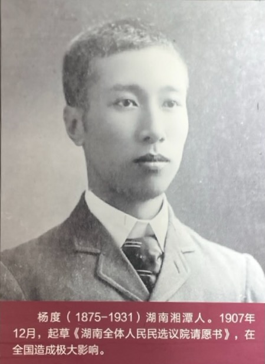
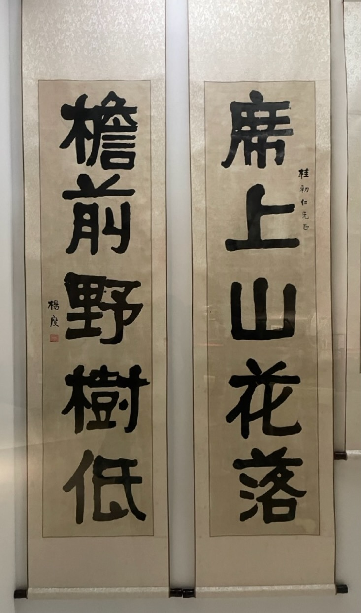

如果说蔡锷领导昆明重九起义，是顺势而为，那么，蔡锷面对袁世凯称帝、共和覆灭，和梁启超细心谋划，然后带病逃离北京，绕道日本、越南，进入云南，然后带兵三千，攻入四川，在地理、兵力、装备等各方面都处于劣势的情况下，多次进攻无果，困难重重，但依旧鼓励军心，顽强进攻，最终撑到各省响应，袁世凯取消帝制，黯然下野，暴死皇城，就不能不承认，这是他一手创造的奇迹了。

我们下面就来体会蔡锷的这一路旅程。

# 袁世凯治国

袁世凯掌握绝对权力后，对建设国家却没有什么办法。虽然他确实在短时间内快速做出了一些决策，体现出了决策效率，但国家并没有什么起色。事实上，因为袁世凯大权独揽，打击其它社会力量，所以辛亥革命以后全国上下群策群力、建设国家，只争朝夕的那种朝气反而被抑制了，社会活力大大降低，各级官僚、武人大肆搜刮，民众更加痛苦。

此外，日本对中国的压迫更甚，这引起了蔡锷的高度关切。日本首先侵入山东，然后又逼迫中国签订二十一条。面对这样的形势，蔡锷很着急。1914 年 10 月，他打破长期的沉寂，在报纸上发表了两篇自己在参政院上对政府外交上的质问，质问政府，面对日军侵及中立地点，并破坏中立举动诸端，政府何以对付。日本提出“二十一条”后，他在参政院发表的长达一个多小时的演说的总结。他激昂慷慨，要求拒绝“二十一条”，下定最后作战决心，并制订了对日作战计划。

# 袁世凯称帝

面对这样的困境，以杨度为首的无德无识的一批人，竟认为恢复帝制是一个好办法，真不知道他们是什么逻辑。8 月 14 日，杨度、孙毓筠等组织“筹一国之治安”的“筹安会”，鼓吹“君主实较民主为优”；9 月 19 日，梁士诒等袁世凯亲信组织“全国请愿联合会”，要求“变更国体”。

杨度，这位在 1907 年写过《湖南全体人民民选议院请愿书》的人，8 年后，竟变成了袁世凯称帝的第一号吹鼓手。他的思路转换，令我惊叹。下面是杨度的照片，也是一表人才啊！

杨度的字：

# 蔡锷对袁世凯称帝的态度

对袁世凯的帝制复辟活动，蔡锷非常忧虑，开始筹划对策，伺机行动。他说：“此事关于国家前途甚巨，..颇属危险”。

但为了防止袁世凯报复，蔡锷不能表示反对。相反，他通过各种场合，公开发表意见，对袁世凯称帝表示支持。8 月 25 日，有人拿赞成帝制的题名录前来蔡锷所在的统率办事处试探，他即带头写了请愿书：我们支持君主制，然后把自己的名字签在第一个。

# 袁世凯称帝的神奇

袁世凯称帝，是公认的一着败棋。他怎么就昏了头，做出这样的一个动作，令人匪夷所思。

但至少，在袁世凯称帝的过程中，他建立的独裁专制统治机制导致的信息屏蔽，助了力。因为他的权力空前，对手已经全部被干掉，所以他视野里的人在他面前说话时都会察言观色，推测他的心理，说些让他高兴的话。因此，他得到的信息是被遮蔽过的，并不是真正的实情。

但袁世凯在主观上也很想做皇帝。因此，他欺骗徐世昌、冯国璋，不和他们吐露实情，就是想拖一拖，避免他们反对。

费正清评论说：“袁意识到高压统治是有其极限的。他坦率承认宪政和代议制的必要性。但是，他不去迅速恢复自由主义共和政体的民众参政的局面，而试图从帝国政治中挑选出某种挽回办法去补救。其结果，对他和他的政策来说，都是灾难性的。”

诚哉斯言。

 

| [Index](./) | [Previous](11-5-eco) | [Next](13-3-plan) |
