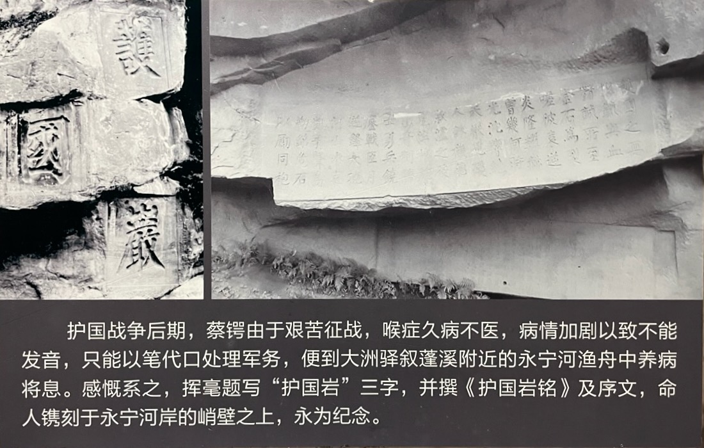

虽然作战艰苦，但就像他在北京办经界局时对蒋百里说的那样：余当困难，精神始现。所以蔡锷在行军的途中，不时会写作一些对联和诗歌。

# 对联

蔡锷到达川黔边界的雪山关时，在这个云南、贵州进入四川的咽喉之地，其时朝暾初上，蔡锷豪情横溢，遂立马撰写了一副对联，后人刻于关口寨南门小庙石柱上，其文如下：

是南来第一雄关，只有天在上头，许壮士生还，将军夜渡；

作西蜀千年屏障，会当秋登绝顶，看滇池月小，黔岭云低。

# 诗歌

在行军过程中，蔡锷曾作《军中杂诗》二首，以表达自己的情怀：

（一）

蜀道崎岖也可行，人心奸险最难平。

挥刀杀贼男儿事，指日观兵白帝城。

（二）

绝壁荒山二月寒，风尖如刃月如丸。

军中夜半披衣起，热血填胸睡不安。

# 护国岩

后来，蔡锷在大洲驿永宁河的大船上，组织反攻。为了纪念这个地方，蔡锷曾勒铭于永宁河畔大洲驿附近的岩石上，后加“序”，亦刻于岩上。岩铭序文如下：

中华民国四年，前总统袁世凯叛国称帝，国人恶之。滇始兴师致讨，是曰护国军。锷实董率之。逾年师次蜀南，与袁军遇于纳溪，血战弥月，还师大洲驿，盖将休兵以图再举。乃未几而粤桂应，而帝制废，又未几而举国大噪，而袁死，而民国复矣。嗟乎，袁固一世之雄也，挟薰天之势，以谋窃国，师武臣力，卒毙于护国军一击之余。余与二、三子军书之暇，一叶扁舟，日容与乎兹岩之下，江山如故，顿阅兴亡，乃叹诈力之不足恃，而公理之可信，此岂非天哉！世或以踣袁为由吾护国军。护国军何有？吾以归之于天，天不得而名，吾以名兹岩云尔。蔡锷题，殷承书。

民国五年七月勒石。

“护国岩”铭曰：

护国之要，惟铁与血。
精诚所至，金石为裂。
嗟彼袁逆，炎隆耀赫。
曾几何时，光沉响绝。
天厌凶残，人诛秽德。
叙泸之役，鬼泣神号。
出奇制胜，士勇兵饶。
鏖战匝月，逆锋大挠。
河山永定，凯歌声高。
勒铭危石，以励同胞。

下面是护国岩的图片：

蔡锷的这些“余当困难，精神始现”的作品，反映了他在艰苦行军和作战中的乐观和必胜信念，对提高自己和自己部队的“志”，以“屈敌人之志”的作用非常明显。

 

| [Index](./) | [Previous](13-9-war) | [Next](13-11-politic) |
