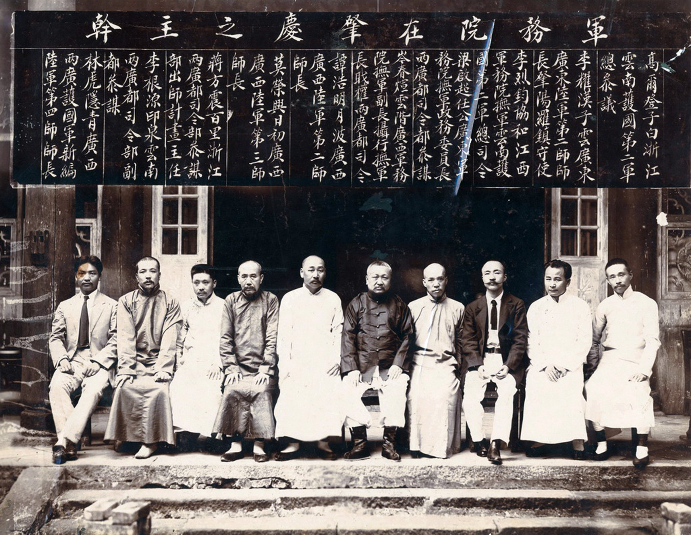

在蔡锷把北军打到志气丧尽，不得不停战的同时，梁启超也在四处奔走，合纵连横。最终师生携手，刺破了袁世凯称帝营造的谎言，导致袁世凯不得不收回帝制图谋。

蔡锷离京后，梁启超也离开了北京，进行反袁大联合。梁启超的政治活动和蔡锷的军事行动保持了密切协同。蔡锷说，梁“每书动二三千言，指陈方略报详”。梁启超在蔡锷《松坡军中遗墨》一书的“题记”中说，在护国战争期间，梁、蔡两人来往函札手稿不下 20 万字。

梁启超和各方势力展开广泛的联系。他一面和冯国璋保持密切联系，一面策动广西陆荣廷起义，最后联合南方各起义省份，组织南方军务院，和北方政府分庭抗礼。其中，他于 5 月 8 日主持成立的南方军务院之组织已俨然一临时政府，对袁世凯造成很大压力。当时的报纸记载：“北京政府所惧者，南方军务院之组织已俨然一临时政府。从前南方势力虽大，尚无统一机关，北方尚有城社可凭。今如此，则所谓中央政府已无复奇货可居。又连接紧要报告，南方一面依约法戴黎，一面通告驻北京各国公使废止北京政府，此等消息较之某省独立，某战失败之惊报，何啻十倍。”

下面是军务院在肇庆之主干合影。自右至左：高尔登、李耀汉、李烈钧、梁启超、岑春煊、谭浩明、莫荣新、蒋方震、李根源、林虎

梁启超也继续在舆论场上发出揭露袁世凯阴谋的王炸，比如他把袁世凯发给云南，要求配合复辟帝制的密电公之于众，给袁世凯造成重大打击。梁启超建议云南都督府将袁世凯帝制活动的有关密电，经整理后全文收录，汇集编印成册，取名《民意征实录》，由云南政报发行所编行，广为散发，揭示了袁世凯当面一套，背后一套的行为。《民意征实录》最后指出：中国历史上篡窃频仍，取径不同，但所用之词皆在“天意”，未有敢假托于“民意”者，“有之，自盗窃中华民国之袁世凯始”。故此书以“民意”征实记之。给袁世凯在舆论上重大打击。

在梁启超和蔡锷的携手打击下，至泸州停战，局势慢慢明朗：袁世凯消灭不了蔡锷，他的帝制图谋已经被证明是自吹自擂，自写自画，因此已经失信于民，无法再继续了。随着 3 月 15 日陆荣廷宣布广西独立，局势有愈演愈烈，以致失控的迹象。

袁世凯这时候知道称帝是进行不下去了。他开始责备别人让他当皇帝。他亲笔写信，请段祺瑞，徐世昌，黎元洪来商量。他问：这帝制是不是该取消了？没有人搭话。他只好自己说：我觉得还是取消的好。3 月 25 日，袁世凯宣布帝制取消。

至此，蔡锷用他自己的生命为代价，打破了袁世凯作为一个独裁者伪造的民意，为四万万人争得了民权。蔡锷知道，专制下的“民意”有一个特有的现象：刚开始，大家因为恐惧，不敢说话。但只要有一个人说出了大家的心里话，但独裁者拿她又不能怎么样，大家就都会说出来了。

蔡锷用自己的生命试出了真正的民意：民主不可弃，帝制不可回。现实确实如此：蔡锷在泸州死死地顶住，各种反对袁世凯的势力就都开始表示了：黎元洪请假；张謇回家；汤化龙回家；连袁世凯的弟弟也登报撇清自己和袁世凯的关系。而被袁世凯逼走的唐绍仪就说得更直白了。他说袁世凯不顾廉耻。5 月，在上海的知名人士 13971人，在沪国会议员 256 人，要求袁世凯下台。

蔡锷的这一仗，是他说的“战争的目标是屈敌人之志”的最好说明。他和梁启超配合得很好，最后“屈”了袁世凯的想当皇帝的志，达到了自己的目标。

袁世凯这一次尝试，输得如此之惨，甚至失去了性命，留下千古骂名，导致后面就再没有人敢提自己想当皇帝了。

中国，终于告别了帝制，谁也不能将它挽回。

 

| [Index](./) | [Previous](13-10-write) | [Next](13-12-down) |
