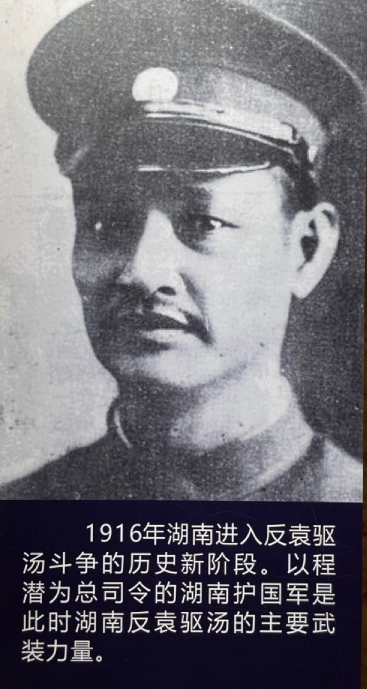
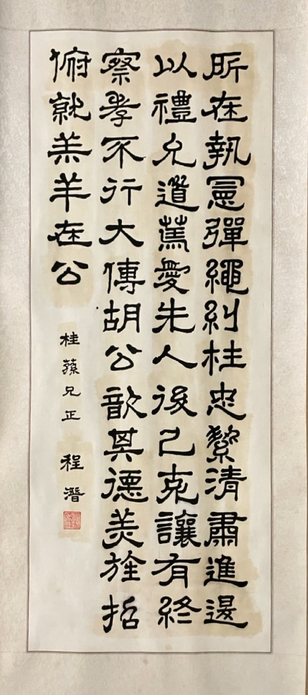
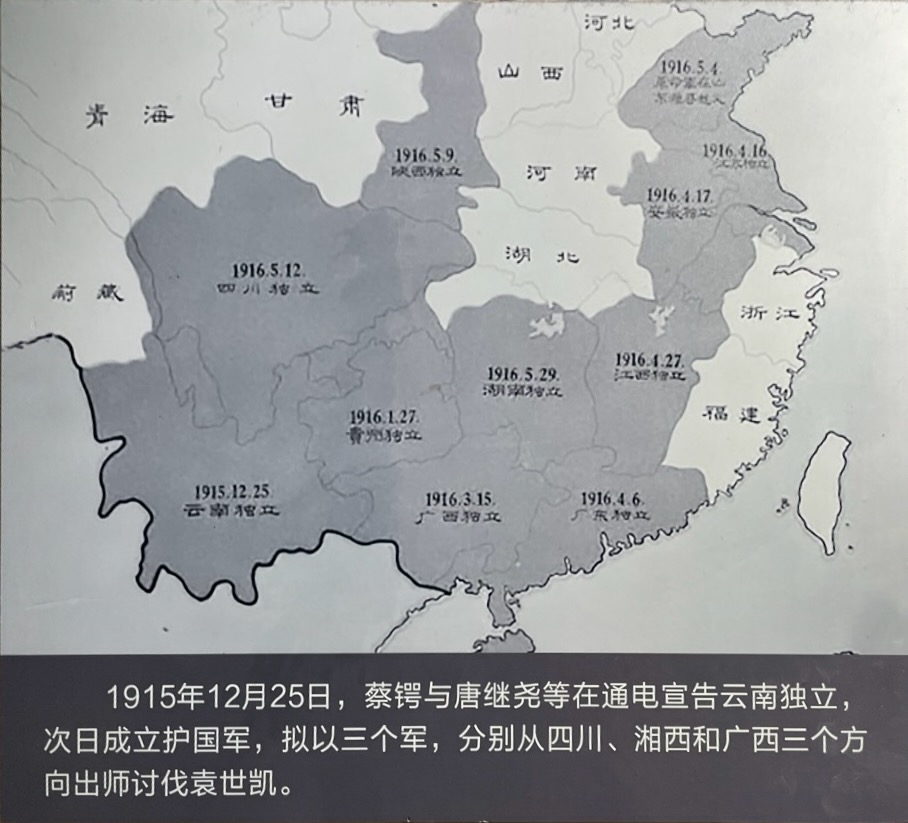

袁世凯取消帝制后，还想接着当总统。2016 年 3 月 25 日，袁世凯以黎元洪、徐世昌、段祺瑞三人的名义，致电独立各省说：“帝制取消，公等目的已达，务望先戢干戈，共图善后。”

蔡锷分析袁世凯这是以退为进，希望盘踞高位，以后卷土重来。蔡锷分析袁世凯的意图说：袁逆之撤销帝制，一因兵事挫衄，外交逼紧，财政困穷，人心鼎沸，乃迫而出此；一因独立各省份逐渐增多，护国军势力继续增高，无力抗御。姑借此下台，以和缓国人之心理，孤我军之势力，仍盘踞现位，以为“卷土重来之计”。

# 坚请袁世凯退位

在外部，蔡锷坚请袁世凯退位，副总统黎元洪上位。他在 4 月 2 日即致电答复黎元洪等人，温和地劝告袁世凯“洁自引退”。全文如下：

北京黎副总统、徐国务卿、段总长鉴：华密。奉勘电。敬谂起居无恙，良慰远系。迩者国家不幸，致肇兵戎，门庭喋血，言之痛心。比闻项城（袁世凯）悔祸，撤除帝制，足副喁望，逖听下风，曷胜钦感。惟国是飘摇，人心罔定，祸源不清，乱终靡已。默察全国形势，人民心理尚未能为项城曲谅。凛已往之玄黄乍变，虑日后之覆雨翻云。已失之人心难复，既堕之威信难挽。若项城本悲天悯人之怀，为洁身引退之计，国人轸念前劳，感怀大德，馨香崇奉，岂有涯量。公等为国柱石，系海内人望。知必有以奠安国家，造福生民也。临电无任惶悚景企之至。锷叩。冬。

袁世凯于是指令四川将军陈宧与蔡锷协商停战，蔡锷便给陈宧亲笔写了一封信，劝说陈宧，识大体，顾大局，促袁世凯退位。信中说：

敬诵大函，得领宏教，不胜钦佩。所云此次云南起事，特为护国起见，诚然诚然。当然锷等以为起事之后，可用军事上之态度，表示国人反对帝制之意，如袁氏而良心不昧，即当俯从民意，中止帝政行动。讵料袁氏并无悔祸之心，竟反调派大军南下，以实行武力压制，以为如此则真正之民意可以被其压倒，而帝制即可成功。因此致令生民涂炭，将士丧亡，举国骚然，四民失业，袁氏岂能辞其咎耶！及见人民反对日烈，帝制终无成功之望，始不得已勉行取消。

他然后详细解释了要求袁世凯退位的三个原因：

1. 袁世凯已失去人民的信任：“论者以为袁氏至此必能退位以让贤者，乃复尸位不去，此非吾人所能解者。试问袁氏居此失败地步，能否掌执国家大权操纵如意？即使能之，又试问袁氏尚有何面目以见国人？今姑将道德廉耻暂置勿论，又试问向当此纪纲法律对内对外之威信荡然扫地之秋，袁氏焉能举国中之有才有德者供其指挥耶？”

2. 袁世凯已经骗过我们，这次还是要骗我们。他说：“据吾人所闻，袁氏屡次布告国人，自谓当初不欲再入政界，因辛亥时迫于公义、国人之请，不得已始出肩任国家大事，以尽爱国爱民之苦衷。兹者举国国民同声要求袁氏退位，为袁氏计亦止有自行卸职一途，始不与其所谓爱国爱民之宗旨相抵触。否则，帝制令虽取消，焉知将来不死灰复燃？请问我公果有何等担保，足以取信于国人耶？”

3. 袁世凯退位，不会给国家带来危险，政权可以平稳过渡。他说：“或者以为袁氏退位，不免有新发生之竞争，致使国家趋于危境。锷则以为大谬不然。袁氏果能退位，继位问题不当以武力解决，应以法律解决之。约法不云耶？若遇总统退位，则其责任职权当以副总统继续肩任。袁氏果去，则黎副总统按照法律上应继其后，同时应按照约法召集国会，另行选举正式总统，当不至生若何纷争也。”

这三点把道理讲得非常清楚，是站得住的。

# 军事准备

在内部，蔡锷主张继续“鏖战三个月”，以军事为后盾，最终解决问题。蔡锷并没有放松。他知道形势仍然险恶，因此告诫战友，要保持警惕，作好应付战争的准备，不要对袁世凯抱有幻想，以防万一。他说：“吾人若绝对的主张倒袁，则惟对外宣言非推翻袁氏不能罢兵可矣。”我们应当继续坚持，“吾人能再鏖战三个月，则无事不了矣”。

他致电唐继尧，要他做好准备，指出袁氏撤销帝制是为了以后能够“卷土重来”，“其狡猾无耻，实堪痛恨。吾侪既揭义旗，自须贯彻始终，方肯罢休。惟应审虑者：（一）我军力量，能否于短时期内速遣援师，将川、粤戡定，大举此伐；（二）袁既取消帝制，我如用兵，各国及各省对于我军，能否仍有多数表同情；（三）某国（指日本）能否实力助我，且保无别项野心；（四）我军支撑数月，即不大得胜利，袁政府因种种难关，将自行倒毙否？以上四端，亟应确实推究，以为决心之根据”。务望“审度时势，早予抉择是幸”。以后又多次致电唐继尧，要求尽快援助前线护国军，因为在四川前线，“我军现在所控逆军，兵力皆较我为倍，一旦决裂，利未见而害已形”。

他在给梁启超的电报中请求军费支援。他说袁世凯取消帝制，“以为目前和缓人心，将来复可卷土重来之计”。我们不能麻痹大意，目前蔡锷部下已拥有滇、黔、川之众，已超过三师人马，但经费紧张，“前示南洋募款，务恳速予运济百万，以纾眉急，不胜盼幸”。

# 军事计划

蔡锷然后具体制定下一步的军事计划。

他首先总结前一阶段作战，承认出师太晚，泸州被敌人首先占领带来的问题。3 月 31 日，蔡锷对梁启超说：此次出征，师行未能大畅，实因宣布过早，动员缓慢，出师计划未尽协宜，以致与京、津所豫想者竟相凿枘。幸上下一心，奋厉无前，辄能以少胜多。

他然后和云南、贵州、广西方面进行下一阶段作战计划和作战部署，准备继续进攻。4 月 6 日，他给各方面负责人发电报，商量兵力分配。他说：“此后军事计划，以滇军规蜀，黔军规湘，桂军规粤，另组织第三军为各路策应，甚佩伟筹。惟于兵力分配，似尚有应斟酌之处。”他主张云南援军，进攻重庆。他说：“凡大军作战，首在将其主力摧破，其余自迎刃而解。次在夺踞其咽喉重地，使其于作战上感非常苦痛，力自不支。”所以，他主张云南援军，先打重庆这一咽喉重地，这样就卡住了敌军的援军进来的道路，然后再歼灭泸州敌军的主力。

# 和辑

为了执行联合作战计划，他给各方面力量做工作，鼓励大家必胜的信心。4 月中旬，他给大家写信如下：

他首先鼓励大家说现在形势大好。他说：”袁氏之取消帝制，不啻证明其已达到水尽山穷之时，且不啻根本取消其势力。就川情论，取巧如陈二庵，骁悍如张敬尧，狡狠如熊祥生，蒙昧如李长泰，近来态度大变，函电往来，皆有戢耳就范之意。我军则屡濒于危，皆能绝处逢生，天意人事益可知矣。”

他然后请求大家继续努力。他说：“吾侪现宜各就职守所在，力量所及，为最后之奋进。百尺竿头，更进一步，则最初之目的，不难贯彻。际此浮图合尖，功成一篑之时，不宜以一隅之小利害而易其喜戚，尤 不可因小故而竞意气，祈与诸君共勉之。”

# 预见

在大势上，蔡锷有比较乐观的估计。他在 4 月 29 日给妻子的信中，首先简要预测了袁世凯的下场。他说：“各省大多数为我左袒，袁纵不逃，此二三月内倒之必矣”。然后他介绍了战场的情况：“北军与我交锋以来，从未稍得便宜，官长死亡殆尽(仅第七师一师中，营长只剩一人)，绝无斗志;加之月来将纳溪地方让其占领，其地殊不易守，须兵甚多，不能安息。时令人夏，前以激战之余，遍地皆新冢，卫生极不宜。近闻彼中瘟疫大作，死亡相继，即我军不进攻，彼亦难久支矣。蜀中文武长官，近常来通款，允与我一致，不日即可宣布独立。俟川事定，即移师东下。以大势揣之，即不用兵，国事亦定也。”

# 弹劾

护国军主要领导人唐继尧、蔡锷、李烈钧等十一人在 4 月 18 日，以“护国军军政府”的名义，发表宣言，指出袁世凯叛逆，应依法弹劾。他们说：袁氏“种种谋叛实据，应受弹劾裁判，载在约法。今袁世凯谋叛罪之成立既已昭然，即将帝制撤销，已成立之罪固在，特以约法上之弹劾。裁判机关久被蹂躏，不能行使职权，任彼逍遥法外，除由本军政府督率大军务将该犯围捕，待将来召集国会依法弹劾，组织法庭依法审判外，特此宣言：前大总统袁世凯因犯谋叛大罪，自民国四年十二月十三日下称帝以后，所有民国大总统之资格，当然消灭。布告中外，咸知闻知”。又云：“今大总统既以犯罪缺位，恭承现任副总统黎公元洪为中华民国大总统，领海陆军大元帅。”此时成立的“护国军军政府”是南方滇、黔、桂、粤联军组织的一个政府，以与袁世凯政府抗衡。

5 月，黑龙江独立。对此，蔡锷说：“黑龙江确已独立。忆朱梓桥于离京之日，在弟宅畅谈半日，叩其对于帝制问题，沉吟者久之，早知其已有会心。”

然后，旅沪 22 个省区的知名人士，由唐绍仪领衔，包括谭延闿、汤化龙等 13971 人，联合发表宣言，要求袁世凯下台，并痛斥冯国璋为“袁世凯第二”。在沪国会议员 256 人又联名通电，以袁世凯退位和黎元洪继任总统为解决时局的主要条件。留日中国学生也来电，要求袁世凯退位。

# 四川独立

蔡锷继续不厌其烦地做四川巡按使陈宧的工作。陈宧是湖南人，但是袁世凯的亲信，是绝不容易反对袁世凯的。蔡锷给陈宧写了很多信，希望陈识大体、顾大局，要陈明白“京中名流，多被嫌禁锢。日暮途穷，倒行逆施，是晚清之不若矣”，“何去何从，惟公裁之”。

在蔡锷的努力下，也随着形势的发展，陈宧的态度转变。1916 年 5 月 3 日，陈宧给袁世凯发送电报，指出大势已去，人心尽失，劝袁世凯退位。他说：自取消帝制之令下，私心窃冀以为可罢滇黔桂之兵，而餍天下之望矣，乃其效力仅得停战议和……乃荏苒蹉跎，迄无解决之望……其争执主要之点，欲得钧座退位……甚至举国人之心理亦如是云云，于此可察大势之已去，人心之已失，虽有大力者，亦不能逆天以挽之矣……帝制尚毅然取消，岂尚恋恋于总统一席……乃国人犹不见谅，种种责难，则毋甯退居颐养之为快也，此非钧座恝然于国民，国民先恝然于钧座耳……若再迁廷时日，则分崩离析之祸，今已见端，后患之来，则宧之所不忍言者矣……陈宧叩。江。

袁世凯收到电报后，并不退位，因此，5 月 22 日，陈宧宣布四川独立。他在宣言中说：宧既念时局之艰难，又悚于人民之呼吁，因于江日径电项城，恳其退位，为第一次之忠告……宧窃不自量，复于文日为第二次之忠告……宧为川民请命，项城虚与委蛇，是项城先自绝于川，宧不能不代表川人与项城决绝，自今日始，四川省与袁氏个人断绝关系，袁氏在任一日，其以政府名义处分川事者，川省皆视为无效……中华民国五年五月廿二日，四川都督陈宧叩。

# 湖南独立

5 月 29 日，袁世凯的另一名亲信汤芗铭也在湖南宣布湖南独立。汤芗铭于 1913 年 8 月起任湖南都督，忠于袁世凯。他在湖南杀人很多，被称为“汤屠户”。

湖南独立是程潜领导的。云南起义后，程潜以护国军湖南招抚使名义，回到湘西，连战皆捷，湘西 20 余县宣布独立讨袁。4 月 26 日，在靖县召开湖南人民讨袁大会，有 48 个县的代表出席，超过全省县数的一半。会议推举程潜为湖南护国军总司令，决定即日宣布湖南独立。4 月 28 日，程潜就任护国军湖南总司令，宣布湖南独立讨袁，各地纷纷响应。5 月 24 日，湘西镇守使田应诏宣布独立。此时，长沙已处于湖南护国军和民军的包围之中。汤芗铭不得已宣布独立。

程潜的字：

四川和湖南的独立，让参加护国战争的地区连成了一片。下面是最后的护国战争形势图。

面对这样的局面，蔡锷知道大局已定。5 月 16 日，蔡锷给夫人连发两信。第一封信中说：“大局消息甚好。袁世凯已打算退位，不久即罢兵息战矣。此次事业，较之辛亥一役，觉得更有光彩，而所历之危险亦大，事后思之，殊壮快也。”

# 屈其志

蔡锷在此后的时间里，继续利用他的文书圣手，进行瓦解敌军，“屈其志”的工作。比如他给敌帅张敬尧的两封信，就很有意思。

第一封是 6 月 4 日的信，情理兼备：

连日接奉尊电，及刘梯团长云峰转述台从由电话商谈各节，具见热诚爱国，肝胆照人，佩慰曷似。现在外交方面风云紧急，某国之进兵济南，已兆衅端。内则遍地萑苻，假借名义，肆行骚扰，生灵涂炭。财政方面，不独北京政府日日有破产之虞，即南北各省亦有难以维持现状之势。前者敝处应冯、段诸公之请，停战两月有奇。方冀于此停战期内，解除纷纽，决定国是。乃以项城个人去留问题，为全国平和之梗，以威信堕地、人心全失之项城，不能再奉为元首，几于全国人稍有知识者类能辨此。即项城迭致二庵电，亦自言退位不成问题，乃荏苒至今，迄无践言之诚意，犹复乞怜外人，赠送利权，滥借外债。一面嗾使张胁追南京会议，以遂其盘踞恋栈之阴谋。项城一日不退，战祸一日不休。外患愈逼愈紧，造孽于一人，受祸于全国，言之悲愤。吾民何辜? 吾国何辜?项城何心?竟忍蹙之绝地也。

迩者川、湘独立，停战之期复将届满，弟与麾下为项城一念之差所迫，又将相见于疆场矣。曾奉麾下函示中有决不为项城一人争总统之语。又由二庵转到张馥清〔卿〕电，谓麾下暨所部亦多深明大义，有联电项城请其敝屣尊荣之意。私心感颂，曷可言宜。昨奉电示暨刘君1转述尊旨，并将联络曹、李2一致进行云云，益用佩慰。惟前此双方仅有意见之疏通，并无实际之表现，殊缺憾。兹参照双方意见，拟定具体的条件如下: (一)承认项城退位后，由段芝老摄行大总统职务，但须依据法律办理。(二)于日内联电项城，迫令退位。袁如不应，或支吾其词，即率所部宣告与袁断绝关系。(三)为办理上项事宜，双方在川境内续行停战十日。上开三条，是否可行，乞迅夺示复，并乞以此电转之周、曹、李诸公力盼。

第二封是 6 月 6 日，代刘云峰写的信，软硬兼施：

窃谓我公与段师之关系，较曹、李、周为独深。贵师在各师中隐然有中坚之目，且与我军接触最近。故我公于此次交涉责任独重，而处境独危。谈判成，战祸息，项城退，段师进，麾下为功之首，于公于私，交受其益。谈判不调，战祸继起，胜负虽不可知，而国事前途，付诸冥冥，麾下首受其殃。且贵军幸而胜，不足为荣，反招全国之切齿，不幸而败，则北洋势力从此堕地矣。曩者蜀未独立，两军对峙，在贵军已有竭蹶难支之势。今贵军所增益者仅一不完整之第八师，而全川军队皆成贵军之敌。况滇、黔援师，以桂事既决，源源而至，其兵力较之一月以前，尤非可同日而语。加以帝制取消之后，贵军心理作何感想，谅亦我公所察知，其尚能为项城一人致死力与否，自是疑问。则一旦决裂，胜负之数，似不待着卜而决也。云峰北人，虽身处南军，胡马北风之义，常萦绕于脑际。凛国事之危急，念战祸之凶残，午夜徬徨，奠知所措。尚冀我公熟筹审虑，勿将此等问题轻轻看过。至盼至祷。如何？

这些信件情理兼备，看完之后，深感笔真的能退兵，能杀人。不得不服。

# 袁世凯死

本来是自己势力范围的四川、湖南两省的独立，给袁世凯打击极大。自己最信得过的手下也背离自己远去，他意识到自己已经彻底站不住脚了。他的精神和身体彻底崩溃。6 月 6 日，一命呜呼。

 

| [Index](./) | [Previous](13-11-politic) | [Next](13-13-shanhou) |
