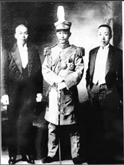

蔡锷一旦认清了现实，就立刻行动。8 月 14 日，鼓吹“君主实较民主为优”的筹安会成立。第二天，蔡锷就乘晚班车到了天津，和梁启超彻夜长谈，筹划如何反对袁世凯复辟帝制。此后，他一面设计将母亲、夫人和孩子送回湖南，一面召昔日的部下进京，与在美国的黄兴、西南地区军政人员联系，“加意布署镇慑”，准备起义。

# 蔡锷和梁启超的计划

1915 年 8 月 15 日，蔡锷从北京搭晚上的火车，到了天津，找到梁启超，一同来到汤觉顿的住所，商量了个通宵。他事后回忆说：“当去岁（1915）秋冬之交，帝焰炙手可热。锷在京师，间数日辄一诣天津，造先生之庐，咨受大计。”

蔡锷和梁启超决定反袁。蔡锷说：“袁氏叛逆，...，吾侪乃不得不负重而趋”。梁启超说：我不能忍。

蔡锷决定这么做，是因为他不能看着自己在《革命军》中立下的志愿就这样破灭。为了建立民国、维护民权、建设国家，多少人牺牲了。他也忍不了。

蔡锷决定这么做，还是因为他判断：虽然艰难，但武力反袁，是可行的。首先，他的西南根据地：云南、贵州、广西，袁世凯还没插手，是自己能够掌握的地盘。他去了云南之后，肯定能够拿到军队，起义。这个没问题。其次，被袁世凯打击的国民党，有广泛的影响力；然后，他了解到，北洋军阀内部也不是铁板一块：段祺瑞、冯国璋、徐世昌对袁世凯称帝，并不真心支持；最后，最关键的一点是：他和梁启超一样，能够感知到人民的心声，那就是帝制不可回，共和不可弃。

10 月梁启超在其天津住所召集最后一次秘密会议，梁启超、蔡锷、戴戡、陈国祥、王伯群、汤觉顿、蹇念益等与会，作出“武装讨伐袁世凯，坚决维护共和国体”的决定。会后，戴戡、蔡锷、陈国祥到山本照相馆合影留念。下面是他们的照片：蔡锷（中）、友人戴戡（左）、陈国祥（右）。

# 计划

蔡锷和梁启超商量的计划是：梁启超首先发表文章，反对帝制，然后蔡锷奔赴云南，举行起义。具体的计划是：“云南于袁氏下令称帝之后即独立，贵州则越一月后响应，广西则越两月后响应，然后以云贵之力下四川，以广西之力下广东。约三四个月后，可以会师湖北。”

蔡锷充分估计到了前程的艰险，做了必死的决心，他也制订了联合一切能够联合的力量的策略。他说：“失败就战死，绝不亡命；成功就下野，绝不争地盘。”第一句意味着这件事对他来说至关重要，因此他已把生死置之度外，愿意付出自己的生命去抗争；第二句意味着他的目标非常明确，就是联合一切能够联合的力量，把袁世凯拉下马。成功后，他就立刻解甲归田，绝不和人争什么。

后面事情也确实如蔡锷计划的这样发展：梁启超先发文章，说出大家说不出来的话，导致舆论转向；然后蔡锷到云南，得到自己的心腹部队的支持，攻入四川，以攻为守，顶住北洋军队，让北洋军队损失惨重，士气低落；然后梁启超、革命党在各地响应，营造舆论，发布通电，加上北洋系内部抵制。这样下来，袁世凯营造的“应人民的呼声而称帝”的谎言就像气球一样破灭了。他没有任何理由再推进帝制了。帝制覆灭。

 

| [Index](./) | [Previous](13-1-huguo) | [Next](13-4-yizai) |
