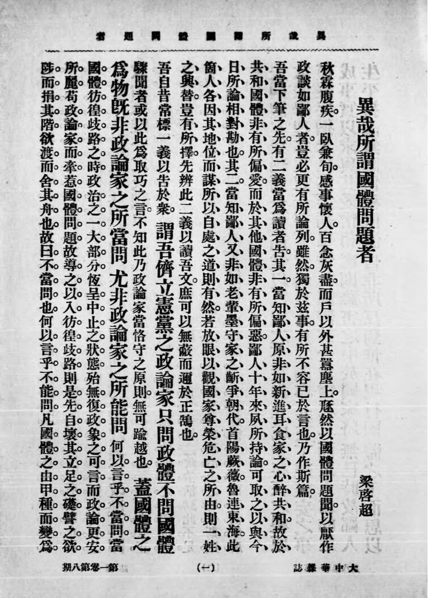

按照和蔡锷商量好的计划，梁启超首先发出了《异哉所谓国体问题者》这篇文章。

这篇文章以规劝的语气，对最近的帝制讨论提出了商榷。梁启超说：本来，我认为只要能“立宪”，“无论国体为君主为共和”，都可以。但现在我们付出了这么多代价，已经共和了，正是整军经武，卧薪尝胆，发愤建设之际，现在却又要回到从前，从君主开始。可是，要做一个开国皇帝，是要做很多重要的事情，建立很多功勋，才配的呢！比如对内治理得当，政治修明，对外一战而霸，实现国家的独立。但现在我们一件也没有做到，相反，国家内忧外患，一片混乱，你凭什么当皇帝？所以：最好还是保持共和，别折腾了吧！不要“果未熟而摘之”、“孕未满而催之”，这样会“伤其根”，“戕其母”。国体这个事情，不能轻易地改动：“夫国体本无绝对之美，而惟以已成之事实为其成立存在之根源。”“呜呼！天下重器也，可静而不可动也。岂其可以翻覆尝试废置，如弈棋？”

梁启超的文章一经发出，就确立了整个舆论方向，“传诵一时”。谢菊曾回忆说：“其时梁正与袁不协，遂写了一篇《异哉！所谓国体问题者》文章，交由《大中华杂志》发表，顿时给袁世凯和一班攀龙附凤的人兜头泼了一盆冷水，一时《大中华杂志》不胫而走，销路奇旺。”

这就是梁启超的伟大之处：他能说出人民想说，却说不出来的心声。梁启超再一次用他的作品证明了：一个伟大的作家能说出时代的心声。梁启超的文字有理有据，说出了大众想说但说不出来的话。这篇文章让人们突然发现：原来这就是自己想要表达的。尤其是梁启超用了“异哉”这两个字，一下就说出了大家的心声，树立了标志。报人徐铸成后来回忆说：“梁启超撰文驳斥，题目叫《异哉！所谓国体问题者》，轰动中外，给了这些丑类以沉重的打击。现在已时隔六十多年，文章的内容，已记不清楚了，而这个虎虎有生气的题目，却还深深地印在一些老人的脑海里。”

梁启超文章的初稿，其实相当激烈。据吴贯英回忆，原稿中曾有这样的字样：“由此行之，就令全国四万万人中三万万九千九百九十九万九千九百九十九人皆赞成，而梁某一人断不能赞成也”。然后有人建议说：袁世凯自己其实还没有承认想要称帝。初次商量政见，不必如此激烈。梁启超接受了这一建议，将此段删去，并把其余各段改得更平和。所以文章就成为了规劝的口吻。

梁启超为了避免和袁世凯撕破脸，还特地预先把文章发给了袁世凯过目。袁世凯看完后，立即派人贿赂梁启超 20 万元，请梁无论如何不要发表，但被梁婉言谢绝。继而袁又遣人对梁进行威胁，各种陷害恐吓接连飞来，梁也不为所动。最后文章发出，说明当时袁世凯对媒体的管控也还是有限。

# 梁启超写作的初心

梁启超写这篇文章，反映了他经历漫长的等待之后，终于明白自己满心期待的华盛顿，其实只是一个只想着自己当皇帝的无耻之徒。梁启超向女儿说：“吾不能忍（昨夜不寐今八时矣），已作一文交荷丈带入京登报，其文论国体问题也。”。蔡锷也是这种感觉。他说：我办经界局毫无结果，老师梁启超办币制局毫无结果，将来恐怕我师生同一命运。他还说：袁世凯如果还言而无信，不咬牙开始建设国家，他就要飘然远引，打个人之穷算盘去了。

梁启超写这篇文章，还有一个原因，就是他如果不写，任由时局发展，那一贯支持袁世凯的他，也会被袁世凯带下水，被钉在历史的耻辱柱上。他后来说：“吾侪自命稳健派者，失败之迹，历历可指也。曾无尺寸根据之地，惟张空拳以代人呐喊，故无往而不为人所劫持，无时而不为人所利用。今根基未复尽者，只余此区区片土，而人方日惎炯于其旁。当此普天同愤之时，我若不自树立，恐将有煽而用之，假以张义声者，我为牛后，何以自存？幸免于此而为独夫戮力，杯酒释兵之事，数月后行且力见，偶然共为一匹夫坐待刲割，噬脐何及。”

# 梁启超文章带来的影响

除了引导了整个舆论的转向，梁启超的文章还在权力场上产生了多种效果。

首先，袁世凯的部下，开始打起了自己的小算盘。比如段祺瑞、冯国璋、徐世昌，他们本来就担心袁世凯称帝后，自己的前途。现在发现舆论转向，就要更细致地想想自己的站位了；

其次，被袁世凯无情打击的国民党和反对票人士，发现了新的机会，自然要出来活跃活跃了。

然后，各省的议员、军事将领，本来就想着地方自治，担心被袁世凯的强势中央所收编，此时内心里也活动了，想要乘机捞一把了。

最后，在华的外国记者和外交官注意到最新的动向，明白原来事情不是像袁世凯说的那样简单，从维护自己的利益出发，就会改变原来支持袁世凯称帝的态度，对袁世凯的行为存疑了。

这些都对袁世凯带来巨大的冲击。袁世凯看似固若金汤的底座，就松动了。

# 梁启超后续的行动

随着形势的发展，梁启超后来说得就更直接了。他说：“自国体问题发生以来，所谓‘讨论’者，皆袁氏自讨自论，所谓‘赞成’者，皆袁氏自赞自成；所谓‘请愿’者，皆袁氏自请自愿；所谓‘表决’者，皆袁氏自表自决；所谓‘推戴’者，皆袁氏自推自戴。此次皇帝之出产，不外右手挟利刃，左手持金钱，啸聚国中最下贱无耻之少数人，如演傀儡者然，由一人在幕内牵线，而其左右十数嬖人蠕蠕而动；此十数嬖人者复牵第二线，而各省长官乃至参政院蠕蠕而动；彼长官等复牵第三线，而千数百余不识廉耻之辈，冒称国民代表者蠕蠕而动。”

此后，梁启超的队友汤化龙、熊希龄、张謇都辞职离京，梁启超自己也先赴武汉，做冯国璋的工作，然后赴广西直接策划广西起义，并组织南方军政府，给袁世凯的北方政权极大的压力。

 

| [Index](./) | [Previous](13-3-plan) | [Next](13-5-prepare) |
