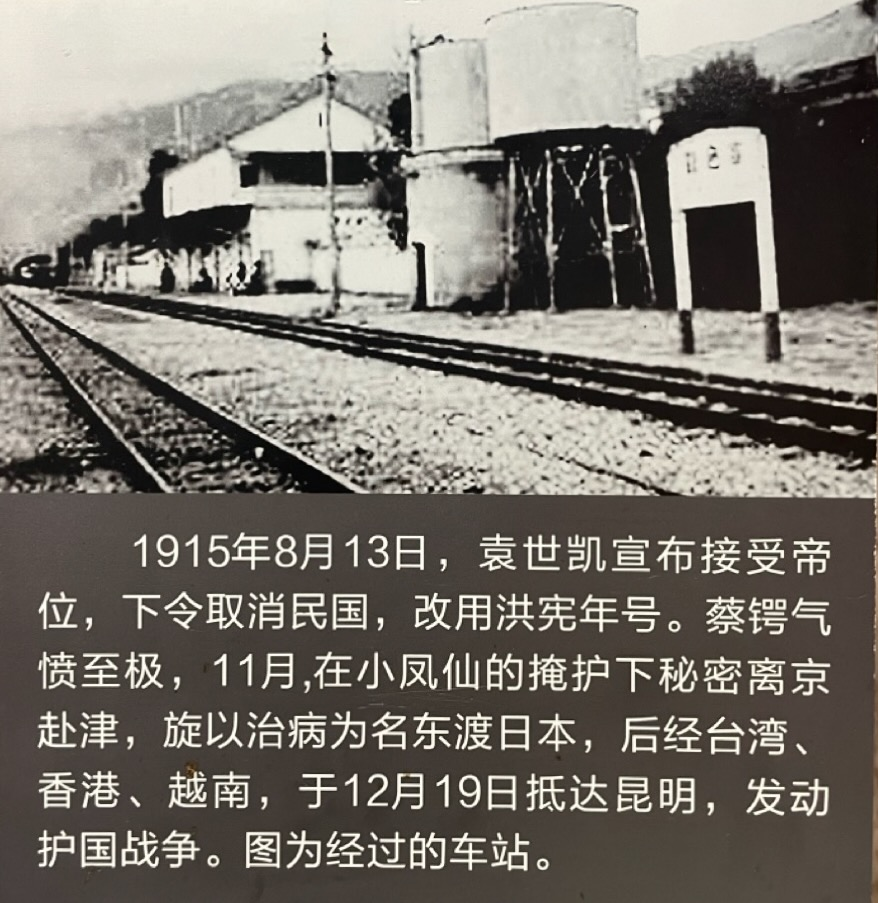

为了逃出北京，蔡锷做了精心地计划，执行也非常出色。

蔡锷首先释放一系列布置周密的烟雾弹，对自己的真实意图进行掩盖。就像他在《曾胡治兵语录》中提到的，打仗最重要的是要“奇”。对于“奇”，唐太宗的手下长孙无忌的话更直接，就是要“骗”。

他首先还是表示自己支持袁世凯称帝。对梁启超发表的《异哉》文章，他逢人便说：“我们先生是书呆子，不识时务。”有人反问他“你为什么不劝劝你先生？”蔡回答说：“书呆子哪里劝得转来？但书呆子不会做成什么事，何必管他呢！”他在筹安会成立之后，也发起成立一个“讨论国是会”，表示“赞成君主国体”。在统率办事处，有人拿着“主张中国国体宜用君主制者署名于后”几个大字的题名录，向蔡锷试探，蔡即写上“昭威将军蔡锷”的签名。

他然后结识了小凤仙，获得了她的信任，请她帮忙打掩护。小凤仙在社会上打拼多年，当然不是简单的人物。但蔡锷还是以自己的真诚打动了小凤仙。他甚至教小凤仙认字、看书。这和他在《曾胡治兵语录》中提到的，要对自己的士兵像对自己的孩子那样，努力教育他们学好、向上，是一致的。小凤仙也全心帮助蔡锷，为蔡锷的平安离开，提供了帮助。小凤仙后来在北京中山公园蔡锷的追悼会上，悲痛欲绝，也体现了她对蔡锷的真心爱戴。1980 年代的电影《知音》就描述了这段故事，由张瑜扮演小凤仙，轰动一时。

通过小凤仙，他完成了把家属送走的工作。他假装和小凤仙乐不思蜀，引起夫人意见，以致夫妻吵架，摔坏杯盘什物不少，惊动了四邻，还惊动了袁世凯，因此夫人借此带着母亲和孩子回了湖南。

但是因为有人告密，以及蔡锷与外界频繁的密电来往，也还是惊动了袁世凯。袁世凯派密探搜查蔡锷的家，希望找到蔡锷密谋的证据，同时也派暗探日夜跟踪蔡锷的行踪。蔡锷知道此时自己必须要走了。他对经界局秘书长周钟岳说：“有陕人路某（孝忱）向公府告密云，滇省反对帝制，吾辈亦通信与谋，昨日军政执法处派人至吾寓检查信件，实由于此。”

他首先到天津，假装在天津住院，然后于 12 月 2 日，在戴戡的陪同下，偷乘日商山东丸号，到日本。离津前，他与梁启超诀别说：“失败就战死，绝对不亡命；成功就下野，绝对不争地盘。”

抵达日本后，在黄兴派来的张孝准、石陶钧等的接应下，蔡锷秘密前往神户，然后迅速换另一艘日轮，南下香港，复取道河内直奔云南。与此同时，他请石陶钧带着自己的行李去别府箱根，作就医状；并准备了多封亲笔信，让石陶钧每隔几天寄一封信给北京袁的亲信唐在礼等人，逐日报告游历状况和养病情形，以掩饰行踪。

袁世凯获悉蔡锷潜赴云南，大吃一惊，立即电令蒙自关道周沆和阿迷县长张一鲲，伺机狙击或捕杀。但唐继尧派自己的亲弟弟、警卫团长唐继虞来越南迎接和护送，挡住了刺客，袁的阴谋未能得逞。

对这段时间蔡锷的经历，后人总结道：君既郁郁于经界事务，不获行其所志，而五月七日中日新约之耻，复为君所腐心扼腕，因建议项城主战，并请给假回滇召集旧部，以为背城借一之举，请勿自馁。不报，而约卒成立，爱国之思，益以奋发。然以百感抑迫，病状遂作。于时，君初有晚间失眠之症，而喉疾六时间之，顾犹深自调节。无何筹安会发起，扼于军警势力，隐忍不便有言。适戴至京，君引与同志，并移寓经界局，便与戴密谋，一方密电西南各省，发抒所见。政府因君所发密电过多之故，深用疑虑，因由军政执法处搜其寓宅，毫无所获。君知撄忌之甚，京中不可以久居矣。而筹安之谋，亦与时俱进，君乃以调查经界名义，派殷承献至江、浙、皖、闽，派黄实至粤、桂、滇、黔，密有所图。又以数千金置厚仪，分馈西南各将军，以资联络。布置既竣，乃自图脱身之策。诡火醇酒妇人，以惑侦者之志。至上年八月十二号侵晨，微服出京。至津后，住共立医院。政府闻信惊绝，遣使促其复回，而君遂于十八号乘日船山东丸东渡。然距其出京之前一日，犹照常至经界局办事也。至日后，复内渡上海，抵沪后用岳某护照抵港。此项护照盖任经界时所请于外交部者也。吾人犹记君行出京时，疾滋寝甚，其在山东丸道中，寓书其友某君谓：脱离故国，心绪少定，现食能下咽，夜能获睡矣。甚矣，忧患足以致于病也。云云。又寓函局员(经界局)，嘱其呈报出洋。到日后，又寓书统率处唐质甫，请密寄佳拓法帖。其安闲不迫，整暇自然如此。

 

| [Index](./) | [Previous](13-5-prepare) | [Next](13-7-he) |
