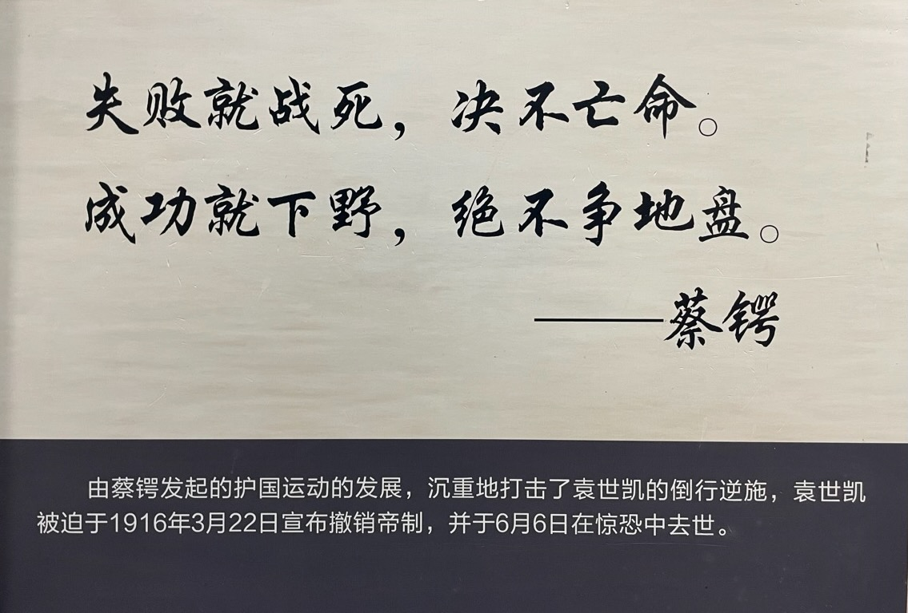
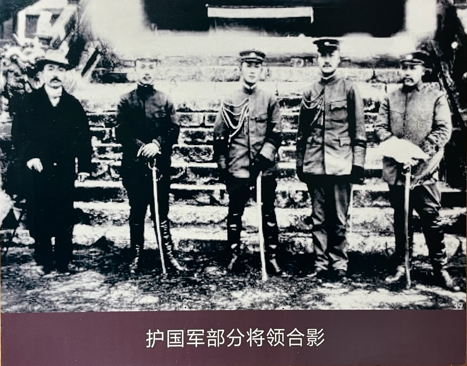

1915 年 12 月 19 日，蔡锷到昆明。下车伊始，他就开始做各方面的工作，一致反袁。此时的昆明，反袁情绪十分热烈。滇军的中下级军官已开过三次秘密会议，酝酿武装讨袁。原国民党骨干分子李烈钧、程潜、熊克武等亦先后来滇，共同策划反袁战争。

蔡锷到来后，以自己为中心，团结了以下 3 方面的力量：
1. 西南地方实力派，特别是以唐继尧为代表的地方实力派。他们是战争的基石；
5. 西南士绅和人民；
2. 国内各种政治势力和派别，包括梁启超的进步党，黄兴、孙中山的欧事研究会和中华革命党，北洋派的上层军政人员。

蔡锷和这 3 方面的人员都有密切的联系，能够调动对应的资源。这种能力在混乱的民初是罕见的。因此蔡锷在反袁各派大联合中所起的纽带作用是难以取代的。

# 团结部队

他首先向云南的部队表明自己的态度：“失败就战死，绝不亡命；成功就下野，绝不争地盘。” 第一句符合他在《曾胡治兵语录》中讲述的治军的基本方法，即要有悲戚感：部队要有必死的气氛，才能打胜仗；第二句符合语录中说的“和辑”要求，即不争功，利益让给兄弟姐妹们。

他诚恳地请求大家的帮助。到昆明的第一天，在滇军将领举办的欢迎宴会上，蔡锷就这样说明了自己的来意：我在北京很想念云南及各地同学、同事与一般健儿。自辛亥革命以来我负云南之责任，得大家协助。援川、援黔、肃清云南内部乱事，都得大家力量，我个人无特殊能力。因得云南各界人士协助，我督滇以来，未发生异状。我离滇，蓂赓调滇。我到北京之初，就知道袁世凯有称帝计划。北京筹安会起，杨度等拥护袁氏，渐渐北京风潮甚高，我内心非常愤慨，但无法解救。想尽一切办法，才离北京到天津，搭船到日本，转香港。云南群众很富爱国思想与民权思想。我坚决回到云南，希望大家努力，打倒洪宪！

他诚挚的讲话和表态，打动了当年的部下，时任云南都督的唐继尧。唐继尧说：“袁世凯准备登帝位，老前辈（指蔡锷）由北京脱险，沿途清吉抵昆，是国家之幸，也是大家之幸。大家同心同德拥护老前辈所指示的打倒袁世凯和救国的一切方针。”随即举杯，并要大家一同举杯敬蔡。蔡称唐为“蓂赓”，唐称蔡为“老前辈”。散会后，唐、蔡又入小客室闭门叙谈，作进一步的安排、筹商。叙谈完毕出门时，蔡、唐一齐捋袖说：“干啊！”显然两人已下了最大的决心。

蔡锷又认真地给大家讲道理，说明反袁的必要性和可行性。他说：我们这一次一定要反对袁世凯。当辛亥革命时，我们发动革命，我们出死入生地进行奋斗，最后才突破难关，把满清推倒，建立了中华民国。现在袁世凯攫取了辛亥革命的胜利成果，自己做起皇帝来，难道我们革命的艰苦奋斗为袁世凯造机会吗？现在袁世凯既做皇帝了，我们如果不起来反抗，让他登上皇帝的位置，那么我们从此就在他的专制统治之下，永远不能翻身，那中华民国就变成了空招牌，这不是我们的初心。我们前一次革命曾经历非常重大的危险，这样重大的危险我们已经安然过去了，今天还有什么重大危险呢？我想这一次革命无论如何，不会象以前那么危险了，所以我们非起来反袁不可。这时候如果不起来干一下，不但对不起国家，对不起已牺牲的烈士，而且也对不起自己。请大家鼓起信心和勇气来吧，没有什么可怕的，只要大家一德一心去干，担保可以克敌制胜，敌人一定能够消灭的。

他用实际行动表明自己“失败就战死，绝不亡命；成功就下野，绝不争地盘”的态度。唐继尧提议蔡锷为都督，自己统兵出征；蔡锷深受感动，以至流泪。但他说：“吾此次来滇，协同起义，完全为讨袁，为救国，并非争权，并非夺利，若果喧宾夺主，不论理论事实如何，总不足以示天下后世，更何以对滇中父老。深望蓂赓鉴此苦衷，无再固辞，并盼总揽全局，统一军政。勿存客气，不辞劳怨，独为其难，以赴事功。”

经过几番推让，最后决定蔡出征，唐坐镇。两人订约，盖有都督府印，载明出征在外部队全盘归蔡指挥，云南内部坐镇军政事务归唐负责。蔡任护国第一军总司令，非唐所委，其总司令官防由云南省议会刊刻授蔡。蔡、唐之间互用公函。后来成立的第二军由唐都督颁发关防，唐对第二军行文用命令；第三军系唐自兼。

最后，大家歃血为盟。誓词为：
拥护共和，我辈之责。
兴师起义，誓灭国贼。
成败利钝，与同休戚。
万苦千难，舍命不渝。
凡我同人，坚持定力。
有渝比盟，神明必殛。

宣誓后，各人在誓词纸上，签上姓名，刺指沥血于玉樽之中，与酒调和，并以余血涂于亲书之签名上。宣誓完毕，焚化誓词，各饮血酒一杯，众皆鼓掌，三呼万岁。这个玉樽现在还在云南的博物馆内。

下面是 1915 年护国军出征前夕，部分护国军将领合影。左起：第一军秘书长李曰垓、第一军总参谋长罗佩金、第一军总司令蔡锷、第一军参议殷承𤩽、第二军总司令李烈钧

据《中华新报》报道，云南商、学、绅、军各界代表数百人，在陆军第一师司令部开会欢迎，其热烈程度盛极一时。“主客间因在该部中厅，以朱笺特书格言六句：（一）开诚布公（二）和衷共济（三）不争权利（四）不避艰险（五）誓死报国（六）保障人权。使触目惊心，各铭座右”。

从蔡锷和唐继尧的相处方式上，就可以看出蔡锷在“和辑”上的坚持。在后面的艰苦作战中，虽然和唐继尧的配合并不理想，蔡锷也一直尽全力维护和唐继尧的合作，理解唐继尧的苦衷，从来没有发过火，每次都是苦劝，不伤感情。比如，在战争开始，唐继尧就以饷糈支绌为词，没有给护国第一军拨给开拔费。蔡锷就自己想办法，最后由蔡锷的参谋长罗佩金以家产押给殖边银行，得款 12 万元，资助第一军，蔡锷的第一军主力才得以从昆明出发。而这时云南宣布独立已经 20 天了，即 1916 年 1 月 14 日，被延误了，导致泸州被敌人先行占领，贻误了军机。此后，唐继尧在军饷、军需方面以及兵员上，都没有给前线以任何补充。在军饷方面，蔡锷曾说，第一军三个梯团，“自滇出发以来，仅领滇饷两月。半年来，关于给养上后方毫无补充，以致衣不蔽体，食无宿粮，每月伙食杂用，皆临时东凑西挪，拮据度日”。又说：“敝部出征以来，率仅发口粮零用。而滇师自出省迄今，省政府仅发饷两月，支撑至今，竭厥可想。”而在军需方面，特别是弹药的补充，虽然蔡锷多次致电唐继尧催促，却没有响应。所以直到 1916 年 6 月 7 日（袁世凯死去的第二天，蔡锷尚未获悉袁死的消息），蔡锷还致电唐继尧催促说：“迭电哀恳，究未照办。同袍将士，颇滋疑虑，万勿河海是幸！”这已是哀求的口吻了。而在兵源的补充上，亦大体如此。

# 团结西南士绅和人民

蔡锷也向云南的士绅和人民解释起义的意义，获取理解和支持。他发布了《告滇中父老文》，读起来非常感人。蔡锷一直以来就注意这样做，因此得到了人民的爱戴。澳大利亚记者骆惠敏说，蔡锷得到了“整个西部的老百姓普遍爱戴”。

他首先感恩滇中父老对自己的信任和照顾，诉说自己的感情。原文是：

锷去滇二年于兹矣。忆辛亥起义，仓卒为众所推，式饮式食于兹土者，亦既有年。自维德薄能鲜，无补于父老，而父老顾不以其不职而莫我肯彀焉，则父老之所以遇我者良厚。属以内迁，不获久与父老游。卒卒北行，伴食权门，郁郁谁语？睹此国难之方兴，计好义急公，堪共忧患，誓死生者，茫茫宇内，盖莫我滇父老若。

译文是：

我离开云南已经两年了。回想辛亥起义时，仓促之间被大家推举，在这里吃住也有几年了。自认德行浅薄，能力不足，对父老们没有什么帮助，但父老们并没有因为我不称职而不接受我，这真是对我厚待了。后来因调任到内地，不能久留与父老们相处。匆匆北上，伴随在权贵门下，心中郁郁寡欢，无法诉说。看到国家面临如此大的危难，思考如何行义救国，能与我共同分担忧患、誓同生死的，整个天下恐怕没有比得上我们云南的父老们。

然后说明自己是来寻找帮助的，因为内忧外患，而袁世凯自私称帝，他如果成功，我们人民的希望就断绝了。原文是：

今锷之所以来，盖诚有为国请命于父老之前者，愿父老之垂听焉。民国成立以还，袁逆世凯因缘事会，遂取魁柄，凭权藉势，失政乱国。内则佥壬竞进，苛政繁兴，盗贼满山，人民憔悴；外则强邻侵逼，藩服携贰，主权丧失，疆土日蹙。乃袁逆曾不悔祸，犹复妄肆威权，排斥异己，挥金如土，杀人如麻。等法制如弁髦，玩国民于股掌。伊古昏暴之祸，盖未有若袁逆世凯之甚者。顾中国志士仁人，所以忍痛斯须，虚与委蛇者，诚念飘摇风雨，国步方艰，冀民国国体不变，元首更替有期，犹可徐图补救耳。乃袁逆贪黩，又复帝制自为，俾兹祸种，贻我新邑。袁逆之帝制成，吾民之希望绝矣。

译文是：

现在我来这里，确实是为了国家向父老们请求援助，希望父老们能够倾听。自从民国成立以来，袁世凯利用时机，取得大权，凭借权力作威作福，失政乱国。国内方面，奸佞小人竞相上位，苛政繁兴，盗贼遍地，人民困苦不堪；国外方面，强邻侵逼，附属国背叛，主权丧失，疆土日渐缩小。然而，袁世凯并没有悔改之心，仍然妄自尊大，排斥异己，挥金如土，杀人如麻。他视法律如无物，玩弄国民于掌中。古往今来的昏君暴君，没有一个比得上袁世凯的暴虐。中国的志士仁人之所以暂时忍耐，虚与委蛇，实在是因为国家正处于风雨飘摇之中，希望民国的国体不变，元首更替有期，还能逐步图谋补救。然而，袁世凯贪婪无度，又复帝制自立，种下了灾祸，带来了新的祸害。袁世凯称帝成功，我们百姓的希望就彻底破灭了。

然后，他说明袁世凯的叛逆，已经弄得天怒人怨。原文是：

比者，胙土分封，绵蕞习礼，袁逆急急顾景，若不克待。而起视四境，则弥天忿叹，群发曷丧偕亡之恶声。武夫健士，则磨刀霍霍，莫不欲专刃贼腹。袁逆日暮途穷，谋逆愈亟，惧人心之不附，则又援外力以自固。参加欧战之危局，承诺东邻之要求。以若所为，不异以国家为孤注，以求彼一人之大欲。

译文是：

最近，袁世凯急急忙忙地封土分封，模仿古代礼制，似乎等不及了。然而，看看四周，满天都是愤怒和叹息之声，群情激愤，发出同归于尽的恶声。武夫健士们磨刀霍霍，无不想将刀刃对准袁世凯的肚子。袁世凯穷途末路，谋逆之心更加急切，害怕民心不附，又引外力以自固，参加欧洲战争的危局，承诺满足东邻的要求。他这种做法，无异于将国家作为孤注，只为满足他一人的巨大欲望。

因此，他鼓舞大家的志气：三户亡秦，一旅兴夏。我们就是要在天下人都不敢发难的时候，先天下而声讨袁世凯，这是我们的责任。有志者事竟成。原文是：

呜呼！袁逆冢中枯骨耳。石敬瑭、张邦昌之故事，彼固可聊以自娱。顾我神明华胄，共偷视息于小朝廷之下。嗟我父老，其又安能忍痛而与此终古耶？诸葛武侯有言，汉贼不并立，王业不偏安。今日之势，民国国民与袁逆义不共戴。三户亡秦，一旅兴夏。有志者事竟成。此匹夫之通责，而亦天下之公言。虽然积威约之渐，举国若暗，相视莫敢发难。独以西南一隅，先天下而声叛国之罪，是则我父老之提携诱导，其义闻英声，夫固足以大暴于天下后世矣。

译文是：

唉！袁世凯不过是坟墓中的枯骨罢了。石敬瑭、张邦昌的故事，他或许可以自我安慰。然而我们华夏子孙，共同在小朝廷的统治下苟且偷生。父老们，难道你们能忍痛与这种局面永远共存吗？诸葛亮曾说：“汉贼不并立，王业不偏安。”今天的局势，民国国民与袁世凯势不两立。三户可以灭秦，一个小队可以复兴夏朝。有志者，事竟成。这是每个人的责任，也是天下的公论。尽管长久的威压使全国如同在黑暗中，互相观望，不敢发难。只有西南一隅，先于天下而声讨袁世凯，这就是我们父老们的英勇义举，足以在天下和后世中广为传扬。

最后，他邀请父老和自己一起战斗。原文是：

锷远道南来，幸获从父老之后，以遘兹嘉会，而又过辱宠信，扫境内甲兵以属之锷，俾得与逆贼从事。锷感激驰驱，竭股肱之力，济之以忠贞，以求勿负我父老之厚望而已。抑全功未必一蹴之可企，而有志岂容一息之或懈。锷行矣。其所贾余勇而策后劲，以期肤功迅奏，而集民国再造之大勋者，伊谁之责？愿我父老之一鼓作气，再接而再后之，以期底于成。斯国家无疆之庥，而亦吾滇父老不朽之盛业也。

译文是：

蔡锷远道而来，有幸跟随父老们，共同迎接这次美好的相会，又承蒙厚爱，掌管境内的军队，得以与叛贼作战。蔡锷感激之余，竭尽全力，忠贞不渝，不负父老们的厚望。然而，全面成功未必一蹴而就，但有志者岂能一刻懈怠？蔡锷即将行动，愿意以余勇策励后劲，期望迅速取得成效，完成民国再造的大业，这是谁的责任呢？希望父老们鼓起勇气，再接再厉，直到成功。这不仅是国家无疆的庇佑，也是我们云南父老们不朽的伟业。

因为蔡锷非常注意和人民沟通，在云南任都督期间也尽忠职守，因此在云南人民心目中的威信极高。蔡锷在一封信中叙述他到达云南的动人情景时说：“锷经越入滇，注意颇属周到，不欲以色相示人。乃此秘密消息，不瞬息而传遍，盖船埠、车栈、旅馆均有人坐候，遂至无可避匿。抵滇之日，儿童走卒群相告语，欣然色喜。不数日，金融恐慌为之立平，物价亦均趋平静。迄宣布独立后（12 月 25、26日），人心更为安适。日来举办护国纪念会，人气敌忾，有如火如荼之观。”可见人民群众气氛之热烈。

# 一致奋斗

为了团结国内各种政治势力和派别，起义后，蔡锷又发表了《誓告全国申明护国宗旨书》，号召大家放下个人、地域、党派、民族观念，一致奋斗。他说：护国军政府的根本目的，在于讨伐袁世凯，消灭帝制，恢复共和民国。因此，需要团结和联合一切反袁人士，共同行动。为此，护国军宣布四条宗旨：

1. 同人职责，惟在讨袁。天祚吾民，幸克有济，举凡建设之事，当让贤能，以明初志，个人权利思想，悉予铲除。
2. 地无分南北，省无论甲乙，同此领土，同是国民。惟当量材程功，通力合作，决不参与地域观念，自启纷裂。
3. 倒袁救国，心理大同，但能助我张目，便当引为同志。所有从前党派意见，当然消融，绝无偏倚。
4. 五大民族，同此共和，袁氏得罪民国，已成五族公敌。万从一心，更无何等种族界限。

# 目标

蔡锷最后确定发出的讨袁护国的目标反映了参与护国战争的各派关切，包括以下四条：

1. 与全国民戮力拥护共和国体，使帝制永不发生；
2. 画定中央地方权限，图各省民力之自由发展；
3. 建设名实相副之立宪政治，以适应世界大势；
4. 以诚意巩固邦交，增进国际团体上之资格。

其中第一条反映了全体民众的关切，即共和之路不可断，帝制之路不可回；第二条反映了西南地方势力的关切，即划清中央和地方权限，维护一定程度的地方自治；第三条反映了各党派政治团体的关切，即建立民主政治，防止独裁；第四条回应了各国的关切，即保持睦邻友好，继续往来。

因此，这个目标反映了各方的关切，是全面的，也切合实际的。

蔡锷就这样团结了几乎全部的力量，实现了他在《曾胡治兵语录》中写下的“和辑”。

 

| [Index](./) | [Previous](13-6-run) | [Next](13-7-prewar) |
