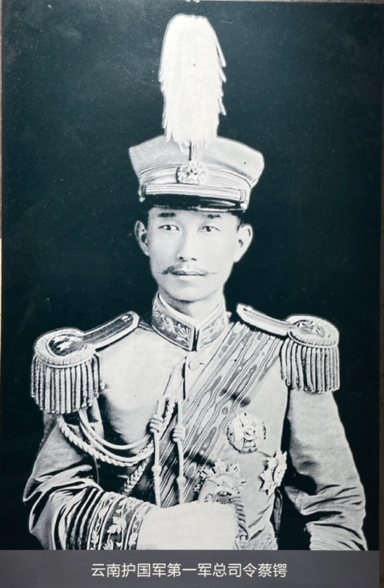

12 月 21、22 日，蔡锷、唐继尧连续主持召开军事会议，最后决定发动反袁护国战争。

蔡锷此时已对形势进行了仔细分析，有了明确的目标和计划，成竹在胸。12 月 21 日，蔡锷给四川泸州雷飙发电报，对局势和自己的计划进行了介绍。他说：天祸吾国，袁氏叛逆，以致强邻生心，内乱潜滋。际兹干钧一发之会，吾侪乃不得不负重而趋。同人于京、津计议多次，决心与此恶魔一战，以奠国家，而安生灵。袁氏诡诈阴险，此次谋叛，附和最力者不过寥寥数辈，然皆另抱目的，实已陷于众叛亲离之地，倾覆甚易。一切计划，早已分途并进，且深信其确有把握。较之辛亥之役，或尤易易。现各省如桂省陆、陈，宁省冯，早已决心，业作准备。赣、湘、浙、鲁久通联络，已得赞可。粤省党人运动亦已成熟。

# 起义

蔡锷先礼后兵，发通电要求袁世凯取消帝制。12 月 23 日，便以云南将军唐继尧、巡按使任可澄名义，致电袁世凯，要求取消帝制，惩办帝制祸首，限 25 日上午 10 时答复。同日，蔡锷与唐继尧、任可澄、刘显世、李烈钧、戴戡联名将前电通告各省。次日，他又与戴戡联名致电袁世凯，“为最后之忠告”，要求袁“于滇将军、巡按所陈各节，迅予照准，立将段芝贵诸人明正典刑，并发明令，永废帝制。..否则，土崩之祸，即在目前，噬脐之悔，云何能及！”

袁世凯不听“忠告”，到期拒不作答，蔡锷起义。12 月 25 日，正式宣布云南独立，武装讨袁，护国战争爆发。12 月 27、30、31 日，蔡锷向全国连续发出通电，痛斥袁世凯。他说：袁世凯“恃其武力，遽即骄盈，蹂躏人权，弁髦法治。国会加以解散，自治横被摧残，异己削迹于国中，大权独操于一手”，“野心愈肆，元首谋逆，帝制自为。”这是很说到点子上的。

# 攻心

按照蔡锷在《军事计划》中所说的，战争的目的是让敌人“屈其志”，而“屈其志”的实质是“攻心”，因此，蔡锷首先向全国军界人士展开攻心战。

25 日 上午 10 时过后，袁世凯未按照唐、任漾电的要求作出答复，蔡锷与唐继尧等人即将梁启超事先起草的《云贵致各省通电》略作修改后通电全国军事将领，真诚地讲述自己的道理，“屈”敌人的“志向”。电文如下：

各省将军、巡按使、护军使、都统、镇守使、师长、旅长、团长、各道尹公鉴并请转各报馆鉴：

天祸中国，元首谋逆，蔑弃约法，背食誓言，拂逆舆情，自为帝制。卒召外侮，警告迭来，干涉之形既成，保护之局将定。尧等黍列司存，与国休戚。不忍艰难缔造之邦，从此沦胥。更惧绳继神明之胄，夷为皂圉。连日致电袁氏，劝戢野心，更求惩治罪魁，以谢天下。所有原电，迭经通告，想承鉴察。何图彼昏，曾不悔祸，狡拒忠告，益煽逆谋。

夫总统者，民国之总统也；凡百官守，皆民国之官守也。既为背叛民国之罪人，当然丧失总统之资格。继尧等深受国恩，义不从贼。今已严拒伪命，奠定滇黔诸地，为国婴守，即日宣布独立，并檄四方，声罪致讨。露布之文，别电尘鉴。

更有数言，涕泣以陈诸麾下者：阋墙之祸，在家庭为大变；革命之举，在国家为不祥。继尧等夙爱和平，岂能乐于兹役？徒以袁氏内罔吾民，外欺列国，召兹干涉。既濒危亡，苟非自今永除帝制，确保共和，则内安外攘，两穷于术。继尧等今与军民守此信仰，舍命不渝。所望凡食民国之禄、事民国之事者，咸激发天良，申兹大义。若犹观望，或持异同，则事势所趋，亦略可预测。继尧等志同填海，力等载山。力征经营，因非始愿所在，以一敌八，抑亦智者不为。麾下忍于旁观，继尧等亦何能相强？然量麾下之力，亦未必能摧此士之坚，即原麾下之心，又岂必欲夺匹夫之志。苟长期相持，稍亘岁月，则鹬蚌之利，真归于渔人，而萁豆之煎，空悲于烁釜。言念及此，痛哭何云！而继尧等则与民国共死生，麾下则犹为独夫作鹰犬，坐此执持，至于亡国，科其罪责，必有所归矣！今若同声义愤，相应鼓桴，所拥护者，为国有之民国也，匕鬯不惊；所驱除者，为叛国之一人，天人共庆。造福作孽，在一念之危微；保国覆宗，待举足之轻重。敢布腹心，惟麾下实利图之。

# 召集部队

蔡锷然后向全省召集自己的部队。比如被编入蔡锷第一军的支队长朱德，正驻在滇南蒙自。起义前夕，蔡锷派专人带了一封亲笔信给朱德及其驻滇南部队中的爱国将领，向他们介绍了各省反袁斗争的形势及其前景、云南出师讨袁的计划等，要他们积极做好准备，在 12 月 25 日，蒙自能与昆明以及省内其他几个较大的城市同时发动起义。起义后，蒙自部队立即乘火车前往昆明，预备向四川开拔。

蔡锷号令即出，当年培养的部下立即响应。12 月 25 日晨，朱德就率领革命士兵驱逐了帝制派军官，宣布起义，举行了讨袁誓师大会，然后征用火车，部队全体开往昆明，向蔡锷报到。

蔡松坡先生在誓师词中慷慨地说:“ 吾侪今日不得已而有此 义举，非敢云必能救亡，庶几为我国民争回一人格而已。”

# 必死之心

蔡锷然后按照他在《曾胡治兵语录》中说的，在大战前，建立一种肃敬的气氛。蔡锷在语录中这么说：兵者，阴事也。哀戚之意，如临亲丧。肃敬之心，如承大祭。故军中不宜有欢欣之象；将军有必死之心，士卒无生还之气，此其所以破燕。

朱德见到蔡锷时，发现他的健康状态非常令人担忧，都哭了，然后蔡锷向他详细地介绍了严峻的军事形势和下一步计划，表达了自己必死的决心。美国记者艾格妮丝·史沫特莱记录了朱德见到蔡锷时的场景，如下：

朱德和他的军官朋友们到达昆明后，立即下火车赶到蔡锷司令部，发现蔡锷正和参谋们开会。

朱德说：“蔡锷起身向我们走来的时候我大吃一惊，说不出话来，他瘦得像鬼，两颊下陷，整个脸上只有两眼还闪闪发光。肺结核正在威胁着他的生命。那时他的声音已很微弱，我们必须很留心才能听得清。当他向我走来的时候，我低头流泪，一句话也说不出来。”

“他虽然命在旦夕，思想却一如既往，锋利得像把宝剑。我们坐下来，他说明了全国各地起义的计划，并且说云南必须挑起重担，等待其他各省共和派力量组织起来，三天之后，我们就要出兵四川，袁世凯有一些最精锐的部队驻扎在那里。他确信附近各省的袁世凯军队已经准备入川，并且提醒我们说，这次作战和辛亥那年大不相同。四川驻满了北洋军队，靠的是袁世凯从外国人手里拿来的贷款，所以装备良好，粮饷充足。我们绝不可能象打清兵那样，把袁世凯军队一举粉碎。光是在川南，他就有四个旅，由他的亲信统率；他的另一个朋友，飞扬跋扈的小军阀曹锟就是后来被称为‘贿选总统’的小恶棍，因为他于 1923 年在国会贿选，凡是选他的国会议员，他每人给五千现洋。”

“我们的第二军，蔡锷对我们说，要立刻出兵贵州，扫荡袁世凯在那里的部队，然后转道广西，直奔滨海的广东。第一军和其他附属部队要出兵四川，增援部队只要训练完成也应跟着调上前线。”

“蔡锷亲自率领进攻四川的部队，并担任第一军总司令。云南军由此改名护国军。”

蔡锷报告完毕，朱德发言说：“可是你不能带队去啊！你有病，要送命的。”

蔡锷望望他又把眼光移到别处，说道：“别无办法。反正我的日子也不多了，我要把全部生命献给民国。”

# 军费、军队

像蔡锷在《军事计划》中说的那样，军费、军队是军事建设最重要的两个两方面，因此，这两方面的工作也迅疾展开。

军费方面，除截留关税、盐税外，还成立了筹饷局，李烈钧任局长（李出征后，由黄德润继任），向国内外募集军费。捐款踊跃。最后南洋华侨捐款 60 多万两，昆明各界捐款 50 多万两，省商会捐款 20 多万两，昭通商会捐款 2 万两，老鸭滩商会捐款 3 万两等。

军队方面，云南省立第一中学自动组织了“讨袁学生军”，上书唐继尧说，袁世凯“鬼蜮为性，豺狼居心”，受托以来，始而终世总统，继而世袭总统，今则悍然废共和为帝政，生等群情激奋，故组织讨袁学生军，实为稍尽国民之责任。云南省高等警察学校全体学生要求出征杀敌，组织为出征“预备队”。云南陆军讲武学校为此增设班次，吸收合格青年到军校受训，准备到军中服役。扩军计划顺利完成，步兵新增 20 个团，编制从原来的8个团增至28个团，加上炮兵、骑兵、警卫军等共 36 个团，兵力增加了两倍。

# 贵州

云南起义后，贵州首先响应。

贵州反对袁世凯称帝的舆论一直存在。筹安会发生后，贵阳达修学校校长聂正邦和黄齐生等数十名教职工就通电斥责筹安会，表示坚决反对复辟帝制。

云南反袁起义后，贵州响应，要求贵州独立讨袁。知识界人士肖廷菼上书贵州护军使刘显世说：“袁世凯盗国之罪罄竹难书，流恶无尽。滇中首义，海内同声，七百万黔民喁望弥殷，请讨尤急。”要求步云南之后尘，声讨袁逆。黄齐生派外甥王若飞持书赴贵州铜仁，策动驻军团长彭文治举义讨袁。1916 年 1 月 17 日、18 日，贵州绅、学、商、农、工界代表 2000 余人在贵阳举行大会，声讨袁世凯的罪行，会后推举代表赴护军使署向刘显世上书说：“黔至今日，危殆极矣。大祸岌岌，近迫眉睫，七百万人同蹈水火。民政长官，弃民如芥；中央政府，视黔为敌。呼吁无闻，死亡谁恤。”“凡属国民，稍有人心，谁不愧愤？滇省首倡大义，举兵反对，堂堂正正，薄海同心，义声所传，咸思奋袂。”要刘显世“俯从民意，早建旌麾”。

1916 年 1 月 24 日，参与云南起义的戴戡率军抵达贵阳，面呈刘显世“袁世凯已众叛亲离，不亡何待？”刘显世最终宣布反袁。

 

| [Index](./) | [Previous](13-7-he) | [Next](13-8-law) |
