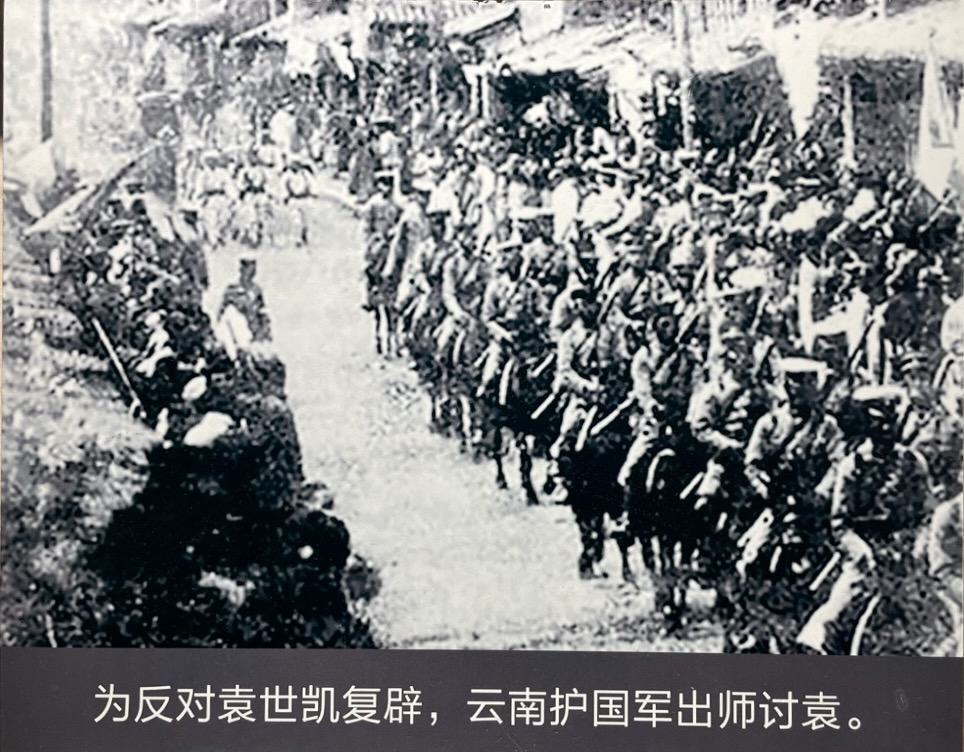

克服重重困难，护国军最终出师讨袁。

蔡锷像他在《曾胡治兵语录》中说的那样，严明军纪，以做到令行禁止，并且对部下负责，让他们走正路，同时也能获得民众的支持，“屈敌人之志”。

护国军有严格的军纪和军风。其颁布的《云南出征军队应守纪律及应注意条件》详细地规定了“行军间之纪律”、“行军间之注意”、“驻军间之纪律”、“驻军间之注意”、“战斗间之纪律”、“战斗间之注意”等多项内容。规定严格、详细，要求切实、具体，例如要求“一律严守军纪，保持秩序，勿失严整”；规定不准“乱入民家”；“休息场所必定大小便之地点，勿许任意污染，有妨卫生”；“购买须要公平，不得依势估压”；“若遇战斗，官长须要身先士卒，为部下之表率”等 50 多条。

规定最后还说明：“以上所列条件，各长官于余暇时，即集合部下讲解、教授，无论行军、驻军有暇，即行三令五申，总使心领神会，永记不忘，获益无穷矣。”又说：“所列不过择要举例，其余细目详件尚未完尽，各长官须将平日心得，按本旨热心补助讲说，胜负攸关，皆在此一念之转移，诸君其勉之。”

正义的战争，良好的军纪，赢得了民心。朱德说：护国军的出师，“自滇以达蜀地，无不箪食而迎”，受到沿途人民群众的热烈欢迎。

# 在四川

进入四川后，蔡锷针对四川曾经发生过的驱逐云南军队入境的历史矛盾，一方面严肃军纪，一方面又做了大量的解释工作，争取四川民众的支持，取得了很好的效果。

进入川境以后，蔡锷连续发布了《入川告示》、《谕四川同胞文》、《饬四川各地方官吏应严拒伪命效忠民国文》、《饬各属人民惩敌效国文》、《饬各属地方官吏造册报核文》、《饬各属筹设驿站文》、《饬各部队不得虐待俘虏》、《布告袁军在川罪行电》等十几个文告，宣传护国宗旨，对稳定地方，争取民心，起了重要作用。

这些告示采用浅显易懂的歌谣形式，以便理解和流传。其中的《入川告示一》是这样写的：
照得中华民国，成立已历岁月。
外经各国承认，内由人民公决。
不图袁贼世凯，竟敢自为帝制。
私设筹安革会，倡议倾覆民国。
假托人民公意，其实利诱威胁。
五图警告频来，内政被人干涉。
只图一家尊荣，不顾全国亡灭。
本军应天顺人，用特仗义讨贼。
各省闻风响应，粤桂黔湘江浙。
众志既经成城，袁贼覆亡无日。
咨尔士农工商，久已民国隶籍。
须知国家存亡，匹夫咸与有责。
其各闻风兴起，慎毋妄相猜测。
兵至秋毫无犯，人民各安生业。
市廛照常买卖，毋得抬价抑勒。
若或军士占霸，骚扰不守规则。
抑或奸宄生事，无端造谣煸惑。
均按军法从事，决不宽贷片刻。
特此通行布告，国民一体知悉。

《入川布告之二》是这样写的：
照得中华民国，人民铁血铸成。
暨今已历五载，国体何容变更。
袁逆背叛约法，妄想帝制自尊。
本军起义讨贼，扶持共和不倾。
告我蜀中父老，以及各界民人：
军士皆守纪律，闾阎鸡犬不惊。
四民各安生业，买卖务须公平。
切勿谣诼生事，有碍义军进行。
地方大小长官，勿得畏避逡巡。
照归供职难谨，保护地方安宁。
倘能闻风响应，本军勿任欢迎。
设有土匪滋事，拿获即正典刑。
兴亡匹夫有责，勿愧共和国民。
逆党如能效顺，一律咸与维新。
特此通行布告，其各一体凛遵。

蔡锷也发表了非常诚恳的告四川人民书，解释自己从云南来的原因，以打消当地军民的顾虑。在《谕四川同胞文》中，他解释了护国反袁的正义性及其目的，说明了护国军为何起于滇黔，又为何来到四川的道理。他说：“现在云、贵两省发动已经一个月，两省军队已开到四川，四川是应该发动的时候了。四川若趁此发动，会合我们的军队顺流而下，直到了武昌，中国的大局就算十成定了八九成了。四川的形势，据全国的上流，关系成败不小。我们所以前来四川，补助四川同胞赶速举义，就是这个缘故。”只要大家齐心，胜利必有把握，到那时“内忧也可以消弭了，外患也可以减少了。合全国的人提起精神，激发良心，同来整顿国事，何愁不有进步？那才算我们的国利民福了”。

# 效果

这些解释说明，加上蔡锷治军严明，起到了很好的效果，护国军在四川得到了支持。战争期间，记者曾在四川自流井一带采访，“与官、绅、工、商、兵、农诸界人士接谈，却未见一人赞助袁之称帝者，且每谈及袁氏必以恶言相加，由是观之，则荣县一带之人民，固欢迎护国军者矣。盖护国军既本大义以起，而人格高尚，军令森严，尤足令人敬仰，沿途秋毫无犯”。在保卫叙府的战斗中，除夕之夜，护国军战斗一天多未曾进食，入夜全城百姓，争将过年食品献出劳军。护国军第一梯团中校参谋陈天贵回忆说：护国军在叙府作战中，第二支队的交通线曾一度被敌军的炮火所阻断，致使饭食无法送进去。待第二支队获得增援，打退了敌人，恢复了交通后，司令部派人给第二支队送去饭食，却见到四川人民已经自动送上饭菜，有鸡有肉有汤，很是丰美。当时城内人民，满街满巷遍设香宴，祝祷滇军胜利，感人至深。

和护国军相反，北洋军军纪不良，立场不正，不能得到四川当地军民的支持。据蔡锷观察：“北兵在川，奸淫掳掠，无恶不作。举其所目睹者而言，逆军败后，民间被褥、媛女衣裤，狼藉满地。每见一逆兵，戒指手镯，辉煌满手，非男非女，怪状难名，每至围攻紧急，或溃退时，迭纵火毁烧民居，几成定例。旬日来，牛背石、双河场及纳溪附近部各处，焚烧民房，殆近千家。有时发见伪示，尚谓滇军纵火，贻害百姓，乞请专款赈恤等语。横暴之极，济以贪骗。人民亲眼目睹，衔之刺骨，故逆军所至，迁徙一空。其步哨、溃兵常被人民挺击，舁送本军。口操北音之人，非十人以上，不敢径行乡镇。我军所至，人民舞蹈欢迎，逃匿妇孺，相率还家，市廛贸易骤盛。甚至火线以内，常有人民携榼馈食。各野老村妪，大率彻夜诵经，祝滇军之战胜。故俘虏供词曰‘天时地利人和，都为滇军占尽，北军万无全胜之理’等语。天厌凶德，人心大去，理无不亡。”

从这里我们可以体会到，严肃军纪，做好解释工作，争取民众支持，是符合“屈敌人之志”的总体作战目标的。

 

| [Index](./) | [Previous](13-7-prewar) | [Next](13-9-war) |
