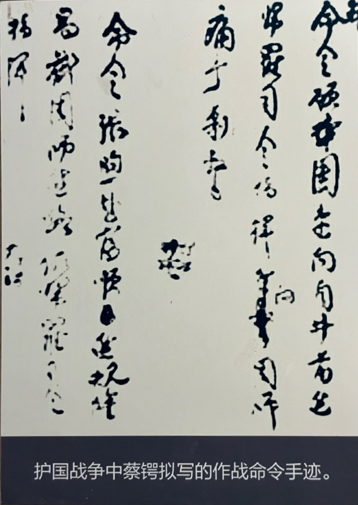
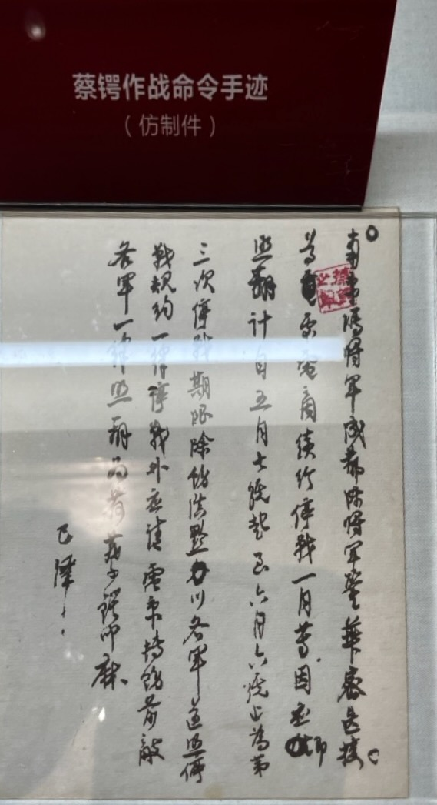

蔡锷进入四川后，刚开始非常顺利，后来在泸州陷入苦战。这场苦战，是中国内战史上，大规模使用枪炮以来，最激烈的战斗之一。蔡锷靠严格的军纪和军风撑了下来。

像蔡锷在《曾胡治兵语录》中说的，他主要采取攻势。在《曾胡治兵语录》中，曾国藩和胡林翼强调的是扎硬寨，然后以主待客，以逸待劳，但蔡锷在点评中说：这种策略在当时军备有限的情况下是可行的，但在现代战争中，因为有炮这样的装备，就不行了。现代战争中国际上的一致意见是要进行攻势。

蔡锷的攻势策略是有效的：前期战斗非常顺利，在蔡锷的攻击下，敌军一触即溃。

# 泸州

蔡锷然后来到了泸州。泸州地势险要，易守难攻，有“铁打泸州”之称，是此次作战的主战场。

非常不利的是：护国军到达泸州时，泸州已被北洋军的重兵占领，包括张敬尧师、吴佩孚旅、川军熊祥生旅，总兵力约 1.5 万人，装备齐全，战斗力较强。而蔡锷中路主军仅3130 人，其它部队，如刘存厚师约 1500 人，加上川边义勇军张煦支队约 900 人仅能承担辅助任务，不能攻坚固守。

为此，蔡锷到达四川永宁（叙永）后，曾提出了新作战方案，但迫于形势，最后进行方案变更。他说：“就现在局势观察，袁逆所称为最精锐之第七、八两师，悉驻泸纳。此间若暂取守势，牵制其主力，而以重兵趋綦渝，甚属得机得势。”这就是说，改以綦江为主攻，抄袭重庆。但没有实行。

于是蔡锷就只能用自己的几千人，进攻北洋军的几万人。虽然就像他在《军事计划》中说的那样，兵不在多，在精，所以他并不畏惧，但是，要在这几万人的敌军中杀出一条血路，难度可想而知。

蔡锷没有气馁，就带着这几千人，先后发动了三次进攻，一直到停战，都气势不减，而敌军的“志”，是大大地挫伤了，达到了他预期的“屈其志”的目标，最终导致袁世凯取消帝制，倒台。

# 熬

蔡锷攻到泸州的前沿：纳溪，在这里来来回回地，经历了一场苦战。

蔡锷在棉花坡设防后，首先和兵力和武器占优势的北军进行了一场硬仗。在这一战中，敌军火力密集而又猛烈。蔡锷紧急调各地的军队驰援，其中就有朱德的部队。

朱德率领部队，星夜兼程，几天跑了几百里，进入战场，然后当即拿着大刀，发起攻击，打退了敌人的进攻，然后又不断通过夜战、白刃战，组织反攻。连续作战四十五个日日夜夜，毫无间歇，打得敌人士气极其低落。由此，朱德一战成名。后人回忆说：“朱德赢得了勇猛善战、忠贞不渝的声誉。曾经见过他作战的人说，他每晚只睡三四个小时就够了，似乎有无穷的精力。”朱德后来也说：打大仗，他是在棉花坡学出来的。但朱德部队也遭受了巨大的损失。进入战斗的第二天（ 2 月 18 日），朱支队中英勇善战的营长曹之骅，就受重伤牺牲。

棉花坡一战影响深远。首先，此阶段时间最长，近一个月，影响全国各地最久；其次，在这一阵地战中，护国军不败，所起号召作用最大；最后，敌在护国军阵地前损耗最大，因此士气被极大地打击了。

蔡锷知道：如果不能攻，就不能守，所以亲临前线，组织反攻。他不顾身体虚弱，带病从设在永宁的总司令部驰赴纳溪前线。2 月 23 日，蔡锷到达纳溪后，与参谋长罗佩金同住在城内指挥所，日夜筹划，准备反攻。

因为指挥过分突前，蔡锷遇险，几乎丧命。2 月 24 日，蔡锷穿起士兵服装，巡视前线，顾品珍、赵又新两梯团长及卫士数人陪同前往。据邹若衡回忆：“午后经过朝阳观敌阵地前面，敌我各据一高地，其间是水田。我们沿田埂通过水田，顾率士兵四五人前行，我随蔡在中间，赵率军士四五人后跟。敌人机枪突然向我们射击。顾的身体轻捷，与军士二人急速跑进安全地区，其余二三军士和蔡与我都由田埂滚入水田隐蔽。赵的身体肥笨，即率军士四五人折头退走。水田中的军士爬上田埂追赶顾。蔡也向田埂爬，我急拉住，往下按，并说：‘动不得’。蔡想挣脱，咬我肩膀一口，我不放手。同时见追赶顾的军士一人面颊中一枪弹，被打断舌头。蔡与我泡在水深及胸的水田中。天渐黑，我摸探着一条安全路线，蔡跟随爬上田埂。罗总参谋长命警卫大队贾子寿派一个中队来接蔡，天已黑才接着，护送蔡锷回纳溪指挥部。”李曰垓说：“蔡锷虽然脱险，然已自顶至踵，遍体泥泞矣。马弁中弹，而蔡获免。此其中盖有天意焉。回首思之，盖已险不可言矣”。

这段时间，蔡锷“每日睡觉不到三点钟，吃的饭一半米一半沙硬吞”。他的疾病也很痛苦。他说：“予近月来颇为病所苦，两星期内喉病加剧，至不能发音。每至夜中，喉间痒痛，随而大咳。”“此病起自去冬，因国事奔驰，迁延未治，遂至缠绵。”对于那时的蔡锷，朱德也回忆说：“蔡锷声音越来越弱，两眼却依然炯炯有光，军服穿在他那瘦骨嶙峋的身上，就象寿衣一样。”

蔡锷在前线视察后认为，护国军与敌对阵拉锯，难以持久；应当集中兵力，对敌发动有力攻击，方有取胜可能。因此，2 月 28 日发动反攻。蔡锷在命令中说：“本总司令与蜀军刘总司令（存厚）编成督战队，现在战线后方督战，凡无命令后退者，立即就地枪毙。”

由于部队疲劳，无援军，经费、饷械、弹药缺乏，反攻未能取得根本进展。蔡锷在当时函电中就曾说：“所难者枪支多破损，未能克日修理；衣服褴褛，未能换给；弹药未能悉加补充，而饷项已罄，乞灵无效。”“所最苦者，弹药未能如时到手，每难收战胜之效。老兵伤亡，无已练之兵补充，致战斗力因而日弱。”

3 月 8 日，因为弹药缺乏、士兵疲惫、敌人顽强，攻势受挫，蔡锷不得不同意后撤修整。此时，蔡锷给唐继尧发电报说：“惟旷日相持，敌能更番休息，我则夜以继日;敌则源源增加，我则后顾难继。言念前途，岂胜焦灼。”面对这种艰难情形，蔡锷虽然也很苦恼，但还是坚持不撤，但敌人确实很顽强。蔡锷说：敌人聚集在一起，防守起来就很顽强。蔡锷硬撑了两天，最后下达撤退命令。

对撤退，蔡锷很不甘心。他说：“熬不过最后之五分钟，曷胜扼腕……”。他说：“纳溪战事，本可有为。弟（蔡锷自称）一意主积极，而榕轩（罗佩金）、积之（刘存厚）则深以子弹不给，士气不扬，疲劳太甚为虑，非暂退不足以全师。议节节防守，俟子弹续到，元气稍固，再行进取。弟期期以为不可，退却之命，缮定不发者屡日，既发复予迁延一日。乃各方面煎迫多端，遂不得不以退为进矣。熬不过最后之五分钟，曷胜扼腕……”此时，敌军“胆已落。三月八号，我军移转阵地，，竟不敢追出一步。”

即然战争就是“熬”，那么怎么熬呢？就是靠心中的志气。蔡锷在给夫人的家信中说：以棉花坡为中心的纳溪保卫战，“鏖战经月，日眠食于风雨之中，出入乎生死以外，总计伤亡及失踪不明者不下千人，而乱军死伤尤众”。“弥月以来，纳溪之役，逆军死伤三四千人，其胆已落。”我军由于“士气百倍，无不一以当十”。因此伤亡相对较少，且“屡濒于危，皆能绝处逢生”。

从这里我们就可以完整地理解蔡锷在《军事计划》《曾胡治兵语录》中说的这些话了：

首先，兵者，阴事也。部队要有哀戚之意，如临亲丧。肃敬之心，如承大祭。军中不宜有欢欣之象；将军有必死之心，士卒无生还之气，此其所以破燕。

其次，战争的目的，是要“屈敌人之志”。要“屈敌人之至”，首先得自己“立志”：有志者事竟成。然后，在你死我活的战斗中，敌我双方都处在地狱之中，就看谁能“熬”过去。什么人能熬出来，就是对自己的“志”有坚定信仰的人，就是有”必死之心“的人，就是平时辛苦操练，以致以艰苦为平常的人。

就是蔡锷治军的法宝。

# 再战

虽然对撤退非常惋惜，但是蔡锷没有放弃。他一方面用军法先稳住阵脚，另一方面逐个走访连队，恢复士气。他说：“昨今两日，默察将士情状，其精神似甚颓丧。”为此，他下令用军法稳定军心。他下达命令：“将士纷纷奔永宁者当不少，务截留押解前来，并择三数人诛之示儆 (枭首示众亦可)”。

虽然部下建议防守，但蔡锷认为专守也是靠不住的，因此继续进攻。10 天后的 17 日，蔡锷就又组织发起攻击。下面是蔡锷发布的作战命令。

因为资源有限，所以蔡锷此次进攻时调整了战术，减少攻坚，保存实力。他发现敌军“极无攻击精神，我军对其正面，只宜配布少数之兵，而以主力冲其侧背，彼自溃走。” 因此，他这样布置：“攻坚大不易，徒挫锐气。逆军如筑有防御工事，务从其侧背击之。此着虽属冒险，然对此顽于守钝于攻之逆军，施以此种战术，尚无碍也。”又取得一系列进展。

对于这次后撤后的再次攻击，他的部下印象非常深刻。部下石陶钧说：“我军苦战纳溪城东棉花坡一带，阵地昼夜不得更代，给养不及半具，子弹不以时至，其疲惫之度殆已无可拟语。赖以支柱者，精神之奋兴耳。一旦背进，衰竭之实，遂不可讳。部将忧之，图减正面兵力以谋专守。但松公以为循此现状，即专守亦无可信，非先作我士气不可！乃遍历行间，耳提面命，以血泪申大义，以军法励怯懦，竭移山填海之力，矢有进无退之心，将此仅存之 3130 人，人人灌以一绝而后苏之兴奋剂，即以一己之精神力平均分配其几许于其所部之人人。”石陶钧最后感叹道：“此时直谓全军佐胜之具，确已不在枪械子弹之属，而直接取效于松公一身之举动焉可也！陶钧经历战役屡矣，此实平生仅见！”

梁启超也重点回顾了这次进攻。他说：“我军最危险时期，松公屈于部曲之议，乃暂退。书中所谓熬不过最后五分钟，曷胜扼腕也。退后，松公煦抚其士卒，使朝气复苏。越三日，乃为沉痛的演说，誓必以死，人人感奋，后此能转败为胜以此。惟能败者，乃为名将，信然。”

对这一段经历，蒋百里总结道：纳溪之役，士气稍稍衰，公能鼓舞之，率与俱进，士气复大振。其与军事，盖天才也。

这次攻击又取得进展，蔡锷恢复了阵地，收复纳溪，但因为缺少弹药，敌军增援，蔡锷此次又没有达到消灭敌军主力的目标。他说：近日两战虽获大胜，然未能将最顽悍之逆军第七师一鼓歼灭，殊为遗恨。盖一因子弹告罄，一因逆军得第八师之新援，流星光底，遂逸长蛇。

而且，敌人增援后，蔡锷又面临兵力不足的严重问题。他说：查逆军现有兵力，系张敬尧之一师，计十一营，初人川时约九千人，历经战役，现时所存当不过五千人。益以新到第八师之王旅，仍在八千人以上。我军现额实不足四千，其中义勇队近千人，战斗力尤弱。

因此，1 周后的 24 日，他不得不转守势，并请求云南方面支援。他说：现在作战计划，仍以扼守要点，集结主力，多张疑兵，以分敌势，俟有隙可乘，分头击破之。所最苦者，弹药未能如时到手，每难收战胜之效。老兵伤亡，无已练之兵补充，致战斗力因而日弱。务望蓂公将每枪所储弹药千发，悉数饬解，分存毕、永，并每月拨送补充兵五百乃至千人。

# 停战

从发动战争开始，蔡锷就在一直不停地做敌军将领的思想工作，不断写信，晓以大义，陈以厉害，以达到“屈其志”的目的。

这些工作带来的第一个成果是冯玉祥的停战。冯玉祥也是辛亥革命的功臣。他奉袁世凯命令，占领叙府后，不再前进。收到曹锟、陈宧、张敬尧来电的质问时，他回电说：“官兵病者太多，故暂作休息。”后来干脆回答说：“官兵不但身上有病，心里亦人人有病，务请速作主张。”因此，叙府城附近，南北两军实际上处于休战状态，双方暂取守势。稍后，冯玉祥将所部开往成都，和同情护国军的陈宧的参谋处处长刘一清一道，规劝陈宧独立反袁。

这些工作带来的最大的成果是和北军的主力张敬尧的停战。在蔡锷的一连串进攻下，张敬尧已经被蔡锷打得失去了斗志，同意停战议和。张敬尧说：“我自当排长起，现在已到师长并总指挥，未离开二十五团，你们那一顿刺刀搠死我七八百人，全师共死两三千人，我的精锐消耗殆尽，你看伤心不伤心，我还打什么？”

这就是蔡锷所说的：战争是要“屈敌人之志”的胜利。下面是蔡锷在停战时期发布的命令。

# 石陶钧回忆

从逃离北京，到鏖战泸州，蔡锷一路艰辛。可是他在患难中，不以为苦，反以为乐，同时也透支了自己的健康。石陶钧在上海蔡锷追悼会上的演说词是很好的证明。下面是石陶钧的回忆：

首先逃离北京就是非常惊险的。石陶钧说：先生出京后，在上海遇非常危险，仅买一报。后由香港到云南时，已有病在身，因精神上所受的，身体上所受的皆足致死。然其志不稍懈，故到滇卒立大功。我常偕行。

然后，到了云南后，收集军队，出兵，真的很难。石陶钧说：到云南，大局已布置定当。然当夕各方面的人，均以为军队甚难，因散处各方，未易聚集。先生计划与精神，我初见时气色不佳，问其理由，他说精神刺激之故。布置后，由云南出发，先生誓师时，早有必死之心，愿大家同归于尽。其日天气甚佳，惟云最多，故日云南。先生动身之日无云，亦是奇事，云南人以为从古未有。

出兵途中，路途艰苦，生活艰苦，疾病缠身，工作繁忙，精神上也高度紧张。石陶钧说：路途艰难，云南为最，由云人川，其苦可知。每天一站，重了上去，兵力日渐增多，自己不能不先走。还有贵州龙建章。所有军队实放心不下，所以刻刻留意。究竟先生为总司令，是应走否?总司令官并非指挥军队过了埠头，在后动身，惟须先行，然后军敢跟上，故知当日困苦情形。但身体上所受的苦，没有精神所受的大。每日五点记簿，七点膳，八点走路，中间经贵州界多日高山，非常艰难。那时自己病已深人。到四川后，最奇者，平日多雨，路又甚窄，故多各为难之甚矣。早膳后安排一切，午膳休息。因先生抵川后，每于膳后将余剩之饭盛贮匣中，饥时取食，每见其咽哽，我知其喉病已重。且先(生)对于军事报告、电报公事，手自披阅，又不多时，又要上马，一天步的路非常崎岖，平人坐轿，先生则不能(不)走。

蔡锷事事亲力亲为，非常辛苦，但也正因如此，将士都很用命。石陶钧说：总总方面看起来，先生所做得人人可做。将来电报印出后，方知所注的皆是先生手笔。且军中处处装电话，先生亲接。譬如三里路外有警告，则有电话来去，岂不灵便。天天在风霜雨露中牺牲。一日到了比[毕〕州，是贵州重要的地方，有火神庙，该地方水汽非常之重，住了几天，雪大非常，陷于苦境。四日报告来，先生自己要去，参谋长说不要去。九日到了，又有剧烈的战争，清早亲到炮兵处四十分钟，望远镜望之，距敌甚近。警告来时，兵士皆愿赴前敌(青龙镇)。敌人所据最坚固处，先生督军前进。敌人见我人没有携枪，因军火少，故先用枪刺冲锋，不轻易发弹也。所有的军官皆愿牺牲生命，故以后无论如何皆能用命。但敌人的枪弹范围敌不远。

他做事精细，令部下佩服。石陶钧说：我们先生做事非常精细，有一天正在吃饭，见一城楼为敌人最好目标，先生以值时军书旁午，安排军事如功课一般，因敌人有坚固营垒三处，我们部下兵力单薄，恐难取胜，先生即想一退兵诱敌方法，徐图再进，藉此休息，训练兵士，振作士气。

他出奇制胜，也令部下佩服。石陶钧说：故后来泸州、纳溪之战，虽二面受攻，均获奇兵制胜。先生为中国最有学识之军宫，神妙不测。但惟一以诚心为用，是后来军中指挥官之模范。处此危境，能获胜者甚少，先生独能以少胜多(因军士不及敌人四分之一)，且支持日久。最有价值之胜仗，系在三月初七一天，乘敌人暇怠，出兵战胜，夺获军械及机关枪不少。彼时我军没有机关枪，即用敌人之枪弹，于十七日并力攻打，自早上三时战起，至八时已经克复占领敌地。他们炮兵见我们去，大叫红帽兵来了，大家便走。现在纪念品尚在那里。此役战胜，先生方说为常胜军矣。

打赢之后，蔡锷对善后又异常操心。石陶钧说：到了三月下浣，帝制取销，就此停战。随又料理善后，颇非易事。

虽然蔡锷不以为苦，但这些消耗，也透支了自己的健康。石陶钧说：先生虽精神困惫，料事如常，无论患难，毫无畏缩。故知其精神百倍，而病益伏于此矣。

# 烈士

护国之战，蔡锷打得辛苦，将士们也做出来巨大的牺牲。比如为了支持泸州前线，先后从叙府抽出 4 个营支援。结果叙府仅剩下田钟谷一个营，其中能出战的仅 200 多人，另有一炮兵连，但只能作步兵阵后支援。2 月 29 日，冯玉祥旅、伍祥祯旅一个团 3000 余人进攻。田钟谷营兵力悬殊太大，被迫后退，刘国威连奉命掩护田营后撤，坚守阵地，与敌人死战，结果全连伤亡殆尽，刘国威亦阵亡。

这些烈士是值得我们纪念的。

# 结果

蔡锷和北军商量停战后，国内的政局不断变幻，他们也就一再续约，继续停战，直到袁世凯死亡。

袁世凯死后，两军和解，蔡锷进入泸州。袁世凯死后第二天，即 6 月 7 日，蔡锷命令朱德进入泸州。朱德回忆说：“那时候，我这一旅穿得破破烂烂，活像一群叫化子。”“我的身经百战的第十团，得到了首先开入泸州的荣誉。这一团一大半人已经阵亡，就是新补充上来的也都变成了老兵。我们把军容稍稍整顿一下，就开进了泸州。泸州人又是放爆竹，又是挂旗，又是欢呼，又是歌唱，盛情欢迎我们。我们从这边进城，北洋军队就从另一边逃走，又劫又抢。这帮家伙用征服者的姿态开进四川，逃出去时则和土匪一样。”

蔡锷被抬进朱德司令部附近的住所里。医生命令蔡锷卧床静养，禁止见客，等稍好一点就去成都。蔡锷虽然卧床，仍把秘书和参谋长叫到床边，研究重建四川的计划。朱德劝了几次，蔡锷用低弱的声音说，他剩下的日子不多了，而他做的事则可能会决定西南的，甚至祖国的命运。

 

| [Index](./) | [Previous](13-8-law) | [Next](13-10-write) |
