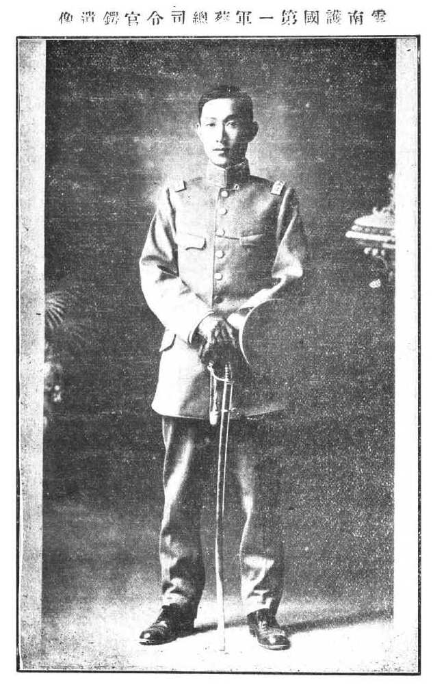

蔡锷最后放下了四川的事务，在家人的陪伴下，前往日本治病。

# 思念家人

大局初定后，他开始思念家人。5 月 16 日，在给夫人的一封信中，他说：“与君别久，相忆殊深。月来养疴来永，公务较简，而回溯远道之思，时潮涌于胸臆。假使能仗飞机，驶赴五华，图片时之良晤，予病当不药而瘳矣。月前有自湘来者，谓阖宅无恙，端生甚健适，屈指计之，将周两岁。时日不居，岁月如流，追怀旧事，殊不胜今昔之感。前函谓永宁貌与端生相若，近来如何? 有无不同之点? 永儿之眼光如何?能如端儿之眼奕奕有神否?端儿初生一二月间，因无良乳，颇觉羸弱，迨得麻奶妈后，始渐壮健。后又稍瘦瘠，然精神则甚旺也。今永儿则如何，较其兄好带否?老三自返滇后，似不甚舒适，近来何如?”，思念之情，令人动容。

5 月 20 日，他收到夫人来信后，回信说：“昨接来书，慰我良多，借谂玉体清吉，永儿已能嬉笑，甚盛，甚盛。”“现已促成都独立，颇有把握。成都独立后，则我军声势更浩大，袁倒必矣。举战以来，一切顺利，皆出意想之外，可以卜天心矣。戎马倥偬中苦忆汝母子，望摄一相片寄来为幸。”

# 相约退隐

蔡锷深知战后的政治角力会非常复杂，因此意图退隐。5 月 26 日，蔡锷问夫人是否愿意和他一起隐退。，他在给夫人的信中说：“而大局稍定，争权夺利者，必蜂拥以出。予素厌见此等伤心惨目之情状，不如及早避去之为得。一俟局势略定，即当抽身引退，或避居林泉，或游海外;为疗病计，以适国外为佳。贤妹亦有偕行之意否?”

至此，蔡锷信守了自己“成功就下野，绝不争地盘”的诺言。他说：“锷锋镝余生，无意问世，且夙病未痊，亟待疗养。拟俟本军部署稍定，即行解甲归休，遂我初服。款款愚忱，伏乞鉴察。”

他也建议各省督军退隐。他说：“蓂公谓善后问题均未解决，系铃解铃，仍在吾辈，洵属至言。而所谓善后问题者，俱易解决。惟关于个人之权利加减问题最易为梗。今侪辈中果有三数人身先引退，飘然远翥，实足对于今日号称伟人志士英雄豪杰一流，直接下一针砭，为后来留一榜样，未始非善。”

此时，蔡锷的病情已经很重了。他在 1916 年 6 月中下旬的几个电报中提到自己的病情说：“患喉头炎已半年余，初发时，久未治，致成慢性。现已成颗粒性，夜间多干咳，殊痛楚。日来发音甚微弱，且以为苦。”又说：“喉病日剧，殊痛楚，几于不能发音。”“喉病起自去冬出京以前，迄无疗治之余裕，今已成顽性，非就专门医院速为调治，似难奉效。”

# 四川工作和告别

在四川军政各方的热情邀请下，蔡锷带病到达成都，坚持工作了一段时间，很希望有所作为。7 月 6 日，北京政府任命蔡锷为四川督军兼省长。然后，四川军政各方“并力劝驾赴蓉，接前敌将士及各属绅民函电，亦纷纷请求速西上就任”。于是，蔡锷于 7 月 21 日离开泸州，29 日到达成都。到达成都后，他大刀阔斧地整编在川军队，统一财政收支，并制定军队、官吏奖惩条例。

但此时蔡锷的病势日重，实在无法坚持工作。于是再三电请辞职治病。这时，他的喉病“经德医施治后，肿痛更剧，声音全失，精神萎顿，饮食骤减”。因此，短暂地布置了一些四川重建的事宜后，蔡锷就离开了四川。

临走时，他发表《告别蜀中父老文》。这又是一篇真情实感的文章，从中可以看出他对“民权”发自肺腑的热爱。他说：

锷履蜀土，凡七阅月矣。曩者驰驱戎马，不获与邦人诸友以礼相见，而又多所惊扰，于我心有戚戚焉。顾邦人诸友曾不我责，而又深情笃挚，通悃款于交绥之后，动讴歌于受命之余，人孰无情，厚我如斯，锷知感矣。是以病未能兴，犹舆舁入蓉，冀得当以报蜀，不自知其不可也。乃者视事浃旬，百政棼如，环顾衙斋森肃，宾从案牍，药炉茶鼎，杂然并陈，目眩神摇，甚矣其惫，继此以往，不引疾则卧治耳。虽然，蜀患深矣！扶衰救敝，方将夙兴夜寐，胼手胝足之不暇，而顾隐情惜己，苟偷食息，使百事堕坏于冥冥，则所谓报蜀之志，不其谬欤！去固负蜀，留且误蜀，与其误也宁负。倘以邦人诸友之灵，若药瞑眩，吾疾遂瘳，则他日又将以报蜀者，补今日负蜀之过，亦安在其不可？锷行矣，幸谢邦人，勉佐后贤，共济艰难。锷也一苇东航，日日俯视江水，共澄此心，虽谓锷犹未去蜀可也。

翻译为白话文是：

我在四川这片土地上已经待了七个月了。过去因为忙于奔波战事，未能与当地的朋友们以礼相见，还常常给大家带来惊扰，心里感到非常不安。然而，当地的朋友们并没有责怪我，反而情谊深厚，在战乱平息后真诚相待，还在我接受任务之后称赞歌颂。人非无情，对我如此厚待，我深感感激。所以，尽管病情未愈，我仍然坚持被抬到成都，希望能为四川做些贡献，自己却不知道这能以实现了。

刚上任十几天，各项事务纷繁复杂，环顾官署森严肃穆，宾客与随从处理公务，药炉茶壶，杂陈一堂，眼花缭乱，精神恍惚，身体极度疲惫。这样下去，不是请病假就是卧床办公。然而，四川的祸患非常深重！要扶持衰弱，救治困厄，本应早起晚睡，辛勤工作，而如果因顾及自己的病情而偷懒休息，让百事荒废在黑暗中，那么所谓报答四川的志向，不就大错特错了吗？离开确实对不起四川，留下又会耽误四川，与其留下误事，不如离开。如果当地朋友们的祝福像药物那样见效，我的病得以痊愈，那么将来我必定会再次为四川效力，弥补今天对不起四川的过错，这也是完全可能的。

我要走了，请代我向当地朋友们道谢，勉励他们辅助后来的贤能之人，共同渡过难关。我乘一叶小舟向东航行，每天俯视江水，清澄我的心境，可以说我虽然离开了四川，但心仍然在这里。

蔡锷对四川做事的艰难当然也非常清楚。他在给朋友的信中说：蜀虽可为，但民情浇薄虚矫，绝不适于从军，若专用外军，屏绝土著，主客不相容，终成水火。加以连年变乱，巨绅良民，多习为盗雕，恬不为怪，澄而清之，谈何容易。故弟常谓治蜀非十年以上不能收效。开始二三年中，须临以雷霆万钧之力，芟夷斩伐，不稍姑息。俟乱根既尽，民志渐苏，乃嘘以阳和之气，培植而长养之。殊盛业也，而弟意甚漠然。

他也婉拒贵州、湖南、北京的邀请，说一定要治病去了。他回复来自北军的邀请说：北军朴勇耐劳为全国冠，惜少国家思想与军人智能，得贤将领以董率改造之，确可植国军之基础。弟甚欲置身彼中，为此后改良之导线。

# 与朱德告别

蔡锷离开成都后，在泸州见到了朱德，和朱德告别。蔡锷从成都先到泸州，拟从泸州乘船，经长江顺流而下。在泸州时，在朱德的家里休息了几天，这时的朱德已是滇军旅长，驻扎在泸州。

据史沫特莱的记载：朱德看到蔡锷的情况，绝望的感觉立刻涌上心头。蔡锷看上去像一个幽灵，虚弱得连两三步都走不动，声音微弱，朱德必须弓身到床边才能听到他说的话。

蔡锷低头说：“这次去日本，既费时间又费钱，因为已经自知没救了。”可是，他并不畏死，只是为中国的前途担忧。蔡锷原来希望把四川重建为共和派的坚强基地，可是他只为军事改编奠定了一点基础。

朱德听着蔡锷的话，对未来忧心忡忡。朱德深知：过去是蔡锷用其天才和无私把护国军中的将领维系到一处。一旦蔡锷这位“危险的智星”离开四川，护国军中的野心分子就会跳出来，成为军阀。朱德说：在西南，还没有人能赶得上蔡锷的才华。

# 与黄兴告别

蔡锷然后到达上海，见到了黄兴。他们是真正的知己。

蔡锷和黄兴都很正直，或者说太正直，以致像袁世凯说的那样，他们易受小人之欺。袁世凯曾经对亲信说：“黄氏性质直，果于行事，然不免胆小识短，易受小人之欺。”

蔡锷和黄兴“易受小人之欺”，这是事实，以蔡锷在广西治军时被学生发动“驱蔡运动”，失望离开为例，他确实受了小人之欺。而黄兴也是如此，他在与同志合作的过程中，一忍再忍，一退再退，从来没有争过，只是自己亡命冲在最前面，也是受了很多小人之欺。

但“胆小识短”却是袁世凯自己的理解。袁世凯从自己的处世哲学出发，认为和小人作战，就得不择手段，以眼还眼，以牙还牙。小人黑我，我就比他更小人。所以袁世凯觉得黄兴做不到这一点，显得躲闪，是胆子小，见识短，逃避。

但蔡锷、黄兴自己不这么看。蔡锷在云南时劝他的部下不要在意广西的那些小人时说，不要浪费时间和小人计较。他说：中外伟人，无不为世所诟病，不用放在心上。

但无论如何，蔡锷和黄兴是“易受小人之欺”。在现实世界中，是用袁世凯的办法，还是蔡锷和黄兴的办法，就见仁见智了。我觉得都可以。

当然，蔡锷和黄兴自己也非常知道这一点，因此他们两互相非常珍惜。黄兴知道蔡锷要到上海，特地派儿子黄一欧在码头等他。一欧后来回忆道：“他躺在床上，病情已经到了严重的阶段，瘦骨清肌，面容憔悴，声音也痛哑了。”

黄兴曾经写过一副对联：唯有真才能血性，须从本色见英雄。如下图：

真才、血性、本色、英雄，就是黄兴、蔡锷对自己的期许啊。

毛泽东曾将蔡锷与黄兴相提并论，视为做人的“模范”。

 

| [Index](./) | [Previous](13-13-shanhou) | [Next](15-3-write) |
