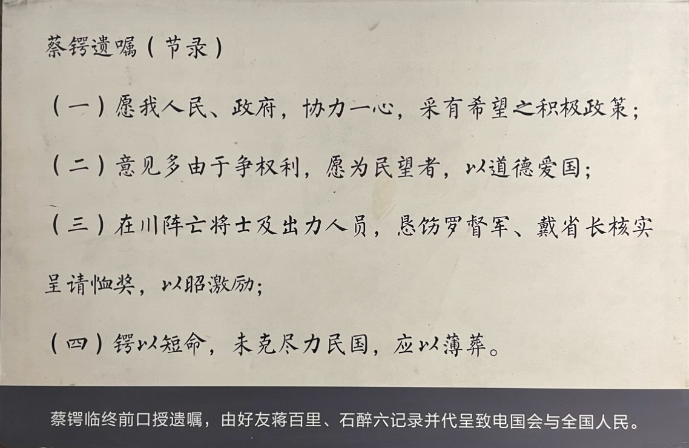
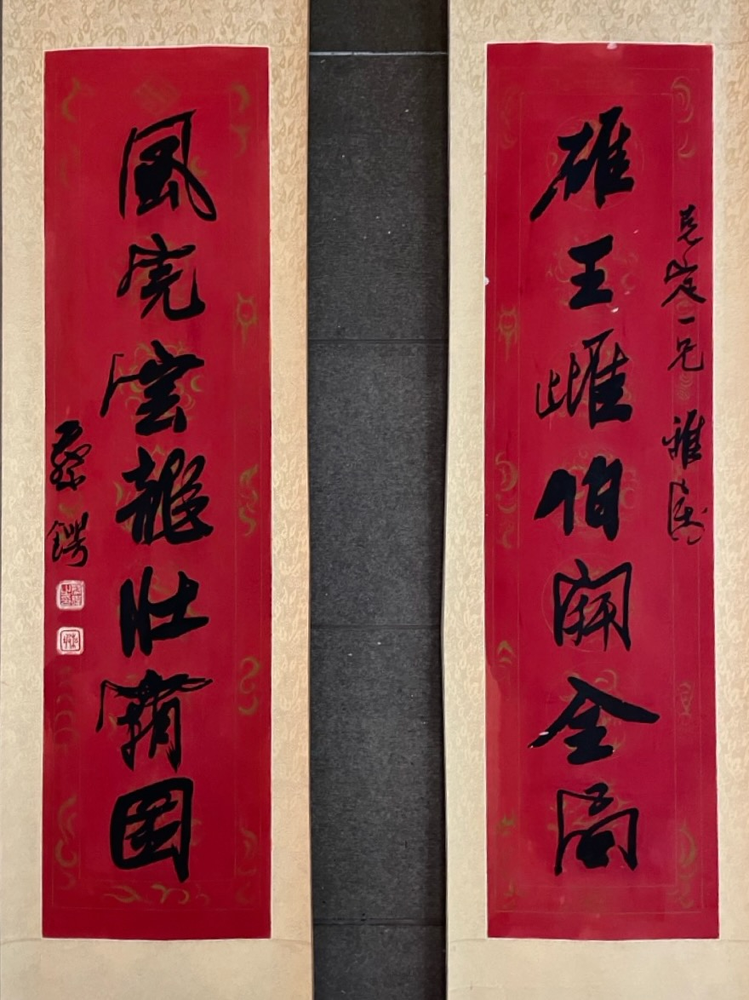

8 月 28 日，蔡锷到达上海，情况非常糟糕。梁启超“会着他，几乎连面目也认识不清楚，喉咙哑到一点声音也没有，医生看着这病是不能救了”。黄兴儿子黄一欧回忆说：“先君（黄兴）当时是极力主张松坡先生摆脱一切，出川疗养的。松坡先生最后接受了朋友的劝告，毅然摆脱一切，离川东下，于8月28日到达上海。松坡先生抵沪时，先君命我代表他前往码头迎接。我上轮船谒见，只见他躺在床上，病情已经到了严重的阶段，瘦骨清肌，面容憔悴，声音也痛哑了。”

蔡锷抓紧时间写作。他要写出自己的思想，让后人能看到它们，让自己没有白来世界一回。虽然投身军界十几年，但破坏是为了建设，建设靠的是思想。所以，写下自己的思想，是最重要的。上马统帅千军万马，也只是为了让自己思想和志向得到实现。所以他不是一个唯命是从的军人，而是一个独立思想，志行合一的人。

# 《盾鼻集》序言

他首先为梁启超记录护国战争的文献《盾鼻集》写了序言。这篇文章回顾了自己和老师的心路历程，真挚感人，读之令人泣下，全文照录如下：

帝制议兴，九宇晦盲，吾师新会先生居虎口中，直道危言，大声疾呼，于是已死之人心，乃振荡而昭苏。先生所言，全国人人所欲言，全国人人所不敢言，抑非先生言之，固不足以动天下也。

西南之役，以一独夫之故，而动干戈于邦内，使无罪之人，肝脑涂地者以万计，其间接所耗瘁，尚不知纪极，天下之不祥，莫过是也。而先生与锷，不幸乃躬其事。

当去岁秋冬之交，帝焰炙手可热，锷在京师，间数日辄一诣天津，造先生之庐，谘受大计。及部署略定，先后南下，频行相与约曰：“事之不济，吾侪死之，决不亡命；若其济也，吾侪引退，决不在朝。”

盖以中国人心陷溺之深，匪朝伊夕，酿兹浩劫，其咎非独一人，要在士大夫于利害、苦乐、死生、进退之间，毅然有所守，以全其不淫、不移、不屈之慨，养天下之廉耻，而葆其秉彝，或可以激颓风于既扇，而挽大命于将倾。盖谓国之所以与立于天地者，必此焉赖。若相竟于事功之末，譬如扬汤止沸，去之愈远矣。

锷既挥涕誓众赴前敌，屡濒于死，不死而得病。先生亦间关入两粤，当锷极困危之际，突起而拯拔之，大局赖是以定。先生不死于粤，其间盖不能以寸，而军中遭大故，抱终天之恨。

呜呼！吾侪躬于与不祥之役，固宜为不祥之人也。今国体既已不失旧物，全国人民当创巨痛深之后，厌乱切而望治亟。但使国中干城之彦，搢绅之英，惩前毖后，鉴数年来酿乱积弱之源而拔塞之，则此等不祥之事，何至复见！则先生与锷之罪，其皆可未减也。

秋九月，锷东渡养疴，道出沪上，谒先于礼庐，既欷歔相对相劳苦，追念此数月中前尘影事，忽忽如梦。锷请先生裒集兹役所为文，布之于世，俾后之论史者，有所考镜，亦以著吾侪之不得已以从事兹役者，此中挟几许血泪也。若以此为先生之事功，先生且将蹙然无以自容，小子夫何敢！

中华民国五年九月初九日

翻译如下：

GPT 翻译

帝制复兴的议论一出，整个天下一片黑暗，我的师傅新会先生身处险境，直言不讳，大声疾呼，于是已经死去的人心才振作起来并苏醒。先生所说的话，是全国人们想说而不敢说的，如果不是先生来说，根本不足以动摇天下。

西南之战，因为一个独裁者的缘故，引发内战，使无辜的人成千上万地丧命，其间接损失难以估量，天下的不祥事莫过于此。而先生和我，不幸亲身参与其中。

在去年秋冬之交，帝制势力如日中天，我在京城，每隔几天就去天津，拜访先生的住所，咨询大计。等到部署大致确定，先后南下，我们多次相互约定说：“事情若不成，我们宁死也不逃命；若成功了，我们就退隐，绝不留在朝廷。”这是因为中国人的心陷溺太深了，不是一朝一夕形成的，最后酿成这场浩劫，因此罪责也不在一个人身上。关键是士大夫们在利害、苦乐、生死、进退之间，毅然有所坚持，以保持他们的操守，不受诱惑，不被动摇，不屈服，从而养育天下的廉耻心，保持其本性，这样或许可以挽救已经衰败的风气，扭转将倾的国家命运。国家要能立足于天地间，必须依赖这种精神。如果只是追求事情的成功，就犹如扬汤止沸，离目标越来越远了。

我挥泪誓众上前线，多次濒临死亡，却侥幸活了下来但得了病。先生也辗转进入两粤，当我极度困危时，先生突然挺身而出，拯救了我，局势才得以稳定。

先生虽然没有死在粤地，但离死亡的距离，比寸还短，而我在军中遭遇的重大变故，让我抱恨终身。

唉！我们亲身参与了这场不祥的战役，注定成为不祥的人。现在国体已经恢复，全国人民在经历了巨大的创痛之后，厌恶战乱，迫切希望安定。只要国家的栋梁之才，士绅中的精英，能吸取前车之鉴，防患于未然，洞悉近年来酿乱积弱的根源并加以铲除，那么这种不祥的事情，何至于再见！这样的话，先生与我的罪过，也就可以减轻了。

秋九月，我东渡养病，途经上海，拜访先生于礼庐，相对欷歔，共诉辛苦，回忆这几个月中的往事，如梦一般。我请先生收集这次战役中的文稿，公之于世，让后来的历史学家有所参考，以表明我们不得已参与这次战役的苦衷，其中夹杂着多少血泪。如果把这作为先生的功绩，先生恐怕会惭愧无地自容，我作为小辈，怎敢妄言！

# 《军事计划》绪论

他还惦记着自己写的《军事计划》，为之写作了绪论，说明了国本、国是、政略、战略、军队的关系，指出“屈其志”是战争的关键。

他强调要有目标长远的政略，确定好敌人，预筹好政略后，再开始练兵。他说：“政略之相持，非一朝夕之故也，其端绪可先时而预测，故其准备可先事而预筹，夫而后可以练兵焉。”具体来说，英国是海洋商业国家，制海权是它的生存之源，因此治海军；德国的地形无险可守，所以治陆军，以东西同时受敌为标准。总之，“政者战之原，敌者兵之母。故治兵云者，以必战之志，而策必胜之道者也。”

全文如下：

国于世界，必有所以自存之道，是曰国本。国本者，根诸民族、历史、地理之特性而成。

本是国本，而应之于国内外及周围形势，以策其自存者，是曰国是。

国是者，政略之所出也。战争者，政略冲突之结果也。军队者，战争之具，所用以实现其政略者也，所用以贯彻其国是者也，所用以维持其国之生存者也。

故政略定而战略生焉，战略定而军队生焉。

军者，国之华，未有不培其根而能华能实者也。

战争为政略冲突之结果，是为近世战之特性。日俄之战，即俄罗斯之远东政略与日本相冲突也。

庸讵不可以交让乎？藉曰政略可以交让也，国是而可以交让乎？国本而可以交让乎？

不可以让，则彼此各以威力相迫，各欲屈其敌之志以从我。近世兵学家下战争之定义曰：战争者，政略之威力作用，欲屈敌之志以从我者也。

夫曰屈其志，乃知古人攻心之说，真为不我欺也。

政略之相持，非一朝夕之故也，其端绪可先时而预测，故其准备可先事而预筹，夫而后可以练兵焉。

英之为国，环海而重商，制海权其生存之源也，故其治海军也，以二国之海军力为标准。

德之为国，当四战之地，左右邻皆强，无险可恃，则恃以人，故其治陆军也，以东西同时受敌为标准。

政者战之原，敌者兵之母。故治兵云者，以必战之志，而策必胜之道者也。

此间他看到日军飞机演习，就对蒋百里说：“我早晚就要和你们分手了。我们建设国防尚未着手，而现代战争已由平面而转立体，我国又不知道落后了多少年！”

# 悼同志

汤觉顿、王广龄、谭学夔等人在广州进行护国运动的交涉中被杀。蔡锷写了挽汤觉顿、王广龄、谭学夔联：才若晨星，国如累棋，希合而支持，乃聚而歼绝; 君等饮弹，我亦吞炭，与生也废弃，宁死也芬芳。

# 悼黄兴

1916 年 10 月 31 日，黄兴突然病逝，时年 42 岁。这给正在日本治病的蔡锷以很大打击。蔡锷自称是“血为之蹶，泪为之沽”。

蔡锷写了挽联：以勇健开国，而宁静持身，贯彻执行，是能创作一生者；曾送我海上，忽哭君天涯，惊起挥泪，难为卧病九州人。其中的“勇健开国，宁静持身”，非常好地概括了黄兴的特点，而“送我海上，哭君天涯，惊起挥泪”真切地写出了他的痛苦悲伤之情。

蔡锷《祭黄兴文》如下：

呜呼，伤哉！予继今将何从而枧吾丰硕魁梧之克强君？孰故于此控抟而颠摧之？岂天上悲剧者而有抑塞磊落之功名心？

呜呼，伤哉！我国体之发育，在甚不完全之态度，君既创作其轮廓而吹万不同以成一，胡为卒卒脂尔逆旅之东轴，弃我如蚁赴汤如羊失牧总总之四亿。

呜呼，伤者！君非仅长予十年也耶？而为予弱冠时相与矫翼厉翮于江户之敬友，既黯然别以若斯之匆匆，君其安用于旧世界为豪胆之怀疑？而批大郤导大窽，以一扫东方学者之唯唯否否？

呜呼，伤哉！君始以趣起社会之动机，对于永静之惰性，而以其悲智显；继以非利己主义之直接认识，传习于沅、湘间，率乃冒死以脱险。既同情激感夫九世复仇之义，君又变历史之声，而与自由思想以黄胄之发展。苟夷考其行而不谬，君其安忍此而与今世远！

呜呼，伤哉！共和之胎影方新，专制之孽形如故，君乃崎岖关河，鏖战血肉，雷动云合夫天下之士，营八区而奋同盟，以张事实之兴复。苟君谋之不臧，久神州之沉陆，何意忧能伤人，竟以促其天年若此之速！

呜呼，伤哉！彼外死生而求为国得用武地者，乃君半生感谢之生活。及义旗飚举于武汉，君独以奋勇先登，开统御群众之道，而使敌为之气夺。嗣举世庆成功，而君且不以易其备尝险阻艰难之豪末。既困楚蒙难不足以屈挠而戕贼之，胡以浃旬间之么公厄而竟不能以自振拔！

呜呼，伤哉！际公私涂炭之极，正大盗移国之初，君乃排俗独行，羌北辕而南辕。亦兵机之不遂，予亦末由获断金而与之俱。谓足以愧彼动摇与暧昧者以万死，君独何以戚戚焉而不以自适其逍遥而容与？

呜呼，伤哉！已矣，夫一国无人莫君如，苟欲知君，又何牵于欲恶为？君苟不辟此荆榛者，即今鼎鼎隽望，伈伈现现，捐百躯，溅万颈，方求一论列，而又何补于今国家之毫厘忽微？亦既劳君形而凋敝之，伤君之神其弥悲。

呜呼，伤哉！人命其如凄风之振纸也，而君乃此幻想篇中之第一缩图。诚勇刚强不可陵，所得之秉彝者不可以久假，乃破坏其肉体而挟其高贵者以他趋。讵乌托邦之待治，更危急于此疮痍鼎沸之九区。乃上违去其衰白之老母，而下以弃远其稚孤，君纵不欲以其家托诸后死之吾徒，翳我国人将此呱呱襁褓之婴孩国，托诸谁氏之将扶？

呜呼，予已血为之厥，泪为之枯，念人世之靡常，壮健如君而犹速化，翻欲以造物之倒行逆施者，以自慰藉此浮沉一年余中之病躯。予言有穷，而痛将无有已时也。予继今将何从而视君之丰硕而魁梧？

呜呼，伤哉！

GPT 翻译如下：

呜呼，太伤心了！我从今以后将如何去凭吊那伟岸魁梧的黄克强先生呢？是谁让他在壮年就夭折呢？难道天上的悲剧者也有抑郁磊落的功名心吗？

呜呼，真是令人伤心啊！我国的体制还在不完全的状态下发展，黄先生已经初步创建了它的轮廓，并使各种不同的因素合而为一，为什么却匆忙地在客栈的东轴上去世，留下我们这四亿如蚂蚁赴汤、如羊失牧般纷乱的百姓呢？

呜呼，真是令人伤心啊！你不是仅比我年长十年吗？而在我弱冠时我们就在江户结交为好友，如今却以如此匆忙的方式告别，你将在旧世界中安息吗？你那豪胆和怀疑精神，又将如何在旧世界施展？你那开创性的伟大功绩，将如何影响东方学者呢？

呜呼，真是令人伤心啊！你起初激发社会的动机，面对永恒的惰性，以你的智慧和悲悯之心显现出来；后来你以无私的精神，传习于沅、湘之间，并冒死脱险。你对复仇的义气深有同情，又改变历史的声音，发展了自由思想。如果细究你的行事风格，你怎能忍心离开这个世界呢？

呜呼，真是令人伤心啊！共和的影子刚刚显现，专制的孽根仍在，你却奔走于关河之间，鏖战血肉，与全国的志士共奋战，以实现复兴。若不是你的谋略，神州早已沉沦，怎料忧虑竟能伤人，促使你早逝！

呜呼，真是令人伤心啊！那些为了国家而寻找用武之地的人，正是你半生感恩的生活。当义旗在武汉高举，你独自奋勇先登，开创了统御群众的道路，使敌人胆寒。全世界都庆贺成功，而你却不以此换取经历险阻艰难的荣耀。即使在楚地受难也不足以屈服你，而你在短短数日的困境中却未能振作起来！

呜呼，真是令人伤心啊！在国难深重、盗贼横行之际，你排俗独行，准备北上，却未能实现你的军事计划，我也未能与你同甘共苦。这足以让那些动摇和暧昧的人感到万分羞愧，而你为何不能自适于逍遥的生活呢？

呜呼，真是令人伤心啊！已矣，整个国家无人如你。如果要认识你，又何必牵扯于欲望和厌恶呢？如果你不去开辟这片荆棘，如今那些杰出的人物，虽捐躯万次，也难以弥补国家的微小损失。你既已劳累而凋敝，伤你的精神，更让我悲痛。

呜呼，真是令人伤心啊！人的生命如同纸片在凄风中飘动，而你是这幻想篇章中的第一缩影。你那勇敢刚强的精神不可压制，所秉持的原则无法长久保持，你破坏了自己的肉体，却带着高贵的精神离去。岂能等待乌托邦的治愈，更何况是在这伤痍满目、混乱不堪的九州呢？你上有年迈的母亲，下有年幼的孩子，你纵然不愿将家托付给我们这些后死之人，但我国的襁褓中的婴孩国，又将托付给谁来扶持呢？

呜呼，我已经为此流血枯泪，想到人世无常，如你这样壮健的人也如此早逝，反而想用造物的倒行逆施来安慰自己这浮沉一年余的病躯。我的话已经说尽，但痛苦将永无止境。今后我将如何去凭吊你那伟岸魁梧的身影呢？

呜呼，真是令人伤心啊！

# 遗言

蔡锷临终前，由护士勉强扶起来，凭窗瞭望日本飞机演习，又一次受到刺激。他对蒋百里说：“我早晚就要和你们分手了。我们建设国防尚未着手，而现代战争已由平面而转立体，我国又不知道落后了多少年！”然后又感慨地说：“不死于对外作战，不死于疆场马革裹尸，而死于病室，不能为国家作更大的贡献，自觉死有余憾。”心情非常沉痛、悲哀。

11 月 7 日口授随员四事，作为遗嘱，于次日给北京政府发了电报。

在遗嘱中，他首先寄语人民和政府：愿我人民、政府，协力一心，采有希望之积极政策。

他然后寄语当权者：意见多由争权利，愿为民望者，以道德爱国。

他不能忘记的是跟随他出生入死的将士。他请求抚恤、嘉奖为护国战争牺牲和出力的将士。他说：此次在川阵亡及出力人员，恳饬罗督军、戴省长核实呈请恤奖，以昭激励。

最后，他责备自己死得太早，未能为民国尽力，请求薄葬。他说：锷以短命，未克尽力民国，应行薄葬。

读完，令人泪下。

 

| [Index](./) | [Previous](15-1-leave) | [Next](17-1-aidao) |
