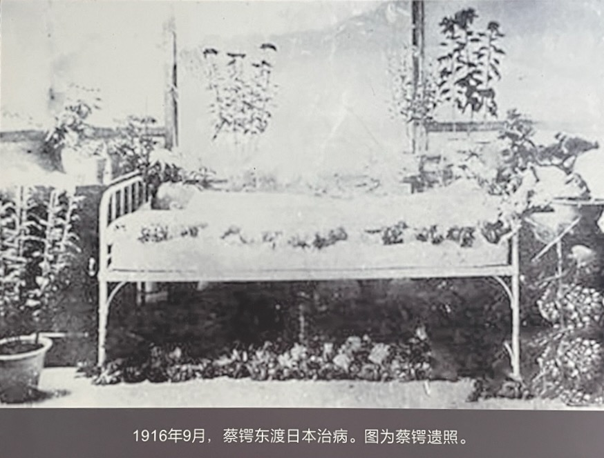
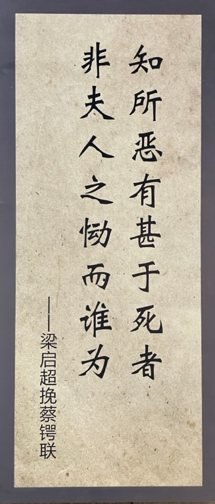
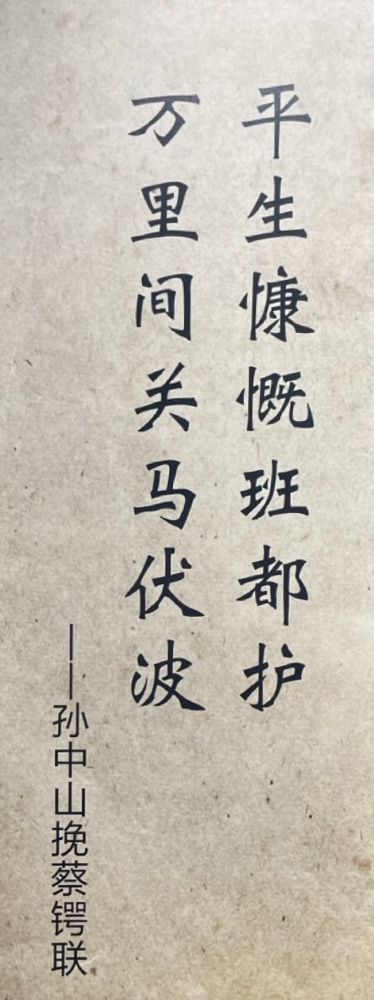
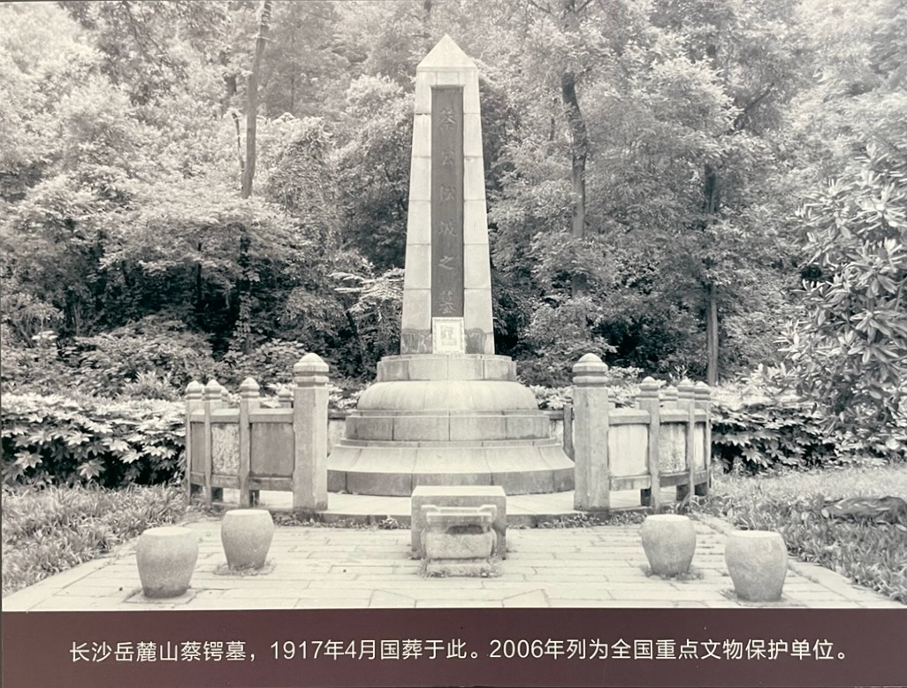

11 月 8 日，蔡锷病逝，享年 34 岁。

梁启超悲痛欲绝。题词如下：

梁启超挽联：

国民赖公有人格，

英雄无命亦天心。

孙中山挽联

汤化龙挽联：无友无敌，无新无旧，名满天下谤即随之，此例遂为先生所破；

袁世凯次子袁克文挽联：军人模范，国民模范；自由精神，共和精神

朱德说：蔡锷是我的北极星。没有了蔡锷，我就迷失了方向。

# 梁启超祭文

蔡锷告别仪式上，梁启超走上前去，宣读祭文。可见到蔡锷遗容，忍不住失声痛哭，难以止制，无法再读祭文，只好把文稿交给他的另一学生石陶钧代读。

全文如下：

蔡公松坡之丧，归自日本，止于上海，将返葬于湖南。友生梁启超，更率厥弟启勋，厥子思顺、思诚等，敬挈清酒庶羞，奠君之灵，而哭之与其私曰：

呜呼！自吾松坡之死，国中有井水饮水处皆哭，宁更特吾之费词。吾松坡宜哭我者，而我今哭焉，将何以塞余悲？君之从我，甫总角耳，一弹指而二十年于兹。长沙讲学隅坐之问难，东京久坚町接席之笑语，吾一闭目，而暖然如见之。尔后合并之日虽不数数，然书札与魂梦日相濡沫而相依。客岁秋冬间灭烛对榻之密画，与夫分携临歧之诀语，一字一句，吾盖永刻骨而镂肌。三月以前，上海最后之促膝，君之喑声尫貌，与其精心浩气，今尚仿佛而依稀。

吾松坡乎！吾松坡乎！君竟中道弃余，而君且奚归？

呜呼！庚子之难，君之先辈与所亲爱之友，聚而歼焉，君去死盖间不容发。君自是发奋而莅军，死国之心已决于彼日。乙巳广西不死，辛亥云南不死，去冬护国寺街不死，今春青龙咀不死，在君固常视一命为有生之余。今为国一大事而死，此固当其职。虽然，吾松坡之报国者，如斯而已耶！不获自绝域以马革裹尸归来，吾知君终不暝于泉窟。

呜呼！君生平安若有隐痛，我不敢以告人。要之，今日万恶社会，百方蹙君于死，吾复何语以叩苍旻！嗟乎！松坡乎！汝生而靡乐，诚不如死焉而反其真。而翁枯守泉壤者十五有载，待君而语苦辛。君之师友在彼者，亦已泰半；各豁冤抱，迓君而相亲。嗟乎！松坡乎！斯世之人，既不可以与处，君毋亦逃空寂以全其神？其更勿责所苦相谇告，使九渊之下，永噫而长颦。

呜呼！余天下之不祥人也，而君奚为乎呢？吾屈指平生素心之交复几许，弃我去者若陨箨相继，而几无复余。远昔勿论，近其何如？孺博、远庸、觉顿、典虞，其人皆万夫之特，未四十而摧折于途。嗟呼！嗟乎！天不欲使我复有所建树，曷为降罚不于吾躬而于吾徒？况乃蓼莪罔报，脊令毕捕；血随泪尽，魂共岁徂。

吾松坡乎！吾松坡乎！汝胡忍自洁而不我惧？呜呼！余有一弟，君之所习以知；余有群雏，君之所乐以嬉。今率以拜君，既以侑君之灵，亦以永若辈之思。心香一瓣，泪洒一卮，微阻丽幕，灵风满旗。魂兮归来，鉴此凄其。呜呼哀哉！尚飨。

翻译为白话文后，是：

蔡公松坡去世后，从日本归来，暂时停留在上海，将被送回湖南安葬。友生梁启超与弟弟启勋、儿子思顺、思诚等人，敬奉清酒和祭品，祭奠蔡公的灵魂，并私下哭诉道：

唉！自从松坡去世，全国有水井和饮水之处都在哭泣，又何必我再多费言辞。松坡应当为我而哭，而我现在却为他哭，我又如何能抑制自己的悲伤呢？你跟随我，自幼时起，到现在已有二十年了。长沙讲学时在角落里向我提问，东京久坚町里共席时的笑语，我一闭眼，仿佛依然能看到那些温暖的场景。此后虽然很少见面，但书信和魂梦中，我们始终相互依恋。去年秋冬之交，我们熄灯对榻密谈，以及分别时的诀别话语，每一个字，每一句话，我都刻骨铭心。三个月前在上海最后一次促膝谈心，你那嘶哑的声音、瘦弱的面貌，以及你的精心和豪气，现在依然在我眼前浮现。

松坡啊！松坡啊！你竟然中途离我而去，你现在又要归往何处？

唉！庚子之难，你的前辈和所亲爱的朋友，都聚在一起被杀害，你当时逃离死亡的情景可以说是千钧一发。从那时起你就发奋从军，决心为国而死。乙巳年在广西未死，辛亥年在云南未死，去冬在护国寺街未死，今春在青龙咀未死，对于你来说，视生命为有生之余是常态。如今你为国而死，这正是你的职责所在。然而，松坡为国报效就只有这样吗？不能从绝域以马革裹尸归来，我知道你在地下也无法安息。

唉！你生平好像有隐痛，我不敢告诉别人。总之，今日的社会万恶，百般逼迫你致死，我又能说什么来质问上天呢？唉！松坡啊！你生而无乐，诚然不如死后返其真性。而你那守护泉壤的老父亲，十五年来，苦苦等待与你倾诉。你的师友也大多已在彼岸，彼此释怀冤屈，迎接你相聚。唉！松坡啊！这个世上的人，既然无法与你共处，你也许逃入空寂之境以全其精神？不再责备那些苦心相劝的告诫，使你在九泉之下，永远叹息和悲伤。

唉！我乃天下最不幸的人，而你为什么要离我而去？我一生中交心的朋友还有几人，弃我而去的如同竹箨般相继凋落，几乎不再剩下几个。远的不论，近的呢？孺博、远庸、觉顿、典虞，这些都是万夫之杰，还未到四十岁就已中途折损。唉！唉！天不愿让我有所建树，为什么降罚于我的徒弟而不是我呢？况且我的父母已无法报答，我自己也遭受尽了苦难；血泪已尽，灵魂随着岁月流逝。

松坡啊！松坡啊！你为何如此绝情，不顾及我？唉！我有一个弟弟，你早已熟悉；我有一群孩子，你也乐于嬉戏。现在让他们来拜你，既是为了祭奠你的灵魂，也为了让他们永远记住你。心香一瓣，泪洒一卮，微微阻隔在丽幕之下，灵风满旗。魂灵啊，归来吧，鉴察这凄凉的情景。呜呼哀哉！希望你能够享用祭品。

梁启超的祭文感动了所有人，灵堂里响起一片泣啜声。

# 戴戡电文

戴戡是陪蔡锷从北京一路南下的贴身部下。蔡锷去世后，戴戡发表电文如下，非常感人：

昨闻蔡松坡噩耗，惊恸无极。昊天不吊，丧此元勋，凡我国人，同声悲悼。前清之季，迄于今日，时有坠沉之虑。勉支大厦之倾，松公功在社稷，人尽知之，无待戡之置喙。特是数年以来，相共患难，知其志节之苦贞，思想之高洁，心乎国征，有至死不渝者。戡既友之，而师事之，当此盖棺，无虑标榜，后死一日，讵忍湮没，惟垂察焉。

辛亥改步，松公在滇，匕鬯不惊，指挥大定。而援川、援黔以及征藏诸役，频年用师，积劳险危，毫无骄矜之气，常存节骨之风，论其品谊，岂类寻常。迨由滇人京，本欲于国家大计徐图所以补救，不意帝制议起，事与愿违。回忆当时，诡慝并进，陷阱四伏，自好者几以自全，安计其他者。乃定策于恶网四伏之中，冒险于海天万里以外，几经困厄，间道入滇，忍痛负重，卒成伟业，坚若卓绝未曾有。复以久病之躯，亲临战陈（阵），举身家性命之关系，不敌其好义之苦心。奉命督川，虽仅日，而用人行政，一秉大公，至今川人震其功，尤佩其德。前过渝时，大难初平，相见泣下，每以国基甫定，民黎凋残，深虑国人犹有南北之见，一多新旧之争，长此肆扰，国将不国，忧愤时局，至于痛哭流涕。日商所以救国及治川者，卒无一语及私。即到东养疴，时通函电，拳拳之念，仍在军国。与其谓松公之死于病，无宁谓其死于国也。虽然，此尚就一人耳目所及者。

自综其生平，数历中外，屡长军民，即无分外之饩，积俸亦可自赡。乃因奔走国事，以致家无担石。此次首义，负累尤多。即此取予之间，实为迄今仅见。故戡于松公，所以重其学识、事功者无殊于人，特尤倾服其品德，足以风世而励俗。悲痛之余，言不尽意。拟请由我副总统领衔人告，优加议恤，特予表彰，实不仅戡感激也已。临电无任悽惶之至。

# 部下电文

蔡锷去世后，唐继尧、陈炳焜、刘显世、任可澄、吕公望、罗佩金等联名致总统、总理电，回顾了蔡锷的一生，请求国葬。全文如下：

该故督军自日本士官学校毕业归国，初在广西办理讲武学校，愤国事日非，即潜谋改革之事，深被嫌疑。调滇充陆军第十九镇第三十七协统领，复与同人秘密联络，准备一切，相时而动。值辛亥八月，我大总统在武昌首义，滇省遂举兵响应，不日间，全省奠定，匕鬯不惊，被推云南都督。任职以来，勤力不懈，庶事咸宜。以滇省财政困难，首倡减俸，月支薪仅六十元，至今因之，军民政事，赖以维持。入京之后，本欲有所贡献，而帝制潮流方热，避而不入。乃乘机南下，间道来滇，共谋举义，崎岖险阻，艰苦备尝。护国军起，督师出川，鏖战叙、泸，亘五阅月。其间泸战最烈，昼夜不休者，几四旬有奇，精神委顿，喉病加剧，实缘于此。大局既定，犹力疾驰赴成都，经营善后，俾军民安贴，然后东下疗疾，所谓尽瘁国事，死而后已。综其生平，既富于韬略，优于文学，尤娴习政治，是以综理军民，措置裕如，滇、黔、川、桂之民，迄今思慕不置。而治事精勤，操守纯洁，尤足为当世官吏师法。今身后萧条，不名一钱，老幼茕茕，言之心痛。惟其功德虽在西南为多，其所设施实有造于全国。丰功伟烈，中外具瞻，不有阐扬，何以光前励后!伏恳我大总统鸿慈，赐予国葬，并将事绩宣付史馆立传，准予京师及立功省份建立专祠，置造铜像，以彰国家崇报之典，而为后来矜式之资。

# 国葬

最终，蔡锷成为中华民国享受国葬殊荣的第一位元勋。国葬湖南长沙。遗体葬于岳麓山，与黄兴墓地前后相邻。

国葬期间，在北京中央公园（今中山公园）设灵堂举行公祭。孙中山、黎元洪、冯国璋、段祺瑞等以及民国政府各部、驻华公使、各界群众都参加了祭奠。

记者记载当时的场景：人则男女老幼，自早八钟至下四钟，络绎不断，总若千万众。闻有东西洋外宾与祭者，较之追悼袁氏之国民大会直别天渊。记者于是知吾人崇拜英雄及凭吊英雄之心，有出于至诚恻但者，非可以逼迫以求之也。不然，与祭者不皆黄、蔡二公之亲友，而争先恐后，仰瞻遗像，徘徊于礼堂而不忍去者，何其形况之沉痛乃尔耶!是日也，朔风凄紧，白日凛凉，入耳哀音，触目悲绪。记者因追想革命之痛史，独立外亭，一倾热泪，真觉二公星殒，悲绝古今矣。天荒地老，成何世耶，沧海桑田，有此变否?

中华民国参议院：“得蔡公松坡噩电，痛哭失声，罔知所措。公为共和再造之元勋、民国伟人、天南一柱，大星崩陨，全国震惊。望瀛海以昭魂，念丰功而增恸。谨于本日大会议决休会一日，并下半旗以致哀悼。”

《申报》：“松坡虽死，而其对中国之心仍未死也！”

《时事新报》：“独先生仗剑而起，提滇中数千之师，以当袁军数万之众，而能克叙州、下纳溪、冲泸州，使袁军胆落天下之人，因此知袁军不可畏。袁氏百胜之威，先生以一朝挫之，共和之局，因以再定。凡兹所述，乃其荦荦大者，其他利国福民之事，尚悉数难终。若夫艰巨之任，则争居人前；权利之来，则愿居人后，其谦光之德、有容之量，尤为并世所罕见。故先生非独国家之干城，抑亦军人之模范也。”

# 梁启超《邵阳蔡公略传》

梁启超做的蔡锷小传：

蔡公讳锷，字松坡，湖南邵阳人。年十四，以县学附生肄业时务学堂，称高才生。十七游学日本，毕业士官学校。清光绪廿九年归国，三十年任广西讲武堂总办。宣统三年任云南协统。辛亥武昌起义，以云南独立。被推为云南都督，寻遣将戡定贵州、四川，助两省独立。督滇垂三年，修明吏治，整饬戎政，在各省中治称最，公深惩疆吏拥兵之祸。民国二年，屡乞解职，为各省倡，政府固留不得。三年春，卒去滇归京，政府旋任为经界局督办，姑就之以免猜忌。四年夏秋间，袁世凯帝制议兴，忌公特甚，所以监视者无不至。公密勿布画，卒只身脱走，间关人云南。以四年十二月二十五日起护国军，提饥卒数干，转战泸叙间，与袁军十余万相持，屡挫其锋。袁军渐相继携贰，袁以恚死，国体复定。五年六月，任四川督军兼省长，先是公已病肺，其人滇也，实扶病督师。在军八月，以饥疲之众当强敌，其劳勩非人所克堪，食杂砂糠，恒经月不得卧，以是积劳增剧，瘦削骨立，喉哑不复能作声，被命督川，辞电十上，然犹力疾赴成都。以十日之力镇抚蜀民，策划善后，遂毅然解职，赴东养病，以其年十一月八日薨于日本福冈之大学病院，年三十有五。

 

| [Index](./) | [Previous](15-3-write) | [Next](17-5-learn) |
