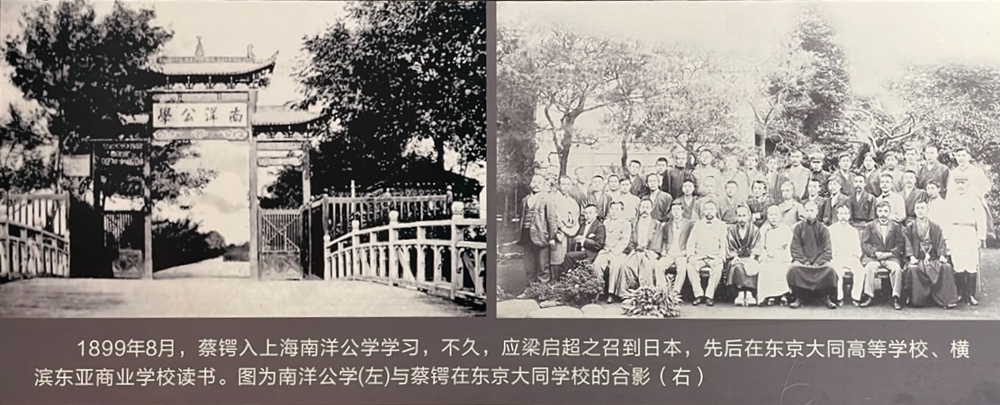
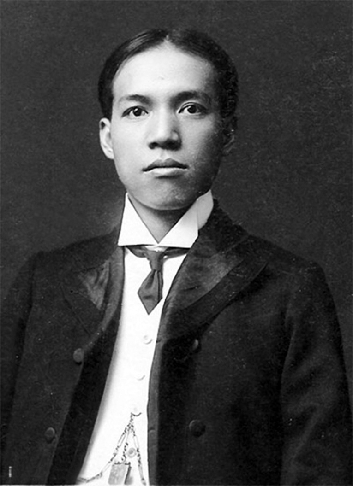

戊戌变法失败后，学堂解散，两位老师——谭嗣同、梁启超一死一逃，江标、徐仁铸、熊希龄、黄遵宪等师长均被革职，永不叙用，同学星散，蔡锷很难接受。

蔡锷在湖南流浪了一段时间，中间还想过刺杀报仇。在后来他审定的自己的记录中，有这样的文字：“旋清廷政变，不果行，愤憾不欲生，奔走湘鄂，阴结同志，谋刺虏后那拉及湘贼中顽固某。”

但是老师们和同学们记得他。在唐才常的帮助下，辗转来到日本，继续跟随梁启超学习。

# “中学为体，西学为用”的自欺

梁启超此时自己也在学习。到了日本，梁启超发现了一个新世界：霍布斯、斯宾诺莎、卢梭。他如饥似渴地学习。

在日本广泛地学习西方译作后，他感慨在国内能够读到的西方政治、经济方面的书太少了，这对发挥中国人的聪明才智非常不利。他说：日本自维新三十年来，广求智识于寰宇。其所译所著有用之书，不下数千种，而尤详于政治学、资生学（即理财学，日本谓之经济学）、智学（日本谓之哲学）、群学（日本谓之社会学）等，皆开民智、强国基之急务也。吾中国之治西学者固微矣，其译出各书，偏重于兵学、艺学，而政治、资生等本原之学，几无一书焉。……使多有政治学等类之书，尽入而能读之，以中国人之聪明才力，其所成就，岂可量哉！

他感慨“中学为体，西学为用”的说法，只是国内“学问饥荒”的背景下产生的一种自欺，实质是旧思想的禁锢和新思想的干涸。1920 年，梁启超作《清代学术概论》，对这一时期的“学术”进行总结。他介绍了自明代徐光启到至清代光绪年间译书情况后，说：光绪间所为‘新学家’者，欲求知识于域外，则以此为枕中鸿秘。盖‘学问饥饿’，至是而极矣。甲午丧师，举国振动，年少气盛之士，疾首扼言‘维新变法’，而疆吏者李鸿章、张之洞辈，亦稍稍和之。而其流行语，则有所谓‘中学为体，西学为用’者，张之洞最乐道之，而举国以为至言。盖当时之人，绝不承认欧美人除能制造能测量能驾驶能操练之外，更有其他学问，而在译出西书中求之，亦确无他种学问可见。康有为、梁启超、谭嗣同辈，即生育于此种‘学问饥荒’之环境中，冥思枯索。欲以构成一种‘不中不西即中即西’之新学派，而已为时代所不容。盖固有之旧思想，既深根固蒂，而外来之新思想，又来源浅觳，汲而易竭，其支绌灭裂，固宜然矣。

诚哉斯言！

下面是梁启超 1903 年在日本时期的照片，眼神和嘴角都露出倔强。

# 艰苦，但异常快乐

蔡锷每天和老师一起学习，条件依然艰苦，但异常快乐。梁启超回忆说：“他们来了之后，我在日本小石川久坚町租了三间房子，我们十几个人打地铺，晚上同在地板上睡，早上卷起被窝，每人一张小桌念书。那时的生活，物质方面虽然很苦，但是我们精神方面异常快乐，觉得比在长沙时还要好。”

自学一段时间之后，蔡锷和同学又进入了梁启超创办的东京大同高等学校研究政治哲学，并补习普通科学，然后谋求进入日本士官学校。为此，蔡锷通过写作、翻译来积攒学费，并把节省下来的钱寄回湖南老家，赡养母亲。经过各种曲折，他最后以优异的成绩，从日本陆军士官学校毕业。

对蔡锷的这段期间的生活，后人总结道：蔡锷学费无着，因日读夜译，举所得译资助学费。时任公方主《新民丛报》，往依之。因以师生义，为谋入日本士官学校。复以君绌于资，为筹措，得两湖两省官费，自是始得安心求学，更得以余资供老母饔飧。君学业成绩特优，遂以士官第三期卒业。时人举以与二蒋称三杰焉(即蒋尊簋、蒋百里)。君少有大志，虽在学时已有澄清天下之想，同学之士无不深伟其人。盖君后此丰功伟烈，已始基于学业时代之矣。

 

| [Index](./) | [Previous](1-9-student) | [Next](3-3-freedom) |
