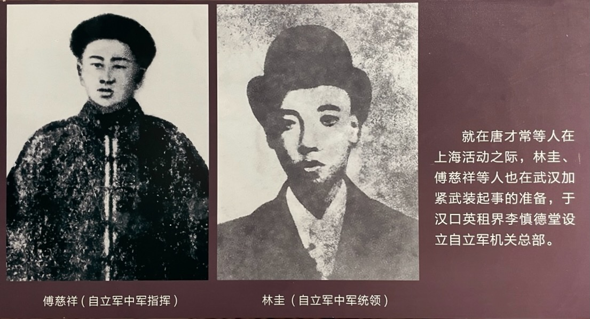
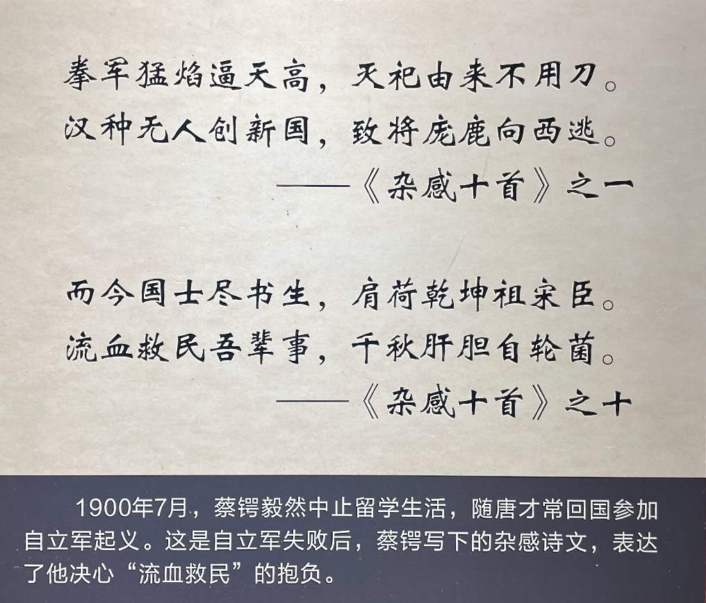

1899 年至 1900 年，蔡锷参与了时务学堂时的老师唐才常和同学林圭的起义。起义失败后，唐才常和同学们被杀，给蔡锷带来很大冲击，决定投笔从戎。

# 国会自立军

自立军的全称是“国会自立军”，因此，它是唐才常等人组织的“中国国会”的武装组织。具体来说，唐才常等人首先从日本回到上海，和中国最早留学美国和英国的容闳、严复、章太炎等人，成立“中国国会”，选举中国最早留学美国和英国的容闳、严复为正副会长，唐才常为总干事，林圭等为干事。然后，唐才常成立了隶属于“中国国会”的武装组织：“国会自立军”，准备在武汉武装起义。

老师的自立军成立，林圭、蔡锷、石陶钧、唐才质等人也要求加入。其中，蔡锷因为瘦小，年龄小，所以唐才常等人回国时候，就没有带他。但蔡锷心里不安，就一个人回国，要求参加。为了保护他，唐才常派他回湖南联络好友。

蔡锷的同学林圭在自立军中发挥了重要的作用，有“庚子一役，唐、林并称”的美名。林圭是时务学堂二班的学生。他仰慕谭嗣同，也被谭嗣同器重。有一天，他曾对唐才质说：“朝廷纲纪败坏，达于极点，曾、左诸人掌握兵柄，苟举义旗，则倾复清室，反掌事耳……吾今日求学，应以挽救国家为第一要义。”听完这番话，唐才质第一反应就是他够“大胆”。果不其然，在这次自立军起义中，他和唐才常在汉口设立自立军秘密机关，担任自立军军中统领，成为仅次于唐才常的领导人。

因为事机不密，起义失败，唐才常、林圭等人都在武昌就义。此时，林圭才 25 岁。除了林圭，就义的时务学堂学生还有：

- 李炳寰：任汉口军中文案，办理总机关文牍事务。他是时务学堂一班学生，和蔡锷一样是高才生。唐才质曾和他住一宿舍，还换帖为兄弟。李炳寰上学时常说：“我们求学，所为何事?但求起衰振敝，上利于国，下泽于民耳。”
- 田邦璇：任自立军后军统领，联络同志，协助筹款，负责安庆一路的起义发动。他还将在时务学堂上学的弟弟田邦玙也带着一同加入自立军。
- 蔡钟浩：他和一班上学的弟弟蔡钟沅一起，在汉口协助林圭组织中军，在常德筹划响应，最后就义于长沙。在学校上学时，蔡钟浩的思想尤为激进，常常将“闻独立自由之义，集同人开自立党于长沙，刊章程，编会籍……湘人之唱言自立者，实以君为始。”挂嘴边。

最终，加入起义的时务学堂学生有 20 多人，其中因为起义失败，牺牲的有 11 多人。1919 年，毛泽东曾评价说：“湖南之有学校，应推原戊戌春季时务学堂。时务以短促的寿命，却养成了若干勇敢有为的青年。唐才常汉口一役，时务学生之死难者颇不乏人。”

蔡锷在长沙幸免于难。他得知师友被杀的消息后，痛哭失声，然后在好友的帮助下，逃回日本。在日本，他写了《杂感十首》，立志复仇。下面是其中两首。他还加了一个注释，说要像法国大革命那样，把敌人送上断头台。

 

| [Index](./) | [Previous](3-3-freedom) | [Next](3-5-military) |
