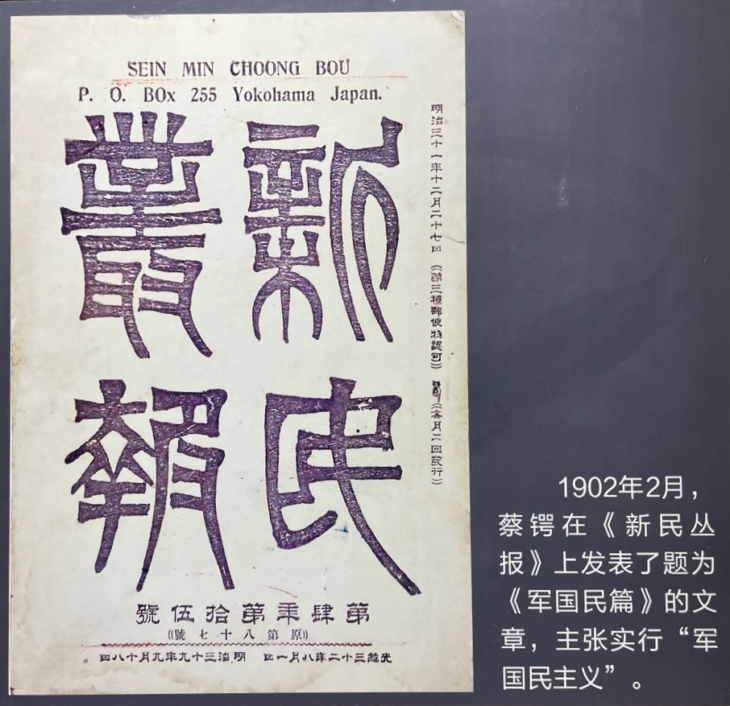

师友们的牺牲，让蔡锷决定学习军事。

他首先把自己的名字改了，取名为“锷”。锷是刀锋的意思。

他然后请求梁启超设法帮他上军校。当时留学生要进入日本军校，需要清朝官方背书，因此需要梁启超动用自己的关系进行安排。

梁启超得知蔡锷要从军，非常惊讶。蔡锷身体瘦小，体质并不强壮，能不能承受战场上风餐露宿、忍饥挨饿、从死人堆里爬出来的艰难？因此，梁启超说：“汝以文弱书生，似难担当军事之重任。”

面对梁启超的怀疑，蔡锷掷地有声地说：“只须先生为我想方法，得学陆军，将来不做一个有名的军人，不算先生的门生。”

梁启超听了后，很高兴，说：“好，好！吾党所缺者，正惟将才耳。松坡有此大志，非徒吾党之幸，亦国家之大幸也！”

为了进入军校，蔡锷开始隐忍，不再轻易地就政治问题表态。这引起了很多人的误解，让蔡锷痛苦。蒋百里回忆说：戊戌变后，间关东渡，欲以私费入陆军不可得，悒悒者二年余卒达其志。时有倡亡国纪念会者，或代署公名，而终请除去之。有为冷语者，则涕泣而言日：先辈亦既死矣，苟得—一艺以救国，复何恤于人言。

这段时期，蔡锷的父亲也去世了，蔡锷非常悲痛。蒋百里回忆说：壬寅春，闻父丧，不得归，则伏案终日，迄于午夜。知其病[痛〕之深，而不敢劝也。

最后，在梁启超的长期努力下，蔡锷终于通过左宗棠的推荐，让得以进入日本陆军士官军校。

蔡锷在军校里练得很好的本领。和蒋百里、蔡锷、张孝准三人被称为中国“士官三杰”。1904 年毕业时，在 100 多名毕业生中，毕业成绩蒋百里名列第一，蔡锷名列第三，证明了他对老师的诺言。

# 军事写作

蔡锷投身军事，不是简单地学习操练，而是广泛阅读，深入思考，提出问题，细致研究，提出自己的军事主张。1902 年，他发表了《军国民篇》，长达 20 页，提出要进行广泛的军事教育，以达到富国强兵的目的。为此，他具体分析了教育、学派、文学、风俗、体魄、武器、音乐、国势等 8 个方面存在的问题，然后提出了改革方案。

他主张“军国民主义”，让国家变得强大。说：“军国民主义，昔滥觞于希腊之斯巴达，汪洋于近世诸大强国。欧西人士，即妇孺之脑质中，亦莫不深受此义。盖其国家以此为全国国民之普通教育，国民以奉斯主义为终身莫大之义务。帝国主义，实由军国民主义胎化而出者也，盖内力既充，自不得不盈溢而外奔耳。”

为此，他首先想重建中国的“国魂”。他说中国的国魂包括孟子的“浩然之气”。他要在“四千年汉族历史中，搜索一种吾绝无仅有之特色”，构建一种新的“大群主义”，“祖国主义”。“祖国主义者何？根于既往之感情，发于将来之希望，而昭之于民族的自觉心。”重建“国魂”。比如德国国魂，即在其《祖国歌》之中所反映的日耳曼主义。

蒋百里与蔡锷一起研究军国民主义，成为形影不离的朋友。蒋百里与蔡锷都出生于1882年，年龄相同，出身贫寒，都中过秀才，也同时留学日本。他们弃文习武的动机也相同：蔡锷认为“要救国就得拿起枪杆子来”，而蒋百里一生以建设现代化国防为目标。所以，他们一见面就成为志同道合之友，几乎达到形影不离的地步。此时蒋方震写了《军国民教育》，与蔡锷的《军国民篇》一起出版。蒋百里还翻译了德国军事学家哥尔紫的《国民皆兵论》。

# 博弈

蔡锷喜欢下棋。蒋百里回忆说：公身不魁伟，而绝有力。好弈，终夜不肯休，艺之强者，常以精神不继而负。其书法别成一家。后人也回忆说：日有定程，暇则围棋，精思妙著，眉色飞舞。观其作势，已知其娴韬略，而善战伐矣。

# 结社

蔡锷在日本士官学校以及留日学生中积极组织社团，联络情谊，交换学识，并且秘密结社，结交了很多的朋友。后来有人回忆说：蔡锷“是年与刘百刚、吴禄贞等创设励志会。庚子以后，东渡学生逐日增多，良莠不齐，情志涣散，因倡议创立留学会馆。并于成城学校创置校友会，为联络情谊，交换学识之资。犹虑情志之尚难固结，复与湘之范、周，鄂之吴、刘，浙之两蒋诸公秘密结社，歃血誓盟，以倾倒清延，建设新国家为宗旨，以死为期;至于用何种手段求达目的，则由人自择。”

作为梁启超的弟子，蔡锷和反对梁启超的革命派中的人，特别是黄兴，也成为了密友。此时，梁启超和孙中山的政见不同，矛盾很大，但蔡锷和黄兴还是成为了密友。1903 年初，蔡锷与黄兴等组织学生义勇队，后改名为“军国民教育会”，以“养成尚武精神，实行爱国主义”为宗旨，黄兴等人被推为“运动员”，即归国发动革命之人员。

蔡锷有意识地建立的这个军事社会网络，成为他后来在云南等地得到广泛支持的重要原因，让他在护国战争中能够得到共和派、革命党、地方军阀等各方势力的认可和支持。

 

| [Index](./) | [Previous](3-4-zili) | [Next](3-7-write) |

