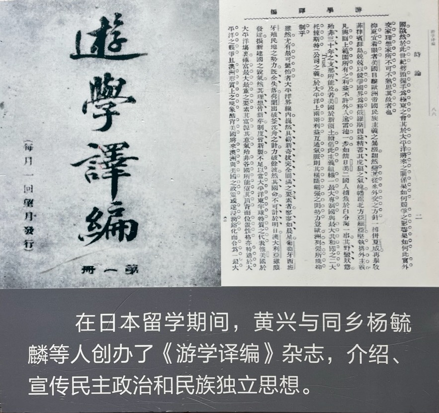
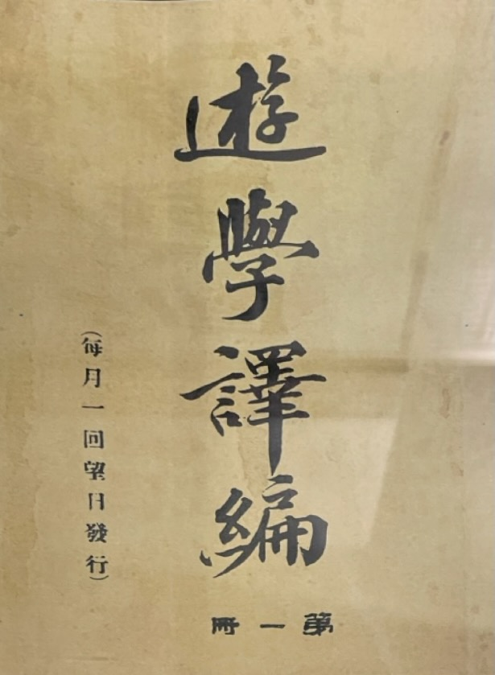
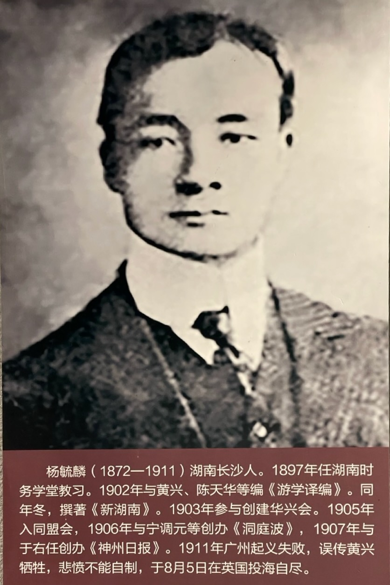
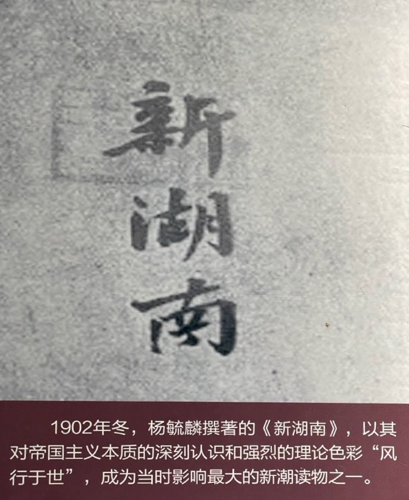

在日本期间，蔡锷热爱写作、翻译。这既锻炼了他的思想，也获得了稿酬，积攒了学费。他写作的内容大概包括：报纸短文写作、宣言、长文翻译、学术著作。

# 报纸短文写作

蔡锷的报纸短文写作非常有规律。1900 年，他写完《杂感十首》后，每隔 10 天左右，就在梁启超主持的《清议报》上发表几篇短文。内容广泛，有梁启超之风。

比如在 11 月 22 日，他就发表了四篇：

第一篇是《世界之魂》。其中他指出：世界文明思想之魂，有孔孟庄老、程朱陆王，天竺之释迦，西方之苏格拉底、佛拉、亚里斯多托、倍根、斯比乐萨、堪德、弥尔、达耳文、斯宾塞等人组成；而法兰西革命之魂，由君查克、赫百旭斯、孟德斯鸠、卢骚、巴路达等造成。他指出通过学习它们，就能开启民智，让人民免于沉沦于苦海地狱之中，腐败萎颓，殆无生气。

第二篇是《拿破仑》。其中他表示了对拿破仑的敬仰。他说：拿破仑心力之雄大，才力之宏博，独具高立须弥，俯视群虻之态。 载下读其片词只字，足使志气飞扬，增无穷磊落嶙峋之浩气。

第三篇是《英德协商》。其中他分析了德国对英国的态度，日本对英国的态度，英日德美对俄国外交政策的影响。

第四篇是《呜呼，发祥地》。其中动情地描述了作为清朝发祥地的满洲，被俄国侵占的情况。指出这不仅对清朝，而且对日本，以及整个东亚都是重大威胁。

蔡锷后面发表的短文还有：《不变亦变》、《爱国心》、《破私》、《英法俄之海权》、《奴性》、《今日少年》、《小说之势力》、《新闻力之强弱与国家文野之关系》等。其中有意思的文章有：

- 在《小说之势力》中，分析了小说开启明智的重要作用
- 在《新闻力之强弱与国家文野之关系》中，强调了新闻机构对国家治理的重要性
- 在《论外交》中，他提出外交应该灵活：“盖外交之术，贵灵而忌滞，贵通而忌拘，贵滑而忌涩，贵巧而忌拙，国威之伸缩，国命之强弱，皆于是赖焉耳。”

从上面的这些文章题目可以看出：蔡锷一直在如饥似渴地阅读、思考、研究、写作。这些对他后来处理各种军事、建设、外交事务，都很有帮助。他终其一生，保持着这种热爱研究和写作的态度。

# 翻译

1901 年开始，蔡锷翻译了几篇较长的文章，又参与《游学译编》的翻译工作。

蔡锷首先译出了《支那人之特质》，希望通过这篇文章，让国人知耻而后勇。这篇文章是八国联军占领北京期间，在北京的日本人回日本后写的。其中关于中国人奴隶性的描述，真的是看得让人痛苦、胆寒。通过翻译这篇文章，蔡锷痛陈中国人的国民性、性格中的弱点：奴隶性、驯服、顺从、不敢为天下先、不敢独自站出来，对抗周围的环境等。他说：外国人看不起我们，是我们自己造成的。他也指出：如果不改变这些，革命成功了，结果也不行。这篇文章长达 11 页。

当年，蔡锷又译出了法国人写的中国国情的调查报告《支那现势论》。这本书长达 100 页。蔡锷付出这么艰苦的努力，显然是希望将其作为革命和建设国家的参考。

他也参与国内的编译事业，希望通过翻译在国内传播知识和思想，促进改革。1902 年，黄兴、杨毓麟等在湖南创办湖南编译社，发刊《游学译编》杂志。蔡锷积极协助他们的工作。

蔡锷曾在《游学译编》上发表了《致湖南士绅书》，详细叙述日本明治维新后迅速由弱变强的过程，指出日本强盛的原因“不过纯用西法，而判断决定，勉强蹈厉，稽合国情已耳”。希望湖南当权的士绅们向日本学习，实行改革，对编译社事“提倡赞成，集成巨款”，并认为，“我湖南一变，则中国随之矣！”

他动情地写道：朔风翔疾，鸿雁南飞，衡山木脱，洞庭波渺，目极潇湘沅资，云烟浩渺，不可怀抱。自浮海而东，登三神山，饮长桥水。访三条、大隈之政策，考福泽、井上之学风，凭昂萨摩、长、肥，遍观甲午、庚子战胜我邦诸纪念。而道路修夷，市廛雅洁，邮旅妥便，法制改良，电讯铁轨，纵横全国，警察严密，游盗绝踪，学校公社，公德商情，农工实业，军备重要，日懋月上，不可轨量。国民上下，振刷衔枚，权密阴符，无孔不入，志意道锐，欲凌全瀛。推其帝国干涉之主义，恐怖坚忍之情形，殆无日不若趋五域之大战，临东西太平洋而有事，以此感激愤厉，抑塞蒸郁。以我四百余洲之土地，五百兆之人民，势利社会，国体精神，一切授人以包办，任人以奴役，而我主人全家，父子兄弟犹然日日酣嬉，寄傲于水深火热，炮烟弹雨之上，则诚不喻其何衷，而亦实痛其无睹。若使某等镇日守乡里，抱妻子，黜聪坠明，深闭固拒，一无闻睹于外务，则等引黄胄之脑质，亦宁有望今日一得之解乎？……卅年以前，与我奚间，一变之效，乃至于此，究臻何道而然乎？固尝群取其故熟思矣，不过纯用西法，而判断决定，勉强蹈厉，稽合国情已耳。

# 宣言

蔡锷也擅长宣言的写作，情理兼备。他与友人共组了“开智会”，创办《开智录》刊物，试图唤醒民众，进行革命。为此，他写了《开智会序》，首先讲述了民族的危机重重，然后指出要开启民智，才能获得民权。全文如下：

今日之日何时也？列强虎视于外，国贼充塞于朝，蠹吏虻飞，腐士如鲫。迩来，团匪肇衅，外强藉口以逞野心，遂至首都破裂，圣主西狩，盗贼横行，万民失主。督抚无自立之谋，义士罹桀尸之恨。列国之运动各分，则瓜分之局成矣。否则，共复满洲政府，而保全之策，则吾国民一受列强之压制，一受满人之箝掣，则为两层奴隶之势成矣。君今日而捐弃家，出万死不顾，摩顶放踵，以供天下牺牲，图国民之自立，故吾中国人人应尽之责耳。计不出此，犹以开智为议，创区区小举，不亦悲乎！吾恐智未及拓，而国已墟，同胞之凌夷殆尽也。虽然，纵鉴神州，遍问黄种，其不沉酣于睡梦中者几何？釜中偷生，自知焦烂之祸之逼至，而犹诩诩徘徊，置大局于不问者，亦复不胜数，是更可为痛泣者也。

故吾国民之沦亡，沦亡于国民之智不开，智即开与梦梦者等，是仍谓之未开也。近世人言之曰，国民有一分之智，即能握一分之权，智未开而虽有权，亦不为我所握矣，此不易之至言耳。亚利安种族膨胀之力，磅礴四溢，今日万马骈首，万弩齐射，以直向我绝东。然其所欲者，不过始欲握东国之利权，继则欲握四万万人之政权，及二万里土地之管辖权耳。虽然，中国所有一切之权，中国民不欲授之于人，则人无得而受之。盖其权操纵在己，然智力孱弱，则人得而夺之，是以争权之道，必在充足吾国民智力也。智力既充，则虽一时瓜分，不能绝吾国民之华盛顿也，片时受两层奴隶之辱，不能使吾民之自由钟息声也。一言以蔽之曰：中国之亡，非随今日政府以亡，乃国民之智未拓，则一亡之后，无建设新政府之日耳。

贯广君，粤人也，热血澎然，奇骨森然，东驰西骋，足无停步，欲有所图，惜志弘而力歉。近于横滨创一开智会，属余叙之。时适内局鼎沸，义士遇害之际，余心绪澎湃，归思茫然，不能振笔，遂拉杂成篇焉。奋翮生序于东京。

# 学术著作

1902 年，他开始写书。先后写了《国际公法志》，70 页，还有《东西洋教育史》。由此可以他已经开始研究法律和教育了。这说明他在军事学习之余，也非常关注政治、外交、法律、教育等建设相关的内容。这和他后来一直奉行的“破坏是为了建设”的思路是一脉相承的。

# 小结

蔡锷在日本时期的写作，后人总结说：革命重实行，耻为空谈，乃以私费人陆军成城学校。学费所出，悉以译述自给。其时适梁任公所创之《新民丛报》开幕，乃草《军国民篇》投登该报。吾国之军国民主义之输入，以此为嚆矢。是年所编辑之《国际公法志》、《支那现势论》诸书，一时风行海内。辛丑(十九岁)与杨君笃生、梁君鼎甫等纠合旅东湘人，创设湖南编译社及《游学译编》。

蔡锷爱好研究、思考和写作的习惯，贯彻了一生。1906 年，他到广西后，写作了关于广西的《越南重塞图说》（《越南用兵计划》）和《桂边要塞图说》等军事著作，还投稿《云南》杂志，写出了关心云南的《云南外交之失败及其挽回》、《日法协约问题》、《西江警察权问题》，对在英法的压力下，如何收回和发展云南的铁路、矿产、邮政、货币、民政、通商，提出了自己的见解。到了云南后，写出了《曾胡治兵语录》。到了北京后，写出了《军事计划》。即使是临终前，还加写了《军事计划》的绪论。这些都是他一直在思考的证明。

所以你说蔡锷是军人，还是文人？我觉得他是思想家。

# 同志

和黄兴一起创办湖南编译社的杨毓麟，也曾是时务学堂的教师。他热爱写作和办报，是著名的《新湖南》的作者。他和黄兴是非常好的朋友，最后竟因为听到误传的黄兴牺牲的消息，悲愤至极，蹈海自杀，令人伤痛。下面是他的照片。

 

| [Index](./) | [Previous](3-5-military) | [Next](3-8-gemjun) |
