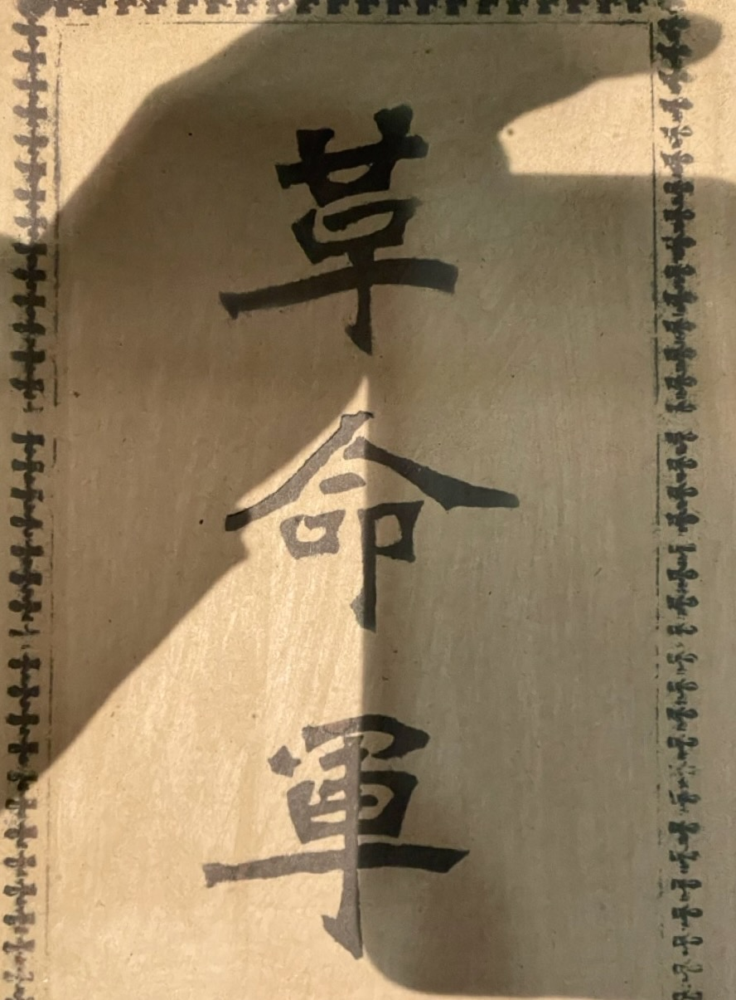

邹容的《革命军》提出了通过“文明的革命”，建立“文明之政体”，让人人都享有自由平等的幸福的目标，提出做国民，不做奴隶，最后发出了类似美国独立运动时发布的《独立宣言》的革命号召。

《革命军》强调进行文明的革命。文明的革命即使有破坏，也是为建设而破坏。重点在于进行自由、平等、政治、法律、观念、自立、责任、公益、自治的教育，让大家去掉奴隶性，成为拥有自由权利的国民。最后建立宪法，选举总统，建立议会，成立政府，而政府权力的唯一目的，是保护人权。

邹容写作《革命军》，是在精读了卢梭的《民约论》、孟德斯鸠的《万法精意》、约翰•穆勒的《自由原论》，以及有关美、法资产阶级革命的历史书籍之后。

蔡锷、蒋百里深入参与了邹容《革命军》的写作。据刘禺生回忆：“邹容字幼丹（应为蔚丹）。当吾等入成城学校陆军预备时，幼丹每日必来谈。予携新会腊肠数斤，课毕围炉，大谈排满。每人每谈一条，幼丹书之，书毕，幼丹则烘腊肠为寿。月余，所书寸余，腊肠亦尽。胡景伊、蔡锷、蒋百里，皆当时围炉主谈人也。松坡签其稿面，曰腊肠书。”关于这一点，章士钊亦有记载说，刘禺生谓“松坡签书腊肠，以戏弄邹容”。

《革命军》分为 7 章。下面分别介绍各章内容。

# 革命的目标

革命军的第一句就是“扫除数千年种种之专制政体，脱去数千年种种之奴隶性质”。

为此，它呼吁实现民主革命，让人人都享有自由平等的幸福。它说：“闻之一千六百八十八年英国之革命，一千七百七十五年美国之革命，一千七百八十年法国之革命，为世界应乎天而顺乎人之革命，去腐败而存良善之革命，由野蛮而进文明之革命，除奴隶而为主人之革命。牺牲个人，以利天下，牺牲贵族，以利平民，使人人享其平等自由之幸福。”

它希望通过民主革命，取代帝制，实现自由平等。它说：“自秦始统一宇宙，悍然尊大，鞭笞宇内，私其国，奴其民，为专制政体，多援符瑞不经之说，愚弄黔首，矫诬天命，揽国人所有而独有之，以保其子孙帝王万世之业。”。因此，“呜呼革命！自由平等者，亦出于是也！”

它希望通过“文明的革命”，建立“文明之政体”。它说：“吾幸夫吾同胞之得闻文明之政体、文明之革命也；吾幸夫吾同胞之得卢梭《民约论》、孟德斯鸠《万法精理》、弥勒约翰《自由之理》、《法国革命史》、美国《独立檄文》等书，译而读之也。是非吾同胞之大幸也夫！是非吾同胞之大幸也夫！”

它推荐的领导人是像华盛顿和拿破仑这样的领导人。

# 革命的原因

革命的原因是不平等。士、農、工、商，都受到不平等的待遇。士兵如尘土。生命如草芥。国土沦丧。民众苦不堪言。

# 革命的教育

它提出需要进行革命的教育，以实现文明的革命。它说：有野蛮之革命，有文明之革命。野蛮之革命，有破坏，无建设，横暴恣睢，适足以造成恐怖之时代，如庚子之义和团，意大利之加坡拿里，为国民增祸乱。文明之革命。有破坏，有建设。为建设而破坏，为国民购自由平等独立自主之一切权利，为国民增幸福。

它建议进行民族、平等自由、政治法治三方面的教育：

1. 当知中国者，中国人之中国也：中国之一块土，为我始祖黄帝所遗传，子子孙孙，绵绵延延，生于斯，长于斯，衣食于斯，当共守而勿替。有异种贱族，染指于我中国，侵占我皇汉民族之一切权利者，吾同胞当不惜生命，共逐之以复我权利。

2. 人人当知平等自由之大义。有生之初，无人不自由，即无人不平等，初无所谓君也、所谓臣也。若尧、舜，若禹、稷，其能尽义务于同胞，开莫大之利益，以孝敬于同胞，故吾同胞视之为代表，尊之为君，实不过一团体之头领耳。而平等自由也自若。后世之人，不知此意，一任无数之民贼、独夫、大盗、巨寇，举众人所有而独有之，以为一家一姓之私产，而自尊曰君，曰皇帝，使天下之人无一平等，无一自由，甚至使成吉思汗、觉罗福临等，以游牧贱族，入主我中国，以羞我始祖黄帝于九原，故我同胞今日之革命。当共逐君临我之异种，杀尽专制我之君主，以复我天赋之人权，以立于性天智日之下，以与我同胞熙熙攘攘，游幸于平等自由城郭之中。

3. 当有政治法律之观念。政治者，一国办事之总机关也，非一二人所得有之事也。譬如机器，各机之能运动，要在一总枢纽，倘使余机有损，则枢纽不灵。人民之于政治，亦犹是也。然人民无政治上之观念，则灭亡随之；鉴于印度，鉴于波兰，鉴于已亡之国，罔不然。法律者，所以范围我同胞，使之相无过失耳。昔有曰：“野蛮人无自由。”野蛮人何以无自由？无法律之谓耳。我能杀人，人亦能杀我，是两不自由也。条顿人之自治力，驾于他种人者何？有法律之观念故耳。

基于民族、平等自由、政治法治这三方面的教育，养成下面四种品质：

由斯三义，更生四种：

- 一曰养成上天下地，惟我自尊，独立不羁之精神。
- 一曰养成冒险进取，赴汤蹈火，乐死不辟之气慨。
- 一曰养成相亲相爱，爱群敬己，尽瘁义务之公德。
- 一曰养成个人自治，团体自治，以进人格之人群。

上面的三方面教育内容和四种品质，总结得非常好。即使到现在，也非常适用。

# 做国民，不做奴隶

它呼吁大家去掉奴隸之根性，做“国民”，不做奴隶。它说：

* 奴隶者，与国民相对待，而不耻于人类之贱称也。

* 国民者，有自治之才力，有独立之性质，有参政之公权，有自由之幸福，无论所执何业，而皆得为完全无缺之人。

* 曰奴隶也，则既无自治之力，亦无独立之心，举凡饮食、男女、衣服、居处，莫不待命于主人，而天赋之人权，应享之幸福，亦莫不奉之主人之手。衣主人之衣，食主人之食，言主人之言，事主人之事，倚赖之外无思想，服从之外无性质，谄媚之外无笑语，奔走之外无事业，伺候之外无精神，呼之不敢不来，麾之不敢不去，命之生不敢不生，命之死不敢不死。得主人之一盼，博主人之一笑，如获异宝、登天堂，夸耀于侪辈以为荣；及婴主人之怒，则俯首屈膝，气下股栗，至极其鞭扑践踏，不敢有分毫抵忤之色，不敢生分毫愤奋之心，他人视为大耻辱、不能一刻忍受，而彼无怒色、无忤容，怡然安其本分，乃几不复自知为人。而其人亦为国人所贱耻，别为异类，视为贱种，妻耻以为夫，父耻以为子，弟耻以为兄，严而逐之于平民之外，此固天下奴隶之公同性质，而天下之视奴隶者，即无不同此贱视者也。

它非常痛心地说：我们中国人经过几千年的压迫，以及非常擅长做奴隶了。它说：

* 我中国人固擅奴隶之所长，父以教子，兄以勉弟，妻以谏夫，日日演其惯为奴隶之手段。呜呼！人何幸而为奴隶哉！亦何不幸而为奴隶哉！

* 且夫我中国人之乐为奴隶、不自今日始也。或谓秦汉以前有国民，秦汉以后无国民。吾谓宴息于专制政体之下者，无所往而非奴隶。数千年来，名公巨卿，老师大儒，所以垂教万世之二大义，曰忠，曰孝，更释之曰：「忠于君，孝于亲。」吾不解忠君之谓何。吾见夫法、美诸国之无君可忠也，而斯民遂不得等伦于人类耶？

* 吾见夫法、美等国之无君可忠，而其国人尽瘁国事之义务，殆一日不可缺焉。夫忠也，孝也，是固人生重大之美德也。以言夫忠于国也则可，以言夫忠于君也则不可。何也？人非父母无以自生，非国无以自存，故对于父母国家，自有应尽之义务焉，而非为一姓一家之家奴走狗者，所得冒其名以相传习也。

* 中国人无历史，中国之所谓二十四朝之史，实一部大奴隶史也。自汉末以迄今日，凡一千七百余年，中国全土，为奴隶于异种者，三百五十八年；黄河以北，为奴隶于异种者，七百五十九年。

它说，很多人还帮着异族（即清朝）来奴役自己的同胞：

* 呜呼！黄帝之子孙，忍令率其嫡亲之同胞，举其世袭之士地，为他族所奴隶者，何屡见而不一。 “箪食壶浆，以迎王师”，“纡青拖紫，臣妾骄人”，“二圣青衣行酒会，九哥白马渡江来”，忠君忠君，此张弘范、洪承畴之所以前后辉映也，此中国人之所以为奴隶也。

* 曾国藩也，左宗棠也，李鸿章也，此大清朝皇帝所谥为文正、文襄、文忠者也，此当道名人所推尊为中兴三杰，此庸夫俗子所羡为封侯拜相，此科举后生所悬拟崇拜不置者。然吾闻德相毕士麻克呵李鸿章曰：“我欧洲人以平异种为功，未闻以残戮同胞为功。”嗟夫！吾安得起曾、左而闻是言！吾安得起曾、左以前之曾、左而共闻是言！吾安得起曾、左以后之曾、左，上自独当一面之官府，下至不足轻重之官吏，而亦共闻是言！

* 夫曾、左、李三人者，亦自谓为读书有得，比肩贤哲之人也，而犹忍心害理，屠戮同胞，为满洲人忠顺之奴隶也如是，其他何足论。吾无以比之，比之以李自成、张献忠，吾犹嫌其不肖，李、张之所以屠戮同胞，而使满洲人入主中国也，李、张固无学识，不读书，又为明之敝政所迫，而使之不得不然，吾犹为之恕。曾、左、李三人者，明明白白知为汉种也，为封妻荫子，屠戮同胞以请满洲人再主中国也，吾百解而不能为之恕。某氏谓英人助满洲平太平天国，亡汉种之罪，英人与有力焉。鸣呼！是又因乌及屋之微意也。

* 曾、左、李者，中国人为奴隶之代表也。曾、左、李去，曾、左、李来，柔顺也，安分也，韬晦也，服从也，做官也，发财也，中国人造奴隶之教科书也。

因此，它呼吁同胞们拔去自己身体里的奴隶性，做既拥有权利，又承担义务的国民。它说：

* 举一国之人，无一不为奴隶，举一国之人，无一不为奴隶之奴隶，二千年以前皆奴隶，二千年以后亦必为奴隶。同胞乎！同胞乎！法国议院中，无安南人足迹，英国议院中，无印度人足迹，日本议院中，无台湾人足迹。印度人之为奴隶也，犹得绕红布头巾为巡捕立于上海、香港之十字街头上，驱策中国人以为乐。然吾试问我同胞，曾否于地球面积上，择一为巡捕之地，驱策异种人以为乐？面包一块，山芋一碟，此固非洲黑奴之旧生活也，同胞！同胞！其重思之！

* 吾先以一言叫起我同胞曰：「国民！」吾愿我同胞，万众一心，肢体努力，以砥以砺，拔去奴隶之根性，以进为中国之国民。法人革命前之奴隶，卒收革命之成功；美洲独立前之奴隶，卒脱英人之制缚。此无他，能自认为国民耳。

* 吾故曰：革命必先去奴隶之根性。非然者，天演如是，物竞如是，有国民之国，群起染指于我中士，我同胞其将由今日之奴隶，以进为数重奴隶，由数重奴隶，而猿猴，而野豕，而蚌介，而荒荒大陆，绝无人烟之沙漠也。

# 革命獨立之大義

它建议参考美国的独立革命，建立宪法，选举总统，建立议会，成立政府，而政府权力的唯一目的，是保护人权。它说：与贵族重大之权利，害人民营业之生活，擅加租赋，胁征公债，重抽航税，此英国议院所以不服查理王而倡革命之原因也。滥用名器，致贵贱贫富之格，大相悬殊，既失保民之道，而又赋敛无度，此法国志士仁人所以不辞暴举逆乱之名，而出于革命之原因也。重征茶课，横加印税，不待立法院之承允，而驻兵民间，此美人所以抗论于英人之前。遂以亚美利加之义旗，飘扬于般岌刺山，而大倡革命至成独立之原因也。

它然后发出自己的独立宣言。它说：自格致学日明，而天予神授为皇帝之邪说可灭；自世界文明日开，而专制政体一人奄有天下之制可倒；自人智日聪明，而人人皆得有天赋之权利可享。今日，今日，我皇汉人民，永脱满洲之羁绊，尽复所失之权利，而介于地球强国之间，盖欲全我天赋平等自由之位置，不得不革命而保我独立之权。嗟予小子！无学顽陋，不足以言革命独立之大义，兢兢业业，谨模拟美国革命独立之义，约为数事，再拜顿首，献于我最敬最亲爱之皇汉人种四万万同胞前，以备采行焉，如左：

1. 建立中央政府，为全国办事之总机关。
2. 区分省分，于各省中投票公举一总议员，由各省总议员中投票公举一人为暂行大总统，为全国之代表人；又举一人为副总统；各府州县，又举议员若干。
3. 全国无论男女，皆为国民。
4. 人人有承担国税之义务。
5. 全国当致忠于此所新建国家之义务。
6. 凡为国人，男女一律平等，无上下贵贱之分。
7. 各人不可夺之权利，皆由天授。
8. 生命，自由，及一切利益之事，皆属天赋之权利。
9. 不得侵人自由，如言论、思想、出版等事。
10. 各人权利必要保护。须经人民公许，建设政府，而各假以权，专掌保护人民权利之事。
11. 无论何时，政府所为，有干犯人民权利之事，人民即可革命，推倒旧日之政府，而求遂其安全康乐之心。迨其既得安全康乐之后，经承公议，整顿权利，更立新政府，亦为人民应有之权利。若建立政府之后，少有不洽众望，即欲群起革命，朝更夕改，如奕棋之不定，固非新建国家之道。天下事不能无弊，要能以平和为贵，使其弊不致大害人民，则与其颠覆昔日之政府，而求伸其权利，毋宁平和之为愈。然政府之中，日持其弊端暴政相继放行，举一国人民，悉措诸专制政体之下，则人民起而颠覆之，更立新政，以求遂其保全权利之心，岂非人民至大之权利，且为人民自重之义务哉？我中国人之忍苦受困，已至是而极矣。今既革命独立，而犹为专制政体所苦，则万万不得甘心者矣，此所以不得不变昔日之政体也。
12. 中华共和国，为自由独立之国。
13. 自由独立国中，所有宣战、议和、订盟、通商、及独立国一切应为之事，俱有十分权利与各大国平等。
14. 立宪法，悉照美国宪法，参照中国性质立定。
15. 自治之法律，悉照美国自治法律。
16. 凡关全体个人之事，及交涉之事，及设官分职、国家上之事，悉准美国办理。

皇天后土，实共鉴之！

# 号召

它最后号召大家起来革命，获得自己的自由。它说：

* 革命为人人应有之义务！其以此革命为日日不可缺之饮食！

* 尔毋自暴！尔毋自弃！尔之士地，占亚洲三分之二，尔之同胞，有地球五分之一，尔之茶供全世界亿万众之饮料而有余，尔之煤供全世界二千年之燃料亦无不足。尔有黄祸之先兆，尔有神族之势力。尔有政治，尔自司之；尔有法律，尔自守之；尔有实业，尔自理之；尔有军备，尔自整之；尔有土地，尔自保之；尔有无穷无尽之富源，尔须自挥用之。

* 尔实具有完全不缺的革命独立之资格，尔其率四万万同胞之国民，为同胞请命，为祖国请命。掷尔头颅，暴尔肝脑，与尔之世仇满洲人，与尔之公敌爱新觉罗氏，相驰骋于枪林弹雨中；然后再扫荡干涉尔主权之外来恶魔，尔国历史之污点可洗，尔祖国之名誉飞扬。

* 尔之独立旗，已高标于云霄；尔之自由钟，已哄哄于禹域；尔之独立厅，已雄镇于中央；尔之纪念碑，已高耸于高冈；尔之自由神已左手指天、右手指地，为尔而出现。嗟夫！天清地白，霹雳一声，惊数千年之睡狮而起舞，是在革命，是在独立。

* 中华共和国四万万同胞的自由万岁！

# 小结

回顾蔡锷的一生，就会发现《革命军》是他立下的“志”，然后他的一生就在按这个志而践行。比如他在《革命军》中写的“文明的革命”。后来，他每次在军事行动之后，就会立刻裁军，然后开展社会重建。所以《革命军》就是他的“志”，而其中的每一个字，他都要“行”。

从上述《革命军》的内容可以看出：邹容、蔡锷、蒋百里他们希望建立的是一个如《独立宣言》声明的保护民众权利的国家。在这个国家里，政府的唯一目标，就是保护国民的平等、独立、自主之一切权利。这一认识是非常深刻的，也是《独立宣言》的根本。蔡锷抓住了。感佩。而他们说的三方面教育、四种品质，也非常令人尊敬。

我不得不说：他们是对的。

 

| [Index](./) | [Previous](3-7-write) | [Next](5-0-guangxi) |

