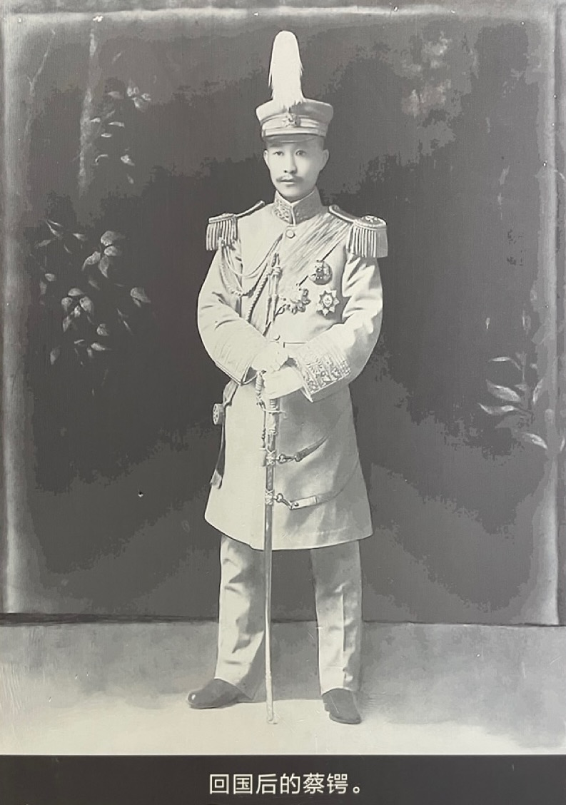
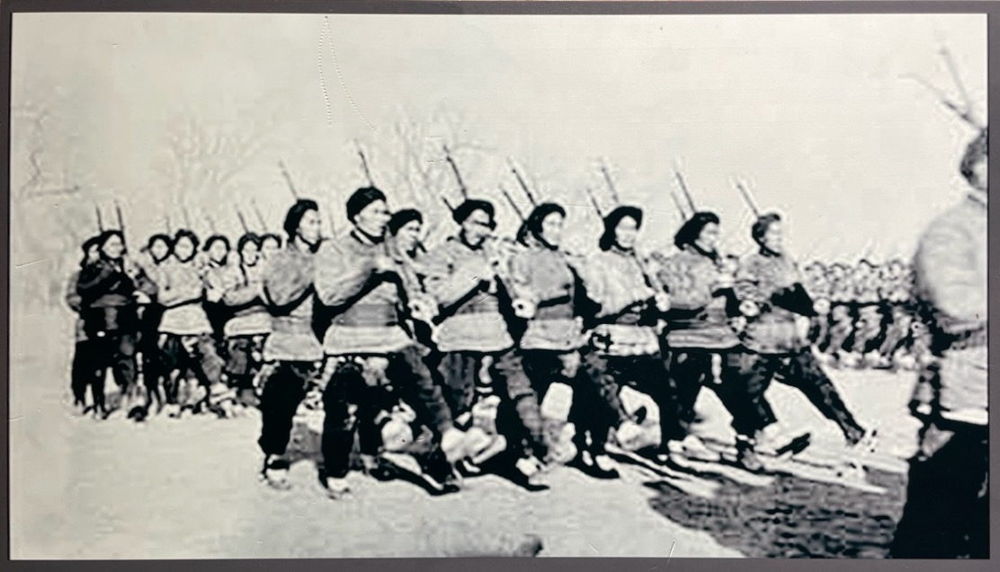
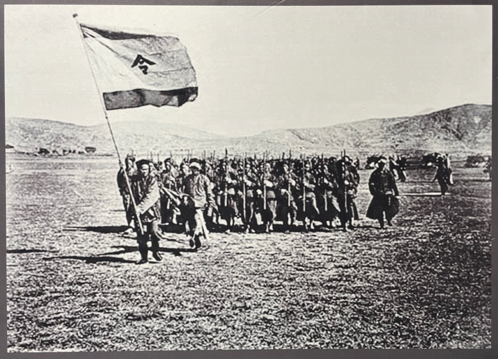

1904 年，蔡锷以优等成绩，从军校毕业。英姿飒爽，回到国内。章士钊回忆说：蔡锷来参加他们的爱国协会聚会，戎装莅盟，佩剑锵然；其持态严肃，印象颇为深刻。

这时的蔡锷，已积极赞成革命。他的一位朋友回忆说，这时的蔡锷，“已放弃了康梁的改良主张，积极赞成排满革命。我在岳麓山高等学堂任教务长，他经常来访，革命情绪异常激烈，跃跃欲试。我每劝他韬晦蓄势，目前应该加意培养革命青年，等到掌握了实力再动”。

# 去广西

蔡锷在湖南等地短暂工作后，到了广西。他在广西呆了 4 年，然后去了云南。

蔡锷怀着把广西塑成‘中国的普鲁士’的梦想，来到了广西。蔡锷来广西，有以下理由：首先，梁启超建议他去广西，指出广西为西南枢纽，东连湘粤，西控云贵，实为西南战略重地，正是英雄用武之地。其次，蔡锷也经过一番深思熟虑。他对朋友们说：“我选择去广西是有原因的。这些天，我一直在考虑，至少有五点，使我坚定意志。第一，广西的风土民情，我比较了解。第二，广西的人民具有吃苦耐劳的本性，而且也有团结的精神。第三，因为地理形势有关系，使广西得以保持住质朴忠厚的社会习尚，人民都很朴素善良。第四，它虽然只是个穷乡僻壤，但是，据我的了解，它境内所储藏的枪炮、弹药及各种军事装备却很齐全。最后一点（第五），就是因为它地处边区，反而具有非常重要的军事地势价值。”蔡锷认为，“这五个因素，是构成广西很可能成为‘中国普鲁士’的先决条件，只要假以时日，广西一定能够被塑成‘中国的普鲁士’！”

# 军务

蔡锷努力建设广西的军务。他和广西巡抚李经羲、张鸣岐合作无间，一方面巡视边防，绘制地图，制订详细的越南作战计划；一方面严肃军纪，培养军事人才。

为了加强边防建设，蔡锷考察和研究边境防务，撰写了《越南重塞图说》（又名《越南用兵计划》）和《桂边要塞图说》两书。1907 年，蔡锷陪同广西巡抚张鸣岐视察广西沿边各地，短衣匹马巡行四千余里，考察山川地势及风土人情，逐一写下札记，亲手草绘略图，然后提出了加强广西防务的完整计划，还建议修筑一条贵邕铁路（从贵阳到南宁），修建沿边炮台，改善防汛工作，整顿边防军务等。1909 年，蔡锷又派遣随营学堂学生分头勘测路线，为建设广西全省军路做好准备。

为了练兵，他提出，“广西练兵主旨：一、为求中国独立自由，必须战胜至少一个帝国主义的国家，以此为最高目的；二、为达到此目的，必须全国一致；三、广西必须为把握全国之枢纽，为完成此事，要密切团结内部”。

征兵时，他强调士兵要有文化、质朴、耐劳、有担当、有责任感。他的征兵标准是：一、必须是有一定文化的青年；二、必须具有淳朴耐苦的品性；三、要明确当兵的责任。他曾在一封信中说：“征兵于日昨到百人，多读书种子，询其当兵之责任为何，莫不以‘为国家’三字对。气象俱淳朴耐苦，即其中有二三学生，亦无流行之国民气习，善足慰也。”

# 陆军讲武堂

1909 年，蔡锷接办广西陆军讲武堂，大刀阔斧，进行改革，收到明显成效。

蔡锷接办讲武堂后，发现学校条件非常恶劣。原来讲武堂的学员，皆旧军官佐，军纪荡然，“丑态怪状，罄竹难书”，甚至“聚众殴官，围睹杀人之事，层见叠出”。

为此，蔡锷一到，就加强管教，严肃军纪，采取断然措施，尽力整顿，对不称职的官员不留情面，悉行黜退。学兵营仅在一天之内即撤换官长20余人，仅留一排长。虽然，数月以来，心力交瘁，然而遇到的问题俱能迎刃而解。过去的丑态怪状，“今则震于军箭军棍之下，不复前萌故态矣”。

然后，蔡锷梳理学校存在的问题。如他给在日本的好友石酔三的信中所说的，他发现学校在内务管理上，没有营房、主持的人都是外行、将校都是杂凑起来的；在军事教育上，虚张声势，不重实务，实际上毫无把握，不注重军人精神，毕业的学生有很多缺点，可能“祸害国家几十年”。

因此，他首先认真规划“将校团”的教育方案。他请好友在日本帮忙收集日军“将校团”的教育体系材料，包括科目、顺序、实施情况，还有日军培训具体材料，包括：冬季作业、兵棋、射击、体操、击剑、野外作业等教程。

有了方案后，他用了好几年的时间，来实行。为了把学校办好，他亲力亲为，亲自抓校舍、厨房、服装、体操、游泳。

蔡锷的努力取得了成效。广西巡抚对他非常信任。军队在全国大比武中获得好成绩。1906 年 9 月，清廷在河南彰德举行新军秋操，蔡锷奉令前往观操，受到袁世凯赏识，被选为中央评判官。

# 隐匿

在工作之外，蔡锷保持隐匿的作风，对重大问题，一般不轻易表态，处世沉着、冷静，并和广西当地心浮气躁的同盟会会员保持距离。这时同盟会已在日本东京成立。虽然他秘密和同盟会会员保持联系，比如黄兴化名张守正来广西活动，蔡锷就和他会面过，但是他也拒绝和当地毛躁的同盟会会员会面。

这种隐匿甚至有点严苛的态度让同盟会员觉得他不好接近。人们回忆说：蔡松坡生性静默，与人谈论，辄扼要数言，和易容众，未尝有连色。然遇事认真，为广西干部学堂监督时，诸生好辩者，常恶语怒斥之，甚或掴之以掌，其严烈如此。

蔡锷用苏东坡《留侯论》中的话：‘卒然临之而不惊，无故加之而不怒’，告诫这些轻率易动的年轻革命党人：如果能够做到苏东坡说的这样，才能当成大事。

# 小结

对蔡锷在广西治军教育的这段经历，后人总结说：甲辰(二十二岁)春间，任湖南教练处帮办，兼武备、将弁两学堂教习。五月赴桂，任广西陆军随营速成学堂总理并创设测绘学堂。因见桂省款项支绌，军备苦难扩张，时生拊髀之叹。迭次请去，当道苦相羁留不果。乙已(二十四岁)冬间，创办陆军小学堂。丙午(二十五岁)创设兵备处，于桂省兵事多所建议，当事以财艰匪多，少所采纳。是年冬间，随同前桂抚张鸣岐巡边，亲历桂、柳、思、南、太、归、镇、泗、色等府。并调查沿边及安南、谅山、高平等省地势民情。短衣匹马，巡行四千余里，于边情地势，均经逐一札记，并草绘略图。前张抚奏请修筑邕铁路，分别修撤沿边炮台，改良对汛，整顿边防军备各条，采锷议也。丁未(二十六岁)夏间，于南宁创练步标，躬亲教练，一切规模，皆所手订，将卒悦服。新兵人伍，锷率同全军，对神盟誓，戒以不犯上，不为匪，不脱逃三事。盖欲以神权迷信，矫边民犷悍之性也。己酉(二十八岁)三月，调充讲武堂总办兼办学兵营。该堂前任办理不善，紊如乱丝，以致所聘某国教习跋扈恣肆，员司学生以及兵夫辄轶出范围之外。锷乃严伸纪律，将中外司员之不尽职者，悉予黜退。学兵营官长以下概行遣散，另行编组，申儆而教练之。堂营章制，重新厘订。期月之间，壁垒一新，广西陆军实以该堂植其基。庚戌(二十岁)该堂毕业后，锷迭次乞假回湘，便道过桂垣。时张抚与军界某某等大起龃龉，伏潮暗湍，不可终日，而军事各机关尤为淆乱无纪，张窘蹙万状，以锷材望夙孚，切意挽留，不令行，任以督练公所三处及干部学堂总办兼办学兵营。锷迫于公义，勉担收拾残破之任。

 

| [Index](./) | [Previous](3-8-gemjun) | [Next](5-1-edu) |

