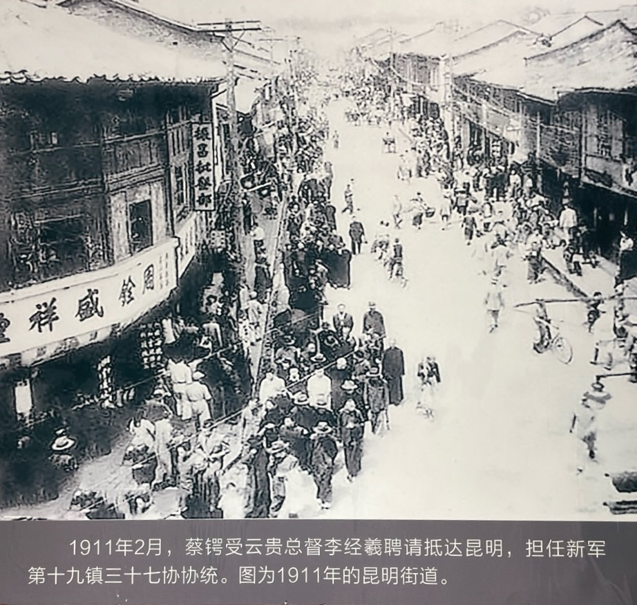
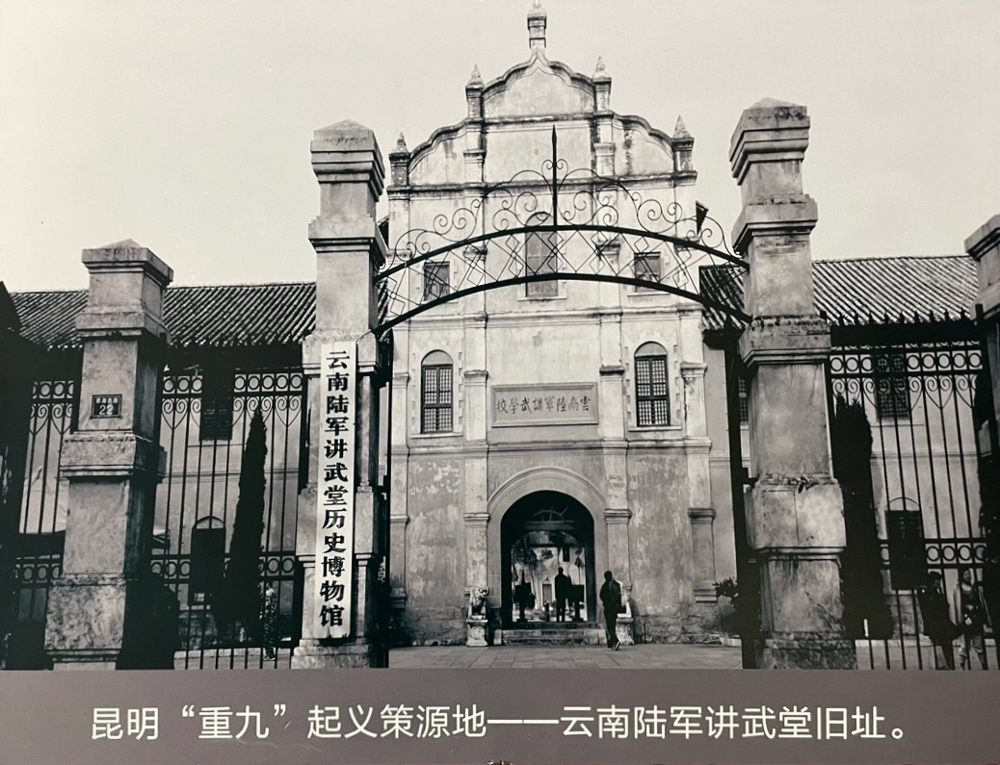
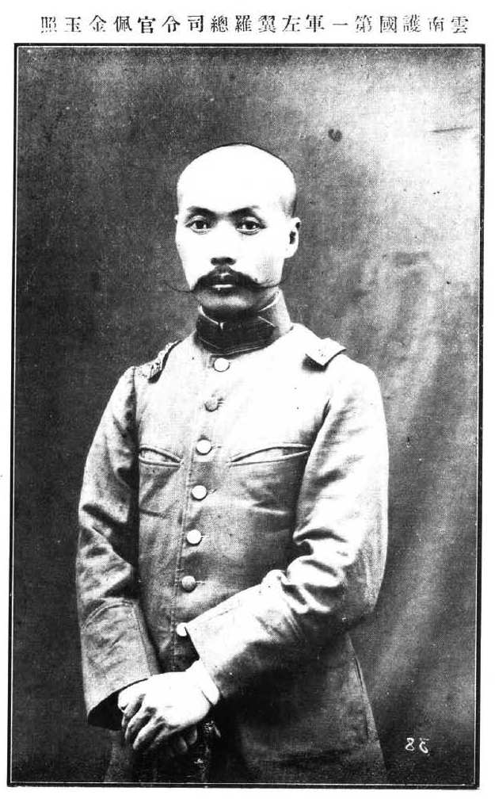

1911 年，蔡锷受时任云贵总督李经羲的邀请，来到了云南，任新军第十九镇第三十七协协统（旅长），掌握了云南新军一半的兵权。

蔡锷到云南后，对记者说：“予于云南心实爱戴，可为第二桑梓。” 这是他的心里话。他在日本研究军事时，就关注过云南。在广西时，特别研究过云南。然后现在云南又有他的老上司李经羲，还有志同道合的革命党同志。因此，蔡锷抛去广西的失望，又一次开始工作了。

# 云南研究

蔡锷对云南进行过细致的研究。云南作为西南边陲的重镇，有着重要的战略价值和意义，蔡锷在广西期间就研究云南，分析云南的形势，并在革命党人主办的刊物《云南》上发表文章。

他在《日法协约问题》一文中，呼吁滇人猛醒，急起直追，以反对帝国主义对云南的侵略。文章指出：“英法协约成于前，而云南瓜分之局定。日法协约随于后，而云南实行瓜分之祸急。呜呼，东北战云，不转瞬布于西南，此吾人思之而心为之痛，胆为之裂，知我云南灭亡之日至，中国全局分裂之势成。”又进一步说：“莽莽神州，河山破碎，茫茫大陆，土地分崩。此庸夫愚妇皆能逆睹而预知者。中国亡云南必先亡，云南亡而二十余省必与之偕亡。藩篱溃决，堂奥莫保，腹心之患已入膏肓。而麻木不仁者，犹曰法兵未至，吾何忧；此不过普通协约，为外交上惯行政策，吾何惧。若是者，势必兵临城下，以刀斧加其颈，鞭挞临于前，乃知法人果取云南之不诬也。”蔡锷表示：“吾愿我千余万同胞以日法一约为亡滇之纪念物，刻骨铭心，永矢弗忘，卧薪尝胆，切齿痛心。以数年养精蓄锐之气，为将来杀敌致果之功。……呜呼，我滇人其猛醒之；呜呼，我滇人其猛醒之。”

他在《西江警察权问题》一文中，指出西江（珠江）警察权的丧失，是英国将中国视其为殖民地的产物，为此痛斥卖国贼出卖祖国利益的罪行。他说：“虽为傀儡，终处崇高。虽为奴隶，终得温饱。此傀儡之所以甘为人舞而不辞，奴隶所以甘为人用而不悔也。不然，遐稽往古，近观当今，凡卖国贼臣，一遇强邻，则甘心媚外，几如先圣后圣，若合符节，不亦奇哉。昔秦桧割失两河于金人，而秦桧之权位愈固。今外部甘失两广西江警察权于英人，而外部之威势愈张。”为此，蔡锷呼吁云南及两广人民急筹抵制之策，特别强调：“吾愿两粤同胞，结大团体，挟逼张督，内以抵抗政府，外以抵制英人。对于政府，则成独立之势；对于英人，与之开特别之谈判。先行承认自请盗贼，若不还我警察权，虽不能骤然作战，与之绝商可也。”满腔热情地鼓动，在力所能及的范围内，反对帝国主义的侵略。

他在《云南外交之失败及其挽回》的系列长文中，分析云南外交被动的远因、近因和诱因，并提出具体的挽救措施：

* 首先保护铁路队，以强硬手段限制法兵入境，收回滇越铁路权，同时开发矿产，发展商业、邮政，加强货币流通管理等，才能打破法国攫取云南的迷梦。蔡锷在文章中指出：“夫云南外交之失败，不自今日始。居今日而言外交，一箝虎夺食，亡羊补牢之外交也。远因者既往之陈迹，诱因者已伏之祸根，近因者将成之惨状。凡稍知时局者，必不忍见其惨状。不忍见之，必思有以维持之。维持之法，不外先发制人之师，箝虎以夺其食；次谋拯救之策，亡羊且补其牢。如食可夺也，而惨状或不骤见；牢可补也，而祸根或容缓除。夫明知牢可补而食不易夺，而不能不强为之夺者，以救目前之危局，不得不然也。”而今天的现实是，“滇省防营久废，积弊太深，拥衰老疲废之防勇，以御朝夕训练之师”，显然是不可能的。因此当务之急，还是要千方百计收回滇越铁路权，只有收回路权，养精蓄锐，才能达到抵御外强之最终目的。蔡锷认为：“吾遥为之度，吾预为之度，吾滇人必曰：‘保护铁路，不如收回铁路之为愈。收回一部之路权，不如收回滇越铁路之全权之为愈。’夫人人有此心此力，有此全副精神，天下事尚可为也。”而且进一步说，云南外交的失败，不仅因为铁路一项，还有矿产权等问题。

* 关于云南之矿产，蔡锷指出：“英法协商，攫我七府之矿权，而我滇吏及政府，饮鸩如饴，滥用国家之公产，以作馈赠之礼仪。置人民死活于不问，未知其居心何等也。”蔡锷为此呼吁，废除矿产权条约，收回七府矿产。“是在我滇吏竭万斛热诚，鼓千钧大力，以提倡之，鼓舞之，联合之。不啻起死人而肉白食，以达其亡羊补牢、箝虎夺食之目的也。”

* 关于云南之通商口岸，蔡锷指出，由于“外患交迫，国势衰微。乃知闭关政策之不足恃，锁国主义之不能行。于是门户大开，国情败露。而列强乘以战胜之余威，以攫我种种之利权。一时通商口岸之新开，最惠条约之取得，各国之商业势力，遂膨胀于支那全境。而中国繁盛之区域，皆为列强销售之市场”。由于不平等条约的结果，使“云南为万国之通商埠，其实即英法之殖民地也”。为此，蔡锷提出了若干挽回云南商埠权利的意见说：“挽回云南之商埠，本非区区意见、寥寥单词所能罄其理蕴。而但以救标之策，望吾滇实事求是，积极进行。纵不能救目前之急难，亦足以固将来之根基。”

* 关于云南之民政机关问题，蔡锷指出：“民政管理权问题是国家主权的象征。民政机关则是民政管理权的执行机构，因而不能授以外人。”但是，“自大清之大局观之，法人进取云南，不但借兵保路保矿，及保护商埠，更屡次强迫清设民政厅于云南之蒙自。倘清吏不慎于先，而徒悔之于后，恐较东三省之祸而更烈也”。“彼何为而强设之？曰路矿商埠之关系在。在彼之意，民政厅一日不能设，彼人民一日不能保。由是观之，欲杜绝民政厅之隐患，必先灭绝路矿之祸胎，及自行保护商埠为主要。”蔡锷强调，在主权问题上是不能让步的，态度必须坚决明确。如果“拒之不坚，则成之必速。持之不力，则祸之必来，而又属于全部主权存亡关系。吾故反复辩论，大声疾呼，以告我云南大吏及一千余万之同胞”。

* 关于云南之邮政，蔡锷指出：“邮政之发达为一国政体之所系，即为一国主权之所关。一国之交通枢纽，除铁道电信之外，即以邮政为之大纲。”而在云南内地，“法人设邮局，以剥夺我之主权，以破坏我之政体”。“夫邮政之关系既与路矿并重，而凡有血性者，自当尽力以维持。倘不争之于先，而徒悔之于后”。否则，“将来军事上之利用，经济上之发展，财政上之转寰，以及行政上之措施，学术上之交换，必受种种绝大之影响，以蒙其障害”。因此，应当全力以争，不能丧失邮政之权。

* 关于云南之货币，蔡锷认为，货币为财政上之枢纽，交通上之媒介，全国财产之所系，人民生命之所归。而在云南，“除腾越方面适用英币外，而其他各地，皆非中国国定之货币，乃法兰西实行之法币也”。其结果，“浅视之为大辱之所在，深察之为大祸之所由生。不转瞬为云南之财政权，必为法人所占有”。为此，蔡锷提出了若干挽回、补救之办法，首先是设立银行及制币局。银行以蓄货币，为拔将来之祸胎，要以一举两得。同时设制币局，铸造银币，印刷纸币，以抵制法币。其次是设立商会及调查局。由总商会提出议案，公布全省商民知晓，逐渐减少法币使用，直至完全不用。同时设立货币调查局，以为调查研究货币之使用，以为协调变通处理。总之，务期一定时间内，停止法币之使用。“苟能信吾言，以救吾滇者救吾国，则即幸甚。”

此文在《云南》杂志第四、五、六、八、九、十一、十二等七期上连载，长达 6 万多字，文末还注明“未完”，由此可见蔡锷研究和思考的广度和深度。

# 抵御外侮

这一时期云南发生的中法英军事冲突，也促使了蔡锷赶赴云南。此时，云南发生震动全国的片马问题。片马地区（包括片马、古浪、岗房等地）在云南省的西部，与缅甸接壤。鸦片战争以后，云南与法国的殖民地越南、英国殖民地缅甸接壤，直接受到威胁。英、法侵略者多次骚扰和入侵云南地区，1910 年底，英国侵略军集中 2000 余人，占领片马。

片马问题引起了蔡锷的关注，并促使他赶赴云南，“厉兵秣马，赴机待死”。蔡锷在给石醉三的信中，就提到了片马问题。他对这一形势，颇为关心。他后来说：“辛亥之春，余应合肥李公（李经羲）之召，谬添戎职。时片马问题纠葛方殷，瓜分之谣诼忽起，风鹤频惊，海内骚然。吾侪武夫，惟厉兵秣马，赴机待死已耳。”

# 老上司李经羲

蔡锷到云南，是受时任云南巡抚、云贵总督李经羲的邀请。李经羲是李鸿章的侄儿。李经羲任广西巡抚期间，邀请蔡锷去广西军界任职，两人配合很好。他调任云贵总督后，再次邀请蔡锷到云南任新军第十九镇第三十七协协统（旅长）。昆明辛亥起义，攻破云贵总督署后，李经羲藏匿民间。蔡锷亲自劝他起义，无果，又亲自礼送他出境。袁世凯当政后，蔡锷去北京，又和李经羲在参政会共事。

# 革命同志

蔡锷在云南革命党中获得了广泛的理解和支持。云南讲武堂创办之初，恰逢日本陆军士官学校第六期毕业生回国，因此有大量回国留日学生进入了讲武堂，成为学校骨干和教官，如李根源、李烈钧、唐继尧、罗佩金等。这批人大多是同盟会会员和爱国志士。他们在学员中发展同盟会会员。朱德回忆，他在进入云南讲武堂不到几个星期，就经人介绍，歃血为盟，加入了同盟会。

罗佩金是支持蔡锷的革命党人的一个典型。他对蔡锷的支持，真的是不顾一切：

* 他支持蔡锷获得军权。李经羲调任云贵总督后，当时就任云南督练处参议官兼云南陆军小学堂总办的罗佩金，就向李经羲推荐蔡锷“可大用”，促使了李经羲邀请蔡锷来云南。蔡锷到达昆明不久，罗佩金建议李经羲任命蔡锷任第十九镇第三十七协统领（旅长），而罗本人则愿由督练处参议官兼陆军小学堂总办调任三十七协七十四标统带（团长），为蔡锷的直属部下，同时推荐雷飚、刘存厚、唐继尧为三十七协所属各营管带（营长）。这样的话，蔡锷就掌握了云南新军一半的兵权。

* 护国战争期间，他又全力支持蔡锷出兵。特别是，当蔡锷的护国军缺乏军费，无法开拔的时候，罗佩金把自己的家产全部变卖，把得到的 12 万大洋，作为军费，让护国军得以出发。这一点相当让人崩溃：别人跟着老板，是为了发家致富，而他跟着蔡锷，是把自己的家都卖了，只为了共同的事业。然后，他在护国战争中充当蔡锷第一军的总参谋长，一起出生入死。

蔡锷也非常信任罗佩金。他离开四川去日本治病时，推荐罗佩金担任四川督军，把四川交给他。在他最后的遗言中还提到罗佩金，显示了对罗佩金的高度信任和期待。

朱德也是支持蔡锷的革命党人的另一个典型。朱德对蔡锷发自内心地尊敬。他说：蔡锷是他的北极星。中华人民共和国成立后，蔡锷已经去世几十年了，朱德还不忘把蔡锷的遗孀接到北京来照顾，就像对自己的家人一样。

蔡锷全力维护革命同志。忠诚于清朝的军事将领想要对革命派军人进行打击、排挤，蔡锷全力维护革命党人。后人总结说：时钟、王等握军界重权，对于同志诸人，屡谗构于李督，极端排挤，公为解释，如殷、罗、韩、谢、唐、刘诸君得以不被排去者，公之力也。

# 隐匿

在工作之外，蔡锷继续保持隐匿的作风，“过着与人隔绝的生活，冷静、稳健、隐退”。朱德多次接近蔡锷，发现蔡锷虽然准许朱德在他的办公室阅览一些秘密和公开的报刊，“却从不表露自己的意见。不仅如此，就是对于清廷也从来没有不满之意。他同其他教官不同，在任何讲义中从不注入革命思想。月复一月，他在白天像个驱策苦工的人，使自己的学员忙碌不堪。在其他时间，便过着与人隔绝的生活，冷静、稳健、隐退”。

虽然隐匿，但蔡锷也向革命派透露过支持革命的信号。七十三标三营见习排长、激进的同盟会会员黄毓英会见蔡锷，述说革命酝酿于云南的情况，希望蔡锷给予支持。蔡锷说：“时机不到干不得，时机成熟时绝对支持。”

面对舆论上的纷争，蔡锷表现得大度。广西的是非，跨境来到了云南。对此，李经羲和军界同事都支持蔡锷，建议蔡锷辩论。蔡锷劝阻大家，说中外伟人，无不为世所诟病，不用放在心上。后人回忆说：桂议员以前此劾公，反遭失败衡之，函恳滇议会表同情。滇议员竟以上闻于李督，李督斥其育从。军界同胞咸抱不平，欲与滇议员开谈判。公亟阻之日:予果无状，为世所摈斥宜也。既俯仰无愧，何恤人言。余将来若能于吾困有所建树，则渠等今日之掊击，适凑成余个人历史上之佳话。中外伟人，无不为世所诟病者，复何庸计较。云云。

# 小结

对蔡锷初到云南的这一段经历，后人总结说：其时，片马问题发生，举国骚然。滇督李公以公治事有声，迭经函电敦调，并派员迓接，公于辛亥(三十岁)春由籍起程赴滇，任三十七协统领。滇省军界党派分歧，争竟颇烈，公不偏不倚，激扬清浊，一视同仁。惟知以砥砺志节，讲求学术策所部，同胞将士靡不倾服而爱戴之。

 

| [Index](./) | [Previous](5-3-leave) | [Next](6-3-zenghu) |

