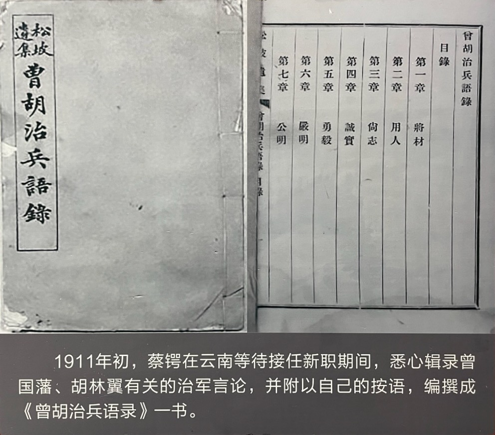

《曾胡治兵语录》是蔡锷在云南写的讲述治军方法的图书。在这本书中，蔡锷基于自己的军事研究和教育经验，在军人精神、治军方法、战守策略三方面，给出了具体的指导。

蔡锷来到云南后，发现在云南进行军事建设很难。他说：“滇中军事较桂省尤难，基础已坏，欲挽回补救，决非一二人之力所能奏功耳”。又说：“闻彼中（滇中）党派林立，且以成镇太速，一切纷如，位置固较此间为优，而办理之难必较西省为甚。”

为了迅速提高军队素质，同时自己给自己一个思考、学习、总结的机会，“自励而励人”，蔡锷写作了《曾胡治兵语录》。他首先受到云南军界的邀请，对新军官兵进行“精神讲话”。他收到这样的邀请，说明他的思想已经通过他的文字，在云南军界中，获得了共鸣。因此，云南军界的领导人建议他到军队中宣讲。同时，广西治军的无功而返，也让他深有感触，想要做出一个反思和总结。

为此，蔡锷编选湘军领袖曾国藩、胡林翼的治军材料，形成了《曾胡治兵语录》，作为对新军官兵进行“精神讲话”的材料。在书的序言中，蔡锷说：“曾、胡者，中国之伟人也。伟人之行，人人得而崇拜之；伟人之言，人人得而服膺之。”

《曾胡治兵语录》一共 12 章。在每一章中，蔡锷都首先列出了曾国藩、胡林翼的话，然后自己进行解读、解释，给出自己的看法。我们下面就从军人精神、治军方法、战守策略三方面，来看它的内容。

# 军人精神

蔡锷首先用了近一半的章节，来讲“军人精神”。这和他在给石醉三的信中所说的问题是一致的，即：中国军校教育的问题是不培养“军人精神”，因此，这样培养出来的军官会“祸患国家几十年”。蔡锷对“军人精神”的重视，和曾国藩、胡林翼治军的理念是一致的。曾国藩、胡林翼也一直强调忠义血性，认为这是他们军队成功的最大法宝。

蔡锷总结的“军人精神”分五个方面：

1. “将材”：“将材”所需要具有的素质，包括良心、血性；勤、恕、廉、明；
2. ”用人“：要不拘一格任用人才。人才哪里都有，关键是要形成一种环境，通过“陶冶”，获得想要的人才；
3. “尚志”：要有“志向”、“胸怀”；
4. “诚实”：“真诚”，能说实话、直话，不“伪”；
5. “勇毅“：勇敢，既要有小勇，也要有大勇，即“浩然之气”。有毅力，不轻易放弃，事在人为。只要切实去办，到山穷水尽之处，自有路走。

# 治军方法

蔡锷然后又用了近一半的章节，来讲治军的方法。这包括 5 个方面的内容：
1. “严明”：赏罚分明，令行禁止。煦煦为仁，足以堕军纪而误国事；
2. “公明”：公正，明智，不偏不倚，知人，晓事；
3. “仁爱”：教育部下走正路，有健康的身体，不扰民；
4. “勤劳”：勤操练。习劳忍苦，是治军之第一要义，因为后面要出生入死打仗的；
5. “和辑”：顾全大局，互相帮助，不猜忌，不炫耀自己的长处，不指摘别人的短处，不以私而害公，尽力帮助别人；

# 战守策略

蔡锷最后用 2 章来将具体如何打仗：
1. “兵机”：小心谨慎，如履薄冰，搞清楚自己的弱点，保证自己不败，再去想办法打败敌人；打仗的时候，要奇正结合；
2. “战守”：作战前要多讨论，精心布置，攻守兼备。作战以进攻为主，防守为辅。

在内容上，蔡锷并不拘泥于曾胡的论述，而是根据时代的变化，写出了自己的方法。比如，在战守策略上，蔡锷根据战争情况的变化，他就讲述了自己以下的看法：

1. 和曾胡“以守为主”的主张不同，他主张进攻。他认为：现代战争，是以进攻为主的。他说：“兵力雄厚，士马精练，军资（军需、器械）完善，交通便利，四者均可有恃，乃足以操胜算”，就应该大胆地攻势。

2. 与优势敌人较量，就要以保全军队为第一。他说：以我国来讲，“数年之内，若与他邦以兵戎相见，与其孤注一掷之举，不如采用亚战术，据险以守，节节为防，以全军而老敌师为主，俟其深入无继，乃一举歼除之”。

书中类似的真知灼见，还有很多。从书中，我们可以看到蔡锷成功的秘诀，也能够理解他后来的各种行为，比如他的谨慎。书中关于为人、带团队、打仗方面的真知灼见，也非常有用。书的内容不长，非常值得细读。

写出书后，蔡锷真的就按这本书践行，并取得了后面的成功。我们后面可以发现，他在后面艰苦卓绝的护国战争中，就是按照这本书中说的方法打的。因此，梁启超在蔡锷打完护国战争之后，看到这本书时说：“世知松坡之事功，读此书可知其事功所由来矣。”国共两党后来都出版和学习过这本书。1924 年，蒋介石在广州将此书作为黄埔军校教材刊印。1943 年，八路军《军政杂志》将其出版。

所以，我们从这本书中，可以学习蔡锷成功的秘密，从而指导自己在险恶的战争中生存下来。他自己也说：“我同胞列校，果能细加演绎，身体力行，则懿行嘉言，皆足为我师资。丰功伟烈，宁独让之先贤！”也就是说，按照这个做，就可以超越“先贤”，以成“丰功伟烈”。

非常值得学习！

 

| [Index](./) | [Previous](6-1-yunnan) | [Next](7-1-xinhai) |
